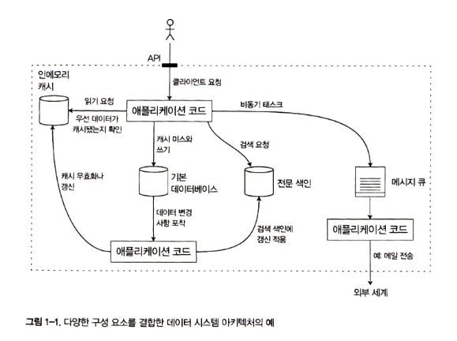
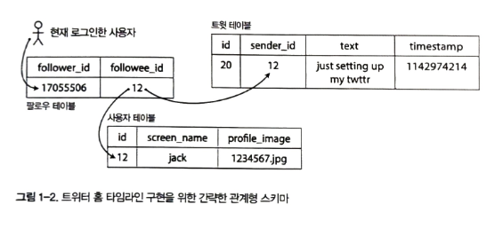
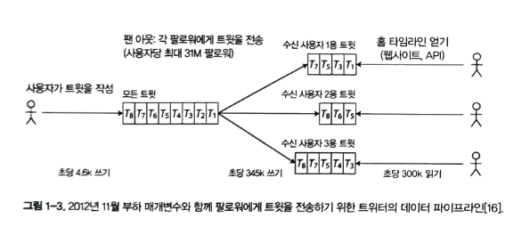
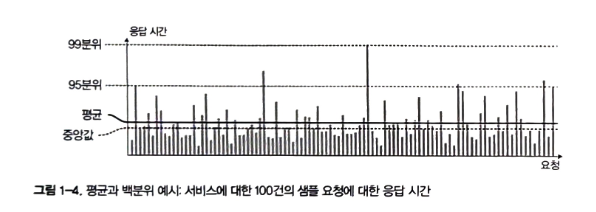

## 데이터 시스템에 대한 생각
최근에 도구들이 다양해지면서 유스 케이스에 딱 들어맞는 경우는 없다.
예를 들어 MQ로 사용하는 Redis가 있고, DB처럼 지속성을 보장하는 Kafka도 있다. 분류 간 경계가 흐려지고 있다.

또한, 단일 도구로 모든 요구사항을 커버하는 것에서 작업마다 효율적인 도구를 사용하여 서로 연결한다.
예를 들어, 메인 DB와 분리된 캐시 계층이나 전문 검색 서버를 따로 두는 경우이다.


이런 소프트웨어 시스템에서 중요하게 여기는 세가지가 있다.
- 신뢰성
- 확장성
- 유지보수성

### 신뢰성
잘못될 수 있는 일을 결함이라고 하고, 결함을 예측하고 대처할 수 있는 시스템을 `내결함성` 또는 `탄력성`을 지녔다고 한다.
`결함`은 사양에서 벗어난 시스템의 한 구성 요소로 정의되지만, `장애`는 사용자에게 필요한 서비스를 제공하지 못하고 시스템 전체가 멈추는 것을 의미한다.

결함으로 인해 장애가 발생하지 않게 내결함성 구조를 설계하는 것이 가장 좋다.
그러나 반대로 내결함성 시스템에서 경고 없이 개별 프로세스를 죽이는 방법 등으로 내결함성을 올리는 방법 또한 존재한다.
(예, 넷플릭스 카오스 몽키)

#### 하드웨어 결함
데이터센터 같은 곳에서 자주 일어난다.
최근 단일 장비의 전체 장애는 매우 들무기 때문에 빠르게 장비를 전황하여 고가용성을 높이고 있다.
하지만 서버 자체에 부하가 늘어나며 하드웨어 결함율도 증가한다.
따라서, 하드웨어 중복성을 추가해 전체 장비의 손실을 견디도록하는 것이 무엇보다 중요하다.

#### 소프트웨어 오류
시스템 내 체계적 오류로 인해 발생하는 경우가 있다.
- 잘못된 특정 입력으로 모든 서버 인스턴스가 죽는 버그
- CPU 시간, 메모리, 디스크 공간, 네트워크 대역폭처럼 공유 자원을 과도하게 사용하는 일부 프로세스
- 시스템의 속도가 느려져 반응이 없거나 잘못된 응답을 반환하는 서비스
- 한 구성 요소의 작은 결함이 다른 구성 요소의 결함을 야기하고 차례차례 더 많은 결함이 발생하는 연쇄 장애

이런 체계적 오류 문제는 신속한 해결책이 없다. 꾸준한 모니터링을 통해 예방하는 것이 중요하다.

#### 인적 오류
- 운영자의 설정 오류가 주요 원인인 경우가 많다고 한다.

#### 신뢰성은 얼마나 중요할까?
신뢰성은 생산성 저하의 원인이고 매출에 타격을 줄 수 있다.

### 확장성
성능 저하의 흔한 이유 중 하나는 부하 증가이다.
확장성은 증가한 부하에 대처하는 시스템 능력을 의미한다.

#### 부하 기술하기
`부하 매개변수`라 부르는 몇 개의 숫자로 나타낸다.
- 웹 서버의 초당 요청 수
- 데이터베이스의 읽기 대 쓰기 비율
- 대화방의 동시 활성 사용자
- 캐시 적중률 등

트위터를 예로 들어보자.
- 트윗 작성
  - 사용자는 팔로워에게 새로운 메시지를 게시(평균 초당 4.6K 요청, 피크일 때 초당 12K 요청 이상)
- 홈 타임라인
  - 사용자는 팔로우한 사람이 작성한 트윗을 볼 수 있다 (초당 300K 요청)

트위터에서는 `fan-out` 때문에 느리다는 함정이 있다.
1. 트윗 작성은 간단히 전역 컬렉션에 삽입한다.
```sql
SELECT tweets.*, users.* FROM tweets
    JOIN users ON twwts.sender_id = users.id
    JOIN floows ON follows.followee_id = users.id
    WHERE follows.follwer_id = current_user;
```

2. 개별 사용자의 홈 타임라인 캐시를 유지한다. 각자의 홈 타임라인 캐시에 새로운 트윗을 삽입



기존에는 1번 방법을 사용했지만, 부하를 줄이기 위해 2번을 사용했다.
그러나 이 경우 팔로워가 3천만 명인 경우, 단일 트윗이 홈 타임라인에 3천만 건 이상의 쓰기 요청이 발생한다.
트위터는 인플루언서는 팬 아웃에서 제외되도록 혼합형을 도입했다. (12장 참고)

#### 성능 기술하기
- 부하 매개변수를 증가시키고 시스템 자원은 변경하지 않고 유지하면 시스템 성능은 어떻게 될까?
- 부하 매개변수를 증가시켰을 때 성능이 변하지 않고 유지되기 원한다면 자원을 얼마나 많이 늘려야 할까?

> `응답 시간`: 클라이언트 관점에서 본 시간 (네트워크 지연과 큐 지연도 포함)
> `지연 시간`: 요청이 처리되길 기다리는 시간 (서비스를 기다리며 휴지 상태인 시간)

클라이언트마다 응답 시간은 다르므로 중앙값을 봐야 한다.


중앙 값은 50분위(p50)으로 축약하여 부른다. 특이 값이 얼마나 좋지 않은지 알아보려면 상위 백분위를 보아야 한다.
각각 p95, p99, p999를 일반적으로 본다.
`꼬리 지연 시간`으로 알려진 **상위 백분위 응답 시간은 서비스 사용자 경험에 직접 영향을 주기에 중요하다.**

예를 들어 아마존은 p999를 최적화하는 것을 목표로 삼았다. 외냐하면 그만큼 서비스 이용이 많기 때문에 가장 많은 데이터를 가지고 있다는 반증이기 때문이다.
백분위는 서비스 수준 목표와 서비스 수준 협약석에 자주 사용하고 기대 성능과 서비스 가용성을 정의하는 계약서에도 자주 등장한다.
이런 지표는 서비스 클라이언트의 기대치를 설정해 서비스 수준 협약서를 지키지 못하면 고객이 환불을 요구할 수 있게 한다.
서버의 경우 HOL 블로킹이 발생할 수 있기 때문에, 클라이언트 응답시간을 기준으로 해야 한다.

#### 부하 대응 접근 방식
사람들은 확장성과 관련해 용량확장과 규모 확장 수평으로 구분해서 말한다.
다수의 장비에 부하를 분산하는 아키텍처를 비공유 아키텍처라 부른다.
훨씬 저렴하고 간단하기에 많이 사용된다.
일부 시스템은 탄력적으로 작동하여 시스템 부하가 클 경우에 유기적으로 확장을 한다.

이 방식은 stateless 서비스에서 유리하다. 이런 이유로 확장 비용이나 DB를 분산으로 만드는 고가용성 요구가 있을 때까지 단일 노드에 DB를 유지하는 것이 최근까지의 통념이다.

특정 애플리케이션에 적합한 확장성을 갖춘 아키텍처는 주요 동작이 무엇이고 잘 하지 않는 동작이 무엇인지의 가정을 바탕으로 구축하고, 이런 가정이 곧 부하 매개변수이다.
가정을 잘못하면 헛수곻는 물론 역효과를 낳는다.

### 유지보수성
버그 수정, 시스템 운영 유지, 장애 조사, 새로운 플랫폼 적응, 새 사용 사례를 위한 변경, 기술 ㅂ채무 상환, 새로운 기능 추가 등이 있다.

레거시 시스템의 유지보수를 위해 아래 3가지를 유념하자.
- 운용성
  - 운영팀이 시스템을 원활하게 운영할 수 있게 쉽게 만들어라
- 단순성
  - 시스템에서 복잡도를 최대한 제거해 새로운 팀이 시스템을 이해하기 쉽게 만들어라
- 발전성
  - 엔지니어가 이후 시스템을 쉽게 변경할 수 있게 하라. 요구사항 변경에 대비

#### 운용성: 운영의 편리함 만들기
좋은 운영성이란 동일하게 반복되는 태스크를 쉽게 수행하게끔 만들어 운영팀이 고부가가치 활동에 노력을 집중한다는 의미이다.
- 좋은 모니터링으로 런타임 동작과 시스템의 내부에 대한 가시성 제공
- 표준 도구를 이용해 자동화와 통합을 위한 우수한 지원을 제공
- 개별 장비 의존성을 회피. 유지보수를 위해 장비를 내리더라도 시스템 전체에 영향을 주지 않고 계속해서 운영하게 함
- 좋은 문서와 이해하기 쉬운운영 모델 제공
- 만족할 만한 기본 동작을 제공하고, 필요할 때 기본값을 다시 정의할 수 있는 자유를 부여
- 적절하게 자기 회복이 가능할 뿐 아니라 필요에 따라 관리자가 시스템 상태를 수동으로 제어할 수 있게 함
- 예측 가능하게 동작하고 예기치 않은 상황을 최소화함

#### 단순성: 복잡도 관리
복잡도는 같은 팀의 진행을 느리게 하고 유지보수 비용이 증가한다.
`우발적 복잡도`: 풀어야 할 문제에 내재하고 있지 않고 구현에서만 발생하는 것
이를 제거하기 위해 추상화를 하자.

좋은 추상화는 매우 어렵다. 분산 시스템에선 여러 좋은 알고리즘이 있지만 시스템 복잡도를 유지하는 데 도움을 주는지는 명확하지 않다.

#### 발전성: 변화를 쉽게 만들기
요구사항이 끊임없이 변하기 때문에 빠르게 변경해야 한다.
