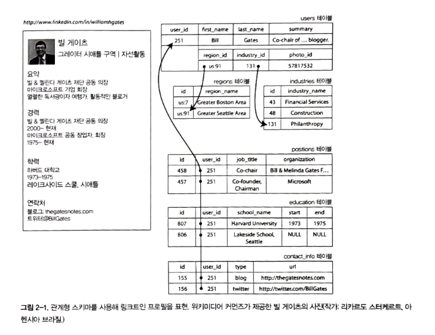

## 관계형 모델과 문서 모델
오늘날 많이 쓰이는 데이터 모델은 SQL이다.관계로 구성되면 순서 없는 튜플의 모음이다.
과거 60~70년대 비즈니스 데이터 처리를 위해 트랜잭션 처리와 일괄 처리가 필요했다.
이를 네트워크 모델과 계층 모델이 대안이 되었지만, 관계형 모델이 우위를 가지기 시작했다.

### NoSQL의 탄생
- 대규모 데이터셋이나 매우 높은 쓰기 처리량 달성을 RDB보다 쉽게 할 수 있는 확장성 필요
- 상용 DB보다 무료 오픈소스 SW에 대한 선호도 확산
- RDB에서 지원하지 않는 특수 질의
- RDB의 제한에 대한 불만과 동적인 데이터 모델의 바람

현재에는 다양한 형태의 저장소를 사용하는 `다중 저장소 지속성`을 가지고 있다.

### 객체 관계형 불일치
애플리케이션 코드와 데이터베이스 모델 객체 사이의 전환이 거추장하여 이를 임피던스 불일치라고 한다.
하이버네이트 같은 ORM이 전환 계층을 하고 있지만 여전히 완벽히 차이를 숨기기 어렵다.


이력서 같은 데이터는 RDB보다 JSON 표현에 매우 적합하다.
누구는 JSON이 임피던스 불일치를 줄인다고 하지만, 여전히 문제가 존재한다. (4장)

SQL과 달리 JSON은 모든 정보가 한 곳에 있어 질의 하나로 충분하고, 이를 더 나은 `지역성`을 갖는다고 한다.

### 다대일과 다대다 관계
하나의 연관 관계에 대한 데이터가 여러개 있는 경우 ID를 사용하여 그 데이터에 중복해서 저장한다.
중복된 데이터를 정규화하려면 다대일 관계가 필요하지만, 문서 모델에 적합하지 않다.
왜냐하면 문서 모델에선 JOIN 지원이 약하기 때문에 다중 질의로 흉내 내는 것이 최선이다.

## 문서 데이터베이스는 역사를 반복하고 있나?
과거 IBM의 정보 관리 시스템 (Information Management System, IMS)라는 계층 모델이 유행했다.
JSON 처럼 모든 데이터를 레코드 내에 중첩된 레코드 트리로 표현한다.
일대다 관계는 작동하지만, 다대다 관계 표현이 어려웠다.
이런 한계를 해결하기 위해 관계형 모델, 네트워크 모델이 있었다.

### 네트워크 모델
계층 모델의 트리 구조에서 모든 레코드는 정확하게 하나의 부모가 있다.
레코드는 다중 부모가 있을 수 있다.
그렇기 때문에 레코드를 조회하기 위해 최상위까지 올라가야했고 속도가 매우 느리다는 한계가 있었다.

### 관계형 모델
단순히 튜플의 컬렉션이 전부다.
쿼리 옵티마이저를 통해 접근 경로를 만든다는 점이 신선했다.
새로운 인덱스를 사용하기 위해 질의를 바꿀 필요가 없어 애플리케이션 개발에 유용했다.

### 문서 데이터베이스와의 비교
다대일과 다대다 관계 표현에서 RDB와 근복적으로 다르지 않다.
둘 다 관련 항목은 고유 식별자로 참조한다ㅓ.
이 식별자는 조인이나 후속 질의를 사용해 읽기 시점에 확인한다.

## 관계형 데이터베이스와 오늘날의 문서 데이터베이스
### 어떤 데이터 모델이 애플리케이션 코드를 더 간단하게 할까?
애플리케이션에서 데이터가 문서와 비슷한 구조라면 문서 모델이 좋다.
문서와 비슷한 구조를 샤딩하면 다루기 힘든 스키마와 불필요하게 복잡한 애플리케이션 코드를 발생시킨다.
문서의 미흡한 조인 지원은 다대다 관계를 사용하는 애플리케이션에서 문제가 될 수 있다.

### 문서 모델에서의 스키마 유연성
문서 모델도 암묵적인 스키마가 있지만, DBMS가 강제하지 않는다.

읽기 스키마는 런타임 타입 확인과 유사하고, 쓰기 스키마는 정적 타입 확인과 비슷하다.
- 다른 여러 유형의 오브젝트가 있고, 각 유형의 오브젝트별로 자체 테이블에 넣는 방법은 실용적이지 않다
- 사용자가 제어할 수 없고 언제나 변경 가능한 외부 시스템에 의해 데이터 구조가 결정된다.

### 질의를 위한 데이터 지역성
지역성의 이점은 한 번에 해당 문서의 많은 부분을 필요로 하는 경우에만 적용된다.
DB는 대개 일부 부분만 접근해도 전체를 적재해야 하기에 over-fetch가 발생한다. 이로 인해 문서를 작게 유지하면서 문저의 크기가 증가하는 쓰기를 피하라고 권한장한다.
이를 위해 오라클은 `다중 테이블 색인 클러스터 테이블` 기능을 제공한다.

### 문서 데이터베이스와 관계형 데이터베이스의 통합
최근 RDBMS에선 JSON와 비슷한 수준의 지원 기능을 제공한다.
문서 DB와 RDB는 점점 비슷해져가고 있다.

## 데이터를 위한 질의 언어
SQL은 선언형 질의 언어이고, IMS와 코다실은 명령형 코드를 사용하ㅣㄴ다.
명령형 언어는 특정 순서로 특정 연산을 수행하게 지시한다. 즉, 결과가 충족해야 하는 조건과 데이터를 어떻게 변환할지를 지정하기만 하면 된다.

반면 선언형은 명령형보다 간결하지만 데이터베이스 엔진의 상세 구현이 숨겨져 있어 질의를 변ㄱ셩하지 않아도 성능 향상이 가능한다.
종종병렬 실행에 적합하다.

### 웹에서의 선언형 질의
DB에 국한되지 않고, 웹 브라우저 상에서 사용 가능
```css
li.selected > p {
    background-color: blue;
}
```

```xsl
<xsl:template match="li[@class='selected']/p">
    <fo:block background-color="blue">
        <xsl:apply-templates/>
    </fo:block>
</xsl:template>
```

### 맵리듀스 질의
몽고DB와 카우치DB 같은 일부 NoSQL은 제한된 형태의 맵리듀스를 지원한다. 문서 대상으로 읽기 전용 질의를 수행할 때 사용한다.

```sql
SELECT date_trunc('month', observation_timestamp) AS observation_month,
    sum(num_animals) AS total_animals
FROM observations
WHERE family = 'Sharks'
GROUP BY observation_month;
```

```js
db.observations.mapReduce(
    function map() {
        var year = this.observationTimestamp.getFullYear();
        var month = this.observationTimestamp.getM onth() + 1;
        emit(year + "-" + month, this.numAnimals);
    },
    function reduce(key, values) {
        return Array.sum(values);
    },
    {
        query: { family: "Sharks" },
        out: "monthlySharkReport"
    }
)
```
1. 상어 종만 거르기 위한 필터를 선언적으로 저장
2. map: js 함수로, 질의와 일치하는 모든 문서에 대해 한 번씩 호출되며 this는 문서 객체로 설정
3. map 함수는 키와 값을 방출
4. map이 발출한 키값 쌍은 키로 그룹화됨. 같은 키를 갖는 모든 키값 쌍은 reduce 함수를 한 번 호출
5. reduce 함수는 특정 월의 모든 관측지에서 동물 수를 합침
6. 최종 출력은 monthlySharkReport 컬렉션에 기록

맵리듀스는 저수준 프로그래밍 모델이다.
맵리듀스의 사용성 문제는 연계된 JS 함수 두개를 신중하게 작성해야 한다는 것이다. 이를 위해 집계 파이프라인이라는 선언형 질의 언어를 지원한다.

```js
db.observations.aggregate([
    { $match: { family: "Sharks "} },
    { $group: {
        _id: {
            year: { $year: "$observationTimestamp" },
            month: { $month: "$observatrionTimestamp" }
        },
        totalAnimals: { $sum: "$numAnimals" }
    }}
]);
```

## 그래프형 데이터 모델