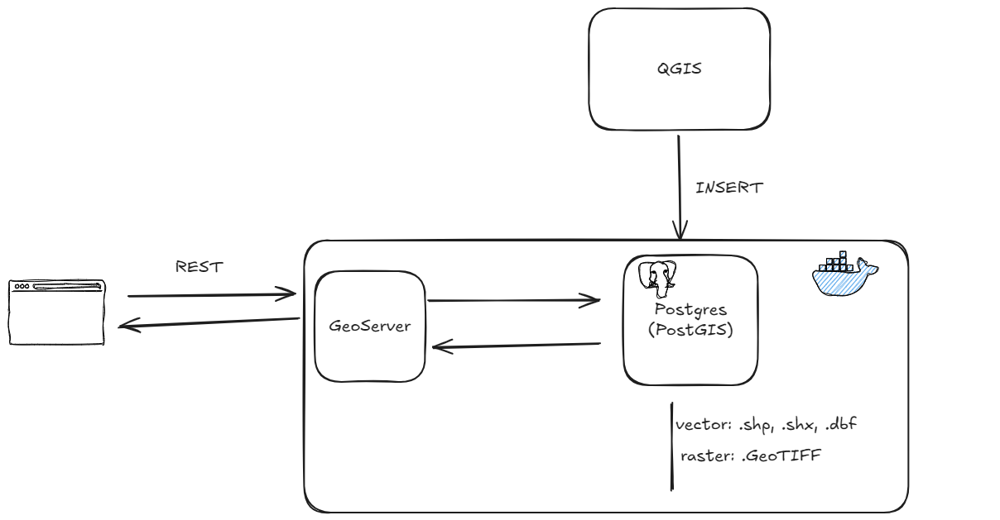

# ✏️ 기획
벡터 이미지와 레스터 이미지를 지도에 표시해주는 서비스를 개발하려고 한다.
현재 사용으로 기본 기술스택은 다음과 같다.

- RDB: PostgreSQL + PostGIS(GIS 파일 저장 익스텐션)
- 서버: GeoServer
- 프론트: HTML+CSS+JS
- DB 관리: QGIS

## 아키텍처

## 개발 순서
1. PostgreSQL의 PostGIS 익스텐션 설치
2. 로컬에서 QGIS와 PostgreSQL 연결
3. QGIS를 통해 PostgreSQL에 파일(shp, dbf 등) 삽입
4. GeoServer의 저장소에 PostgreSQL 연결 및 PostgreSQL에 있는 레이어 가져와서 저장하기
5. 프론트에서 GeoServer API 콜하기 

데이터베이스는 어떻게 띄울 것인가?
- supabase로 띄우기

## 데이터
- 벡터 데이터 (문화유산)
    - shp: 점선면을 구성하는 실제 좌표
    - dbf: shp에 대한 위치 속성 정보를 가지는 데이터베이스 파일
    - shx: shp와 dbf를 연결해주는 인덱스 파
- 레스터 데이터 (항공사진)
    - GeoTiff: 이미지 파일 + 지리 참조 정보인 TIFF 파일
        - 실제 지구상의 위치와 그림 파일을 견결한 지도

## 기능
<!-- TODO 250910 회의 후 추가 예정 -->

 

# 🛠️개발 과정
## 주의할 점
좌표계의 경우, 데이터들은 기본적으로 `EPSG:5179`를 사용한다. 따라서, QGIS 상에서 업로드 할 때에도 기본 좌표계를 설정하여 삽입해야 한다.

GeoServer의 API 엔드포인트의 경우, `http://localhost:8080/geoserver/wms`을 사용해야 한다.

