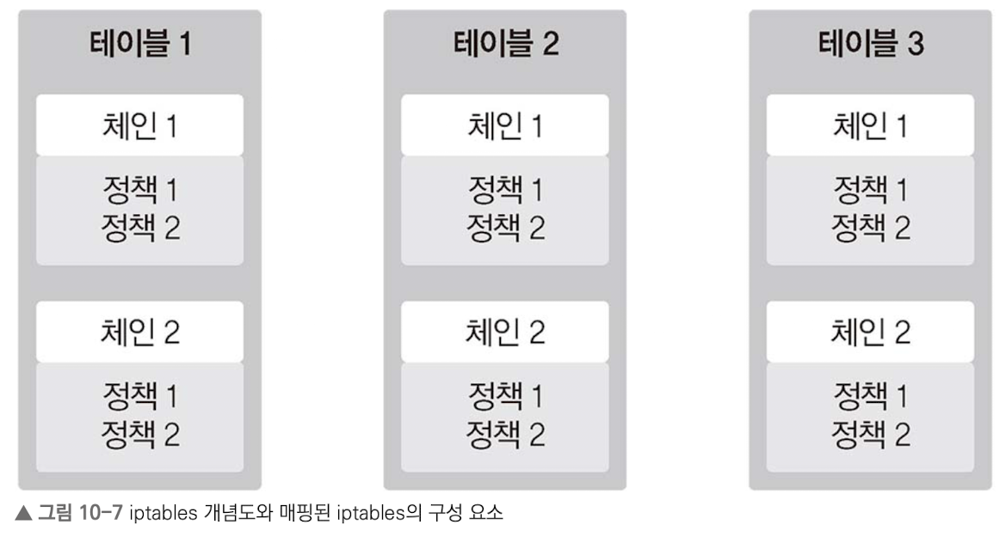
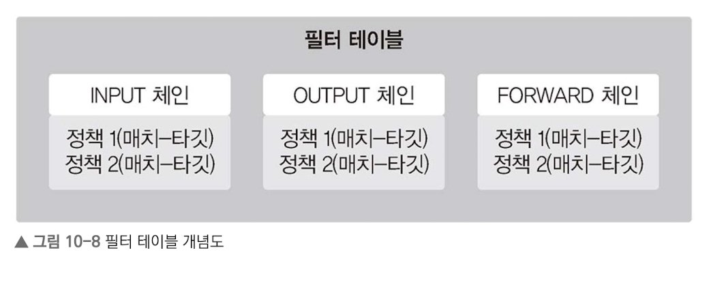

# 10. 1 리눅스 서버의 방화벽 확인 및 관리

### 10.1.1 iptables 이해하기
iptables로 차단할 IP나 포트에 대한 정책을 수립.
수립된 정책들은 정책 그룹으로 관리됨.

- 정책 그룹: 서버 기준의 트래픽 구간별로 만드는데, 트래픽 구간은 서버로 유입되는 구간, 서버에서 나가는 구간, 서버를 통과하는 구간을 말함.



- 체인: 개별 정책 방향성에 따라 구분한 그룹
- 테이블: 체인을 역할별로 구분한 그룹

iptables는 필터 테이블, NAT 테이블, 맹글 테이블, 로 테이블, 시큐리티 테이블 총 5가지 테이블 존재.

체인은 이 존재.


- 필터 테이블: 패킷 허용 및 차단
- INPUT 체인, OUTPUT 체인, FORWARD 체인 : 서버로 유입되는 구간, 서버에서 나가는 구간, 서버를 통과하는 구간
- Match: 제어하려는 패킷 상태 또는 정보 값의 정의
- Target: MAtch와 일치하는 패킷을 허용할지, 차단할지 처리 방식

## 10.1.2 리눅스 방화벽 활성화/비활성화
우분투 기준
```bash
apt install iptables
```

## 10.1.3 리눅스 방화벽 정책 확인
`-L(--list)` 옵션 사용

