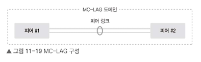

# 11.1 이중화 기술 개요
## 11.1.1 SPoF
단일 장애점은 시스템 구성 요소 중 동작하지 않으면 전체 시스템이 중단되는 요소.
예, 이더넷 네트워크 시스템에서 허브 장치 전원

- 고가용성을 추구하는 네트워크, 소프트웨어 애플리케이션, 상용 시스템에 단일 장애점이 있는 것은 바람직하지 않음.
- 다수의 SPoF 때문에 하나의 장애가 전체 서비스 장애로 연결될 수 잇음.

### 11.1.2 이중화의 목적
특정 인프라에 문제가 발생해도 다른 인프라를 통해 서비스 지속 가능.
- 엔드 투 엔드에 속하는 모든 인프라에 이중화 적용 고려.
- `액티브-액티브`의 경우, 하나에 장애 발생 시 인프라 용량이 절반으로 떨어지므로 정상 서비스 불가능
- `액티브-스탠바이`를 통해 이중화 기술 구현

## LACP
벤더 독자규격으로 인해 다른 장비끼리 연결의 호환성 문제를 해결하기 위해 `상호호환 가능한 연결 계층 표준화`

- 모든 물리 인터페이스를 액티브 상태로 사용
- 논리 인터페이스를 구성하는 물리 인터페이스 중 일부에서 문제가 발생해도 나머지 물리 인터페이스로 서비스 유지
- 서로 다른 인터페이소 LACP를 구성할 수 없음. (예, 1G와 10G)

### 11.2.1 LACP 동작 방식
LACPDU라는 프레임 사용.

- 출발지 주소, 목적지 주소, 타입, 서브 타입, 버전 정보 등을 포함해 매초 마다 주고 받음.
- 멀티 캐스트 이용
- LACPDU를 주고받는 장비가 한개여야 한다.
    

| 모드 | 동작 |
|-----|-----|
| 액티브 | LACPDU를 먼저 송신하고 상대방이 LACP로 구성된 경우, LACP를 구성 |
| 패시브 | LACPDU를 송신하지 않지만 LACPDU를 수신받으면 응답해 LACP 구성 |

### 11.2.2 LACP와 PXE
액티브-액티브 형태로 인터페이스 이중화를 구성할 때도 LACPDU를 사용.
PXE 이용 시, 서버가 운영체제를 설치하기 전 단계이므로 본딩과 티밍 같은 논리 인터페이스를 설정할 수 없음.
PXE로 OS 설치 시 LACP 인터페이스가 아닌 다른 일반 인터페이스로 OS 설치. 다시 LACP 설정 한 후 스위치 포트 설정을 다시 변경.

> PXE(Preboot Execution Environment)는 "사전 부팅 실행 환경"을 의미하며, 네트워크 인터페이스(LAN 카드)를 통해 컴퓨터를 부팅할 수 있게 해주는 환경이자 기술입니다. 즉, 하드 디스크, CD-ROM, USB 등 물리적인 저장 매체 없이도 네트워크를 통해 운영체제(OS)를 설치하거나 부팅할 수 있도록 지원하는 기능

1. 스위치에서 서버로 LACPDU를 보내지만, 서버는 OS 구성 전으로 수신하지 못함.
2. 스위치에서 LACPDU 수신 못했을 경우, 인터페이스 한 개만 활서오하해 PXE Boot를 실행.
3. PXE로 OS 설치하고 LACPDU를 주고받으면 LACP로 구성이 변경됨.

 

# 11.3 서버의 네트워크 이중화 설정
서버 인터페이스 이중화 구성은 네트워크 인터페이스 이중화화 다름.
하나의 논리 인터페이스를 만드는 것이 액티브-액티브의 사용을 의미하는 것이 아님.

 

# 11.4 MC-LAG
LACP 구성 시, MAC 주소가 1:1이어야 한다. 따라서 각 NIC별로 물리 MAC 주소를 따로 사용하지 않고 두 개의 물리 MAC 주소 중 하나를 Primary MAC 주소로 사용.

서로 다른 스위치로 이중화 구성을 하면 두 스위치 간 MAC 주소가 달라 LACP 사용이 불가능. 따라서, 서버에서도 본딩이나 티밍 모드를 액티브-스탠바이로 구성해 사용.

> MC-LAG는 두 대 이상의 물리적으로 분리된 스위치를 마치 하나의 논리적인 스위치처럼 동작하게 하여 링크 어그리게이션을 확장합니다. 
> LACP의 한계: 일반 LACP는 스위치 포트나 케이블 장애에는 대응할 수 있지만, LACP를 구성한 스위치 자체에 장애가 발생하면 연결된 서버나 하위 네트워크 장비의 통신이 완전히 단절

## 11.4.1 MC-LAG 동작 방식

- 피어 장비: MC-LAG을 구성하는 장비
- MC-LAG 도메인: 두 피어 장비를 하나의 논리 장비로 구성하기 위한 영역 ID.
- 피어 링크: MC-LAG을 구성하는 두 피어 장비 간의 데이터 트래픽을 전송하는 인터링크.

- 피어들은 하나의 도메인으로 구성
- 피어 링크는 다양한 네트워크 통신을 위해 트렁크로 구성
- 패킷 경로를 일반 데이터 트래픽 경료용의 피어 링크, 별도의 제어 패킷을 위한 경로를 구성할지 결정

개별 MAC 주소가 아닌 가상 MAC 주소를 사용. MC-LAG과 연결된 장비는 MC-LAG 피어들이 동일한 MAC 주소로 보이게 됨.

## 11,4,2 MC-LAG을 이용한 디자인

1. 스위치를 물리적으로 이중화하여 액티브-액티브 구성

2. 스위치 간 MC-LAG을 통해 루프 구조 없애고 STP로 모든 포트 사용.

3. 스위치 간 MC-LAG 구성하는 또 다른 경우, 상.하단을 모두 MC-LAG로 구성.

 

# 11.5 게이트웨이 이중화
## 11.5.1 게이트웨이 이중화란?
동일한 서브넷에 있는 내부 네트워크와 통신 시 ARP를 직접 브로드캐스트해 통신한다. 이때 L3 장비 없이 이루어지므로 호스트에 게이트웨이 설정이 없으면 외부 네트워크와 통신이 불가능.

위와 같은 장애가 발생할 경우, 통신이 불가능하다. 이를 위해 여러 게이트웨이가 같은 가상 MAC 주소를 가지도록 이중화가 가능하다. 우선순위가 높은 장비가 Active 상태로 유지되고 ARP 요청에 응답.

## 11.5.2 FHRP

여러 게이트웨어 장비를 하나의 게이트웨어 처럼 작동하는 프로토콜. 여러 게이트웨이를 같은 가상 MAC과 IP를 사용하도록 설정. 만약 액티브 장비 장애 발생 시, 스탠바이가 액티브 역할을 가져오고 MAC 주소 테이블을 자신으로 갱신하여 사용.

FHRP 기술을은 표준 프로토콜로 VRRP를 사용. VRID 값을 사용하는데 동일한 VRID를 설정한 장비가 하나의 VRRP 그룹으로 구성됨.

### VRRP
1. VRID가 같은 장비 끼리 VRRP 그룹으로 묶음. 각 장비에 우선순위를 설정. (기본값 100)
2. VRRP 마스터 설정을 위해 서로 Hello 패킷 주고 받음. Hello 패킷의 우선순위를 비교해 마스터 선정. 3회 이상 수신하지 못하면 상대방이 비정상으로 간주해 자신이 마스터 장비가 됨.
3. 마스터 장비는 가상 IP와 MAC 주소를 가짐.
    

## 11.5.3 올 액티브 게이트웨이 이중화

게이트웨이 외부로 가기 위한 경로가 스탠바이더라도 액티브 장비를 통해서만 외부로 나갈 수 있다.

이럴 경우, 트래픽이 불필요하게 우회하므로 비효율적일 수 있음.

게이트웨이를 액티브-액티브로 구성하면 액티브 장비로 들어오는 트래픽은 물론 스탠바이 장비로 들어오는 트래픽도 스탠바이 장비에서 직접 처리해 트래픽 흐름을 최적화 가능.

## 11.5.4 애니캐스트 게이트웨이
게이트웨이가 한 곳에 위치하게 되면 모든 트래픽이 하나의 게이트웨이를 거쳐 통신하게 되므로 통신이 비효율적.

여러 개의 같은 IP를 가지는 게이트웨이가 존재하지만 가장 가까운 위치에 있는 게이트웨이에서 서비스를 제공.
