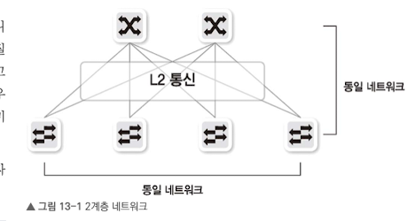
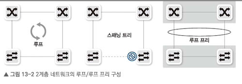
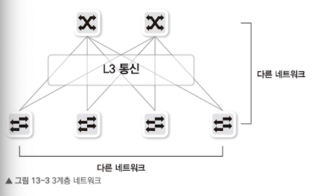
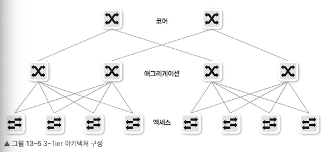
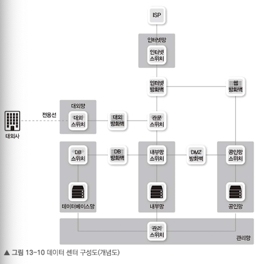
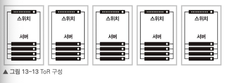
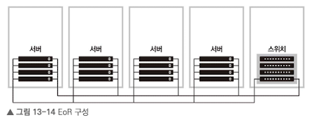
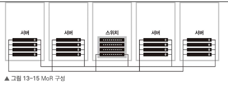

# 13.1 2계층/3계층 네트워크
## 13.1.1 2계층 네트워크

통신할 호스트가 동일한 네트워크에 있어야한다. 이 때문에 게이트웨이를 거치지 않고 직접 호스트 간 통신이 가능하다.

- 루프 구조가 생기면 문제가 발생하므로 STP로 이를 해결
- 블록 포인트가 생기는 문제를 위해 논블로킹 구조로 만들어야 함.
- MC-LAG 등으로 루프 제거 미 논블로킹 구조를 구현

## 13.1.2 3계층 네트워크

호스트 간 통신이 IP 라우팅 같은 3계층 통신으로 이루어진 디자인.

- 서로 다른 네트워크 간 통신.
- 전체 네트워크 인프라 대역폭을 ECMP 라우팅 기술을 이용해 모두 사용 가능.
- 루프 없이 모든 대역폭 사용 가능

 

# 13.2 3-Tier 아키텍처

코어-애그리게이션-액세스 3계층으로 이루어진 네트워크 디자인.
전통적인 데이터 센터와 일반적인 캠퍼스 네트워크 디자인 기법.
서버 간 통신보다 사용자로부터 서비스를 요청받고 서버에서 사용자의 요청에 응답하는 North-South 트래픽이 대부분인 경우에 적합한 구조.

 

# 13.3 2-Tier 아키텍처
## 13.3.1 스파인-리프 구조
리프 스위치와 스파인 스위치 간에 전송 2계층 스패닝 트리가 동작하지 않고 모든 링크를 사용해 트래픽을 전송.
- 대용량 분산 처리에 특화
- East-West 트래픽이 많은 현대 네트워크에 적합.
- 모든 호스트 간 통신 홉이 동일.

## 13.3.2 L2 패브릭
스파인-리프 사이를 2계층 네트워크로 구성.
TRILL이나 SPB같은 프로토콜 사용. 이를 통해 모든 링크 활성화 가능.

## 13.3.3 L3 패브릭
스파인- 리프 사이를 3계층 네트워크로 구성.
일반적인 라우팅 프로토콜로 정보교환.
하단 호스트의 네트워크가 리프 간에 서로 다른 네트워크를 갖게 됨.

 

# 13.4 데이터 센터 존/PoD 내부망/DMZ망/인터넷망

## 13.4.1 인터넷망
외부 인터넷에서 사용자가 데이터 센터에 접근할 수 있도록 구성된 영역.
소규모 데이터 센터는 ISP에서 IP 할당 받아 사용. 큰 규모의 데이터 센터는 ISP와 연동 시, BGP 프로토콜로 별도의 AS(Autonomous System)번호를 받아 연결.

## 13.4.2 공인망 (DMZ)
데이터 센터에서 외부 사용자에게 직접 노출되는 웹 서비스 등의 서버들이 모인 망.
언트러스트와 트러스트를 연결하기에 군사분계선인 DMZ라고도 불림.

## 13.4.3 내부망(사내망/사설망)
데이터 센터 내부나 사내에서만 접근할 수 있는 네트워크.
사설 IP로 외부와 통신 시 NAT 필요. 원격지에 있는 내부망 간연결 시는 VPN이나 전용선으로 연결.

## 13.4.4 데이터베이스망
내부망에 데이터베이스망을 두어 보안 강화.

## 13.4.5 대외망
회사 대 회사로 서비스 연동 시, 별도의 전용선

## 13.4.6 관리망/OoB(Out of Band)
관리용 인터페이스를 별도로 제공. 서비스망 문제 발생 시 접근을 위해 분리.

 

# 13.5 케이블링과 네트워크
## 13.5.1 ToR

Top of Rack으로 랙 상단에 개별적으로 스위치 구성. ToR 스위치가 서버들을 연결.
스위치가 많아 관리 및 전력 등 운영 비용 증가. 미사용 중인 포트가 늘어 포트 집적도 떨어짐.

## 13.5.2 EoR

End of Row로 랙의 행 끝에 네트워크 장비를 두고, 케이블로 연결.
스위치 장비 수를 줄일 수 있어 대기 지연이 적다.
케이블이 길어져 복잡하고, 서버와 스위치 간 인터페이스 업그레이드 시 케이블 교체비용 증가.

## 13.5.3 MoR

Middle of Row로 중간에 두어 케이블 낭비를 줄인 방식.

