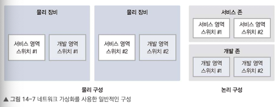
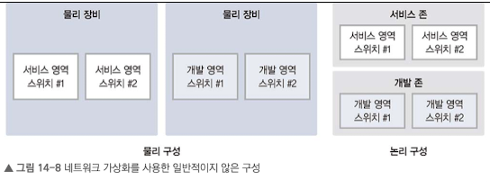

# 14.1 장비 가상화 기술이란?
리소스의 추상화를 의미하고 크게 두 가지로 나뉜다.
- 여러 개의 물리 장비를 하나의 논리 장비로 합치는 기술
- 하나의 물리 장비를 여러 개의 논리 장비로 나누는 기술

- 장점
    1. 다수의 장비를 하나의 장비처럼 관리
    2. 이중화 경로를 효율적으로 사용하고 루프 문제를 제거

물리 장비에 장애 발생 시 논리 장비 모두에 영향을 미치므로 동일한 역할을 하는 장비의 이중화 구성을 하나의 물리 장비에서 구성하면 안된다.

