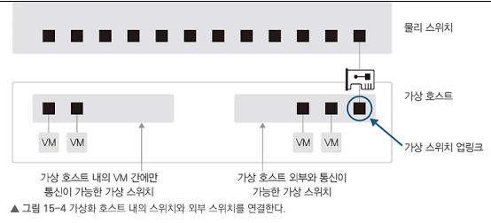
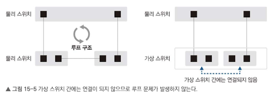
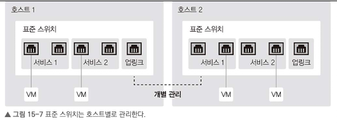
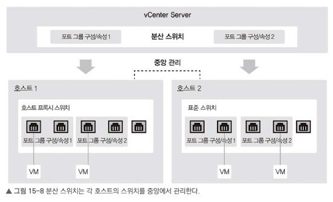
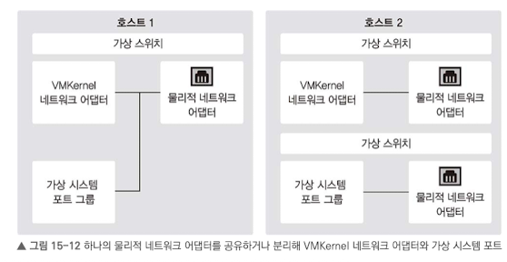

성격이 다른 서버와 서비스가 하나의 하이퍼바이저 위에서 동작하다보니 다양한 네트워크의 연결이 필요.

# 15.1 가상화 서버 구성 시의 네트워크 설정
하비퍼바이저를 통해 하나의 물리 호스트 안에서 여러 개의 가상 서버 구동이 가능하다.

 

# 15.2 VMware vSphere
서버 가상화, 네트워크 가상화, 스토리지 가상화 등 다양한 가상화를 지원.

## 15.2.1 VMware 가상 스위치
하이퍼바이저인 ESXi에서는 서버 내부의 네트워크를 구성하기 위한 가상 스위치를 제공.
`가상 스위치`: 논리적 소프트웨어 스위치. 내부 네트워크의 2계층 스위치 기능 이용 가능.

가상 먼신들이 외부로 통신하려면 ESXi 호스트의 물리 네트워크 카드를 물리 스위치에 연결해야 함.

한 개 이상의 스위치 사용시 루프 구조가 발생하지만, 가상 스위치 간에는 연결되지 않으므로 STP 동작하지 않고, BPDU 패킷도 발생하지 않는다.

가상 스위치는 MAC 학습작업이 필요 없다. 하이퍼바이저가 가상 네트워크 어댑터를 할당하기 때문에 물리 주소를 알고 있어서이다. 따라서, 정적으로 2계층 스위치를 정의할 수 있다.

## 15.2.2 표준 스위치/분산 스위치

### 표준 스위치

- ESXi 호스트마다 개별적으로 있어 관리
- 가상 스위치를 각각 관리하고, 포트 그룹을 통해 가상 네트워크를 분리

### 분산 스위치

- 가상 스위치들을 중앙에서 일괄 관리
- 중앙 관리 서버인 vCenter가 제공하는 기능.
- 표준 스위치에서 제공하지 않는 다양한 기능 제공.

## 15.2.3 VMKernel 포트와 가상 시스템 포트 그룹

하나의 물리 네트워크 어댑터를 공유하거나 분리해 VMKernel 어댑터와 가상 시스템 포트로 사용

### 15.2.3.1 VMKernel 어댑터
일반 가상 머신의 서비스 용도가 아닌 ESXi 호스트가 동작하는 데 필요한 관리용 서비스 네트워크 구성에 사용.
OoB같이 가상 머신의 서비스 용도가 아닌 호스트 관리용 서비스 네트워크.

### 15.2.3.2 포트 그룹 설정
가상 머신이 네트워크 연결하기 위해 가상 네트워크 어댑터를 가상 머신에 추가한다. 네트워크 어댑터는 이 가상 머신이 어떤 네트워크에 연결할지 선택하려고 가상 스위치에서 미리 설정해놓은 네트워크 탬플릿을 지정.
이를 `포트 그룹`이라고 한다.

포트 그룹에 보안 정책, 트래픽 조절 정책, 모니터링 정책, 이중화 구성 등을 적용할 수 있다.

## 15.2.4 포트 그룹 관리
실제 실습이므로 패스
