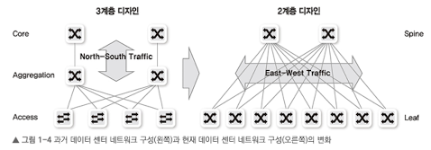
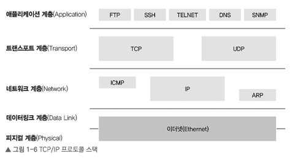
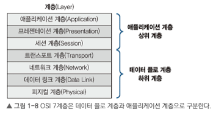
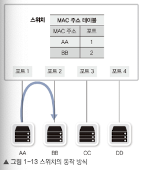
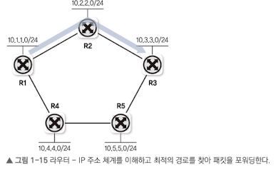
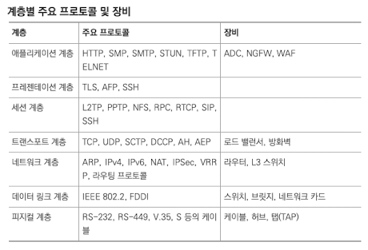
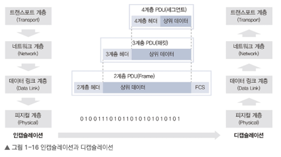

# 1. 네트워크 시작하기
## 1.1 네트워크 구성도 살펴보기
### 1.1.1 홈 네트워크

### 1.1.2 데이터 센터 네트워크
- 안정적이고 빠른 대용량 서비스 제공 목표
- 고속 이더넷 기술 사용
- 기존 3계층 구성이 대신 가상화 기술과 높은 대역폭을 요구하는 스케일 아웃 기반 등장으로 스파인-리프 구조(2계층 구조)를 많이 사용

## 1.2 프로토콜
- 어떤 표준협회나 워킹 그룹이 만들어낸 규정이나 규약
- 최근엔 복잡한 여러 프로토콜 기술이 이더넷-TCP/IP 기반 프로토콜로 변경됨
- 물리적 측면: 전송 매체, 신호 규약, 회선 규격 등. 이더넷
- 논리적 측면: 장치들끼리 통신하기 위한 프로토콜. TCP/IP

TCP/IP는 여러 프로토콜 묶음이라 `프로토콜 스택`이라고 부른다. 

## 1.3 OSI 7계층과 TCP/IP
- 벤더별 통합을 목적으로 OSI 7계층이 만들어졌지만, 대부분의 프로토콜이 TCP/IP 프로토콜 스택 기반임.
- 이를 통해 계층별 프로토콜을 개발해 네트워크 구성 요소들을 모듈화

## 1.4 OSI 7계층별 이해하기
### 1.4.1 1계층(피지컬 계층)
- 들어온 전기 신호를 그대로 재생성하여 전달
- 케이블, 커넥터: 케이블 본체를 구성하는 요소
- 트랜시버: 랜카드와 케이블을 연결하는 장비
- 탭: 네트워크 모니터링과 패킷 분석을 위해 전기 신호를 다른 장비로 복제

### 1.4.2 2계층(데이터 링크 계층)
- 주소 정보를 정의하고 정확한 주소로 통신
- 데이터 형태로 처리하므로 데이터 에러 탐지나 수리 역할 수행
- `플로 컨트롤`(동시에 여러 명과 통신하므로 받는 사람이 현재 데이터를 받을 수 있도록하는 작업)을 수행
- NIC와 스위치로 구성됨
- `MAC 주소`를 사용

스위치가 단말의 MAC 주소, 연결 포트를 `주소 습득` 과정에 파악하고, 통신할 때 적절히 필터링하고 정확학 포트로 포워딩 해준다. 그러나 1계층의 허브는 전기 신호를 전달하기에 동시에 하나의 장비만 데이터를 보낼 수 있음. 이런 비효율성을 극복하기 위해 `이더넷 기반 네트워크`가 급증함.

### 1.4.3 3계층(네트워크 계층)
- MAC과 달리 IP는 사용자가 바꿀 수 있고, 네트워크 주소 부분과 호스트 주소 부분으로 나뉨.
- 네트워크 주소 정보를 통해 자신이 속한 네트워크와 원격지 네트워크를 구분
- `라우터`는 IP 주소를 통해 최적의 경로를 찾아주고 해당 경로로 패킷을 전송하는 역할 수행

### 1.4.4 4계층(트랜스포트 계층)

- 하위 4 계층은 데이터를 잘 쪼개 보내고 받는 역할을 중점으로 수행
- 따라서 네트워크 애플리케이션에서 하위 4계층의 역할을 고민하지 않아도 된다.
- 1, 2, 3 계층은 올바른 위치로 보내고 실제 신호를 만드는데 집중. 그러나 4계층은 해당 데이터들이 잘 보내졌는지 확인하는 역할을 수행

- 패킷 유실, 순서 바뀜을 바로잡는 역할 수행
- `로드밸런서`와 `방화벽`이 여기에 포함
- 포트번호와 시퀀스, ACK 번호를 통해 부하 분산 혹은 보안 정책을 수립해 해킷을 통과, 차단하는 기능 수행

### 1.4.5 5계층(세션 계층)
- 양 끝단의 프로세스 연결을 도와주고 유지되도록 관리, 작업 완료 후 연결 끊는 역할
- 에러로 중단된 통신의 에러 복구와 재전송 수행

### 1.4.6 6계층(프레젠테이션 계층)
- 표현 방식이 다른 애플리케이션이나 시스템 간 통신을 돕기 위해 하나의 통일된 구문 형식으로 변환
- MIME 인코딩, 암호화, 압축, 코드 변환 등을 수행

### 1.4.7 7계층(애플리케이션 계층)
- 애플리케이션 프로세스를 정의하고 서비스 수행

## 1.5 인캡슐레이션과 디캡슐레이션

- 데이터를 보내는 과정을 인캡슐레이션, 받는 과정을 디캡슐레이션
- 현대 네트워크는 대부분 패킷 기반 네트워크
- `인캡슐레이션`: 애플리케이션에서 데이터를 데이터 플로 계층(1~4계층)으로 보내면서 패킷에 데이터를 넣도록 분할하는 과정
- `디캡슐레이션`: 받은 데이터를 상위 계층으로 보내면서 헤더를 하나씩 벗기는 과정

헤더에는 두 가지의 정보를 반드시 포함해야 한다.

1. 현재 계층에서 정의하는 정보
    - 패킷 순서 및 점검을 위한 시퀀스, 애크 번호, MAC 주소 등이 필요하다.

2. 상위 프로토콜 지시자
    - 디캡슐레이션하는 목적지 쪽에선 헤더에 아무 정보가 없으면 **어떤 상위 프로토콜로 올려보내야할지 알 수 없다.**
    - 인캡슐레이션하는 쪽에서 헤더에 상위 프로토콜 지시자 정보를 포함해야 한다.