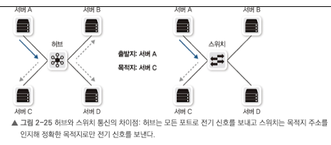
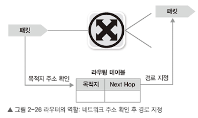

네트워크 연결에 필요한 회선과 구성요소를 알아보자.

## 2.1 네트워크 연결 구분

네트워크 규모와 관리 범위에 따른 구분
- LAN(Local Area Network) : 사용자 내부 네트워크
- MAN(Metro Area Network) : 한 도시 정도를 연결하고 관리하는 네트워크
- WAN(Wide Area Network) : 멀리 떨어진 LAN을 연결해주는 네트워크

### 2.1.1 LAN
- 먼 거리 통신이 필요 없어 스위치와 같이 간단한 장비로 연결.
- 대부분 이더넷 기반 전송 기술 사용
- 최근에는 구분이 무의미해지고 있음

### 2.1.2 WAN
대부분 통신사업자로부터 회선을 임대해 사용한다. 사용계약에 의해 비용 부과됨

## 2.2 네트워크 회선
### 2.2.1 인터넷 회선
- 인터넷 접속을 위해 통신사업자와 연결하는 회선
- 보통 전송 선로를 공유하는 구조

### 2.2.2 전용 회선
- 대역폭 보장하는 서비스
- 저속: 음성 전송 기술 기반
    - 높은 신뢰성이 필요할 때 사용 -> 현재 사용 빈도 줄고 있음
    - 결재 승인과 같은 VAN사나 대외 연결에 사용
- 고속: 메트로 이더넷
    - 광케이블 기반의 이더넷

### 2.2.3 인터넷 전용 회선
- 인터넷 연결 회선에 대한 통신 대역폭을 보장해주는 상품
- 가입자가 통신사업자와 연결되고 이 연결이 인터넷과 연결
- 경쟁하지 않고 연결 품질 보장

### 2.2.4 VPN
가상으로 직접 연결한 것 같은 효과가 나도록 만들어주는 네트워크 기술

- 통신사업자VPN
    - 낭비되는 대역폭 비용을 줄이고 먼 거리와 연결하더라도 비용 감소를 위해 통신사업자가 직접 가입자를 구분하는 VPN (예, MPLS VPN)
    - 거리보다 속도의 영향을 받기 때문에 거리가 멀어질 수록 비용을 낮추는 데 도움
- 가입자 VPN
    - 일반 사용자가 사용하는 대부분의 VPN 기술

### 2.2.5 DWDM
먼 거리 통신 시, 케이블 포설 비용과 관리 문제를 극복하기 위해 개발된 기술.
하나의 광케이블에 다른 파장의 빛을 통해 여러 채널을 동시에 전송하는 기술이다.
기가 인터넷에 사용하여 광회선을 공유하더라도 별도 채널을 이용해 구분하므로 접속 속도를 유지할 수 있다.

## 2.3 네트워크 구성 요소
### 2.3.1 네트워크 인터페이스 카드
컴퓨터를 네트워크에 연결하기 위한 하드웨어 장치로 현재 대부분의 보드에 온보딩되어 있어 별도 장착하지 않아도 된다.

- NIC의 역할
1. 직렬화: 전기 신호를 데이터로 상호 변환
2. MAC 주소
3. 흐름 제어: 하나의 채널에서 여러 통신을 하므로 데이터 유실 방지를 위한 중지 요청

### 2.3.2 케이블과 커넥터
1. 이더넷 네트워크 표준
    - 가장 많이 사용되는 이더넷 방식에 사용되는 케이블 및 커넥터
    - 일반 PC는 기가비트 이더넷, 데이터 센터 서버는 기가비트나 10기가비트 이더넷 주소 사용

    주로 사용되는 케이블
    - 1,000BASE-T/10GBASE-T: TP 케이블을 이용
    - 1,000BASE-SX/10GBASE-SR: 멀티모드 광케이블 사용, 짧은 거리 보낼 때
    - 1,000BASE-LX/10GBASE-LR: 싱글모드 광케이블, 긴 거리 보낼 때

    1,000 = 속도, BASE = 채널, T = 케이블 타입

2. 케이블, 커넥터 구조
    - TP 케이블은 커넥터와 케이블 본체가 하나로 있어 별도 트랜시버 필요 없음
    - 광케이블은 다양한 속도, 거리를 지원하므로 트랜시버, 커넥터와 케이블을 분리하는 경우가 많음
3. 트위스티드 페어 케이블
    - 카테고리 단위로 등급을 나눔
    - 높은 대역폭 지원이 어려워 10G부턴 광케이블 이용
    - 그러나 최근 10GBASE-T 기본 탑재 서버가 늘어나면서 10G에도 TP 케이블 사용하기도 함
4. 동축 케이블
    - 과거 LAB 구간에도 사용했지만 최근 10G 이상 고속 연결을 위해 트랜시버 통합한 DAC을 많이 사용한다. (동축 케이블의 일종)
5. 광 케이블
    - 구리선보다 신뢰가 높고 먼 거리 통신이 가능
    - 싱글모드는 먼 거리 통신을 지원하여 가늘고 레이저 사용
    - 멀티모드는 굵고 LED 광원을 사용하여 싱글모드보다 저렴
6. 커넥터
    - 케이블 끝부분으로 네트워크 장비나 네트워크 카드에 연결되는 부분
7. 트랜시버
    - 외부 신호를 컴퓨터 내부 전기 신호로 바꿈
    - 트랜시버가 없으면 NIC를 규격마다 바꿔야 한다.

### 2.3.3 허브
거리가 멀어질 수록 줄어드는 전기 신호를 재생성해주고, 여러 대의 장비를 연결하는 목적으로 사용됨.
전체 네트워크 성능이 줄어드는 문제가 있고, 패킷이 무한 순환하여 네트워크 전체를 마비시키는 등 다양한 장애의 원인이 되어 현재는 잘 사용되지 않음.

### 2.3.4 스위치
2계층 장비로 여러 장비를 연결하는 역할 통신을 중재하는 역할을 수행한다. MAC 주소를 이해하여 양방향 통신을 통해 통신을 중재한다. 이를 통해 이더넷 성능 보장에 큰 역할을 한다.

### 2.3.5 라우터
3계층 장비로 먼 거리 통신할 수 있는 프로토콜로 변환하는 역할 수행.
- 브로드캐스트와 멀티캐스트를 컨트롤하여 불분명한 주소로 통신할 경우 이를 버린다.
- 최적의 경로로 패킷을 포워딩한다.
- L3 스위치와 공유기가 이와 같은 역할을 수행한다.

### 2.3.6 로드밸런서
4계층에서 동착하며 IP 주소를 변경할 수 있다.
주로 웹에서 사용되며 웹 서버 앞에 두고 웹 서버를 여러 대로 늘려준다, 서비스 헬스 체크 기능이나 대용량 세션 처리 기능도 담당한다.

