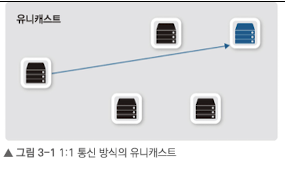
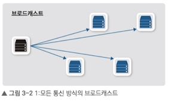
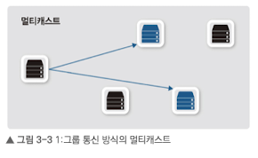
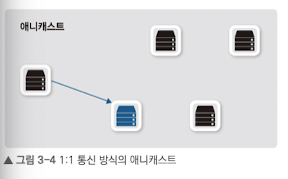
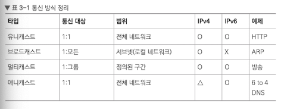
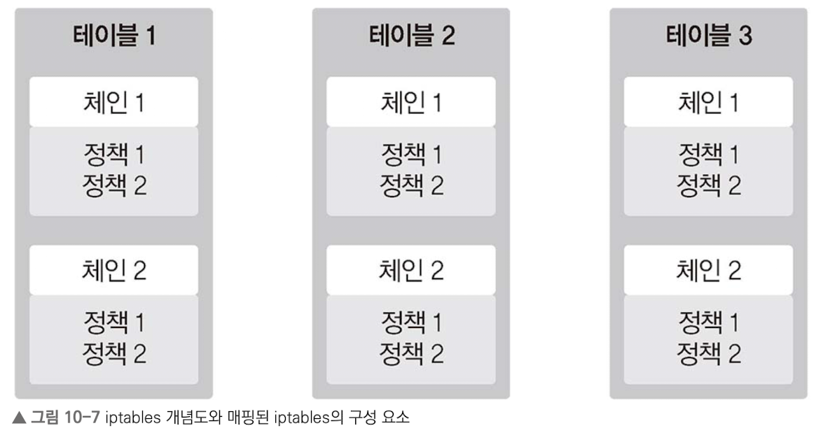

MAC, IP 주소에 대해 다루고 주소체계를 이루는 서브넷, 게이트웨어, ARP와 같은 프로토콜의 기능과 역할을 상세히 설명.

## 3.1 유니캐스트, 멀티캐스트, 브로드캐스트, 애니캐스트

- 유니캐스트
    - 1:1 통신
    - 출발지와 목적지가 1:1로 통신
- 브로드캐스트
    - 1:모든 통신
    - 동일 네트워크에 존재하는 모든 호스트가 목적지
- 멀티캐스트
    - 1:그룹(멀티캐스트 구독 호스트) 통신
    - 하나의 출발지에서 다수의 특정 목적지로 데이터 전송
- 애니캐스트
    - 1:1 통신(목적지는 동일 그룹 내의 1개 호스트)
    - 다수의 동일 그룹 중 가장 가까운 호스트에서 응답
    - IPv4에서는 일부 기능 구현, IPv6은 모두 구현 가능

`유니캐스트`는 출발지와 목적지가 명확히할 때 사용하는 대부분의 통신 방식

`브로드캐스트`는 유니캐스트로 통신 전, 상대방의 정확한 위치를 알기 위해 사용. 로컬 네트워크 내에서 모든 호스트에 패킷을 전달해야 할 때 사용.

`멀티캐스트`는 IPTV와 같은 실시간 방송 볼 때 사용. 사내 방송이나 증권 시세 전송과 같이 **단방향으로 다수에게 동시에 같은 내용 전달 시 사용**

`애니캐스트`애니케스트 주소가 같은 호스트들 중 가장 가깝거나 가장 효율적인 호스트와 통신. 가장 가까운 DNS 서버를 찾을 때, 혹은 게이트웨이 찾을 때 사용

## 3.2 MAC 주소
2계층에서 통신을 위해 NIC에 할당된 고유 식별자이다. 네트워크 접속하는 모든 장비엔 MAC 주소라는 물리적 주소가 있어야 통신이 가능핟.
### 3.2.1 MAC 주소 체계
MAC은 변경할 수 없도록 하드웨어에 고정되어 출하된다. 이를 BIA(Burned-In Address)라고 부른다. 한 제조업체에 하나 이상의 주소 풀을 주고 그 풀 안에서 각 제고업체가 자체 MAC 주소를 할당한다.

48비트의 16진수 12자리로 표현하고, 앞 24비트는 제조사 코드, 뒤 24비트는 제조사가 할당한 값이다. MAC주소는 유일하지 않지만, 동일 네트워크에 중복되지만 않으면 정상 작동한다. 라우터를 거칠 때 출발지, 도착지 MAC 주소가 변경되기 때문에 유지되지 않을 수 있다.

### 3.2.2 MAC 주소 동작
1. 2계층에서 패킷으로 변환하여 내용을 구분한 후 도착지 MAC 주소를 확인.
2. 도착 MAC 주소가 자신이 아닐 경우 패킷을 폐기
3. 도착지가 자신이거나 같은 그룹 주소이면 상위 계층으로 넘김

## 3.3 IP 주소
2계층은 물리 주소인 MAC 주소를, 3계층은 논리 주소인 IP 주소를 사용한다.

### 3.3.1 IP 주소 체계
32비트인 IPv4와 128비트인 IPv6가 있다. 8비트씩 4개로 구성되어 있고, 네트워크 주소와 호스트 주소로 나뉘어 있다.

- 네트워크 주소: 호스트들을 모은 네트워크를 지칭하는 주소. 동일한 네트워크 주소를 로컬 네트워크라고 함.
- 호스트 주소: 하나의 네트워크 내에 존재하는 호스트를 구분하는 주소

과거에는 IP 개수에 따라 네트워크 크기를 할당하는 클래스 개념을 도입했다. 그러나 작은 네트워크가 필요한 조직에서 너무 많은 IP를 가져가 낭비되는 문제가 발생한다.

### 3.3.2 클래스풀과 클래스리스
1. 클래스 네트워크으 ㅣ등장
A클래스를 할당받은 조직에서 제대로 사용하지 못해 낭비하는 문제가 있다. 이를 해결하기 위해 클래스리스 네트워크를 통해 네트워크와 호스트 주소를 나누는 구분자를 사용했고 이를 `서브넷마스크`리고 한다.

### 3.3.3 서브네팅
기존에 부여된 클래스를 무시하고 새로운 네트워크보다 더 쪼개 구분자로 사용하는 것을 말한다.

- 네트워크 사용자 입장
    - 네트워크에서 사용할 수 있는 IP 범위 파악
    - 기본 게이트웨키와 서브넷 마스크 설정이 제대로 되어 있는지 확인
- 네트워크 설계자 입장
    - 네트워크 설계 시 네트워크 내에 필요한 단말을 고려한 네트워크 범위 설계

### 3.3.4 공인 IP와 사설 IP
- 인터넷에 연결하기 위한 식별자로 공인 IP가 필요하다. 인터넷에 접속하지 않거나 NAT를 사용할 경우 사설 IP 주소를 사용할 수 있다.
