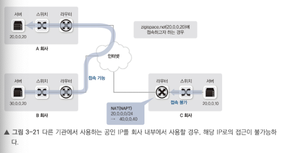
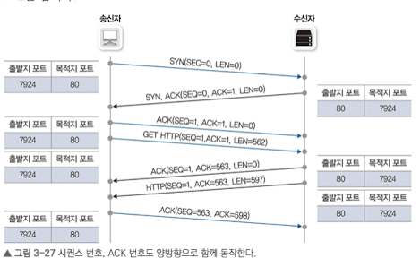
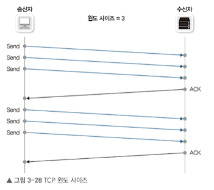
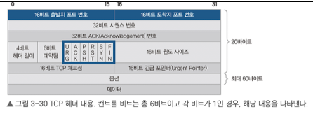
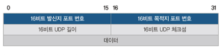
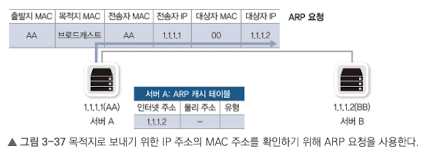
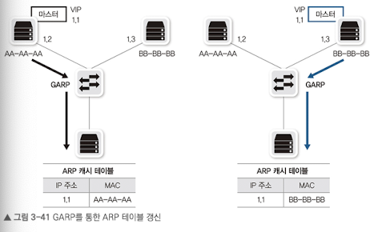
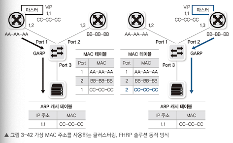
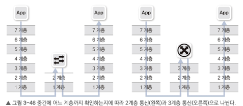

 MAC, IP 주소에 대해 다루고 주소체계를 이루는 서브넷, 게이트웨어, ARP와 같은 프로토콜의 기능과 역할을 상세히 설명.

## 3.1 유니캐스트, 멀티캐스트, 브로드캐스트, 애니캐스트

- 유니캐스트
    - 1:1 통신
    - 출발지와 목적지가 1:1로 통신
- 브로드캐스트
    - 1:모든 통신
    - 동일 네트워크에 존재하는 모든 호스트가 목적지
- 멀티캐스트
    - 1:그룹(멀티캐스트 구독 호스트) 통신
    - 하나의 출발지에서 다수의 특정 목적지로 데이터 전송
- 애니캐스트
    - 1:1 통신(목적지는 동일 그룹 내의 1개 호스트)
    - 다수의 동일 그룹 중 가장 가까운 호스트에서 응답
    - IPv4에서는 일부 기능 구현, IPv6은 모두 구현 가능

`유니캐스트`는 출발지와 목적지가 명확히할 때 사용하는 대부분의 통신 방식

`브로드캐스트`는 유니캐스트로 통신 전, 상대방의 정확한 위치를 알기 위해 사용. 로컬 네트워크 내에서 모든 호스트에 패킷을 전달해야 할 때 사용.

`멀티캐스트`는 IPTV와 같은 실시간 방송 볼 때 사용. 사내 방송이나 증권 시세 전송과 같이 **단방향으로 다수에게 동시에 같은 내용 전달 시 사용**

`애니캐스트`애니케스트 주소가 같은 호스트들 중 가장 가깝거나 가장 효율적인 호스트와 통신. 가장 가까운 DNS 서버를 찾을 때, 혹은 게이트웨이 찾을 때 사용

## 3.2 MAC 주소
2계층에서 통신을 위해 NIC에 할당된 고유 식별자이다. 네트워크 접속하는 모든 장비엔 MAC 주소라는 물리적 주소가 있어야 통신이 가능핟.
### 3.2.1 MAC 주소 체계
MAC은 변경할 수 없도록 하드웨어에 고정되어 출하된다. 이를 BIA(Burned-In Address)라고 부른다. 한 제조업체에 하나 이상의 주소 풀을 주고 그 풀 안에서 각 제고업체가 자체 MAC 주소를 할당한다.

48비트의 16진수 12자리로 표현하고, 앞 24비트는 제조사 코드, 뒤 24비트는 제조사가 할당한 값이다. MAC주소는 유일하지 않지만, 동일 네트워크에 중복되지만 않으면 정상 작동한다. 라우터를 거칠 때 출발지, 도착지 MAC 주소가 변경되기 때문에 유지되지 않을 수 있다.

### 3.2.2 MAC 주소 동작
1. 2계층에서 패킷으로 변환하여 내용을 구분한 후 도착지 MAC 주소를 확인.
2. 도착 MAC 주소가 자신이 아닐 경우 패킷을 폐기
3. 도착지가 자신이거나 같은 그룹 주소이면 상위 계층으로 넘김

## 3.3 IP 주소
2계층은 물리 주소인 MAC 주소를, 3계층은 논리 주소인 IP 주소를 사용한다.

### 3.3.1 IP 주소 체계
32비트인 IPv4와 128비트인 IPv6가 있다. 8비트씩 4개로 구성되어 있고, 네트워크 주소와 호스트 주소로 나뉘어 있다.

- 네트워크 주소: 호스트들을 모은 네트워크를 지칭하는 주소. 동일한 네트워크 주소를 로컬 네트워크라고 함.
- 호스트 주소: 하나의 네트워크 내에 존재하는 호스트를 구분하는 주소

과거에는 IP 개수에 따라 네트워크 크기를 할당하는 클래스 개념을 도입했다. 그러나 작은 네트워크가 필요한 조직에서 너무 많은 IP를 가져가 낭비되는 문제가 발생한다.

### 3.3.2 클래스풀과 클래스리스
1. 클래스 네트워크으 ㅣ등장
A클래스를 할당받은 조직에서 제대로 사용하지 못해 낭비하는 문제가 있다. 이를 해결하기 위해 클래스리스 네트워크를 통해 네트워크와 호스트 주소를 나누는 구분자를 사용했고 이를 `서브넷마스크`리고 한다.

### 3.3.3 서브네팅
기존에 부여된 클래스를 무시하고 새로운 네트워크보다 더 쪼개 구분자로 사용하는 것을 말한다.

- 네트워크 사용자 입장
    - 네트워크에서 사용할 수 있는 IP 범위 파악
    - 기본 게이트웨키와 서브넷 마스크 설정이 제대로 되어 있는지 확인

    IP주소와 서브넷 마스크를 AND 연상하여 네트워크 주소를 얻고, 브로드캐스트 주소 및 첫번째, 마지막 주소를 계산한다.

- 네트워크 설계자 입장
    - 네트워크 설계 시 네트워크 내에 필요한 단말을 고려한 네트워크 범위 설계
    - 네트워크 크기를 고민해 서브넷 마스크를 결정하고 설계에 반영
    IP를 쉽게 관리하기 위해 최대한 같은 크기의 네트워크를 할당하고, 10진수로 표현해도 쉡게 이해할 수 있는 C 클래스 단위인 24비트로 쪼개 할당하는 것이 바람직하다.
    
    또한, 라우터가 관리하는 경로가 적을 수록 관리하기 쉽다.
    
    왼쪽 네트워크처럼 라우터가 특정 IP의 정보만 알아도 상관없도록 구현하면 훨씬 관리하기 수월해진다.

### 3.3.4 공인 IP와 사설 IP
인터넷에 연결하기 위한 식별자로 공인 IP가 필요하다. 인터넷에 접속하지 않거나 NAT를 사용할 경우 사설 IP 주소를 사용할 수 있다.
다른 기관에서 사용하는 공인 IP를 회사 내부의 사설 IP로 사용중일 경우 접근이 불가능하다.

## 3.4 TCP와 UDP
4계층은 2, 3계층 프로토콜과 다르게 통신할 목적지 프로세스를 정확히 찾아가고, 패킷을 잘 조합하는 역할을 수행한다.

### 3.4.1 4계층 프로토콜과 서비스 포트
헤더에는 `각 계층에서 정의하는 정보`, `상위 프로토콜 지시자 정보`가 포함되어 있다.
4계층 프로토콜 지시자인 포트 번호는 출발지와 목적지를 구분해 처리해야 한다.

- 포트 종류
    - 웰 노운 포트 : 80, 443, 25 (~1023)
    - Registered Port: IANA에 신청한 공식 번호 및 비공식 번호 (1024 ~ 49151)
    - 동적, 사설, 임시 포트 : (49152 ~ 65535)

요청과 응답 시에는 출발지 포트와 도착지 포트가 반대가 된다. 이런 포트 방향 변화는 문제를 해결할 때 서비스 흐름을 이해하는 데 매우 중요하다.

### 3.4.2 TCP
신뢰할 수 없는 공용망에서 정보유실 없는 통신을 보장하기 위해 세션을 안전하게 연결하고 데이터를 분할 및 전송 확인 기능이 필요하다.

- 패킷 순서, 응답 번호
    - 패킷의 순서를 말하는 `시퀀스 번호`가 있고, 응답 번호인 `ACK 번호`가 있다.

    

    - 기본적으로 출발지에 시퀀스 번호를 보내면, ACK 번호로 시퀀스 번호 + 1을 담아 보낸다.

- 윈도 사이즈와 슬라이딩 윈도우
    - 왕복 지연시간(RTT)를 줄이기 위해 여러 패킷을 한꺼번에 보내고 응답을 받는다.
    
    - 윈도우 사이즈는 최대 2^16(64K)이다. 64K 이상의 사이즈를 사용하기 위해 헤더 사이즈를 늘리지 않고 뒤의 숫자를 무시하는 방법으로 통신한다.

- 3웨이 핸드셰이크
    - 안전한 통신을 위해 통신 전, 각 통신에 필요한 리소스를 미리 확보하는 작업이다.
    
    - 어떤 패킷이 새로운 연결 시도이고 기존 통신에 대한 응답인지 구분하기 위해 헤더에 `플래그`를 넣는다.
        - SYN : 연결 시작 시 1로 표시
        - ACK : SYN이 아닌 모든 패킷은 기존 메시지 응답이므로 1로 표기
        - FIN : 연결 종료 시 1로 표기
        - RST : 연결 종료시 1로 표시. 연결을 일방적으로 끊을 때 사용
        - URG : 긴급 데이터인 경우 1로 표기
        - PSH : 전송할 데이터 없거나 즉시 전달할 때 사용

### 3.4.3 UDP

음성 데이터나 실시간 스트리밍, 사내 방송이나 증권 시세 데이터 전송 등에 사용

TCP와 달리 3웨이 핸드셰이크 절차가 없다. 그 대신 첫 데이터는 리소스 확보를 위해 인터럽트를 거는 용도로 사용되고 유실된다. 또는 연결 확립만 TCP를 사용하고 나머진 UDP를 쓰는 방법이 대부분이다.

 

## 3.5 ARP
상대방의 MAC 주소를 알아내기 위해 사용되는 프로토콜

### 3.5.1 ARP란?
IP주소 체계는 물리적 MAC 주소와 전혀 연관성이 없으므로 두 개의 주소를 연계시킬 메커니즘이 필요.
ARP는 TCP/IP 스택을 위해서만 동작하는 것이 아니라 TPC/이더넷 처럼 3계층 논리적 주소와 2계층 물리적 주소 사이에 연결 시에도 사용됨.

처음 통신 시도 시, 패킷을 바로 캡슐화 할 수 없다. IP 주소는 이미 알고있지만 MAC 주소를 알 수 없기 때문이다.

패킷 보낼 때마다 ARP 브로드캐스트 수행 시 효율이 크게 떨어지기 때문에 캐시 테이블을 통해 TTL로 관리한다.
또한 하드웨어 가속없이 CPU로 사용되기에 부하에 취약하다.

### 3.5.2 ARP 동작

- 요청: 브로드 캐스트
    
    - 도착지: (FF-FF-FF-FF-FF-FF)
    - 송신자 MAC: 자신
    - 송신자 IP: 자신
    - 대상자 MAC: 00-00-00-00-00-00
    - 대상자 IP: 목적지 IP

- 응답: 유니캐스트
    - 도착지: 요청 MAC
    - 송신자 MAC: 자신
    - 송신자 IP: 자신
    - 대상자 MAC: 목적지 MAC
    - 대상자 IP: 목적지 IP

### 3.5.3 GARP
필드는 그대로 그러나 자신의 IP와 MAC을 알리기 위해 사용됨.

- 요청: 브로드 캐스트
    - 송신자 MAC: 자신
    - 송신자 IP: 자신
    - 대상자 MAC: 00-00-00-00-00-00
    - 대상자 IP: 자신

- 사용 이유
1. IP 충돌 감지
2. 상대방의 ARP 테이블 갱신
    - DBHA(High Availabilty) 솔루션에서 주로 사용
    - 액티브-스탠바이로 작동하기 위해 두 개의 DB를 가상 IP 주소로 서비스한다.
    - 마스터인 DB-A가 멈출 경우, DB-B가 마스터된다. 이때, 기존 DB-A와 통신하던 단말의 ARP 테이블의 갱신이 필요하다.
    
3. 클러스터링, FHRP
    - 클러스터링이나 FHRP는 스위치 장비의 MAC 테이블 갱신을 위해 사용한다.
    
    - 가상 MAC 주소로 클러스터링할 경우, 단말의 ARP 테이블은 갱신할 필요가 없다. 그러나 스위치의 경우, 포트가 변경되기 때문에 MAC 테이블 갱신이 필요하다.

### 3.5.4 RARP
ARP와 반대로 MAc 주소로 IP 주소를 알기 위해 사용된다.
제한된 기능으로 인해 BOOTP와 DHCP로 대체되어 거의 사용하지 않는다.

 

## 3.6 서브넷과 게이트웨이
동일 네트워크와 원격지 네트워크 간 통신 동작 방법과 차이를 알아보자.

### 3.6.1 서브넷과 게이트웨이 용도
브로드캐스트는 동일 네트워크 내에서만 가능하기 때문에 원격 네트워크 통신을 위해선 `게이트웨이`가 필요하다.

먼저 목적지와 자신이 동일 네트워크인지 `서브넷 마스크`를 통해 확인한다. 

### 3.6.2 2계층 통신 vs 3계층 통신

- 2계층 통신
    - 로컬 네트워크 통신으로 직접 브로드캐스트를 이용하여 `L2 통신`이라고 부른다.
- 3계층 통신
     - 원격 네트워크로, 라우터 같은 3계층 장비로 패킷을 전송하여 `L3 통신`이라고 한다.
    