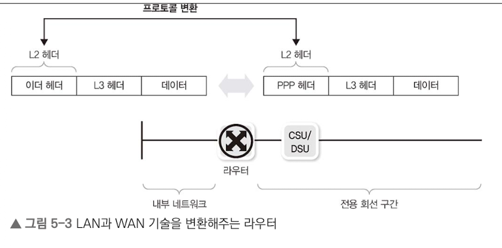
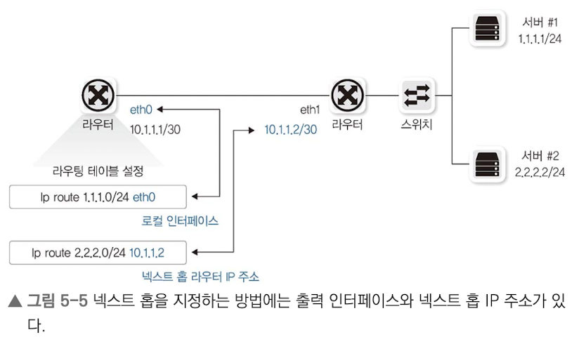
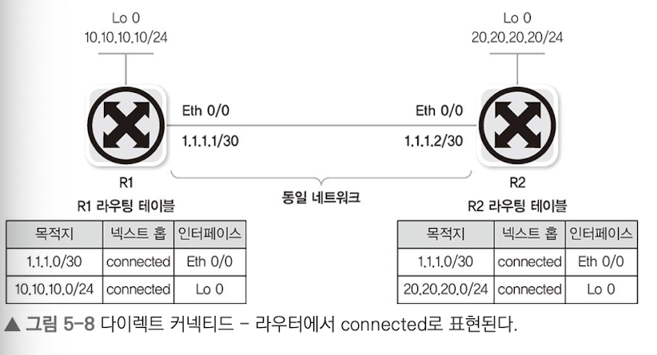
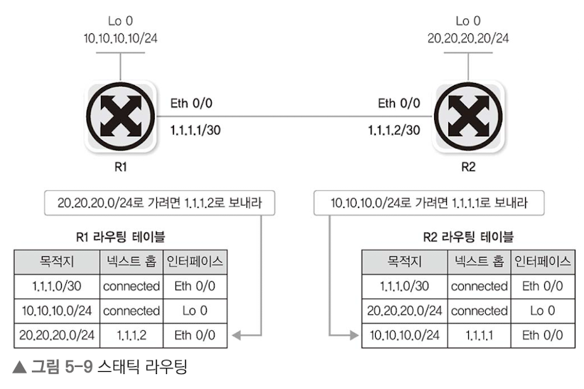
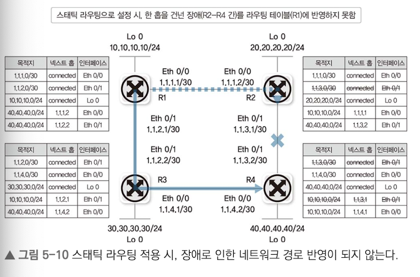
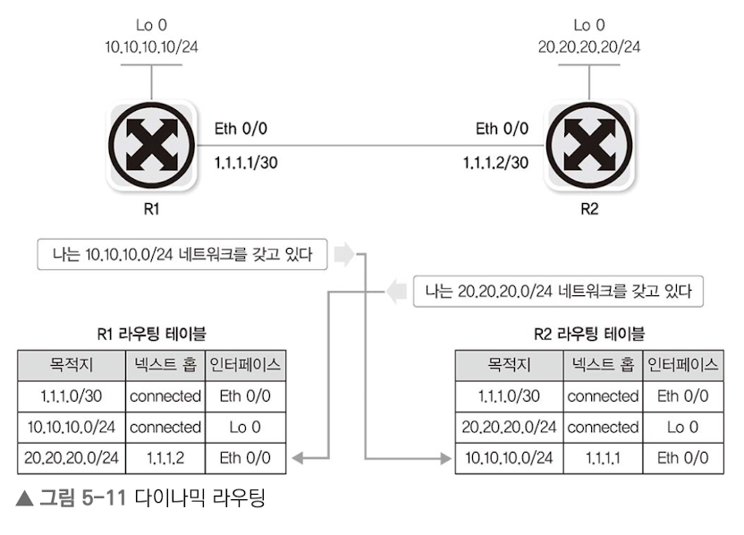
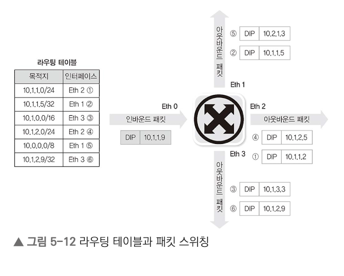
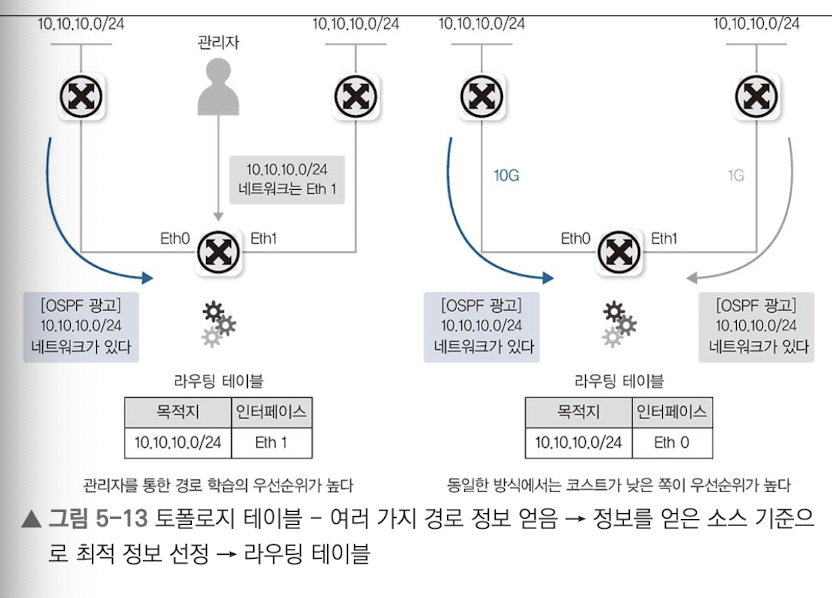
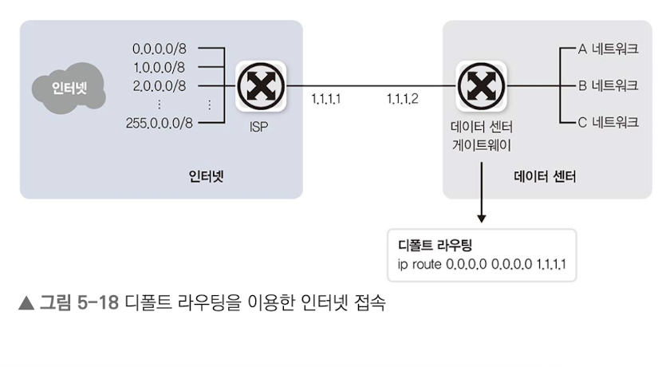

# 5.1 라우터 동작 방식과 역할
## 5.1.1 경로 지정
경로 정보를 모아 라우팅 테이블을 만듬 -> 들어온 패킷의 도착지 IP를 통해 패킷 포워딩

스위치와 다르게 자신이 얻은 경로 정보에 포함된 패킷만 포워딩

## 5.1.2 브로드캐스트 컨트롤
패킷을 원격지로 보내기 위해 분명한 도착지 정보가 있을 때만 통신 가능
기본적으로 멀티캐스트 정보 습득 X, 브로드캐스트 패킷 전달 X

## 5.1.3 프로토콜 변환

과거에는 LAN과 WAN에서 사용하는 프로토콜이 달라 프로토콜 변환을 라우터가 담당.
예를 들어, 이더 헤더인 L2 헤더를(내부 네트워크)를 WAN(전용회선구간)으로 전송하기 위해 PPP 헤더로 변환한다.

<br/>

# 5.2 경로 지정
패킷이 들어오기 전 경로 정보를 충분히 수집해야 함.
그러나 서브네팅으로 인해 IP주소가 굉장히 늘어남에 따라 최적화된 정보 습득이 필요하다. 따라서 완전히 일치한 정보 대산 가장 근접한 정보로 패킷을 포워딩하게 된다.

## 5.2.1 라우팅 동작과 라우팅 테이블
단말부터 목적지까지 전부 지정하지 않고 인접 라우터에 넘기는 방식을 `홉-바이-홉` 이라고 한다.

넥스트 홉을 지정할 땐 일반적으로 상대방 라우터의 인터페이스 IP 주소를 지정하는 방법을 사용한다.
인터페이스 설정 시 라우터의 나가는 물리 인터페이스를 지정할 수 있지만 논리적 인터페이스(VLAN 인터페이스 같은)을 사용할 수도 있다.



포워딩 시 오직 `목적지 주소`와 `라우팅 테이블만` 이용하여 포워딩을 결정한다.

> 3계층에선 루프를 막기위해 TTL을 사용한다.

## 5.2.2 라우팅(경로 정보 얻는 방법)

경로 정보를 얻는 방법은 크게 3가지이다.

1. 다이렉트 커넥티드
2. 스새틱 라우팅
3. 다이나믹 라우팅

### 5.2.2.1 다이렉트 커넥티드
라우터는 IP와 서브넷 마스크를 통해 얻은 네트워크 정보를 **라우팅 테이블에 자동 저장**한다.
따라서, 강제 삭제는 불가능하고 해당 인터페이스가 비활성화되면 자동 삭제된다.



### 5.2.2.2 스태틱 라우팅
관리자가 직접 목적지 네트워크와 넥스트 홉을 라우터에 지정.
직접 삭제도 가능하고 다이렉트 커넥티드 처럼 인터페이스 비활성화 시 자동삭제 된다.



### 5.2.2.3 다이나믹 라우팅

큰 네트워크의 경우, 스태틱 라우팅마능로 관리가 어렵다. 라우터 너머의 정보를 파악하기 어려워 장애 발생 시 대체 경로로 패킷을 보낼 수 없다.

`다이나믹 라우팅`은 라우터끼리 자신의 정보를 서로 교환하여 전체 네트워크 정보를 학습한다. 따라서, 장애 발생 시 대체 경로로 패킷 포워딩이 가능하다.



## 5.2.3 스위칭 (라우터가 경로를 지정하는 방법)
`스위칭`: 패킷이 들어오면 라우팅 테이블을 참조하여 최적의 경로로 포워딩하는 작업


완전한 매치 대신 `롱기스트 프리픽스 매치`를 사용하여 가까운 경로를 선택. 이 방버은 더 많은 리소스를 소모하기 때문에 캐싱을 통해 최적화가 가능하다.

## 5.2.4 라우팅, 스위칭 우선순위

목적지 정보가 같고 서브넷을 사용할 경우, 가중치를 메겨 정한다.

1. 다이렉트 커넥티드: 라우터에 바로 붙은 대역이기 때문에
2. 스태틱 라우팅: 직접 등록된 만큼 신뢰도가 높다고 판단
3. 다이나믹 라우팅: 어떤 라우팅 프로토콜을 통해 받는지에 따라 우선순위 달라짐

<br/>

# 5.3 라우팅 설정 방법
## 5.3.1 다이렉트 커넥티드
라우팅 테이블에 목적지가 다이렉트 커넥티드라면 L2 통신으로 목적지에 도달한다.
외부 네트워크로 통신하려면 원격지 네트워크에 대한 라우팅 정보가 필요하다.

## 5.3.2 스태틱 라우팅
라우터에 직접 연결되지 않은 네트워크 정보를 입력.
```bash
ip route NETWORK NETMAST NEXTHOP [네트워크 장비: 시스코]
route add -net NETWORK /Prefix gw NEXTHOP [운영체제: 리눅스]
```

네트워크 규모가 매우 커지면 라우팅을 처리하는데 어려움이 있다. 따라서 대용량 인터넷 라우팅 전용 라우터가 필요하고 이는 인터넷 사업자가 운영한다. 일반 회사에서 운영하는 라우터는 모든 인터넷 경로 정보를 받아 처리하기 부적절하므로, 슽태틱 라우팅을 확장한 `디폴트 라우팅`을 이용한다.

### 디폴트 라우팅
모든 패킷을 인터넷 사업자에 보내기 위해선 200갸 이상의 스태틱 라우팅이 필요하다.
```bash
ip route 0.0.0.0 255.0.0.0 1.1.1.1
ip route 1.0.0.0 255.0.0.0 1.1.1.1
ip route 2.0.0.0 255.0.0.0 1.1.1.1
ip route 3.0.0.0 255.0.0.0 1.1.1.1
...
ip route 255.0.0.0 255.0.0.0 1.1.1.1
```

첫 옥텟이 0 ~ 255인 것까지 넥스트홉을 1.1.1.1로 보내고 있다.

이를 줄여 모든 모든 목적지(0.0.0.0/0)를 1.1.1.1로 전송하도록 설정할 수 있다.

```bash
ip route 0.0.0.0 0.0.0.0 1.1.1.1
```



> 디폴트 라우팅 = 디폴트 게이트웨이


## 5.3.3 다이나믹 라우팅
SPoF를 막기 위해 두 개 이상의 경로를 유지하기 위해 스태틱 라우팅만으로는 한계가 있다. 따라 라우터끼리 자신들만의 프로토콜로 정보를 교환하도록 한다.

### 다이나믹 라우팅 프로토콜 분류
### 5.3.3.1 역할에 따른 구분
일반적으로 유니캐스트 라우팅 프로토콜을 사용한다.

AS라는 자율 시스템이 있다. AS는 하나의 조직이므로 다른 AS와 통신과 내부 통신이 다를 수 있다.

### 5.3.3.2 동작 원리에 따른 분류
