# 6.1 4계층 장비의 특징
4계층 장비는 포트 번호, 시퀀스 번호, ACK 번호를 바탕으로 작동하기 때문에 통신 전반의 관리를 하기 위한 세션 테이블이 필요하다.

- 세션 테이블
- 대칭 경로 요구: 인바운드와 아웃바운드 경로가 일치
- 정보 변경(로드밸랜서의 경우)

# 6.2 로드 밸런서
서버나 장비 부하를 분산해주는 장비. 웹 서버의 부하 분산에 가장 많이 사용. 비용 절감에 있어 스케일 아웃이 많이 사용되기 때문에 로드 밸런서의 중요성이 더욱 커졌다.

대표 IP 주소를 서비스 IP 주소로 갖고, 그 밑에 시스템이 늘어나면 로드 밸런서가 각 시스템의 실제 IP로 변경해 요청을 보낸다.

- L4 로드 밸런싱
    - 일반적인 로드밸런서
    - TCP, UDP(특히 포트 넘버)를 기반으로 수행
    - 최근에는 L7도 함께 지원

- L7 로드 밸런싱
    - HTTP 등의 애플리케이션 프로토콜 기반으로 수행
    - HTTP 헤더, URI 기반으로 부하 분산 가능
    - `ADC(Application Delivery Controller)`라고 부름
    - 스쿼드나 Nginx의 `리버스 프록시`와 유사한 기능

## 6.2.1 L4 스위치
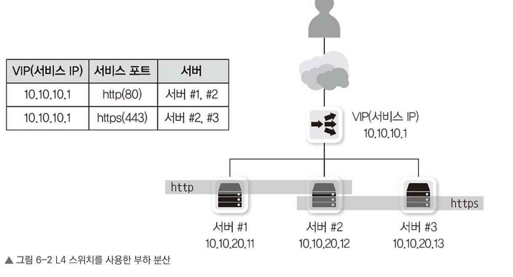
부하 분산, 성능 최적화, 리다이렉션 제공

- 설정 요소
    - 가상 서버: 사용자가 바라보는 실제 서비스
    - 가상 IP: 사용자가 접근해야 하는 서비스 IP
    - 리얼 서버: 실제 서비스를 수행하는 서버
    - 리얼 IP: 실제 서버 IP

가상 서버로 요청이 오면 L4 스위치가 리얼 서버로 분산해준다.

## 6.2.2 ADC
애플리케이션 계층에서 동작하는 로드 밸런서. 애플리케이션 헤더와 내용을 통해 부하 분산, 정보 수정, 정보 필터링 수행.

ADC는 프록시로 동작하고, **L4 스위치 기능을 포함**한다.
캐싱, 압축, 콘텐츠 변환 및 재작성, 인코딩 변환 및 프로토콜 최적화 기능 제공

## 6.2.3 L4 스위치 vs ADC
### L4 스위치
- 부하 분산
- TCP 게층에서의 최적화 및 보안 기능
- TCP 커넥션을 통한 보안과 성능 향상
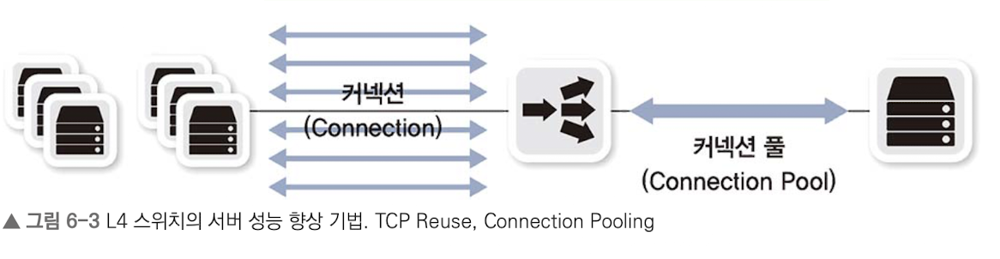

### ADC
성능 최적화 작업 중 부하가 심한 작업을 별도로 수행 -> `이미지나 정적 콘텐츠 캐싱`
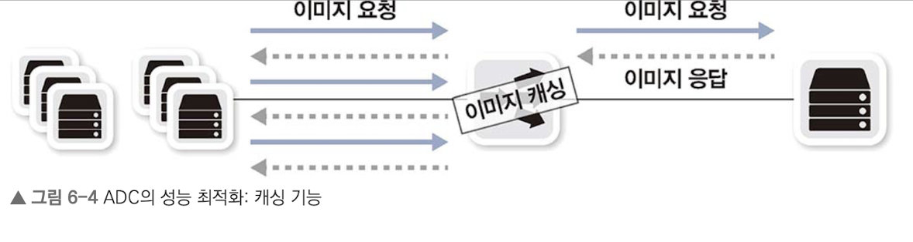
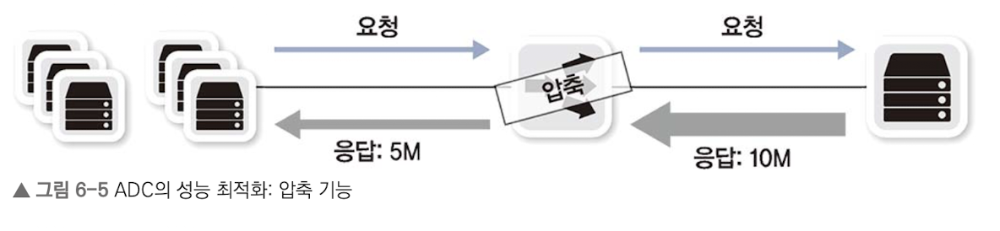

최근 SSL 프로토콜 사용이 많기 때문에 동작 속도를 향상시키기 위해 클라이언트-ADC는 SSL로, ADC-웹 서버는 HTTP로 통신한다.
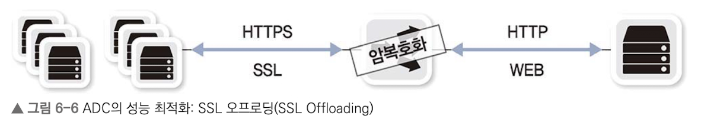

 

# 6.3 방화벽
해당 장비를 통과하는 트래픽을 사전 정책 조건에 맞춰 허용 및 차단하는 장비를 말한다.
3, 4계층에서 동작하고 세션을 인지 및 관리하는 SPI 엔진을 기반으로 동작한다.

NAT와 유사하게 세션 정보를 장비 내부에 저장.
이를 통해 세션 테이블에 없는(정책에 없는) 요청은 무시한다.

# 6.4 4계층 장비를 통과할 때의 유의점 (세션 관리)
세션 테이블로 패킷 변경 및 애플리케이션 성능 최적화, 보안을 위한 패킷 포워딩 및 드롭을 진행한다.

이를 위해 애플리케이션과 새션 장비 간 세션 정보를 동일하게 유지해야한다.

## 6.4.1 세션 테이블 유지, 세션 정보 동기화
세션 상태를 테이블에 기록하여 통신이 없더라도 종단 장비 간 통신이 종료되지 않으면 일정 시간 동안 세션 테이블을 유지한다. 이는 메모리를 사용하기 때문에 적절한 타임아웃 값을 설정해야 한다.

만약 **세션 장비의 세션 만료 시간 < 애플리케이션 세션 만료 시간** 이면, SYN이 아닌 ACK 패킷을 보내도 비정상 패킷으로 판단하여 차단하게 된다.
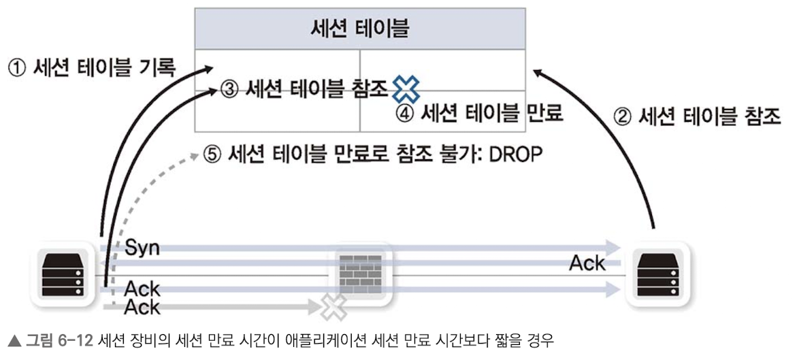

이런 문제를 해결하기 위해 여러 설정이 가능하다.

### 6.4.1.1 세션 장비 운영자 입장
**가. 세션 만료 시간 증가**
애플리케이션에 맞게 세션 장비의 타임아웃을 늘리면 된다. 시스템 메모리 고갈을 위해 적절한 유지 시간을 미리 알려야 한다.

**나. 방화벽 설정**
세션 테이블에 정보가 없더라도 통과시키는 설정. 보안에 취약하다.

**다. 세션 장비에서 양 단말에 세션 종료 통보**
세션 장비에서 세션 타임아웃 시, 세션 정보를 삭제하지 않고 양 종단에 RST를 통보.
양 종단은 세션이 비정상으로 종료됐다고 판단해서 세션을 끊는다.

### 6.4.1.2 개발자 입장
**가. 애플리케이션에서 주기적인 패킷 발생**
가장 좋은 방법으로 더미 패킷을 보낸다. 최근 대부분 플랫폼에서 내장하고 있고, 헬스 체크 기능을 구현할수도 있다.

## 6.4.2 비대칭 경로 문제
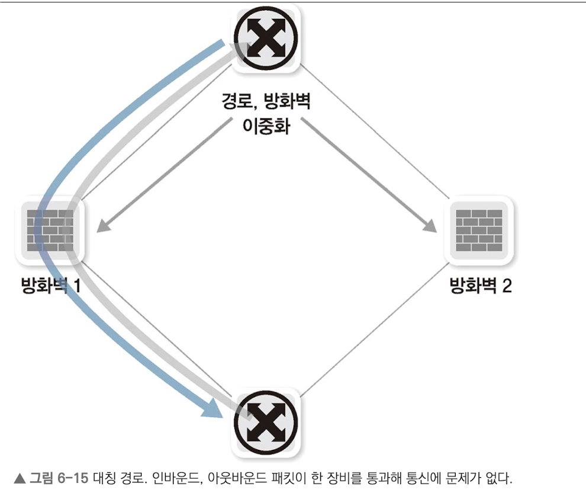
네트워크 안정성을 위해 네트워크 회선과 장비를 이중화한다. 경로가 2개 이상이되면 인바운드 패킷과 아웃바운드 패킷 경로가 달라질 수도 있다. 이를 비대칭 경로라고 한다.

가장 좋은 해결 방법은 비대칭 경로가 생기지 않게 경로를 디자인하는 것이지만, 세션 장비 성능이 저하될 수 있다.

첫번째 해결방법은 `세션 테이블을 동기화`하는 것이다. 두 개 경로상의 두 장비가 하나의 장비처럼 동작하여 정상 작동한다. 그러나 세션 동기화 시간보다 패킷 응답이 빠르면 비정상 동작할 수 있다.
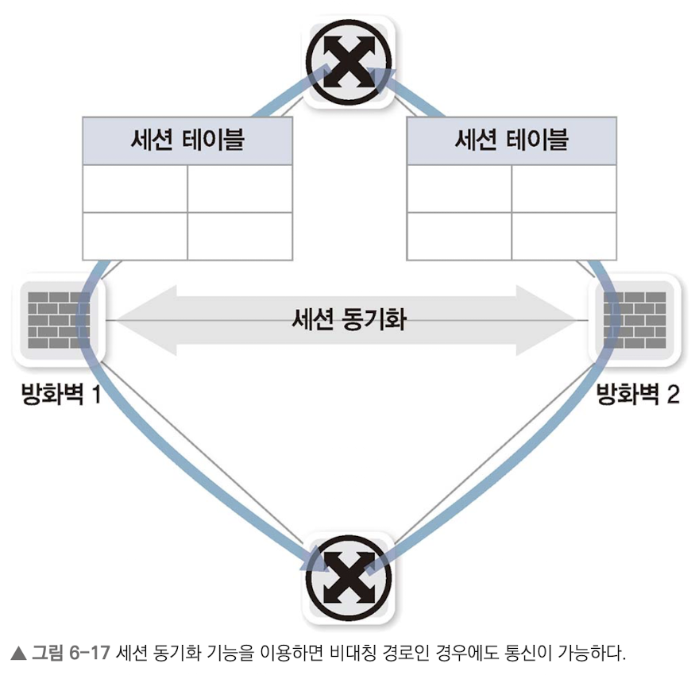

두번째 해결방법은 `비대칭 경로가 생길 경우, 세션 장비에서 다양한 방법으로 보정하는`것이다.
인바운드 패킷이 통과하지 않았는데 아웃바운드 패킷이 들어온 경우, 인바운드 패킷이 통과한 다른 세션 장비로 패킷을 보낸다.

## 6.4.3 하나의 통신에 두 개 이상의 세션이 사용될 때의 고려사항
현대에는 하나의 통신에 한 개의 세션을 사용하지만, 과거에는 여러 개의 세션을 사용하는 프로토콜도 있다.

### 프로토콜 구조
`데이터 프로토콜`: 데이터를 실어 나름
`컨트롤 프로토콜`: 데이터가 잘 전송되도록 세션 제어

현대에는 하나의 프로토콜에서 헤더와 별도 메시지로 해결하지만, 오래된 프로토콜은 그렇지 않다.

### FTP
FTP는 컨트롤 프로토콜과 데이터 프로토콜이 완전 분리되어 있고, 두 가지 모드를 가진다.

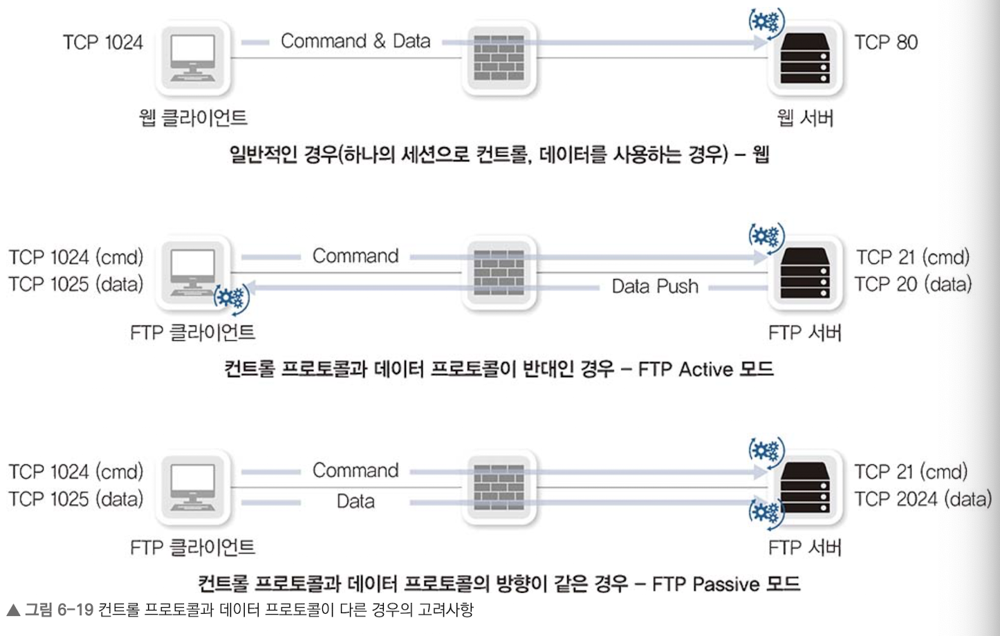

- Active 모드
    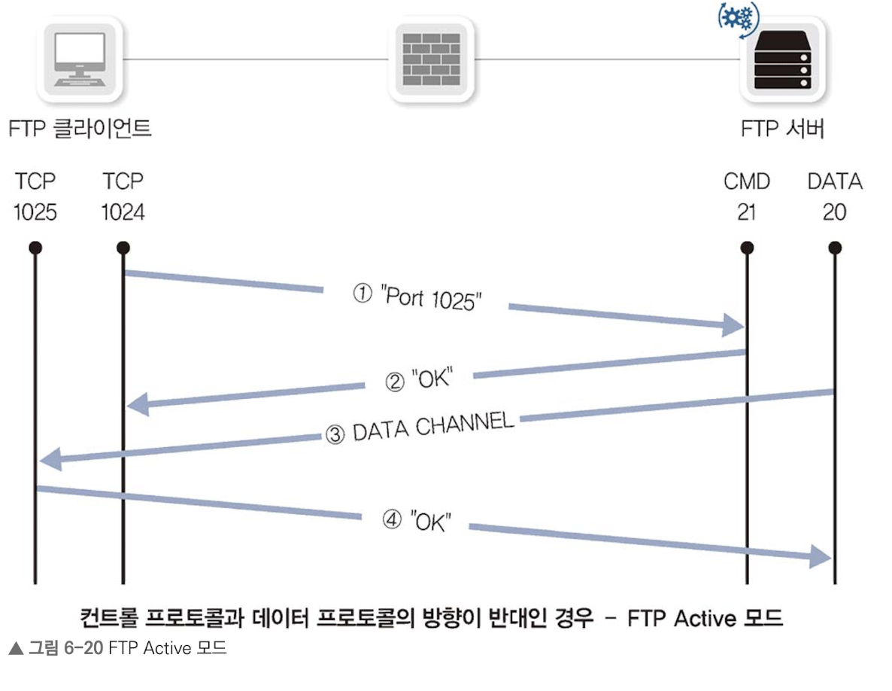
    - 중간에 방화벽이 있으면 방화벽 반대 방향도 열어주어야 한다. (3번에서 서버가 클라이언트에 요청하기 때문에)

- Passive 모드
    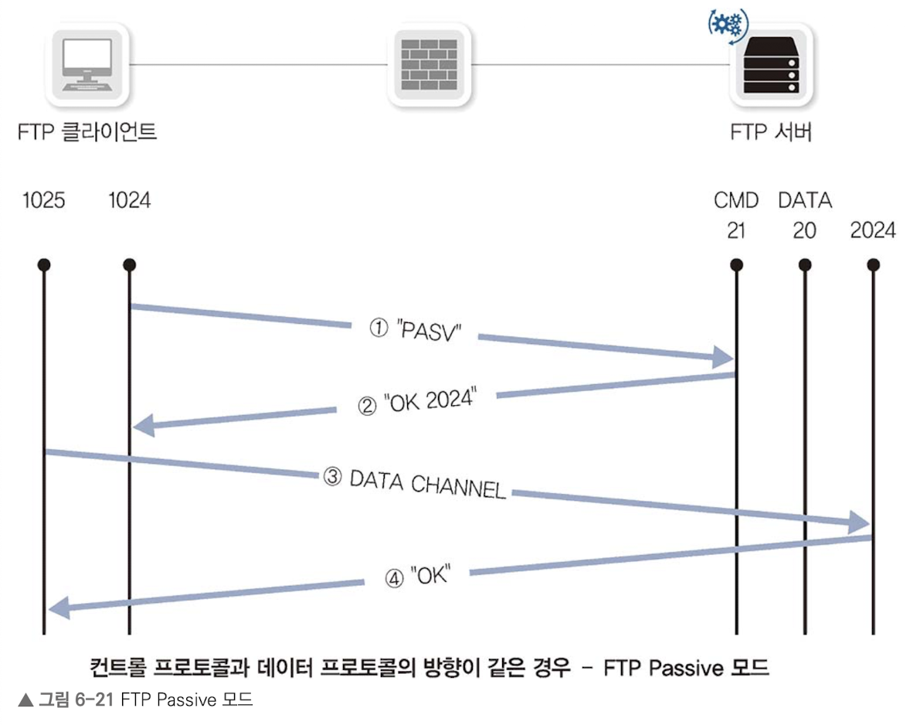
