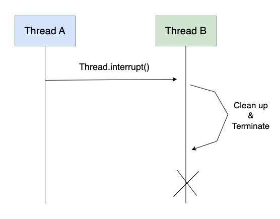
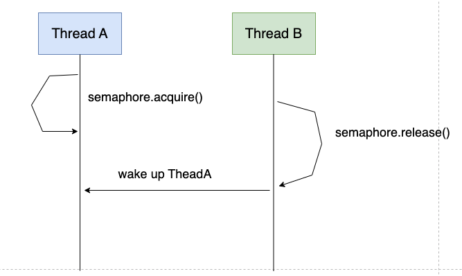
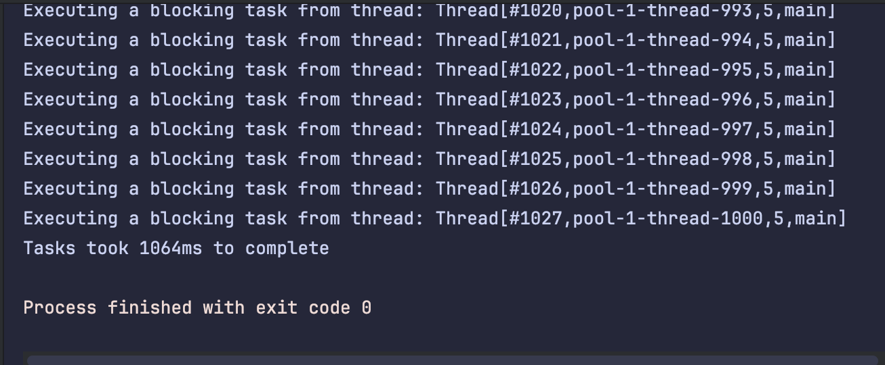
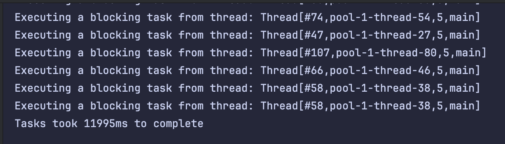
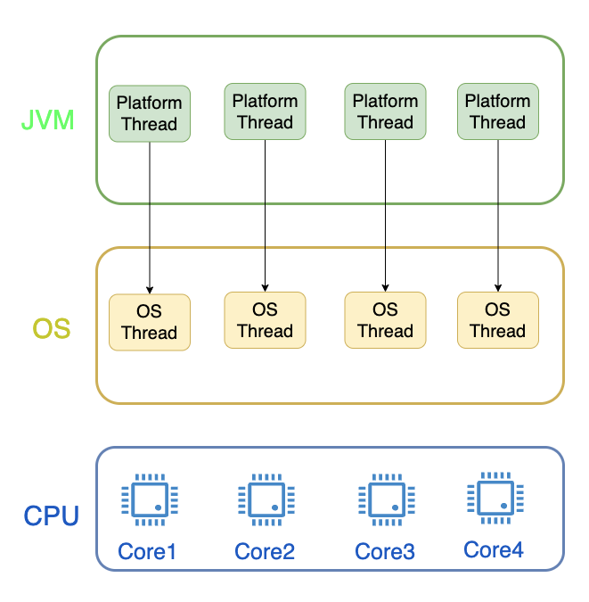
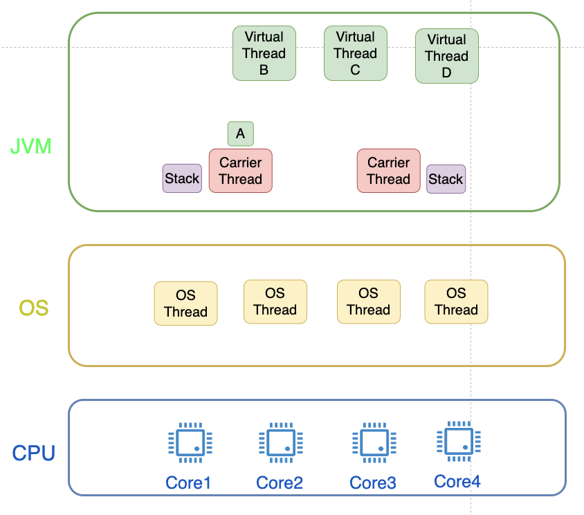
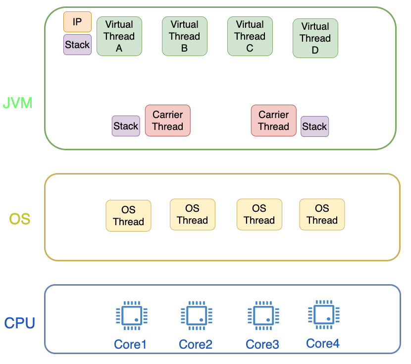

# 2. 스레딩 기초 - 스레드 생성

### Thread.start() vs. Thread.run()

- start() : 새로운 스레드 생성 후 run() 호출 -> 멀티 스레드
- run() : 스레드 생성 없이 run()만 실행 -> 싱글 스레드

### 스레드 정지하는 ㅣㅇ유
1. 스레드는 아무것도 안해도 리소스를 사용한다.
2. 스레드 오작동 시 주징해야 한다.
3. 메인 스레드가 멈춰도 다른 스레드가 살하있으면 애플리케이션이 종료되지 않는다.

### thread.interrupt()

```java
Thread thread = new Thread(new CustomRunnable());
thread.start();

private static class CustomRunnable implements Runnable {
    
    @Override
    public void run() {
        try {
            while(true) {
                char input = (char) System.in.read();
                if(input == 'q') {
                    return;
                }
            }
        } catch (IOException e) {
            
        }
    }
}
```

스레드가 유저의 인풋을 받는 동안 당연하게도 스레드 블로킹이 발생한다. 이 상태를 벗어나기 위해 interrupt()를 사용한다.
이 때 interrupt()만 호출하지 않고 이를 catch할 수 있는 구문 추가도 필요하다.

```java
Thread thread = new Thread(new CustomRunnable());
thread.start();
thread.interrupt();

private static class CustomRunnable implements Runnable {
    
    @Override
    public void run() {
        try {
            while(true) {
                if(Thread.currentThread().interrupt()) {
                    break;
                }
                char input = (char) System.in.read();
                if(input == 'q') {
                    return;
                }
            }
        } catch (IOException e) {
            
        }
    }
}
```

# 3. 성능 최적화
## 성능 및 지연 시간 최적화 개요
성능 메트릭은 상황마다 다를 수 있다. 예를 들어 주식 트레이딩 프로그램에선 성능 메트릭은 지연시간이다. 그러나 비디오 플레이어에선 프레임 레이트의 정확도가 성능 메트릭이 된다. 마지막으로 댜규모 데이터 머신러닝 애플리케이션의 경우 처리량이 성능 메트릭이 된다.

### 지연 시간을 줄이는 방법
총 T의 지연 시간이 걸리는 작업을 하위 작업 N개로 나누어 T/N에 수행 가능하도록할 수 있다.
최적의 결과는 N개의 코어에 N개의 하위 작업이 일정한 기간 동안 수행되어야 한다. 그러나 이런 결과를 가져오는 것은 거의 힘들다. 또한 병렬로 수행된 하위 작업을 합치는 과정도 있기 때문에, 작업 시간이 길수록 멀티 스레딩 프로그래밍이 싱글 스레딩 프로그래밍보다 레이턴시가 짧아지는 교차점이 발생하게 된다.

## 처리량 최적화
엄청 긴 텍스트에서 단어가 몇 번 사용됐는지 확인하는 HTTP 서버를 만들었다. 200개의 스레드가 한 번에 요청을 보낼 경우, 싱글 스레드와 멀티 스레드 일때의 성능을 알아보자.

| 스레드 수 | 처리량(/sec) |
|---|---|
| 1 |  14.8 |
| 2 | 16.6 |
| 4 | 21.3 |
| 8 | 25.6 |
| 16 | 29.5 |

가상 스레드 수 이상으로 스레드를 늘릴 경우, 결과에는 큰 영향을 미치지 않는다.

<br/>

# 섹션 5: 스레드 간 데이터 공유
## 스택 및 힙 메모리 영역

### 스택
```c
void main
```

- 스레드 실행 시 포함되는 모든 변수는 Stack에 있다.
- 스레드 생성 시 보통 할당된다.
- Stack Size는 한정되어 있고, 상대적으로 작다. (플랫폼마다 다름)
- 그렇기 때문에 너무 깊은 계층적 시스템 콜은 StackOverflow Exception을 유발한다.

### 힙
- 무엇이 할당되는가?
    - 객체 (String, Object, Collection)
    - Class의 멤버 변수
    - 정적(static) 변수

- 힙 메모리 관리
    - GC에 의해 관리된다.
    - 객체는 레퍼런스가 하나라도 있으면 힙에 머무른다.
    - 클래스 멤버변수는 부모 클래스와 같은 생명주기를 같는다.
    - 정적 변수는 영원히 머무른다.

### 레퍼런스 != 객체

```java
Object referenceVar1 = new Object();
Object referenceVar2 = referenceVar1;
```

두 레퍼런스 변수는 하나의 오브젝트를 가르킨다.

- 레퍼런스 : Stack에 할당된다. 단, 클래스 멤버변수이면 Heap에 할당된다.
- 객체 : Heap에 할당된다.

### 문제

```java
public List<String> getAllNames() {
    int count = idToNameMap.size();
    List<String> allNames = new ArrayList<>();
    
    allNames.addAll(idToNameMap.values());
                
    return allNames;
}
```
allNames는 레퍼런스이므로 스택에 저장되고, new ArrayList<>의 경우 Collection이므로 힙에 저장된다.

## 리소스 공유와 임계 영역
### 스레드간 리로스 공유
- 리소스는 무엇을 의미하는가?
    - 변수
    - 자료 구조
    - 파일 또는 커넥션 핸들러
    - 메세지

### 스레드간 리로스를 공유하는 이유
- 멀티스레드 소프트웨어 아키텍처에서 디스패처라는 한 개의 스레드가 입력값을 받아서 작업을 배포하고 또 공유된 큐를 사용해 적은 수의 작업자 스레드만 사용하도록 한다. 이때 리소스를 공유하므로서 매우 빠른 속도로 작업을 수행할 수 있다.

- 마이크로서비스에서 서로 다른 스레드가 데이터베이스의 읽기 쓰기를 수행한다고 가정해보자. 

- 발생할 수 있는 문제

레이스 컨디션 발생 가능

### 레이스 컨디션 해결하기 - 임계 영역 할당

- invenrotyCounter가 공유되고 있다.
- items++ 과 items--가 동시에 일어나기 때문에 원자 작업이 아니다.

- items++가 원자 작업이 아닌 이유
    1. currentValue 가져오기
    2. newValue <- currentValue + 1
    3. items <- newValue

<br/>

# 섹션 6: 병행성 문제와 솔루션

## 자바에서 동시서 문제 해결하기
### 1. synchronized 사용하기
```java
public static class InventoryCounter {

    private int items = 0;

    public synchronized void increment() {
        items++;
    }

    public synchronized void decrement() {
        items--;
    }

    public synchronized int getItems() {
        return items;
    }
}
```

사실 해당 코드는 아래와 똑같이 작동한다.

```java
public static class InventoryCounter {

    private int items = 0;

    public void increment() {
        synchronized(this) {
            items++;
        }
    }

    public void decrement() {
        synchronized(this) {
            items--;
        }
    }

    public int getItems() {
        synchronized(this) {
            return items;
        }
    }
}
```

### 2. synchronized에 Lock 사용하기

synchronized 키워드 대신 Lock을 직접 설정할 수도 있다. 이때의 장점은 다음과 같다.
1. Lock을 두 개 설정할 수 있다.
2. 특정 부분에만 임계 영역을 설정할 수 있다.

```java
public static class testClass {

    Object lock1 = new Object();
    Object lock2 = new Object();

    public void method1() {
        synchronized(lock1) {

        }
    }

    public void method2() {
        synchronized(lock2) {

        }
    }
}
```

## 원자적 연산과 Volatile 및 메트릭의 실용 예시
### 원자적 연산
- 우리가 사용하는 모든 작업은 원자적이지 않다.
- 모든 레퍼런스 선언은 원자이다.
- Getter와 Setter는 원자이다.
- 원시 타입의 선언은 모두 안전하다. (long, double 등)
- long과 double은 64비트이기 때문에 32비트 컴퓨터에선 한 번에 연산되지 않을 수 있다.
    - 예) x = y <- 0~31 비트 연산 후, 32비트 ~ 63비트 연산 = 총 2번

### Volatile 
`volatile` 키워드를 통해 double 타입을 원자 작업을 하도록 수행할 수 있다.

```java
volatile double a;
```

## 경쟁 상태 및 데이터 경쟁
### 경쟁 상태
스레드 스케줄링에 따라 결과가 달라질 수 있다.
임계 영역을 확인하고 synchronized block을 통해 해결할 수 있다.

### 데이터 경쟁
```java
public class SharedClass {
    int x = 0;
    int y = 0;

    public void increment() {
        x++;
        y++;
    }

    public void checkForDataRace() {
        if(y > x) {
            throw new DataRaceException("This should not be possible");
        }
    }
}
```

위 코드에서 increment() 내부를 보면 무조건 x가 먼저 +1이 되기 때문에 DataRacException이 발생하지 않을 것이라고 생각한다.

그러나 직접이를 실행할 경우 DataRaceException이 자주 발생하는 것을 알 수 있다. 그 이유는 **컴파일러나 CPU가 비순차적으로 명령을 처리하는 경우**가 있기 때문이다.

이런 데이터 레이스가 발생하지 않는 경우도 있다. 다음 예시는 이전 결과가 다음 실행에 영향을 미치기 때문에 발생하지 않는다.

```java
public void someFunction() {
    x = 1;
    y = x+2;
    z = y+10;
}
```

- 해결 방법
    1. sytnchronized 키워드를 통해 공유 변수 보호
    2. volatile 키워드를 통해 공유 변수 선언

<br/>

# 섹션 7: 락킹 심화
## ReentrantLock
Lock 사용 시, unlock하는 것을 깜빡하여 데드락이나 오류에 빠지는 경우가 있다. 이를 막기위해 try-catch-finally을 통해 unlock을 한다.
```java
Lock lockObject = new ReentrantLock();

public int use() throws SomeException {

}

```

- getQueuedThreads() : 락을 얻기 위해 기다리는 쓰레드 리스트 반환
- getOwner() : 현재 락을 가진 쓰레드를 반환
- isHeldByCurrentThread() : 현재 쓰레드에 의해 락이 열려있는지 확인
- isLocked() : 어떤 쓰레드에 의해 락이 잠겨있는지 확인

ReentrantLock은 락의 공정성을 제어할 수 있다. `synchronized` 키워드는 공정성을 보장하지 않는다. ReentrantLock은 생성자에 실제 값을 전달해서 공정성을 만든다. 공정성 플래그 사용 시 락을 얻기 위한 시간 때문에 앱의 처리량이 줄어들 수 있다는 단점이 있다.

### LockInterruptibly
```java
while(true) {
    lockObject.lock();
    // ...
    if(Thread.currentThread().isInterrupted()) {
        cleanUpAndExit();
    }
}
```
이미 다른 스레드가 락을 사용중일 때 lock()을 수행하면 블록되어 멈추게 된다.
이럴 땐 interrupt 메서드를 호출해도 소용없다.
그러나 lock() 대신 `lockInterruptibly()`을 사용하면 innterupt가 가능하다.
 
### tryLock()
boolean tryLock()

- 락을 얻으면 true 반환
- 락 사용 불가 시, suspended되지 않고 false 반환

```java
// lock
lockObject.lock();
try {
    useResource();
}
finally {
    lockObject.unlock();
}

// tryLock
```java
if (lockObject.tryLock()) {
    try {
        useResource();
    }
    finally {
        lockObject.unlock();
    }
}
```

- 일반 lock() 사용 시, 얻을 때까지 블로킹이 된다.
- tryLock()의 경우, 없으면 블로킹 되지 않고 원래 일을 수행한다.

## Reentrant의 읽기쓰기 락
- 읽기 작업 위주 (캐시)
    - Reader 스레드에 비해 Writer 스레드 빈도가 낮다.
    - Reader 스레드와 Writer 스레드 간 경쟁 상태를 막는 락이 필요하다.
    - Reader 스레드 간의 락은 필요하지 않다. 

- 임계 구역이 짧은 경우, 다수의 Reader 스레드의 락은 앱 성능에 문제를 야기한다.


### How to Use
```java
readLock.lock();
try {
    readFromSharedResources();
} finally {
    readLock.unlock();
}
```

- 여러 스레드가 읽기 락이 진입하게 되면,  읽기 스레드가 몇 개인지 기록하게 된다.
- 읽기 락과 쓰기 락은 서로 차단하게 된다.

기존 Lock과 다르게 ReentrantReadWriteLock은 훨씬 효율적이다.

<br/>

# 섹션 8: 스레드 간 통신
## 세마포어
### 생산자-소비자
```java
Semaphore full = new Semaphore(0);
Semaphore empty = new Semaphore(1);
Item item = null;
```

```java
// Producer
while(true) {
    empty.acquire();
    item = produceNewItem();
    full.release();
}

// Consumer
while(true) {
    full.acquire();
    consume(item);
}
```

### 생산자-소비자 with 큐

```java
Semaphore full = new Semaphore(0);
Semaphore empty = new Semaphore(CAPACITY);
Queue queue = new ArrayDeque();
Lock lock = new ReentrantLock();
```

```java
// Producer
while(true) {
    Item item = produce();
    empty.acquire();
    lock.lock();
    queue.offer(item);
    lock.unlock();
    full.release();
}

// Consumer
while(true) {
    full.acquire();
    lock.lock();
    consume(item);
    lock.unlock();
    consume(item);
    empty.release();
}
```

## 조건 변수: 다목적, 스레드 간 통신
### 스레드 통신 방법
1. 인터럽트로 다른 스레드 종료시키기


2. Join()으로 대기하기 


3. 세마포로 release하기 


### 조건 변수로서의 세마포
- `acquire()` 호출은 `Permit 수 > 0인가?`를 체크하는 것과 같다.
- 만약 condition이 not met이면, thread A는 다른 스레드가 세마포를 변경할 때까지 잠든다.
- 만약 Thread B가 `release()`하면, thread A가 일어난다.
- 일어난 thread A는 다시 `acuire()`로 체킹한다.

### Condition 변수
Thread A가 세마포 상태를 체킹할 때의 Condition 변수를 생성해보자.
Condition 변수는 Lock과 연관되어 있고, 원자성이 보장되어야 한다.


**[생산자 소비자 패턴을 이용한 로그인 정보 확인 시스템]**
```java
Lock lock = new ReentrantLock();
Condition condition = lock.newCondition();
String username = null, password = null;

// Consumer
lock.lock();
try {
    while(username == null || password == null) {
        condition.await();
    }
} finally {
    lock.unlock();
}
doStuff();

// Provider
lock.lock();
try {
    username = userTextbox.getText();
    password = passwordTextbox.getText();
    condition.signal();
} finally {
    lock.unlock();
}
```

## wait(), notify(), notifyAll()
- Object Class를 상속받은 Java Class에서 사용 가능
- 어떤 객체도 condition variable과 lock으로 사용 가능 (단, synchronized 키워드를 사용해야 함)
- wait(): 또 다른 스레드가 일어날 때 까지 현재 스레드는 기다린다.
    - 대기 상태에선 CPU를 소비하지 않는다.

```java
public class MySharedClass {
    private boolean isComplete = false;
    public void synchronized waitUntilComplete() {
        while(isComplete == false) {
            wait();
        }
    }

    public void synchronized complete() {
        isCompelete = true;
        notify();
    }
}
```

### Object Signalling vs Condition Variables
| Object Signalling | Condition Variables |
|:-----------------:|:-------------------:|
| synchronized(object) { | lock.lock() |
| } | lock.unlock() |
| object.wait() | condition.await() |
| object.notify() | condition.signal() |
| object.notifyAll() | condition.signalAll() |

<br/>

# 섹션 9: Lock-Free 알고리즘, 데이티 구조 및 기술
## 멀티스레드 프로그래밍: Lock-Free 알고리즘 강의 요약

### 1. Lock-Free 프로그래밍 소개
- 멀티스레드 프로그래밍에서 **가장 매력적이고 중요한 주제** 중 하나.
- 기존의 '락(Lock)'을 사용한 병행성 문제 해결 방법을 대체하거나 보완하는 기술.
- 락은 대부분의 병행성 문제를 쉽고 안전하게 해결할 수 있는 중요한 도구이지만, 여러 단점을 가지고 있음.
- 좋은 엔지니어는 다양한 도구(락, Lock-Free)를 이해하고 상황에 맞는 최적의 도구를 선택할 수 있어야 함.

### 2. 기존 '락(Lock)' 방식의 문제점

1.  **데드락 (Deadlock)**
    - 여러 스레드가 서로의 작업이 끝나기를 기다리며 **모두 멈추는 상태**.
    - 애플리케이션에 락이 많을수록 발생 확률이 높아지며, 해결하기 매우 까다로움.

2.  **성능 저하**
    - 특정 스레드가 락을 너무 오래 점유하면, 해당 락을 기다리는 다른 모든 스레드들이 **가장 느린 스레드의 속도에 맞춰져** 전체적인 성능이 떨어짐.

3.  **우선순위 역전 (Priority Inversion)**
    - 우선순위가 낮은 스레드가 락을 가진 상태에서 CPU 점유를 잃게 되면, 해당 락이 필요한 **우선순위 높은 스레드가 실행되지 못하고 무한정 대기**하게 되는 문제.
    - 애플리케이션 응답 없음(무응답성) 문제를 유발할 수 있음.

4.  **스레드의 예기치 않은 종료**
    - 락을 가진 스레드가 예기치 않게 죽거나 인터럽트 되면, 락이 해제되지 않아 **다른 모든 스레드가 영원히 대기**하는 상황 발생 (데드락과 유사).

5.  **성능 오버헤드 (Performance Overhead)**
    - 스레드가 락을 얻기 위해 경쟁하다 실패하면, 해당 스레드는 **'블록(block)' 상태**가 됨.
    - 이 과정에서 불필요한 **컨텍스트 스위치(Context Switch)**가 발생하여 오버헤드와 지연 시간을 유발함.
    - 특히, 초고속 거래 시스템처럼 아주 짧은 지연 시간도 중요한 시스템에서는 큰 문제가 될 수 있음.

### 3. Lock-Free 프로그래밍의 핵심 원리

- **문제의 근원**: `count++`와 같은 단순해 보이는 연산도 CPU에서는 "읽기 → 계산 → 저장"의 **여러 하드웨어 명령어로 나뉘어 실행**된다는 점. 이 명령어들 사이를 다른 스레드가 파고들어 값을 변경하면 데이터의 일관성이 깨짐(경쟁 상태).
- **해결책**: **단일 하드웨어 명령어로 실행되는 것이 보장된 연산**을 사용하는 것.
- 단일 하드웨어 명령어는 그 자체로 **원자적(Atomic)**이므로, 여러 스레드가 동시에 접근해도 안전함(Thread-safe).

### 4. Lock-Free 프로그래밍을 위한 Java 도구

1.  **`volatile` 키워드**
    - 공유 변수를 `volatile`로 선언하면, `long`/`double`을 포함한 모든 타입 변수의 **읽기/쓰기 연산이 원자적으로 처리**됨.
    - 데이터 경쟁 상태를 피하기 위한 가장 기본적인 방법.

2.  **`java.util.concurrent.atomic` 패키지**
    - `AtomicInteger`, `AtomicLong`, `AtomicReference` 등 다양한 원자적 클래스를 제공.
    - 이 클래스들의 메서드(예: `incrementAndGet()`, `compareAndSet()`)는 내부적으로 **플랫폼(CPU)이 보장하는 저수준 원자적 연산을 활용**함.
    - 개발자는 이 클래스들을 이용하여 복잡한 Lock-Free 알고리즘과 데이터 구조를 설계할 수 있음.

## AtomicInteger

### 1. AtomicInteger 소개

  - `java.util.concurrent.atomic` 패키지에서 **가장 중요하고 흔하게 사용되는 클래스**.
  - 정수(integer) 값에 대한 다양한 연산을 **원자적으로(atomically)** 수행할 수 있도록 지원.
  - 락(Lock) 없이 경쟁 상태(Race Condition)를 해결하는 첫걸음.
  - **생성 방법**: `new AtomicInteger(초기값);` 형태로 객체를 생성하여 사용.

### 2. 주요 원자적 연산 메서드

`AtomicInteger`가 제공하는 메서드들은 이름으로 기능을 쉽게 파악할 수 있습니다. 핵심 차이는 **연산 후 새로운 값을 반환하는가, 아니면 연산 이전의 기존 값을 반환하는가**입니다.

| 기능 | 새로운 값 반환 (연산 후) | 이전 값 반환 (연산 전) |
| :--- | :--- | :--- |
| **1 증가** | `incrementAndGet()` | `getAndIncrement()` |
| **1 감소** | `decrementAndGet()` | `getAndDecrement()` |
| **지정된 값(delta) 더하기** | `addAndGet(delta)` | `getAndAdd(delta)` |

  - **덧셈과 뺄셈**: `addAndGet`, `getAndAdd` 메서드에서 `delta` 값으로 음수를 전달하면 뺄셈 연산도 간단히 수행할 수 있습니다.

### 3\. 장점과 단점 (한계점)

#### 장점

  - **단순함**: `synchronized` 키워드나 `Lock` 객체를 사용할 필요가 없어 코드가 간결해짐.
  - **안전성**: 메서드 호출 자체가 원자적으로 실행되므로, 해당 연산에 대한 경쟁 상태나 데이터 경쟁을 걱정할 필요가 없음.

#### 단점 (매우 중요)

  - **원자성의 범위는 '단일 메서드 호출'에 한정됨.**
  - 두 개 이상의 `Atomic` 메서드를 연속으로 호출한다고 해서, 그 전체가 하나의 원자적 연산으로 묶이는 것은 아님.
  - **예시**:
    ```java
    atomicInteger.incrementAndGet(); // 이 연산 자체는 원자적임
    atomicInteger.addAndGet(5);    // 이 연산 자체도 원자적임
    ```
      - 위 두 연산은 **서로 분리된 원자적 연산**임. 한 스레드가 `incrementAndGet()`을 실행하고 `addAndGet(5)`를 실행하기 전에, 다른 스레드가 끼어들어 값을 변경할 수 있음.
      - 따라서 여러 연산을 하나로 묶어 원자적으로 처리해야 하는 경우에는 별도의 동기화 기법이 여전히 필요함.


<br/>

# 섹션10. 고성능 IO를 위한 스레드 모델

## 블로킹I/O 소개

### "최적의 스레드 개수 = CPU 코어 수" 정책의 한계
이 정책은 모든 작업이 CPU 연산일 때만 유효함.

작업에 블로킹 IO가 포함되면 이 정책은 하드웨어를 최적으로 활용하지 못하고 성능 문제를 야기함.


### 시나리오 1: 순수한 IO 바운드 애플리케이션
상황: 온라인 상점 (1코어 컴퓨터, 정책에 따라 1개 스레드 운영).

문제:

사용자 요청이 들어와 스레드가 원격 데이터베이스에 데이터를 요청 (느린 IO 연산).

데이터를 기다리는 동안 스레드는 차단(block)되고 CPU는 유휴 상태가 됨.

이때 다른 사용자에게서 새로운 요청이 들어와도, 유일한 스레드가 차단되어 있어 새로운 요청은 처리되지 못하고 대기해야 함.

결론: CPU 자원이 여유로움에도 불구하고, 블로킹 IO 때문에 애플리케이션 전체 처리량이 급격히 떨어짐.

### 시나리오 2: 가끔 IO가 발생하는 일반적인 애플리케이션
상황: 온라인 상점 (4코어 컴퓨터, 정책에 따라 4개 스레드 운영). 대부분의 데이터는 메모리에 있어 빠르지만, 가끔 데이터베이스 접근(IO)이 필요함.

문제:

4개의 요청 중 1개가 DB 접근(IO)을 하면서 해당 스레드가 장시간 차단됨. -> 사용 가능한 스레드가 3개로 줄어듦.

다음 들어온 4개의 요청 중 또 1개가 DB 접근을 하면 -> 사용 가능한 스레드는 2개로 줄어듦.

결론: 가끔 발생하는 블로킹 IO 호출이 점점 가용 스레드 풀을 고갈시킴. 이로 인해 IO 작업과 전혀 상관없는 빠른 메모리 기반 요청들까지 지연되는 등 애플리케이션 전체 성능에 악영향을 미침.


### '작업 단위 스레드(Thread-per-Task)' 모델 소개
핵심 아이디어: 들어오는 모든 요청이나 작업(Task)에 대해 개별 스레드를 하나씩 할당하는 방식. '요청 단위 스레드(Thread-per-Request)'라고도 불림.

목표: 특정 작업이 블로킹 I/O로 멈추더라도 다른 스레드에서 다른 작업을 동시에 처리하여, CPU가 쉬는 시간을 줄이고 전체적인 처리량을 높이는 것.

구현: Java에서는 Executors.newCachedThreadPool() 같은 동적 스레드 풀을 사용해 유사하게 구현. 필요할 때마다 새 스레드를 생성하여 작업을 처리함.

2. 성능 측정 실험 및 결과 분석
강의에서는 Thread.sleep(1000)으로 1초짜리 블로킹 I/O를 모방하여 실험을 진행했습니다.

### 실험 1: 1,000개 작업 실행

결과: 약 1,000개의 스레드가 생성되었고, 전체 작업은 약 1초 만에 완료됨.

분석: 모든 작업이 각자의 스레드에서 동시에 실행되어 기대한 대로 높은 동시성을 보여줌.

### 실험 2: 10,000개 작업 실행 (스레드 수 제한 없음)

결과: 스레드 수가 계속 증가하다가 OutOfMemoryError가 발생하며 애플리케이션 충돌.

분석: 스레드는 메모리를 차지하는 비싼 자원이며, OS가 생성할 수 있는 스레드 수에는 한계가 있음. 이 모델은 확장성이 떨어짐.

### 실험 3: 10,000개 작업 실행 (스레드 수를 1,000개로 제한)

결과: 약 10초 소요. (10,000개 작업을 1,000개 스레드로 10번에 나누어 처리)

분석: 충돌은 막았지만, 이제 처리량(Throughput)이 스레드 풀의 크기에 의해 인위적으로 제한됨. CPU는 여전히 여유가 있음에도 더 빠르게 처리하지 못함.



### 실험 4: 잦은 블로킹 호출 (총 블로킹 시간은 동일)

상황: 각 작업이 '1초짜리 블로킹 1번' 대신 '10밀리초짜리 블로킹 100번'을 수행하도록 변경. (총 블로킹 시간은 1초로 동일)

결과: 예상 시간인 10초보다 훨씬 긴 약 23초가 소요됨.

분석: 잦은 블로킹 호출로 인해 스레드가 계속해서 '실행-대기' 상태를 오가면서 막대한 컨텍스트 스위칭(Context Switching) 오버헤드가 발


### '작업 단위 스레드' 모델의 장단점
- 장점
    - '코어당 1개 스레드' 모델보다 I/O 바운드 작업에서 훨씬 나은 성능과 동시성을 제공함.

- 단점
    - 높은 리소스 비용: 스레드는 생성 및 유지 비용이 비싸고 OS의 제한을 받으므로, 무한정 생성할 수 없어 확장성에 명백한 한계가 있음.

    - 처리량 제한: 애플리케이션 충돌을 막기 위해 스레드 수를 제한하면, 처리량이 스레드 풀 크기에 묶이게 됨.

    - 스레싱 (Thrashing) 발생: 블로킹 호출이 잦아지면 OS가 스레드를 CPU에 할당하고 빼는 '컨텍스트 스위칭' 작업에만 CPU 자원을 대부분 소모하게 됨. 이처럼 실제 작업이 아닌 시스템 관리(스케줄링)에 자원이 낭비되는 현상을 스레싱이라고 하며, 성능에 매우 치명적임


## 논블로킹(Non-blocking) I/O 모델
###  '작업 단위 스레드' 모델의 추가적인 문제점
성능 문제 외 안정성 문제: 블로킹 I/O는 성능 저하뿐만 아니라, 시스템 전체의 안정성을 해칠 수 있습니다.

- 제어의 역전 (Inversion of Control):
    - 상황: 우리 애플리케이션이 제어할 수 없는 외부 서비스에 네트워크 요청을 보낸다고 가정.
    - 문제: 만약 이 외부 서비스가 갑자기 느려지거나 멈추면, 해당 서비스에 요청을 보낸 스레드들이 모두 응답을 기다리며 **차단(block)**됩니다.
    - 결과: 결국 스레드 풀이 고갈되어, 이 외부 서비스와 전혀 관련 없는 다른 기능(예: 내부 DB 조회)을 요청하는 사용자까지 모두 영향을 받게 됩니다. 외부 서비스 하나가 우리 시스템 전체를 마비시키는 '제어의 역전' 상황이 발생합니다.

### 논블로킹 I/O (Non-blocking I/O) 모델 소개
핵심 아이디어: I/O 작업을 요청하되, 결과를 기다리며 스레드를 차단하지 않는(non-blocking) 방식.

동작 방식:

스레드가 I/O 작업을 요청하면, 시스템은 즉시 스레드를 반환시켜 다른 일을 계속 할 수 있도록 합니다.

I/O 작업이 완료된 후의 로직은 콜백 함수(Callback Function) 형태로 함께 전달합니다.

나중에 OS가 I/O 작업 결과를 받으면, 등록해 두었던 콜백 함수를 실행하여 나머지 작업을 처리합니다.

결과: 스레드가 멈추지 않으므로, '코어당 1개 스레드' 모델로 돌아가도 CPU를 100% 활용할 수 있게 됩니다.

### 논블로킹 I/O 모델의 장점
최고의 성능과 효율:

스레드가 블로킹되지 않아 CPU 유휴 시간이 최소화됩니다.

불필요한 스레드를 대량으로 생성할 필요가 없어 메모리 자원이 절약됩니다.

스레드 수가 적어 컨텍스트 스위칭 오버헤드가 거의 없습니다.

높은 안정성과 안전성:

외부 서비스가 느려져도 해당 콜백의 실행만 지연될 뿐, 다른 스레드들이 차단되지 않습니다.

따라서 특정 외부 시스템의 장애가 애플리케이션 전체로 전파되는 것을 막아 시스템 안정성을 크게 높일 수 있습니다.

### 논블로킹 I/O 모델의 단점 (치명적)
코드의 복잡성 - 콜백 지옥 (Callback Hell):

하나의 작업이 이전 작업의 결과에 의존하는 경우, 콜백 함수 안에 또 다른 콜백 함수가 중첩되는 구조가 반복됩니다.

이는 코드를 작성하고 읽기 매우 어렵게 만들며, 테스트와 디버깅을 극도로 힘들게 합니다.

어려운 API와 프레임워크 의존성:

OS나 JDK가 제공하는 저수준(low-level) 논블로킹 API는 직접 다루기 매우 복잡합니다.

이 때문에 대부분의 프로젝트는 논블로킹을 쉽게 구현하기 위해 Netty, RxJava, Reactor 등 별도의 서드파티 라이브러리나 프레임워크에 의존하게 되어, 애플리케이션의 복잡도와 의존성이 증가합니다.

## 가상 스레드 소개
### 플랫폼 스레드와 운영체제 스레드의 관계
기존의 자바 스레드를 이제 플랫폼 스레드라고 부릅니다. 플랫폼 스레드는 생성될 때 운영체제에 새로운 스레드를 요청하며, JVM은 고정된 크기의 스택 공간을 할당받습니다. 운영체제가 CPU 스레드 스케줄링 및 실행을 전적으로 담당하며, 플랫폼 스레드는 운영체제 스레드와 1:1로 매칭됩니다. 이러한 특성 때문에 플랫폼 스레드는 생성 및 관리에 많은 비용이 들고 제한된 자원으로 간주됩니다.


### 가상 스레드 특징
- 메모리 사용량이 적다.
- 최대 개수가 많다.
- 스레드 생성 비용이 싸다.
- 컨텍스트 스위칭 및 스케줄링 비용이 싸다.
- Nonblocking I/O 지원

### 가상 스레드의 동작 방식
가상 스레드는 JDK 21부터 도입된 새로운 유형의 스레드입니다. 플랫폼 스레드와 달리 가상 스레드는 JVM에 완전히 속하며, JVM이 그 생명주기를 관리합니다. 고정 크기 스택이 할당되지 않고, 더 이상 필요 없을 경우 JVM의 가비지 컬렉션에 의해 회수됩니다. 운영체제는 가상 스레드의 존재 자체를 알지 못하며, 생성 및 관리에 전혀 관여하지 않습니다. 이러한 특성 덕분에 가상 스레드는 저비용으로 대량 생성 및 삭제가 가능합니다.

가상 스레드가 실제로 CPU에서 실행될 수 있도록, JVM은 내부적으로 소수의 플랫폼 스레드 풀을 생성합니다. 특정 가상 스레드가 실행될 필요가 있을 때, JVM은 풀 내의 플랫폼 스레드 중 하나에 해당 가상 스레드를 **마운트(Mount)**합니다. 이때 해당 플랫폼 스레드를 **캐리어 스레드(Carrier Thread)**라고 부릅니다. 가상 스레드의 실행이 끝나거나 더 이상 진행할 수 없는 블로킹 상태가 되면, JVM은 가상 스레드를 캐리어 스레드에서 **언마운트(Unmount)**하고 현재 상태를 힙에 저장하여 플랫폼 스레드를 다른 가상 스레드가 사용할 수 있도록 합니다. 이 과정을 통해 JVM은 적은 수의 플랫폼 스레드로도 훨씬 많은 수의 가상 스레드를 효율적으로 스케줄링할 수 있습니다. 개발자는 가상 스레드의 스케줄링에 직접 관여할 수 없으며, 이는 JVM이 내부적으로 관리합니다.





## 가상 스레드를 사용한 블로킹 연산 성능 이점 요약
이번 강의에서는 가상 스레드를 블로킹 연산에 사용했을 때 얻을 수 있는 성능 이점에 대해 집중적으로 살펴보았습니다. 가상 스레드는 애플리케이션에서 동시에 실행하려는 작업을 나타내는 자바 객체이며, JVM은 플랫폼 스레드 풀 내에서 가상 스레드를 캐리어 스레드로 스케줄링하고 마운트하여 실제 작업을 수행합니다.

### 가상 스레드의 이점
IO 바운드 애플리케이션에 최적화: 가상 스레드는 스레드가 오랜 시간 기다려야 하는 IO 바운드 연산(예: 데이터베이스 읽기, 네트워크 통신, 파일 읽기/쓰기)에 특히 유리합니다. CPU 연산 위주의 작업에서는 큰 성능 이점을 기대하기 어렵습니다.

블로킹 API의 편리함 유지: 개발자는 익숙하고 사용하기 쉬운 블로킹 IO API를 계속 사용할 수 있습니다. JVM이 내부적으로 네트워크 연산의 논블로킹 버전을 사용하고 복잡성을 추상화해주기 때문입니다.

가벼운 스레드 생성 및 관리: 새로운 가상 스레드를 생성하는 비용은 매우 저렴합니다. 이는 새로운 스레드를 할당하거나 새로운 스택 프레임이 필요 없기 때문입니다.

컨텍스트 스위칭 비용 감소: 운영체제가 스케줄링에 직접 참여하지 않아 컨텍스트 스위칭 비용이 발생하지 않습니다. JVM은 단순히 차단된 가상 스레드 코드의 실행을 멈추고 다른 가상 스레드에 속한 코드를 찾아 실행을 계속합니다.

높은 처리량 및 안정성: 가상 스레드를 사용하면 애플리케이션 충돌 없이 동시에 훨씬 많은 수의 작업을 처리할 수 있습니다. 이는 기존 플랫폼 스레드 풀 방식에서 발생할 수 있는 스레싱(thrashing) 문제를 해결합니다.

### 가상 스레드의 작동 방식 (블로킹 IO 연산 시)
사용자 요청이 들어오면 새로운 가상 스레드가 생성되어 처리됩니다.

JVM은 가상 스레드를 플랫폼 스레드에 마운트하여 캐리어 스레드로 만듭니다.

코드 실행 중 데이터베이스 읽기와 같은 블로킹 IO 연산을 만나면, JVM은 캐리어 스레드를 차단하지 않고 가상 스레드를 마운트 해제합니다.

내부적으로 JVM은 논블로킹 IO를 사용하며, 이 복잡성은 개발자에게 공개되지 않습니다.

다른 사용자 요청이 들어오면, JVM은 새로운 가상 스레드를 생성하고 내부 플랫폼 스레드에 마운트하여 코드를 실행합니다.

이전 요청에 대한 데이터베이스 응답이 도착하면, JVM은 첫 번째 가상 스레드를 다시 마운트하고 중단되었던 지점부터 코드 실행을 재개하여 사용자 요청 처리를 완료합니다.

요청 처리가 완료된 가상 스레드는 더 이상 필요 없으므로 가비지 컬렉션의 대상이 됩니다.
