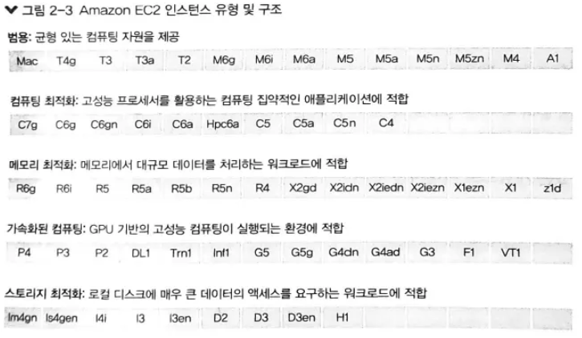
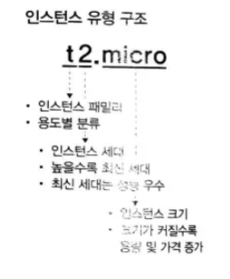

# 1. 컴퓨팅 서비스
- **EC2** : 인스턴스라는 가상 머신 형태로 제공 (가장 기본)
- **ECS** : EC2 기반 + (자원 배포, 스케줄링, 스케일링 관리)
- **Lambda** : 서버리스 컴퓨팅. 별도의 서버 설정 안해도 됨.
- **Lightsail** : 독립적인 환경 제공. 최소한의 설정만으로 사용 가능

# 2. EC2

> 💡 Elastic: 컴퓨팅 자원에 대해 원하는 만큼 확장 축소가 유연함.

- AMI(Amazon Machine Image)를 이용하여 인스턴스의 sw 정보 정의
- CPU, 메모리, 디스크, OS 등을 워크로드에 맞게 설정 가능

## 2.1 EC2 인스턴스

> 💡 CPU, 메모리, 스토리지, 네트워킹 용량을 결정하는 다양한 인스턴스 유형 제공

- 필요한 만큼 자원 사용, 다 쓰면 자원 반납하는 형태

### EC2 인스턴스 유형

### EC2 인스턴스 유형 구조

### 인스턴스 상태

💥 주의사항
- `중지됨` 과 `종료됨` 의 차이
    - 중지됨: 인스턴스 유지한 채 일시적으로 중지
    - 종료됨: 인스턴스 영구 삭제 (다시 사용 힘듬)
        - 콘솔 상에서 바로 삭제되지 않음. 일정 시간 후에 삭제됨

 

## 2.2 AMI
> 💡 인스턴스 시작 시, 필요한 정보를 제공함. (OS나 SW를 적절히 구성한 상태로 제공) = 템플릿

- 사용자 정의, MarketPlace의 서드 파티용, 자체 정의 기본 중 선택 가능

### 사용자 정의 AMI 생성 및 배포

- AMI는 동일 리전 또는 다른 리전으로 복사 가능
- 필요 없는 AMI는 등록 취소 가능

 

## 2.3 EC2 스토리지

> 💡 서버 자원에서 발생되는 다양한 데이터를 보관하는 저장 공간

- EC2 인스턴스용 스토리지 유형
    - 인스턴스 스토어
    - Amazon EBS (블록 스토리지)

### 인스턴스 스토어

> ✅ 인스턴스에 바로 붙어 있는 저장소 (기본 스토리지)

- 프리티어인 t2.micro는 인스턴스 스토어 지원하지 않음!
- 속도가 매우 빠름
- 인스턴스 중지 혹은 종료하면 데이터 손실됨

### Amazon EBS

> ✅ 인스턴스가 네트워킹을 통해 접근하는 영구 보존 스토리지 (하드디스크와 비슷)

- 스냅샷 생성, 백업 및 연결 해제 후 다른 인스턴스에 연결도 가능

 

## 2.4 EC2 네트워킹

### Amazon VPC

- AWS 퍼블릭 클라우드 안의 논리적으로 격리된 가상의 클라우드 네트워크

### 네트워크 인터페이스

- 네트워킹 수행을 위해선 네트워크 인터페이스가 필요.
- ENI라는 논리적 네트워크 인터페이스가 VPC 내 생성됨.
    - ENI를 EC2 인스턴스에 연결해서 네트워킹 수행
- 통신 케이블을 장착하는 어댑터

### IP 주소

- 대상을 구분하고 네트워킹 수행

 

## 2.5 EC2 보안

### 보안 그룹

- EC2 인스턴스의 송수신 트래픽 젱하는 가상의 방화벽
- 인바운드 규칙과 송신 트래픽에 대한 아웃바운드 규칙
- 대상 트래픽에 대한 허용과 거부 결정

### 키 페어

- 인스턴스에 연결 시 자격을 증명하는 보안 키
- 퍼블릭 키, 프라이빗 키로 구성
    - 퍼블릭 키: 인스턴스에 저장
    - 프라이빗 키: 사용자 컴퓨터에 별도로 저장
- 사용자가 가진 프라이빗 키를 이용하여 자격을 증명

