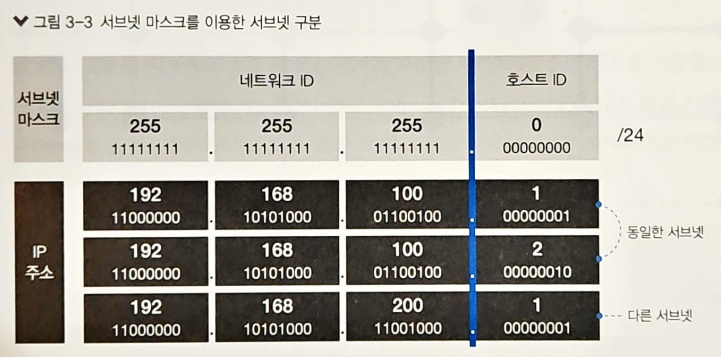
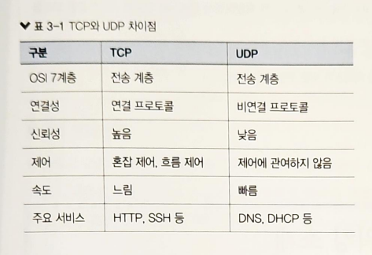
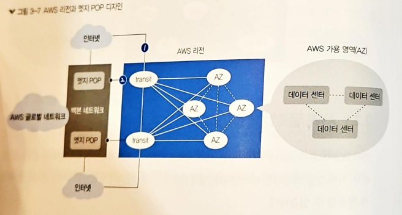
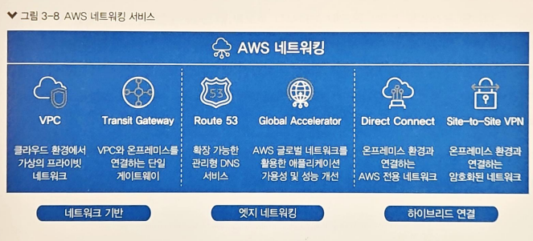
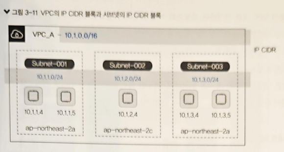
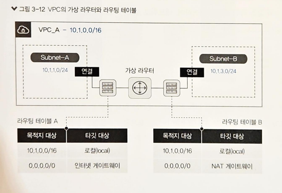
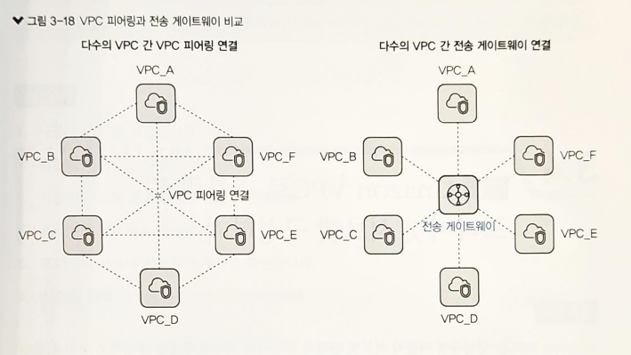

# 3장. AWS 네트워킹 서비스

[3장 실습](https://www.notion.so/3-410c4918410e4cd180606e8d26491ec1?pvs=21)

# 1. 네트워킹 요소

### OSI 7계층 모델

<aside>
✅ 네트워킹 통신 구조를 일곱 개의 계층으로 분류

</aside>

1. **물리 계층** : 네트워크 하드웨어 전송 기술.
2. **데이터링크 계층**: 물리 계층에서 송수신된 정보의 오류, 흐름 제어
3. **네트워크 계층** : 데이터를 최적의 경로로 전달 (라우터)
4. **전송 계층** : 종단 간 데이터 전송 다룸 (유효성, 효율성 보장)
5. **세션 계층** : 종단 간 응용 프로세스 통신 관리 (논리적 연결 담당)
6. **표현 계층** : 데이터 형식의 차이를 해결
7. **응용 계층** : 응용 프로세스와 직접 연계하여 실제 프로그램 서비스

### IP 주소와 서브넷

- `IPv4` : 10진수(0~255) 또는 2진수(0~1) 네자리로 되어 있으며, 각 자리는 온점으로 구분됨.
    - 예) 192.168.100.1 또는 11000000.10101000.01100100.00000001 (보통 전자)
    - 단점: 가용 범위가 부족 & 효울성 떨어짐 → 이를 보완하기 위해 IPv6 개발됨.
- `IPv6`

### 퍼블릭 IP 주소와 프라이빗 IP 주소

- 퍼블릭 IP 주소 : 실제 인터넷에서 사용하려고 인터넷 서비스 고읍자에서 제공하는 유일한 공인 IP 주소
- 프라이빗 IP 주소 : 인터넷이 아닌 독립된 네트워크 내부에서만 사용하려는 사설 IP 주소

<aside>
✅ 프라이빗 IP 주소의 세 가지 클래스 (범위 정해짐)

</aside>

### 고정 IP 주소와 유동 IP 주소

- `고정 IP 주소` : 네트워크 관리자가 수동으로 할당 (= 탄력적 IP)
- `유동 IP 주소` : 특정 서버가 동적으로 할당
    - DHCP (Dynamic Host Configuration Protocol)로 주소 제공하는 서버와 주소 할당 받는 클라이언트로 구성 (IP 주소 임대)

---

### 서브넷과 서브넷 마스크

<aside>
✅ **서브넷** : 부분 네트워크로, 다양한 서브넷이 거대한 네트워크 환경 이룸.

</aside>

<aside>
✅ **서브넷 마스크** : 32비트 구조 = 네트워크 ID + 호스트 ID

</aside>

- 서브넷 마스크로 서브넷을 구분함.
- 네트워크 ID : 서브넷 구분하는 기준 값
- 호스트 ID : 동일 서브넷 내에서 대상을 구분하는 기준 값

~~뒤에 있는 24는 범위를 의미한다.~~

**[ 정정 ]**

IP 주소 = 네트워크 ID + 호스트 ID

예) 192.168.60.14 가 32비트이므로  네트워크 ID는 24bit, 호스트 ID는 8bit.

서브넷 마스크가 255.255.255.0는 각 8비트의 범위를 의미한다.

이때, 네트워크 ID는 IP주소와 서브넷 마스크를 bit AND 연산하여 구한다.

예) 192.168.60.14 , 255.255.255.0

192 = 1100 0000

255 = 1111 1111

AND  연산 결과 = 1100 0000 (192와 같다.)

14 = 0000 1110

0   = 0000 0000

AND 연산 결과 = 0000 0000 (14와 다르다.)

따라서, 네트워크ID = 192.168.60.0

이를 쉽게 표현하는 것이 192.168.60.14/24

따라서, 맨 뒤에오는 **24는 네트워크ID의 길이를 의미**한다.

---

### 라우팅과 라우터

<aside>
✅ **라우팅** : 네트워킹 통신 시, 목적지 경로를 선택하는 작업
**라우터** : 라우팅 시 수행하는 장비 (물리적으로 존재)

</aside>

### TCP와 UDP

데이터 전송을 담당

- **TCP**
    
    <aside>
    ✅ 대상 간 연결 및 데이터 전송 여부 확인과 전송하는 **연결형** 프로토콜
    
    </aside>
    
    - 연결 맺고 확인하는 작업으로 신뢰도 높음. BUT, 느림
    - 속도 < 안정적

- **UDP**
    
    <aside>
    ✅ 대상 간 연결 없이 전달하는 **비연결형** 프로토콜
    
    </aside>
    
    - 연결, 제어가 없어 신뢰성 보장 X. BUT, 속도가 빠름

### 포트 번호

<aside>
✅ TCP, UDP 사용 서비스가 서로 구분하도록 사용

</aside>

- IANA 라는 인터넷 할당 번호 관리 기관에서 장의
    - HTTP: TCP 80번 / DNS: UDP 53번

---

# 2. AWS 네트워킹

## 2.1 AWS 리전 네트워킹 디자인

<aside>
💡 **리전**: 데이터 센터 군집화하는 물리적 위치
리전 = 트랜짓 센터 + 가용 영역

</aside>

|  | Intra-AZ | Inter-AZ | **트랜짓 센터 연결** |
| --- | --- | --- | --- |
| **정의** | 리전 내부의 **가용 영역 중** 100GE 또는 400GE로 상호 연결된 환경 | 지리적 떨어진 **가용 영역**끼리 연결된 환경 | 외부 인터넷 통신을 위한 환경 |
| **장점** | - | 정전이나 자연재해 같은 문제에 가용성을 유지
내결함성을 강화 | - |

## 2.2 AWS 글로벌 네트워크와 엣지 POP

<aside>
✅ `엣지POP`: AWS 글로벌 네트워크라는 전용망 → 고성능 서비스 제공하는 센터

</aside>

- 다음 두 가지로 구성.
    - **엣지 로케이션**
    - **리전별 엣지 캐시**
- 세계 300개 이상의 엣지 로케이션과 13개의 리전별 엣지 캐시 서로 연결된 AWS 글로벌 네트워크

- **목적** : 짧은 지연 시간 + 높은 처리량
- ex) Amazon CloudFront, Amazon Route 53, …

### 엣지 POP의 구조 및 일반 서비스와의 차이

- 일반: 트랜짓 센터에서 인터넷 구간으로 통신
- 엣지 POP : 트랜짓 센터 → 백본 네트워크 → 엣지POP 경유

<aside>
☝ `백본 네트워크` : 다양한 네트워크 연결하는 컴퓨터 네트워크 일부

</aside>

## 2.3 AWS 네트워킹 서비스

---

# 3. Amazon VPC

<aside>
✅ 커스텀 가상 프라이빗 클라우드 네트워크

</aside>

## 3.1 Amazon VPC 기본 구성 요소

### 리전과 VPC

- VPC는 리전(서울, 런던 등) 마다 독립적으로 존재
- 다른 리전 VPC 끼리 연결하여 확장 가능

### 서브넷과 가용 영역

- VPC 내에서 서브넷으로 분리된 네트워크 구성 가능
- **서브넷은 반드시 하나의 가용 영역에 종속적**

- 각 서브넷은 프라이빗, 퍼블릭 선택이 가능

### IP CIDR

<aside>
✅ IP 주소 범위를 표현하는 방법

</aside>

- VPC 내의 IP CIDR에서 서브의 IP CIDR이 분할되어 있음.
- 즉, **서브넷에서 생성된 자원은 IP CIDR 범위 내의 IP 주소 할당 받음.**

- IP CIDR(10.1.1.0/24), 서브넷의 IP는 해당 범위에 포함됨
    - 10.1.1.0/24는 10.1.1.0 ~ 24 라는 뜻??

### 가상 라우터와 라우팅 테이블

- 과정
    
    VPC → 네트워크 경로 확인 → 트래픽 전달용 가상 라우터 생성
    

- `가상 라우터` : 기본 라우팅 테이블 보유, 라우팅 테이블로 네트워크 경로 식별
    
    별도 라우팅 테이블 생성 가능 & 서브넷 연결하고 서브넷마다 라우팅 테이블 가짐
    

          **[ 참고 ]**

- 타깃 대상의 로컬: VPC 내부 간 통신 의미
- 특수 목적 용 인터넷 게이트웨이 혹은 NAT 게이트웨이 등을 타깃 대상 가능

- **목적지**(Destination): destination CIDR인 트래픽을 보낼 IP 주소 범위. 예를들어, CIDR 172.16.0.0/12를 가진 외부 기업 네트워크(external corporate network) --
    
    target보다 큰 개념
    
- **대상**: destination 트래픽을 보낼 게이트웨이, 네트워크 인터페이스(네트워크를 위한 물리 링크 연결, 라우터 같은!) 혹은 연결. 예를들어 인터넷 게이트웨이 --
    
    destination보다 작은 개념
    
    [ 목적지와 타깃 ]
    
    [AWS 라우트 테이블 (Route Tables) 이란? 그리고 실제 활용 (라우팅 테이블)](https://jake-seo-dev.tistory.com/229)
    
    - 101.0.0/16의 범위를 가진 IP는 로컬을 거쳐 이동한다.
    - 
    

### 보안 그룹과 네트워크 ACL

VPC는 가상 방화벽 기능 제공

- **목적** : 트래픽 접근 통제
- **기능** :
    - IP CIDR 블록, 프로토콜, 포트 번호 등 정의
    - 허용 또는 거부하는 보안 규칙
- **주의점** : 인바운드 규칙과 아웃바운드 규칙을 고려하여 보안 규칙 세우기
- **차이점**

|  | 보안 그룹 | 네트워크 ACL |
| --- | --- | --- |
| 공통점 | 송수신 트래픽 접근 통제 |  |
| 접근 제어 대상 | 인스턴스와 같은 자원 | 서브넷 |
| 스테이트풀과 스테이트리스 | 스테이트풀(이전 상태 저장) | 스테이트리스(이전 상태 모름) |
| 허용 및 거부 정책 | 허용 규칙 외는 차단 | 허용, 차단 모두 정의
(정의되지 않으면 기본적으로 차단) |

---

## 3.2 Amazon VPC와 다른 네트워크 연결

### 인터넷 게이트웨이

<aside>
✅ VPC와 인터넷의 논리적인 연결인 자원

</aside>

- 서브넷의 라우팅 테이블에서 나가는 타깃 대상을 인터넷 게이트웨이로 지정 → 퍼블릭 서브넷 환경으로 만듬

1. 인터넷 게이트웨이 생성 → Amazon VPC 연결
2. 서브넷의 라우팅 테이블이 타깃 대상을 인터넷 게이트웨이로 지정

### NAT 게이트웨이

<aside>
✅ 프라이빗 IP → 퍼블릭 IP 주소 변환 기능 제공

</aside>

1. 퍼블릭 서브넷에서 외부 인터넷 구간 통신
2. 프라이빗 서브넷에서 외부 인터넷 구간 통신
    
    프라이빗 IP → NAT 게이트 웨이 → 퍼블릭 IP → 인터넷 게이트웨이 → 인터넷 구간
    

### VPC 피어링

<aside>
✅ 서로 다른 VPC 연결 (다른 리전, 다른 계정 O)

</aside>

❗ 주의점

- IP CIDR 블록 중복되면 안됨!

### 전송 게이트웨이

<aside>
✅ 중앙 집중형 라우터 (다수 VPC나 온프레미스를 하나로)

</aside>

- 단일 지점 연결
- 네트워크 구성 간소화 & 비용 감소

### 가상 프라이빗 게이트웨이

<aside>
✅ 관리형 AWS Site-to-Site VPN 이나 AWS Direct Connect로 온프레미스 환경 연결

</aside>

설명이 이게 끝…

## 3.3 Amazon VPC 요금

VPC 기능 일부만 유료!

- NAT 게이트웨이 1시간당 100원 미만 요금 발생
