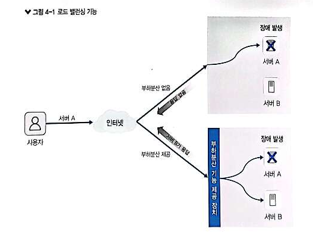
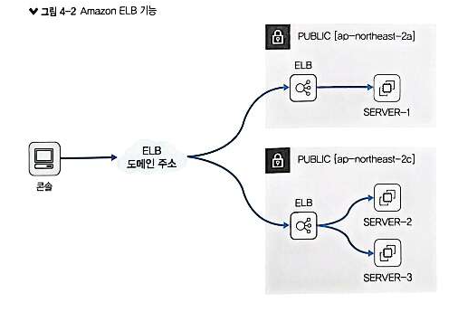
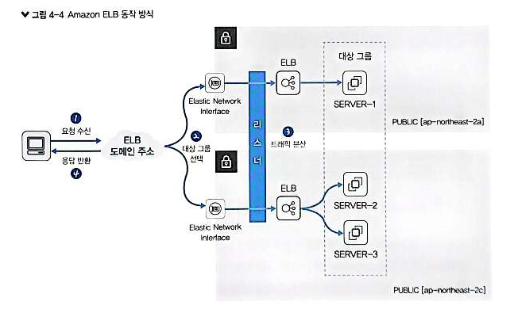
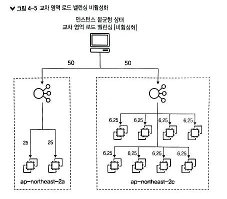
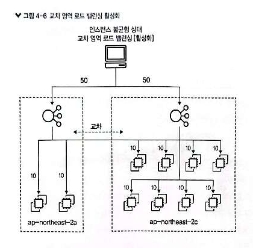

# 4장. AWS 부하분산 서비스

이론: 완료
실습: 완료

# 1. Amazon ELB

## 1.1 부하분산



<aside>
💡 서버에서 요청 처리 시, 동일 목적 수행하는 다수의 서버에 분산 처리하는 기능

</aside>

`로드 밸런싱` : 부하분산 과정

`로드 밸런서` : 부하분산 수행하는 대상

**[ 장점 ]**

- **고가용성** : 시스템, 서비스가 지속적 자동 가능하도록 하는 기능
- **내결함성** : 시스템 일부가 멈춰도 계속 작동하도록 하는 기능

## 1.2 Amazon ELB



<aside>
💡 EC2 인스턴스, 앱, 마이크로서비스, 컨테이너  서비스 트래픽을 자동 분산 처리하는 기술

</aside>

**[ 특징 ]**

- HTTP, HTTPS, TCP, SSL 등 프로토콜 지원
- 같은 인스턴스에서의 세션 유지 지원
- CloudWatch로 모니터링 가능
- 오토 스케일링을 통해 트래픽에 따른 인스턴스 추가, 삭제 지원

## 1.3 Amazon ELB 구성 요소

)

- `로드 밸런서` : 여러 대의 EC2 인스턴스, IP 주소, 람다 등으로 트래픽을 대상 그룹에 있는 인스턴스로 분산시키는 역할
    - 요청을 서버로 전달 & 서버 응답을 반환
- `대상 그룹` : 로드 밸런서에서 분산할 대상의 집합 정의
    - 로드밸런서가 대상 그룹 대상들 상태 확인 & 정상작동하는대상에만 요청 전달
- `리스너` : 로드 밸런서에서 사용할 포트, 프로톨콜 설정
    - 로드 밸런서에 연결된 프로토콜, 포트로 요청 수신 & 대상 그룹으로 라우팅
    - 대상 트래픽의 규칙 생성 및 수행할 동작 정의

> ~~그림 4-2에서 로드밸런서에 public, 리전이 표시된 이유는?~~
> 

## 1.4 Amazon ELB 동작 방식



**[ 과정 ]**

1. **클라이언트 요청 수신** : 로드 밸런서가 리스너 등록하여 요청 수신
2. **대상 그룹 선택** : 수신 요청 처리할 대상 그룹 선택
3. **트래픽 분산** : 요청 분산. 이때, 로드밸런서가 가용가능한 대상에게만 분산
    - ELB가 로드 밸런싱 알고리즘으로 트래픽 분산
4. **응답 반환** : 수신한 것으로 반환하므로 응답 받은 것처럼 느낌

<aside>
💡 **[ 로드 밸런서와 통신하는 방식 ]
- `인터넷 경계 로드 밸런서` :** 외부에서 직접 로드 밸런서 접근
**- `내부 로드 밸런서` :** 내부 서버 전용 네트워크에서 로드 밸런서 사용

</aside>

> Elastic Network Interface :
> 
> 
> ```
> 인스턴스가 AWS 서비스, 다른 인스턴스, 온프레미스 서버, 인터넷 등 다른 네트워크 리소스와 통신할 수 있도록 하며, Secure Shell(SSH) 또는 Remote Desktop Protocol(RDP) 등을 이용해서 인스턴스에서 실행중인 OS와도 통신할 수 있게 해줍니다.
> ```
> 
> 출처:
> 
> [https://kimjingo.tistory.com/197](https://kimjingo.tistory.com/197)
> 

## 1.5 Amazon ELB 교차 영역 로드 밸런싱



기본적으로 로드 밸런서는 동일한 비중으로 트래픽 분산함.

따라서, 불균형 문제가 발생할 수 있다.

위 그림처럼 2개의 가용 영역이 50:50으로 비중이 나뉘면, 각 인스턴스 당 비중이 불균형해진다.

이를 해결하기 위해 제공하는 것이 `ELB 교차 영역 로드 밸런싱`



ELB 교차 영역 로드 밸런싱 사용하여 이 문제를 해결 가능하다.

**[ 교차 영역 로드 밸런싱 적용 여부 ]**

- ALB : 기본 활성화
- NLB : 기본 비활성화

대상 그룹 수준에서 구성 가능하므로, 대상 그룹 별로 별도로 구성 가능

단, 가용 영역 간 통신 비용 발성

> 가용 영역 = 로드 밸런서??
> 

## 1.6 Amazon ELB 종류

|  | CLB(classic) | ALB(application) | NLB(network) | GWLB(gateway) |
| --- | --- | --- | --- | --- |
| **주요 특징** | EC2-Classic을 대상으로 트래픽을 부하분산 처리 | HTTP,HTTPS의 트래픽 부하분산하는 OSI 7계층 로드 밸런서 | TCP, UDP의 트래픽 부하분산하는 OSI 4계층 로드 밸런서 | VPC 내부 라우팅으로 서드 파티의 방화벽/어플라이언스 대상으로 경유하는 트래픽의 부하분산 처리 |
| **유형** | 4계층, 7계층 | 7계층 | 4계층 | 3계층 게이트웨이, 4계층 로드 밸런서 |
| **프로토콜** | TCP, SSL/TLS, HTTP, HTTPS | HTTP, HTTPS, gRPC | TCP, UDP, TLS | IP |
| **대상 유형** | EC2-Classic | IP, 인스턴스, AWS Lambda, 컨테이너 | IP, 인스턴스, ALB, 컨테이너 | IP, 인스턴스 |
| **고정 IP 제공** | 미지원 | 미지원 | 지원 | 미지원 |
| **보안 그룹** | 미사용 | 사용 | 미사용 | 미사용 |
- `CLB` : 레거시 로드밸런서로 잘 사용하지 않음
- `ALB` : 웹 애플리케이션 특화된 세밀한 라우팅을 제어할 수 있어, 웹 애플리케이션을 위한 로드 밸런서
- `NLB` : 대규모 네트워크 트래픽 처리, 대상 그룹의 대상이 IP 주소로 식별될 때 유용. 따라서, 높은 처리량, 빠른 응답 시간을 보장하는 게임 서버, VoIP 서비스, 미디어 스트리밍 등에서 사용

[OSI 7 레이어(계층), 그리고 L4 L7 스위치에 대한 고찰.....](https://sarc.io/index.php/miscellaneous/758-osi-7-l4-l7)

[4장 실습](https://www.notion.so/4-f9b76887b6ab4ca082ca1e0fe0d86b16?pvs=21)
