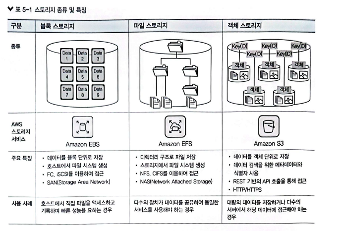
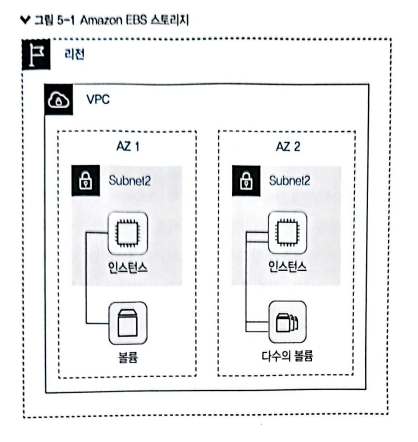
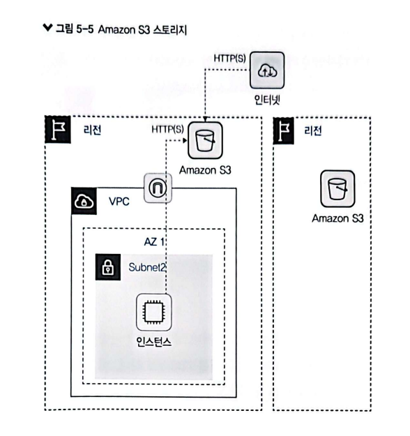
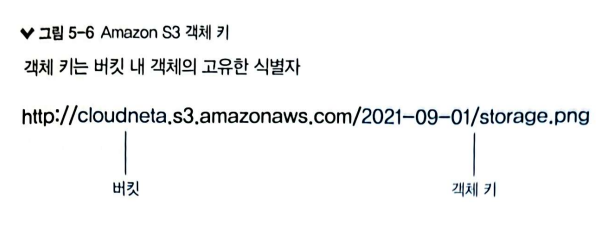

# 5장. AWS 스토리지 서비스

이론: 완료
실습: 완료

# 1. 스토리지 개요

- `볼륨` : 하나의 파일 시스템을 갖춘 하나의 접근 가능한 스토리지 영역

### 스토리지 볼륨 & 파일시스템

스토리지 볼륨과 파일 시스템은 컴퓨팅 환경에서 데이터를 저장하고 조직하는 데 사용되는 핵심 요소입니다. 다음은 스토리지 볼륨과 파일 시스템 간의 관계에 대한 기본적인 설명입니다.

1. **스토리지 볼륨 (Storage Volume):**
    - 스토리지 볼륨은 데이터를 저장하는 데 사용되는 **논리적인 공간**입니다.
    - 이는 하드 디스크 드라이브 (HDD), 솔리드 스테이트 드라이브 (SSD), 또는 클라우드 스토리지와 같은 물리적인 저장 장치를 나타낼 수 있습니다.
    - 스토리지 볼륨은 비디오, 사진, 문서, 애플리케이션 등의 데이터를 저장하는 용도로 사용됩니다.
2. **파일 시스템 (File System):**
    - 파일 시스템은 스토리지 볼륨 상에 **데이터를 구성하고 저장하는 방법을 정의하는 소프트웨어**입니다.
    - 파일 시스템은 파일 및 디렉터리와 같은 데이터 구조를 관리하며, 파일의 저장 위치, 액세스 권한, 파일 크기 등을 관리합니다.
    - 주요 파일 시스템에는 NTFS (Windows), ext4 (Linux), APFS (macOS), FAT32 등이 있습니다.
3. **관계:**
    - **스토리지 볼륨은 데이터를 저장하는 공간을 제공하고, 파일 시스템은 이러한 데이터를 조직하고 관리**합니다.
    - 스토리지 볼륨은 파일 시스템을 호스팅하는 컨테이너 역할을 합니다. 파일 시스템은 스토리지 볼륨 상의 데이터를 추상화하여 사용자 및 애플리케이션이 쉽게 액세스할 수 있게 합니다.
    - 파일 시스템은 사용자가 파일을 생성, 수정, 삭제하고 데이터를 읽고 쓸 수 있게 해주며, 스토리지 볼륨은 이러한 파일 시스템이 동작하는 공간을 제공합니다.

 

> 간단히 말해, 스토리지 볼륨은 데이터를 저장하는 데 사용되는 물리적인 공간을 나타내고, 파일 시스템은 해당 스토리지 볼륨 상에서 데이터를 조직하고 관리하는 데 사용되는 소프트웨어입니다. 함께 작동하여 사용자 및 애플리케이션에 데이터를 효율적으로 제공합니다
> 

# 2. 스토리지 서비스 및 주요 기능

## 2.1 블록 스토리지

> 💡 **단일 스토리지 볼륨을 `블록` 이라는 개별 단위로 분할하여 저장하는 스토리지**

- 특징
    - 각 블록은 저장된 위치에 고유한 주소가 있어, 
    서버에서 파일을 요청하면 블록들을 재구성하여 하나의 데이터로 전달 가능
    - 가상 머신 인스턴스에 위치
    - SAN 또는 가상 머신의 디스크로 사용

`SAN(Storage Area Network)`
 : 서로 다른 종류의 데이터 저장 장치를 한 서버에 연결하여 관리하는 네트워크

## 2.2 파일 스토리지

> 💡 **디렉터리 구조로 파일을 저장하는 스토리지**

- 특징
    - 계층 구조로 이루어짐.
    - 파일이 늘어나면 분류 및 정리 힘듬
    - 주로 NAS에 사용됨.

`NAS(Network Attached Storage)` :
컴퓨터 네트워크에 연결된 파일 수준의 컴퓨터 기억 장치. 다른 네트워크 클라이언트에 데이트 접근 권한 제공

## 2.3 객체 스토리지

> 💡 **데이터 조각을 객체로 지정하고, 개별 단위로 저장하는 스토리지**

- 특징
    - 단일한 평면적인 주소 공간에 저장 (계층구조 X)
    - 데이터 및 관련 메타데이터로 구성된 객체에 고유 식별자 존재
    - OS나 파일 시스템에 의존하지 않음
    - 객체의 키로 대상 검색
    - REST API로 접근
    - 데이터 용량 사실상 무제한
    - 대용량인 비정형 데이터 처리 (이미지, 영상 등)

## 2.4 스토리지 선택 기준

---

# 3. Amazon EBS

> 💡 블록 스토리지 볼륨 제공 서비스

- 볼륨 위에 파일 시스템 생성 ( = 하드디스크 )
- EBS 볼륨 구성의 동적 변경 가능
- 데이터 출입이 많은 서비스에 적합

[ 과정 ]

1. AWS 관리 콘솔에서 필요한 용량과 성능에 맞추어 볼륨 생성
2. 인스턴스에 연결하고 파일 시스템 포맷 후 사용
    - 파일 시스템 포맷은 운영 체제에 따라 다름(리눅스: xfs or ext4 | 윈도우 : NTFS)
3. 포맷 후, 볼륨을 서버에서 마운트한 후 데이터를 해당 디렉터리에 저장하여 사용

[ 특징 ]

- 고속 네트워크 & 데이터 수명 시간이 독립 (단, 포맷이 같아야 함)
    - `독립된 데이터 수명 시간` : 연결된 인스턴스 삭제해도, 볼륨은 재사용 가능
- 하나의 EBS 볼륨, 하나의 인스턴스

> 하나의 인스턴스에 여러 개의 EBS 볼륨은 가능한듯 (인스턴스:EBS볼륨 = 일대다)
> 

## 3.2 EBS 특징

- 데이터 가용성 : 장애 발생 시, 가용 영역 내에서 자동으로 데이터 복제
- 데이터 지속성 : 인스턴스 수명과 관계없음
- 데이터 안정성 : EBS 암호화 기능 지원 및 AES-256 알고리즘 사용
- 데이터 백업 : 스냅샷 및 S3 데이터 백업 기능 지원
- 데이터 확장성 : 중단없이 수정 가능

## 3.3 EBS 볼륨 유형

크게 SSD와 HDD 유형으로 구분 (컴퓨터의 것과 비슷)

## 3.4 EBS 스냅샷

특정 시점으로 돌아갈 수 있는 기능 (=백업)

> 다른 스냅샷들을 참고해서 완성된 데이터를 만들 수 있는 듯

> 💡 증분식 백업 방식 : 초기 백업 작업 이후, 후속 백업 작업은 해당 백업 파일의 변경된 부분만 백업하는 것

**[ 특징 ]**

- 증분식 백업 방식으로 저장 비용 및 시간 절약
- 특정 데이터를 삭제해도 한 부분의 스냅샷만 가지고 있으면 복구 가능
- 계정 간, 리전 간 복제 가능

 

## 3.5 EFS

> 💡 **완전 관리형 네트워크 파일 시스템**

**[ 특징 ]**

- 여러 컴이 동일 데이터에 접근할 때 사용
- NFS 프로토콜 → 기존 앱과 통합 가능
- 여러 컴퓨팅 인스턴스에서 동시에 사용 가능
- NAS처럼 사용자 홈 디렉터리 공유 가능

`NFS(Network File System)` : 공유된 원격 호스트 파일을 다른 시스템이 로컬에서 가용하는 방식

| EBS | EFS |
| --- | --- |
| IOPS 높고 용량이 커서 처리량 많고 대기 시간 짧음 | 가용 영역 전반 걸쳐 사용하는 스토리지 |
| 탄력성 제공으로 용량 및 성능 부족 걱정 없음 | 가용 영역 장애를 고려하여 가용성 뛰어남 |

> EBS는 하드디스크 처럼 독립된 스토리지, EFS는 여러 인스턴스에서 동시에 사용 가능한 스토리지?

 

# 4. Amazon S3

<aside>
💡 **많이 사용되는 객체 스토리지 서비스**

</aside>

**[ 구성 요소 ]**

- **버킷** : 기본 컨테이너 (객체가 저장됨) / 생성 후, 버킷명과 리전 변경 불가
- **객체** : 객체 데이터 + 객체 메타데이터
    - 객체 메타데이터 : 이름-값으로 키 및 버전 ID로 버킷 식별 (이름: 키 , 값: 버전 ID)
- **키** : 객체 고유 식별자.버킷 + 키 + 버전
- **S3** 데이터 일관성 : 데이터 복제 및 일관성 모델 제공

> 버전은 어디서 명시?
> 

### 특징

- 하나의 리전 내 최소 세 개 이상의 물리적 분리된 가용 영역에 데이터 복제
- OS 도움 없이 객체별 접근 가능
- 동일 버킷 내 여러 개의 객체 변형 보유
- 버전 관리 기능 제공
- AWS의 다른 서비스와 연동 가능
    - 예) 기기별 사이즈를 고려한 이미지를 위해 람다와 연동

### 스토리지 클래스

> **데이터 유형에 따라 적절한 클래스를 선택하여 공간 및 비용을 효율적으로 관리하자**
> 

### S3 보안

- IAM으로 접속 사용자나 데이터 접근 관리
- 요청 시 쿼리 문자열을 인증하여 임시 권한을 부여하는 presign 기능 제공
- 기본적으로 외부 접근 못하도록 설정됨.
    - 따라서, 별도 정책으로 설정해야함.

### EBS Root Volume

AWS에서는 Amazon Elastic Block Store (EBS)을 사용하여 인스턴스의 루트 볼륨을 생성할 수 있습니다. **기본적으로 AWS에서 인스턴스를 시작할 때, EBS 볼륨을 루트 볼륨으로 사용**하게 됩니다. 이 EBS 루트 볼륨은 **인스턴스의 운영 체제와 애플리케이션 데이터를 포함**합니다.

따라서 특별한 설정이나 조치를 취하지 않아도 기본적으로 AWS에서는 EBS를 사용하여 루트 볼륨을 생성합니다. 사용자가 별도의 설정을 하지 않으면 **자동으로 생성되는 것이 일반적**입니다.
