# 4,1 스위치 장비 동작
스위치는 경쟁을 없애고 패킷을 동시에 여러 장비로 간섭 없이 통신하도록 도와준다.

- 스위치의 동작 방식
    1. 플러딩
    2. 어드레스 러닝
    3. 포워딩/필터링

## 4.1.1 플러딩
네트워크 관련 정보 없이 허브처럼 모든 포트로 패킷을 전달하는 역할을 의미한다.
매칭되는 목적지 MAC 주소 정보가 MAC 주소 테이블에 없으면 모든 포트에 같은 내용의 패킷을 전송한다.
그 이유는 LAN에서 동작하므로 자신이 정보를 가지고 잇지 않아도 어딘가에 있는 장비는 있을 수 있다고 가정하기 때문이다.
플러딩은 스위치가 제 역할을 하지 못할 뿐 아니라 패킷 플러딩 공격을 받을 수 있다.

## 4.1.2 어드레스 러닝
MAC 주소 테이블을 만들고 유지하는 과정을 의미한다.
어드레스 러닝은 출발지 MAC 주소를 사용하기 때문에 브로드캐스트나 멀티캐스트에 대한 MAC 주소를 학습할 수 없다. 두 가지 모두 목적지 MAC 주소 필드에서만 사용하기 때문.
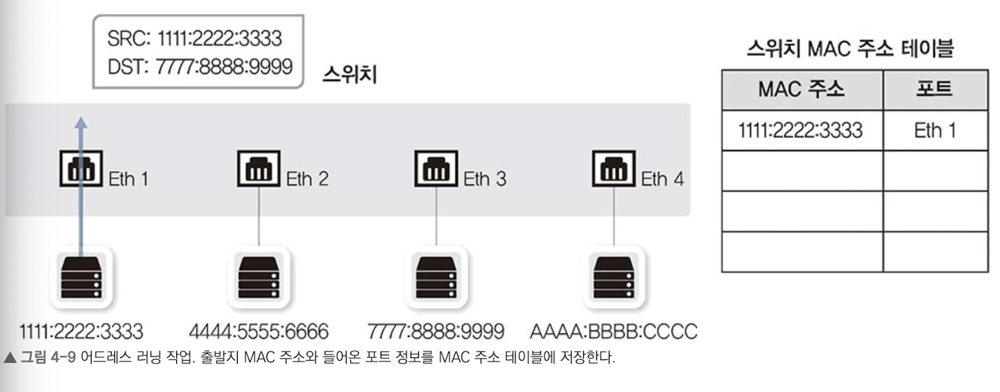

## 4.1.3 포워딩/필터링
패킷이 스위치에 들어온 경우, 도착지 MAC 주소를 확인하고 자신이 가진 MAC 테이블과 비교해 맞는 정보가 있으면 해당 포트로 패킷을 포워딩한다. 이때 일치하지 않는 다른 포트로는 패킷을 필터링하여 전송하지 않는다.

일반적으로 유니캐스트에서만 수행된다. 브로드캐스트나 멀티캐스트는 모두 출발지가 사용되지 않기 때문에 트래픽은 전달이나 필터링 작업을 하지 않고 모두 플러딩한다.

# 4.2 VLAN
## 4.2.1 VLAN
스위치에서 사용하는 가상화 기술을 의미한다.
물리적 배치와 상관없이 LAN을 논리적으로 분할, 구성하는 기술이다.

- 사용 이유
    - 과도한 브로드캐스트로 인한 성능 저하 방지
    - 보안 향상을 위한 차단 용도
    - 서비스 성격에 따른 정책 적용

하나의 장비가 서로 다른 네트워크를 갖도록 분할하기 때문에 VLAN 간에 통신은 불가능하다.
그러나 분리된 단말 간에는 L3 장비를 통해 통신이 가능하다.
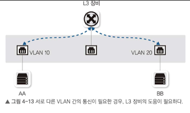

## 4.2.2 VLAN의 종류와 특징
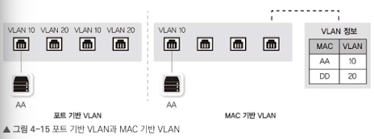

### 포트 기반 VLAN
- 논리적으로 분할할 때 사용
- 스위치 특정 포트에 VLAN을 할당하여 사용

### MAC 기반 LAN
- 스위치에 연결되는 단말의 MAC 주소를 기반으로 VLAN을 할당

## 4.2.3 VLAN 모드 동작 방식
서로 다른 VLAN이 설정된 포트간에는 통시이 불가능하다. VLAN이 다르면 별도의 스위치에 연결된 것과 같아, VLAN 간 통신은 불가능하다.
그래서 서로 다른 VLAN과의 통신을 위해선 별도의 3계층 장비가 필요하다. 예를 들어 브로드캐스트인 ARP 리퀘스트와 같은 작업은 3계층 장비가 필요하다.

### 태깅
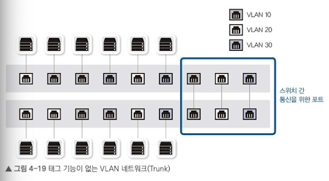
스위치에 3개의 VLAN이 있는 경우, VLAN이 스위치간 통신을 위해서 3개의 포트가 필요하다.
이런 낭비되는 연결 포트를 방지하기 위해 `태그 포트`를 사용한다. 태그 포트를 통해 하나의 포트로 여러 개의 VLAN을 함께 전송할 수 있다.
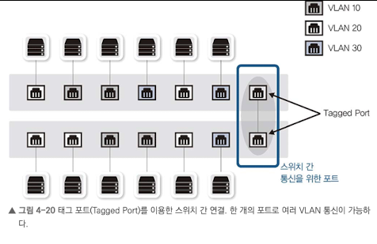

태크 포트로 패킷을 보낼 때 VLAN ID 필드를 끼워 넣어 보낸다. 수신 측은 VLAN ID를 제거하면서 VLAN ID의 VLAN 패킷을 보낼 수 있게 된다.

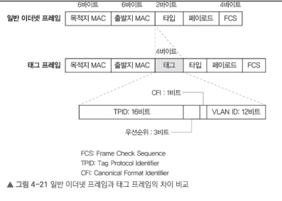

VLAN 사용 시, MAC 테이블에 VLAN 필드가 추가되어 VLAN별로 MAC 주소 테이블이 존재하는 것처럼 동작한다.

# 4.3 STP
`SPoF`: 하나의 시스템이나 구성 요소에서 고장이 발생해, 전체 시스템의 작동이 엄추는 요소
SPoF를 막기 위해 두 대 이상의 스위치로 디자인되는데, 이런 상황은 루프가 발생하여 치명적인 오류를 야기할 수 있다.

## 4.3.1 루프란?
### 4.3.1.1 브로드캐스트 스톰
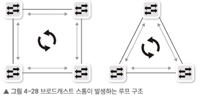
브로드캐스트 발생 시, 포트는 들어온 포트를 제외한 포트로 플러딩을 한다. 이렇게 패킷이 계속해서 플러딩되어 돌고도는 현상을 `브로드캐스트 스톰`이라고 한다. 2계층 헤더는 3계층에서의 **TTL같은 라이프타임 메커니즘이 없어** 계속해서 패킷이 살아 전체 네트워크 대역폭을 차지할 수 있다.

### 4.3.1.2 스위치 MAC 러닝 중복 문제
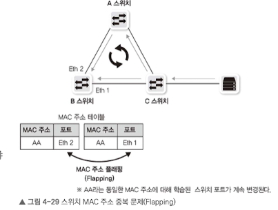
스위치는 출발지 MAC 주소를 학습한다. 직접 들어온 패킷과 여러 스위치를 돌고 들어온 패킷에 대해 매번 MAC 테이블을 반복 갱싱해야하므로 부하가 발생할 수 있다. 이를 `MAC 어드레스 플래핑`이라고 한다.

이를 방지하기 위해 직접 포트를 셧다운하여 방지할 수 잇지만, 루프를 찾기도 힘들고 네트워크 장애가 발생할 수 있어 비추천한다.
그 대신 직접 자동 감지 및 우회로 없는 경우 스스로 차단 포트를 푸는 `스패닝 트리 프로토콜`을 사용한다.

## 4.3.2 STP란?
`스패닝 트리 프로토콜`은 루프를 확인하여 적절히 포트 사용을 못하게 하여 루프를 예방하는 매커니즘이다.
전체적인 스위치의 상황을 알기 위해, 스위치는 `BPDU(Bridge Protocol Data Unit)`으로 정보 전달 및 수집된 정보로 전체 네트워크 트리를 만들어 루프 구간을 확인한다.

### 4.3.2.1 스위치 포트의 상태 및 변경 과정
- Blocking
    - 패킷 데이터를 차단한 상태로 상대방의 BPDU 대기
    - 20초 동안(Max Age) BPDU 받지 못했거나 후순위 BPDU를 받으면 -> 리스닝 상태로 변경
    - BPDU 교환주기 = 2초, 10번의 BPDU 대기
- Listening
    - 해당 포트가 전송 상태로 변경되는 것을 결정하고 준비
    - 자신의 BPDU를 상대방에게 전송하기 시작
    - 총 15초 대기
- Learning
    - 이미 해당 포트를 포워딩하기로 결정하고 실제 패킷 포워딩이 일어남
    - 스위치가 곧바로 동작하도록 MAC 주소를 러닝하는 단계
    - 총 15초 대가
- Forwarding
    - 패킷 포워딩 단계. 정상적인 통신 가능

스위치에 신규 장비를 붙이면 통신까지 50여 초가 소요된다.
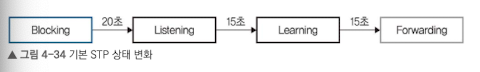

STP가 활성되어도 곧바로 포워딩 상태가 되지 않는다. 따라서, 부팅이 빠른 OS가 DHCP 네트워크 접속할 때 부팅 단계에서 IP를 요청하지만 할당받지 못하는 경우가 많다.

### 4.3.2.2 STP 동작 방식
루프를 없애기 위해 루트부터 리프로 뻗어나가는 토폴로지를 구성한다.

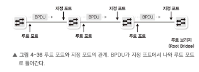
1. 하나의 `루트 스위치`를 선정
    - 전체 네트워크에서 선정
    - 자신을 전체 네트워크의 대표 스위치로 적은 BPDU를 옆 스윛치로 전달
2. 루트가 아닌 스위치 중 하나의 루프 포트 선정
    - 루트 브릿지로 가는, 경로가 가장 짧은 포트를 `루트 포트`라고 한다.
    - 루트 브릿지에서 보낸 BPDU를 받는 포트
3. 하나의 세그먼트에 하나의 지정 포트 선정
    - 스위치와 스위치가 연결되는 포트는 하나의 지정 포트 선정
    - 스위치 간 연결에서 이미 루트 포트로 선정된 경우, 반대쪽이 지정 포트로 선정되어 양쪽 모두 포워딩 상태가 됨.
    - 스위치 간 연결에 아무도 루트 포트가 아닐 경우, 한쪽은 지정 포트로 선정되고 다른 한쪽은 대체 포트가 되어 차단 상태가 됨.
    - BPDU가 전다로디는 포트

## 4.3.3 향상된 STP(RSTP, MST)
STP는 모든 스위치에 BPDU가 전달되는 시간 때문에 블로킹 포트가 포워딩될때까지 30~50초 소요
대부분의 **TCP 애플리케이션은 네트워크가 끊기고 나서 30초를 기다리지 못하기 때문에** STP로 인해 문제가 발생할 수 있다. 또한, 스위치 여러 개의 VLAN이 있으먄, **VLAN별 STP를 계산**하기 때문에 부하 발생

### 4.3.3.1 RSTP
2~3초로 절체 시간이 짧아 TCP 기반 애플리케이션 세션 유지 가능
STP와 동작방식은 같지만 BPDU 메시지 형식이 다양하여 여러 상태 교환 가능
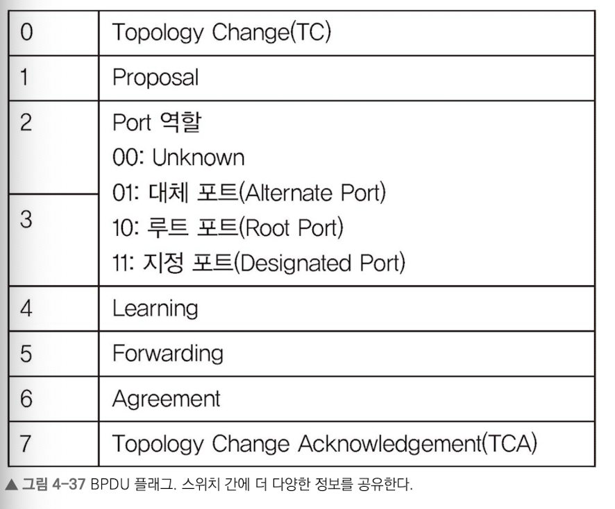

- 기존 STP 토폴로지 변경
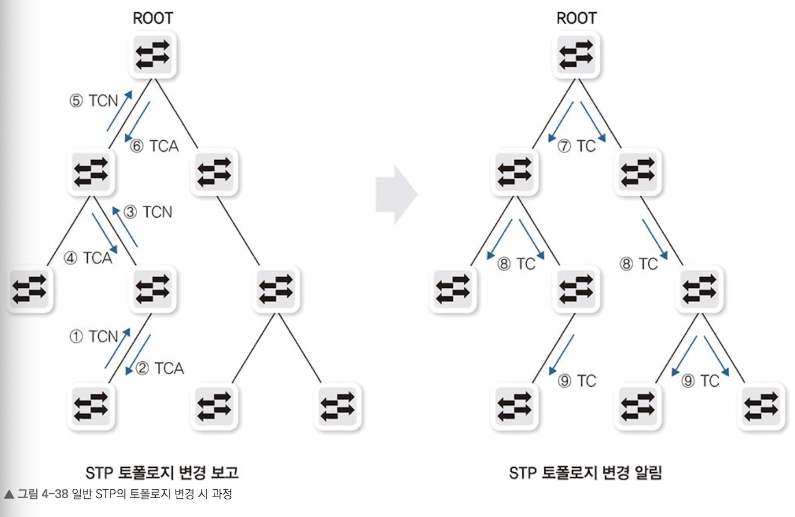
토폴로지 변경 시, 말단 스위치에서 루트 브릿지까지 변경 보고 -> 루트 브릿지가 연산 후 다시 말단 스위치로 전송

- RSTP 토폴로지 변경
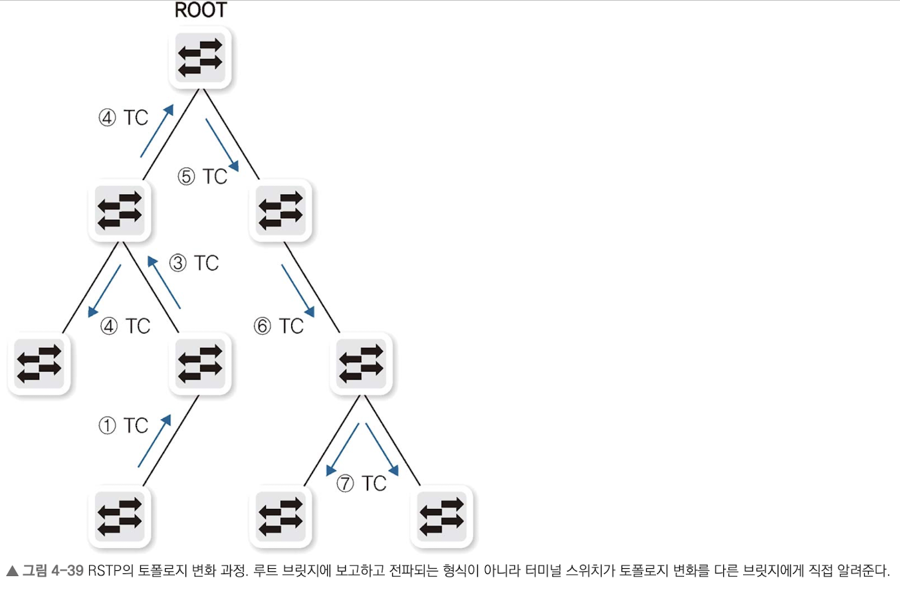
토폴로지 변경 시, 스위치 자신이 모든 네트워크에 변경을 직접 전파

### 4.3.3.2 MST
기존 STP(=CST)는 VALN 개수와 상관없이 한 개의 ST로 동작.
이 경우, 스위치의 관리 부하가 적지만 자원 효율적 활용 불가능

이 문제를 해결하기 위해 PVST(Per VLAN Spanning Tree)를 사용한다. VLAN마다 다른 ST가 작동 -> 모든 VLAN마다 별도의 SP 관리가 부담

`MST`: 여러 개의 VLAN을 그룹으로 묶어 별도의 SP로 동작
- 로드 셰어링 기능 사용
- 경로 개수나 용도에 SP 개수 정의
