# 7.1 NAT/PAT
여러 개의 IP를 하나의 IP로 변환하는 기술.
공식 용어는 NAPT(Network Address Port Translation)이다.
즉, IP 주소를 다른 IP 주소로 변환해 라우팅을 원활히 해주는 기술을 의미한다.

## 7.1.1 NAT/PAT
1. IPv4 고갈 문제의 솔루션으로 사용
2. 보안을 강화하기 위해 사용 
    - 사내 IP 체계를 숨길 수 있음
    - 주소 변환 후 역변환이 정상적으로 다시 수행되어야만 통신이 가능
3. IP 주소 체계가 같은 두 개의 네트워크 간 통신을 가능하게 함
4. 불필요한 설정 변경을 줄임
    - 이전에는 회선 사업자를 바꿀 경우, IP 변경이 필수
    - 단말 간 직접적인 연결을 하지 않아, 공인 IP만 변경하면 됨.

## 7.1.2 NAT 동작 방식

### NAT 동작 방식
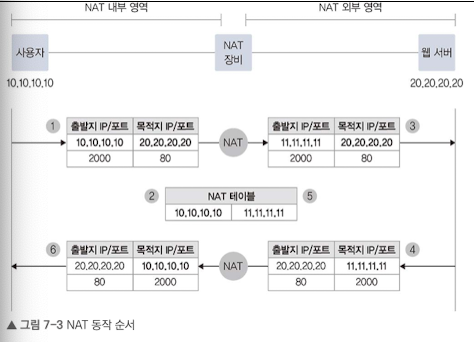


## 7.1.3 PAT 동작 방식
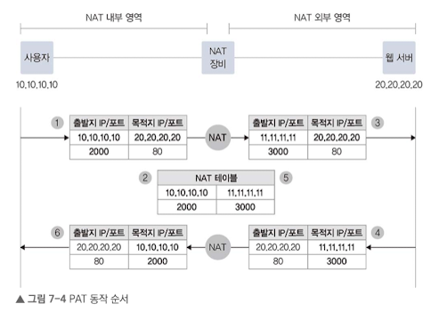

PAT는 NAT와 동작방식이 같지만, 서비스 포트까지 함께 변경하여 관리한다. 따라서 하나의 IP만으로도 다양한 포트로 사용자 구분이 가능하다.
만약 서비스 포트가 동시에 모두 사용 중이거나 재사용 불가능할 경우, PAT가 비정상 동작 가능.
동시 사용자가 많을 경우엔 PAT에서의 하나의 공인 IP를 Pool로 구성해야 한다.

대신 PAT는 내부에서 외부로 출발하는 경우에만 사용 가능하다.
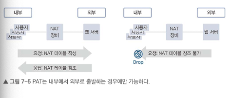

## 7.1.4 SNAT와 DNAT
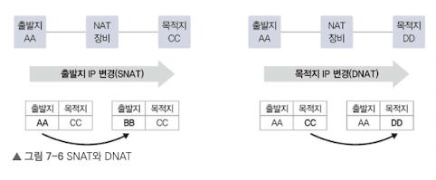

- SNAT(Source NAT): 내부 -> 외부로 나가는 패킷의 출발지 주소를 변경하는 NAT
- DNAT(Destination NAT): 외부 -> 내부로 들어오는 패킷의 목적지 주소를 변경하는 NAT

### 사용 경우
- SNAT
    - 사설(내부) -> 공인(외부)으로 통신할 때 사용
    - 보안상 내부 실제 IP를 숨겨야할 때 사용
    - 사내 IP가 대외사 사내 IP 대역과 중복 방지 위해 사용
    - 로드 밸런서 구성에 따라 사용 (12장에서 학습)
- DNAT
    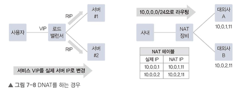
    - 로드밸런서에서 사용
    - 대외망과의 네트워크 구성에서 사용

## 7.1.5 동적 NAT와 정적 NAT
정적 NAT: 출발지와 목적지의 IP를 미리 매핑
동적 NAT: NAT 수행 시 IP를 동적으로 변경
    - IP풀에서 가져와 사용하므로 수행 시점에 NAT 테이블을 만들어 관리
    - 타임아웃 적용도 고려해볼만 함

|   | 동적 NAT | 정적 NAT |
|:-:|:-------:|:-------:|
| NAT 설정 | 1:N,N:1,N:M | 1:1 |
| NAT 테이블 | NAT 수행 시 생성 | 사전 생성 |
| NAT 테이블 타임아웃 | 동작 | 없음 |
| NAT 수행 정보 | 실시간으로만 확인하거나 별도 변경 로그 저장 필요 | 별도 필요 없음|

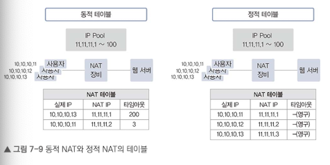

<br/>

# 7.2 DNS
네트워크 프로토콜에서 컨트롤 프로토콜은 처음 통신 관계를 맺거나 유지하는 데 큰 역할을 한다.
TCP/IP에서의 주요 컨트롤 프로토콜은 ARP, IMCP, DNS가 있다.

DNS는 도메인 주소를 IP 주소로 변환하는 역할을 한다. 최근 MSA 설계가 많아지면서 서비스 간 API 호출이나 인터페이스가 많아져 DNS의 역할이 더 중요해졌다.

## 7.2.1 DNS 소개
- 하나의 IP로 여러 웹 서비스 운영 가능
- 서비스 중인 IP가 변경되어도 접속 방법 변경 없이 서비스 유지 가능
- 지리적으로 여러 위치에서 서비스 가능

## 7.2.2 DNS 구조와 명명 규칙
역트리 구조로 TLD(Top-Level Domain), Seciond-Level Domain, Third-Level Domain 처럼 계층화되어 있다.
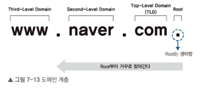

### 7.2.2.1 루트 도메인
최상위 영역.
사용자가 쿼리한 도메인 값을 직접 갖고 있거나 캐시에 있는 정보로 응답.
만약 정보가 없으면 루트 DNS에 쿼리한다.
루트 DNS의 IP 주소를 기록한 힌트 파일이 있어 별도 설정이 필요없다.

### 7.2.2.2 TLD

## 7.2.3 DNS 동작 방식
DNS 서버 없이 로컬에 도메인과 IP를 직접 설정해 사용할 수 있고, 이런 파일을 `host 파일`이라고 한다.
그리고 hosts 파일에 리스트는 항상 DNS 캐시에 저장된다.

만약 DNS 캐시에 없으면 DNS 서버로 쿼리한다.
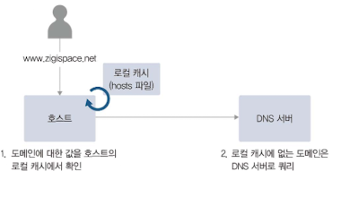

중앙 서버 대신 분산 DB로 사용한다.
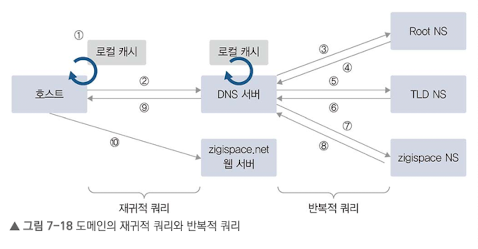

zigispace.net 쿼리를 DNS 서버에 보낸다고 가정해보자.
1. ROOT NS에 쿼리 -> .net TLD NS 주소 알려줌
2. TLD NS에 쿼리 -> zigispace NS 주소를 알려줌
3. zigispace NS에 쿼리 -> 실제 IP 주소를 알려줌

## 7.2.4 마스터와 슬레이브
액티브-스탠바이 형태가 아니라 **슬레이브 서버는 단순히 마스터가 만든 존 파일을 복제하여 사용한다.**
그렇기 때문에 마스터가 고장나면 슬레이브 또한 사용이 불가능하다.

슬레이브 서버에 만료시간을 설정하여 특정 시간동안 복제가 이루어지지 않으면 서비스 장애가 발생하다.
만료 시간은 SOA 레코드에 설정하게 된다.

## 7.2.5 DNS 주요 레코드
| 레코드 종류         | 내용 |
|:----------------:|-----|
| A(IPv4) | 도메인 주소를 IP 주소로 매핑 |
| AAAA(IPv6) | 도메인 주소를 IP 주소로 매핑 |
| CNAME(별칭) | 도메인 주소에 대한 별칭 |
| SOA(권한 시작) | 본 영역 데이터에 대한 권한 |
| NS(도메인의 네임 서버) | 본 영역에 대한 네임 서버 |
| MX(메일 교환기) | 도메인에 대한 메일 서버 정보 |
| PTR(포인터) | IP 주소를 도메인에 매핑(역방향) |
| TXT(레코드) | 도메인에 대한 일반 텍스트 |


## 7.2.6 DNS에서 알아두면 좋으 내용
### 7.2.6.1 도메인 위임
도메인 내의 모든 레코드를 네임 서버가 관리하지 않고 다른 곳에서 레코드를 관리하도록 위임이 가능.
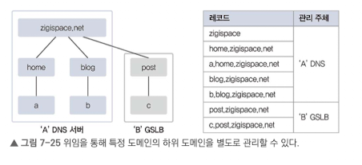

post라는 하위 도메인은 'B' GSLB에서 관리하도록 넘길 수 있다.

### 7.2.6.2 TTL
DNS에 질의해 응답받은 결과 값을 캐시에서 유지하는 시간을 말한다.
로컬 캐시의 용량 부족 문제를 해결하기 위해 적절한 TTL 시간 설정이 필요하다.

### 7.2.6.3 화이트 도메인
정상적인 도메인을 인증, 관리하는 제도.
화이트 도메인 등록을 위해선 해당 도메인에 SPF 레코드가 설정되어 있어야 한다.
메일 정보와 도메인의 SPF 정보가 일치하지 않을 때만 비정상적 이메일로 간주하여 스팸처리 된다.

### 7.2.6.4 한글 도메인
퓨니코드로 정의해야 한다.

<br/>

# 7.3 GSLB
하나의 레코드 이름으로 여러 IP를 설정하는 것을 DNS 로드밸런싱이다.
그러나 DNS만으로는 헬스 체크가 불가능하여 가용성이 떨어지는 문제가 있다.
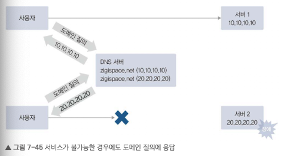

GSLB를 통해 헬스 체크 수행이 가능하고, 이를 인텔리전스 DNS라고 한다.

## 7.3.1 GSLB 동작 방식

1. 사용자가 web.zigispace.net DNS에 질의
2. LDNS는 NS를 찾기 위해 순차 질의
3. zigispace.net NS 서버로 web.zigispace.net 질의
4. DNS 서버는 GSLB로 web.zigispace.net을 위임했기에 GSLB 정보를 LDNS에 응답
5. LDNS는 다시 GSLB로 질의
6. GSLB가 헬스 체크를 통해 정상적인 값 응답
7. GSLB에서 결과값을 응답받은 사용자에게 최종 응답

## 7.3.2 GSLB 구성 방식
### 도메인 자체를 GSLB로 사용
도메인에 대한 모든 레코드를 GSLB에서 설장해야 한다.
즉, GSLB 자체가 도메인의 네임 서버 역할을 한다. 이 경우, 헬스 체크가 불필요한 경우나 모든 레코드에 대한 질의가 GSLB로 이루지므로 부하가 발생.

### 특정 레코으데만 GSLB로 처리를 이괸
1. 별칭 사용 (CNAME 레코드 사용)
    - 실제 도메인과 다른 별도의 도메인 레코드로 GSLB에 등록
    ```bash
    lb.example.com. IN CNAME gslb.example.gslbprovider.net.
    ```
    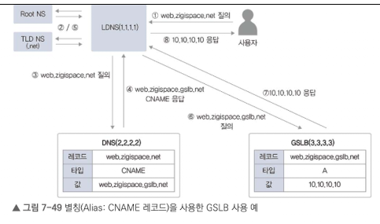
2. 위임 사용 (NS 레코드 사용)
    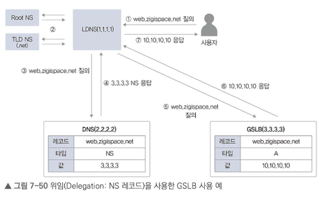

## 7.3.3 GSLB 분산 방식

- 주요 목적
    - 서비스 제공의 가능 여부를 체크해 트래픽 분산
    - 지리적으로 멀리 떨어진 다른 데이터 센터에 트래픽 분산
    - 지역적으로 가까운 서비스에 접속해 더 빠른 서비스 제공이 가능하도록 분산
- 헬스 체크 모니터링 요소
    - 서비스 응답 시간/지연
    - IP에 대한 지리 정보

<br/>

# 7.4 DHCP
## DHCP 프로토콜
BOOTP 프로토콜 기반으로 작동한다. 사용되는 서비스 포트도 같고, 사용방식도 같다.

## 7.4.2 DHCP 동작 방식

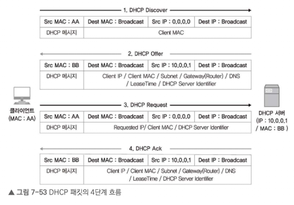

1. DHCP Discover (클라 -> DHCP)
    - 클라이언트가 DHCP 찾기 위해 DHCP Discover 메시지를 브로드캐스트
2. DHCP Offer (DHCP -> 클라)
    - 클라이언트에 할당할 IP 주소, 서브넷, 게이트웨이, DNS 정보, Lease Time 등을 DHCP 메시지에 담아 전송
3. DHCP Request
    - 제안받은 IP 주소와 DHCP 정보를 포함한 DHCP 요청 메시지를 브로드캐스트
4. DHCP Acknowledgement
    - IP 주소 사용하겠다는 요청을 받고, 사용 정보 기록 및 DHCP Request 메시지를 수신했다는 ACK 응답 전송

출발지: UDP 68번
목적지: UDP 67번

DHCP 서버는 IP Pool 중 IP를 선택하여 할당.
포함 정보: 서브넷, 게이트웨이, DNS 정보, 임대 시간, DHCP 서버 IP

- DHCP 서버가 여러 개일 경우, 여러 Offer 메시지 중 하나를 선택하여 전송
- 갱신 과정은 DHCP 정보와 할당된 IP가 있기 때문에 바로 DHCP Request를 전송하여 빠르다.
    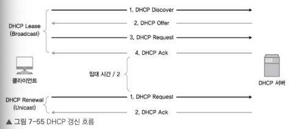
- 초기 임대 시간의 75% 지난 시점에 갱신을 시도한다.

## 7.4.4 DHCP 릴레이
하나의 DHCP를 통해 여러 네트워크에 IP를 할당이 가능하다.
이를 위해 중계 역할을 하는 `DHCP 릴레이 에이전트`를 사용한다.

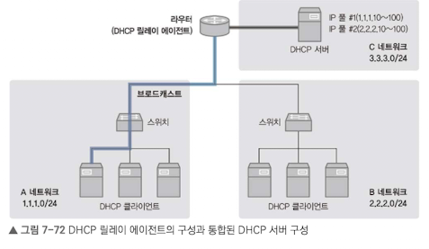

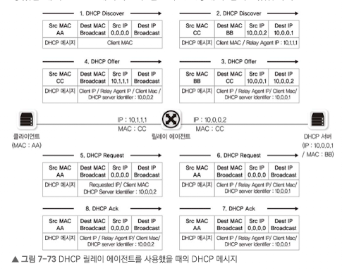

1. DHCP Discover(클라이언트 -> 릴레이 에이전트)
    - 클라이언트에서 브로드캐스트

2. DHCP Discover(릴레이 에이전트 -> DHCP 서버)
    - 출발지, 목적지를 릴레이 에이전트, DHCP로 변경
    - 유니캐스트로 전송

3. DHCP Offer(DHCP 서버 -> 릴레이 에이저트)
    - 할당할 IP 등의 정보를 전송
    - 유니캐스트로 전송

4. DHCP Offer(릴레이 에이전트 -> 클라이언트)
    - DHCP Offer를 브로드캐스트로 전송
    - DHCP Server Identifier는 DHCP 서버 주소가 아닌 릴레이 에이전트 외부 인터페이스 IP

5. DHCP Request(클라이언트 -> 릴레이 에이전트)
    - 브로드캐스트로 전송

6. DHCP Request(릴레이 에이전트 -> DHCP 서버)
    - 유니케스트로 DHCP 요청 메시지 전달

7. DHCP ACK (DHCO 서버 -> 릴레이 에이전트)
    - 유니캐스트로 응답 전송

8. DHCP ACK(릴레이 에이전트 -> 클라이언트)
    - 브로드캐스트로 ACK 메시지 전달
