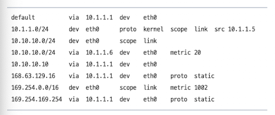
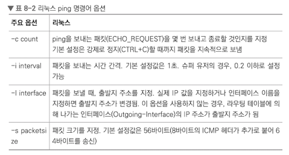
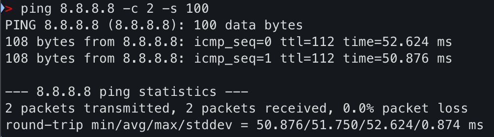
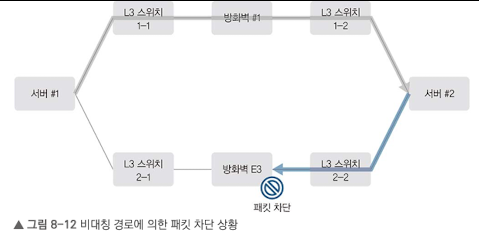
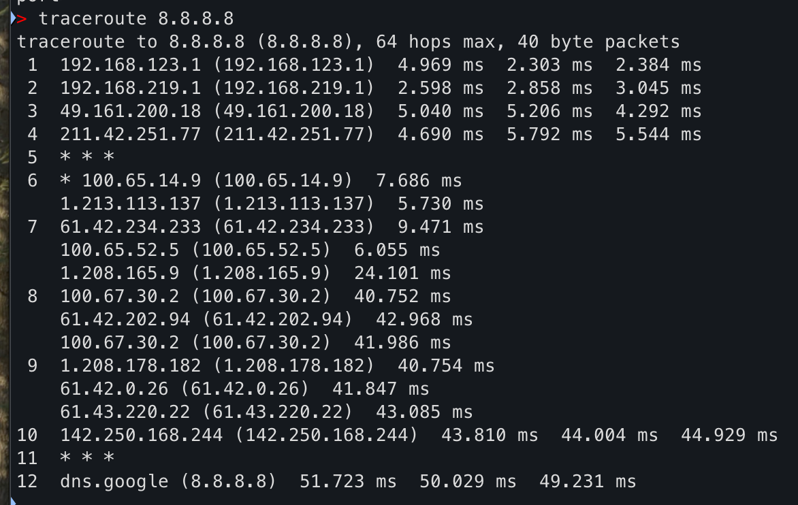
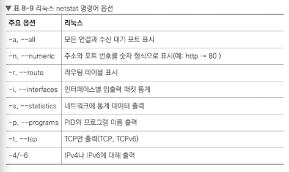
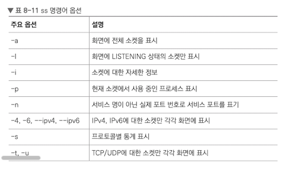
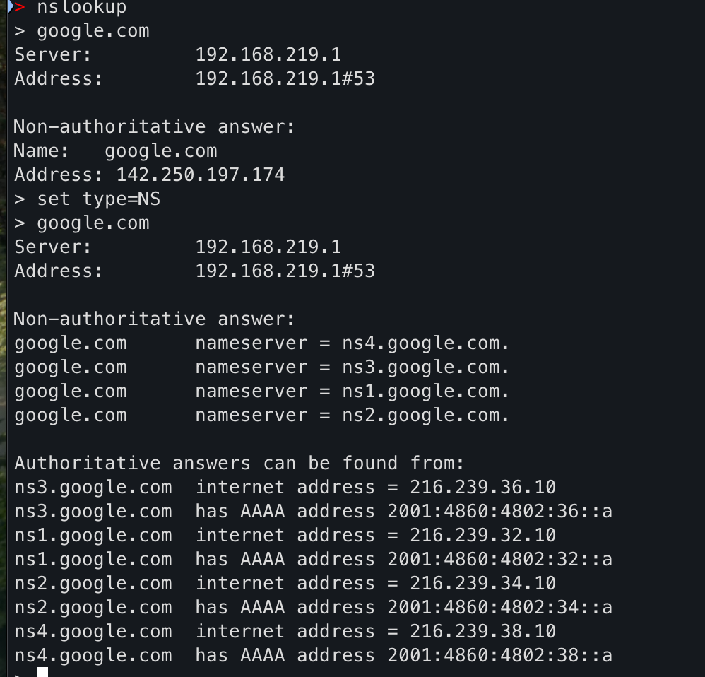

# 8.1 서버의 네트워크 설정 및 확인

# 8.2 서버의 라우팅 테이블
외부 네트워크와 통신을 위해 라우팅 테이블이 필요하다. 디폴트 라우팅이 라우팅 테이블에 자동으로 등록해준다.
만약 두 개 이상의 네트워크 어댑터를 사용할 경우, 두 네트워크 어댑터 모두 디폴트 게이트웨이 설정하면 정상적인 통신이 되지 않는다. 
그러나 하이퍼바이저 위에서 돌아가는 가상 서버의 경우, 가상 머신 내에서는 복잡한 테이블 설정할 필요가 없다

## 8.2.1 서버의 라우팅 테이블

- 목적지 네트워크, 서브넷
    - 서버가 통시하려는 목적지 IP에 맞는 라우팅을 선택하는 기준
- 게이트웨이
    - 선택된 목적지로 가기 위해 서버에서 선택하는 넥스트 홉
- 인터페이스
    - 서버의 네트워크 카드를 말함
    - 라우팅에서 어떤 물리적 경로로 패킷을 보낼지 설정
- 우선순위(메트릭)
    - 동일 라우팅 테이블이 두 개 이상 존재할 경우, 어떤 라우팅 테이블 선택할지 결정
    - 낮을수록 우선순위 높음

## 8.2.2 리눅스 서버의 라우팅 확인 및 관리
`ip route`나 `netstat -r`을 통해 확인이 가능하다.
```
root@09d9515d0174:/# ip route
default via 172.17.0.1 dev eth0
172.17.0.0/16 dev eth0 proto kernel scope link src 172.17.0.3
```

```
root@09d9515d0174:/# netstat -r
Kernel IP routing table
Destination     Gateway         Genmask         Flags   MSS Window  irtt Iface
default         172.17.0.1      0.0.0.0         UG        0 0          0 eth0
172.17.0.0      0.0.0.0         255.255.0.0     U         0 0          0 eth0
```

- 메트릭 값 등의 특정 값은 ip route로만 조회가 가능하다.
- 네트워크 인터페이스가 1개인 서버는 라우팅 테이블 추가 및 삭제 필요 없음
- NI가 2개 이상인 경우, 어떤 NI를 사용할지 명시하기 위해 라우팅 테이블 추가 및 삭제가 필요

### 라우팅 테이블 추가
```bash
route add { -host | -net } Target[/prefix] [gw Gw] [metric M] [[dev] If]
```
```bash
route add -host 10.10.10.10 gw 10.1.1.1
# -> 특정 10.10.10.10 서버가 목적지인 경우, 10.1.1.1로 라우팅

route add -net 10.10.10.0/24 dev eth0
# -> 10.10.10.0/24 네트워크 대역이 목적지인 경우, eth0 인터페이스로 라우팅

route add -net 10.10.10.0/24 gw 10.1.1.6 metric 20
# -> 10.10.10.0/24 네트워크 대역이 목적지인 경우, 10.1.1.6으로 라우팅. 이 라우팅 경로의 metric 값을 20으로 설정
```



- 메트릭 값을 통해 라우팅 테이블 우선순위를 메기고, 더 높은 우선순위의 라우팅 테이블이 액티브, 아닌 테이블이 스탠바이 상태가 된다.
- 액티브 경로에 문제가 생기면 해당 경로가 삭제되어 스탠바이로 통신이 Fail-over 된다.

### 라우팅 테이블 삭제
```bash
route del { -host | -net } Target[/prefix] [gw Gw] [metric M] [[dev] If]
```
```bash
route del -host 10.10.10.10 gw 10.1.1.1

route del -net 10.10.10.0/24 dev eth0

route del -net 10.10.10.0/24 gw 10.1.1.6 metric 20
```

위 명령어 들은 서버 재부팅 시, 초기화된다는 문제가 있다.
영구 적용을 위해선 별도 파일에 라우팅 설정을 입력해야 한다.

### Ubuntu의 영구적 라우팅 설정
별도 파일 대신 interfaces 파일에 라우팅 설정
```bash
up route add [-net| -host] <host/net>/<mask> gw <host/IP> dev <Interface>
```

설정 후 interfaces 파일 예시
```
# eth0 네트워크 설정
auto eth0

# eth0 정적 네트워크 설정
iface eth0 inet static
    address 10.1.1.6
    netmask 255.255.255.0
    gateway 10.10.10.1    
    dns-nameserver 219.250.36.130

# 영구적 라우팅 등록
# 10.10.10.0/24 가 목적지인 경우 , 게이트웨이인 10.1.1.1 로 라우팅
up route add -net 10.10.10.0 netmask 255.255.255.0 gw 10.1.1.1

-알라딘 eBook <IT 엔지니어를 위한 네트워크 입문> (고재성.이상훈 지음) 중에서
```

<br/>

# 8.3 네트워크 확인을 위한 명령어
## 8.3.1 ping(Packet InterNet Groper)
IP를 통해 특정 목적지까지 네트워크가 잘 동작하는지 확인.
즉, 라우팅 경로가 정상적으로 구서오디어 있는지 체크.
ICMP 프로토콜을 사용하여 작동.

```bash
ping [옵션] 목적지_IP
ping 8.8.8.8 -c 2 -s 100 # 패킷 2번, 크기 100바이트 송신
```




## 8.3.2 tcping
목적지 단말이 잘 살아도, 방화벽, 서비스 포트 오픈 문제 등으로 작동하지 않는 경우가 발생할 수 있다. tcping을 통해 실제 서비스 포트로 정상 통신 가능한지 확인이 가능하다.

```bash
tcping [옵션] 목적지_IP
```

## 8.3.3 tracerpute(리눅스)/tracert(윈도)
중간 경로의 더 상세한 정보를 얻기 위해 사용된다.
IP 헤더의 TTL 필드를 통해 패킷이 드롭한 이유를 알려준다.
TTL이 0이 되면 ICMP time exceed 메시지를 출발지로 전달한다.
3계층 정보로 경로 추적을 하기 때문에 2계층 이하 스위치 장비 추적은 불가능하다.



- `-n` 옵션을 통해 도메인 주소 대신 IP를 바로 표기하여 출력 결과가 빠르다.
- 보안 장비에 의해 icmp 메시지나 udp 패킷이 차단된 경우 응답하지 않을 수 있다. -> * * * 출력


## 8.3.4 tcptraceroute
traceroute와 유사하나 실제 서비스 포트를 이용해 경로를 추적하고, 결과적으로 목적지 서비스 포트가 정상으로 열리는지 확인가능.

```bash
tcptraceroute [옵션] 목적지_IP [서비스 포트]

```

## 8.3.5 netstat(network statistics)
특정 서비스가 정상적으로 열려 있는지, 외부 서비스와 TCP 세션이 정상적으로 맺어져 있는지 등을 확인하는 명령어.
라우팅 테이블이나 인터페이스 패킷 통계 정보를 확인한다.



## 8.3.6 ss(socket statistics)
소켓 정보를 확인할 수 있는 네트워크 명령어. 커널 스페이스로 직접 가져오므로 netstat보다 빠르다.

```bash
ss [옵션] [필터]
```



## 8.3.7 nslookuip(name server lookup)
DNS에 다양한 도메인 관련 내용을 질의해 결과값을 전송받을 수 있는 네트워크 명령어.
A 레코드가 아닌 다양한 다른 레코드 정보를 확인할 때 set type 옵션을 사용하면 된다.


## 8.3.8 telnet(tel network)
원격지 호스트에 터미널 연결을 위해 사용하는 프로토콜.
네트워크 문제 해결을 위해 특정 서버의 서비스에 대한 접근 가능성을 테스트하는 데도 사용.

```bash
telnet 목적지IP 서비스포트
```
- 서비스 접근 불가능할 경우
    1. 네트워크 경로 문제 시, ping과 traceroute로 대략적인 문제 파악
    2. 보안장비로 차단된 경우, 다른 포트나 ICMP 프로토콜로 파악
    3. 단말의 방화벽 기능을 일시적으로 내리고 테스트 수행
    4. netstat과 ss로 서비스 동작 파악

## 8.3.9 ipconfig
네트워크 설정을 확인하는 윈도우 명령

DHCP 환경에서 할당받은 현재 IP 해제 및 갱신 가능
```bash
ipconfig /release
ipconfig /renew
```
단말 자체에 저장된 도메인 캐시 모두 삭제
```bash
ipconfig /flushdns
```
현재 로컬에 저장된 도메인 캐시 정보 확인시에는 /displaydns 옵션을 이용

## 8.3.10 tcpdump
네트워크 인터페이스로 오가는 패킷을 캡처해 보는 기능

```bash
tcpdump -i eth0 tcp port 80
```

