# 9.1 보안의 개념과 정의
## 9.1.1 정보 보안의 정의
- 다양한 위협으로부터 보안을 보호하는 것
- 우리가 생산하거나 유지해야 할 정보에 위험이 발생하거나 사고가 날 염려 없이 편안하고 온전한 상태를 유지하는 일련의 활동

### 보안의 3대 요소
- 기밀성: 인가되지 않은 사용자가 정보를 보지 못하게 하는 모든 작업 (암호화 작업)
- 무결성: 정확하고 완전한 정보 유지에 필요한 모든 작업 (MD5, SHA등의 해시)
- 가용성: 정보가 필요할 때, 접근을 허락하는 일련의 작업

## 9.1.2 네트워크의 정보 보안
정보를 수집, 가공, 저장, 검색, 송수신하는 도중에 저옵의 훼손, 변조, 유출을 막기 위한 관리적, 기술적 방법

## 9.1.3 네트워크 보안의 주요 개념
- 트러스트 네트워크: 외부로부터 보호받아야 할 네트워크
- 언트러스트 네트워크: 신뢰할 수 없는 외부 네트워크
- DMZ 네트워크: 신뢰할 수 없는 외부 사용자에게 개방해야 하는 서비스 네트워크

- 인터넷 시큐어 게이트웨이: 트러스트(또는 DMZ) 네트워크에서 언트러스트 네트워크로의 통신을 통제
- 데이터 센터 시큐어 게이트웨이: 언트러스트 네트워크에서 트러스트(또는 DMZ)로의 통신을 통제

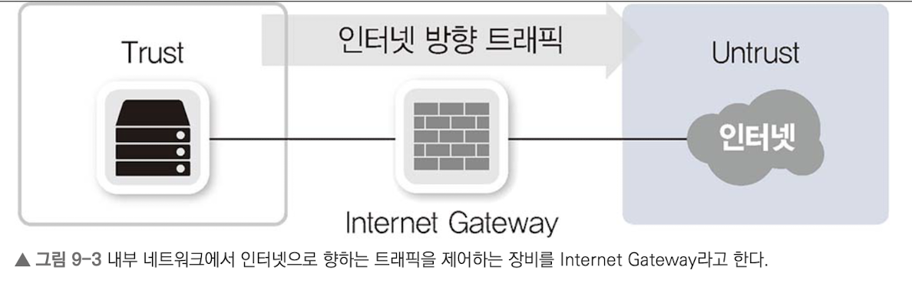
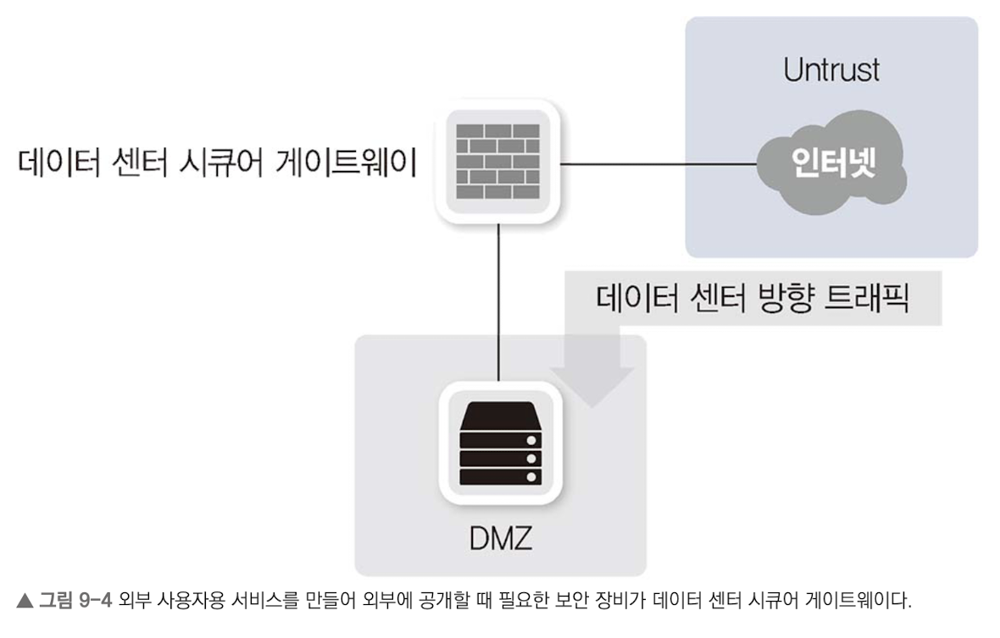

### 9.1.3.1 네트워크 보안 정책 수립에 따른 분류
- 화이트리스트
- 블랙리스트

대부분의 장비는 화이트리스트와 블랙리스트를 모두 사용하고 있다. 하지만, 화이트리스트는 통신 정보를 상세히 알아야 세부적인 통제가 가능하므로 많은 관리 인력이 필요하다.

### 9.1.3.2 정탐, 오탐, 미탐
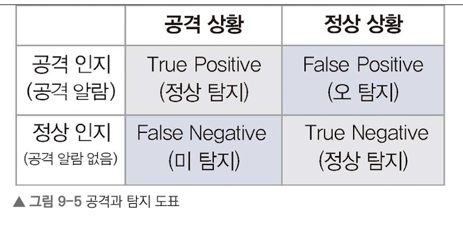

 

# 9.2 보안 솔루션의 종류
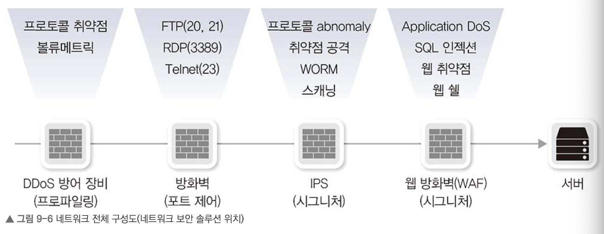
모든 공격을 장비 한 대로 방어하지 않고 여러 장비의 기능으로 단계적 방어.

## 9.2.1 DDoS 방어 자입
데이터 센터 네트워크 내부와 외부 경계에서 방어하여, `볼류메트릭 공격`을 막는다.
볼류메트릭 공격은 회선 사용량이나 그 이상 트래픽을 과하게 발생시키는 공격이다.

## 9.2.2 방화벽
4계층에서 동작하는 패킷 필터링 장비. 3, 4계층 정보 기반 정책으로 패킷 검열.

## 9.2.3 IDS, IPS
방화벽에서 방어할 수 없는 다양한 애플리케이션 공격을 방어.
프로파일링 기반 방어 기법 및 애플리케이션을 골라 방어하는 애플리케이션 컨트롤 기능 탑재.

## 9.2.4 WAF
- 웹 서버를 보호하는 전용 보안 장비
- HTTP처럼 웹 서버에서 동작하는 웹 프로토콜 공격을 방어.
- IPS 회피 공격을 방어. 예를 들어, 공격 트래픽 방어만 하지 않고 공격자에게 통보하거나 민감한 데이터가 유출될 때, 그 정보만 제거.

## 9.2.5 샌드박스
APT 공격을 막는 대표 장비로 악성 코드를 샌드박스 시스템 안에서 직접 실행.
해당 파일의 행동을 모니터링해 그 파일들의 악성 코드 여부를 판별.

## 9.2.6 NAC
Network Access Control은 네트워크에 접속하는 장치들을 제어.
인가된 사용자만 내부망 접속할 수 있고, 인가받기 전이나 승인 실패 사용자는 접속하지 못하도록 제어.

## 9.2.7 IP 제어
보안사고 추적이 쉽도록 고정 IP 사용 권고 지침이 금융권에 내려왔다.
이를 위해 할당된 IP를 관리하고 의도된 IP 할당이 아니면 네트워크 이용 못하도록 막는 기능.

## 9.2.8 접근 통제
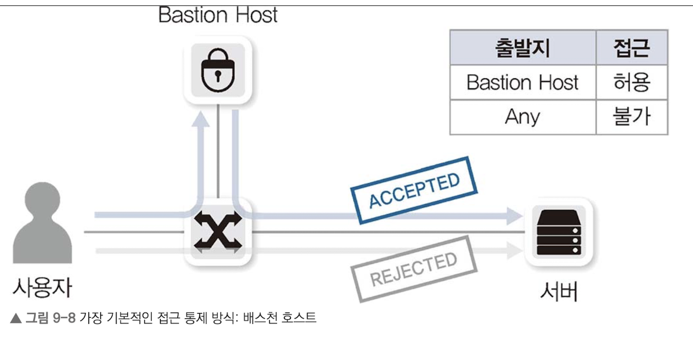
서버나 DB에 직접 적은을 막고, 작업 추적 및 감사를 하는 접근 통제 솔루션이 개발됨.
서버 접근을 위한 모든 통신은 배스천 호스트를 통해서만 가능하도록 막아서 사용.

 

# 9.3 방화벽
## 9.3.1 방화벽의 정의
네트워크 중간에 위치해 해당 장비를 통과하는 트래픽을 사전 정책에 따라 허용 및 차단하는 장비.
3, 4계층에서 동작하므로 세션을 인지하는 상태 기반 엔진(Stateful Packet Inspection, SPI)로 동작.

## 9.3.2 초기 방화벽
패킷의 인과 관계를 알지 못해 단순 정책만으로 패킷을 필터링했다. 이를 stateless 방화벽.
3,4 계층의 5-튜플(Src IP, Dest IP, Src Port, Dest Port, Protocol)로 정책 설정.
불트적 다수 기반의 정책을 설정하는데 한계. 3, 4 계층 헤더 변조 공격에 취약.

## 9.3.3 현대적 방화벽의 등장 (SPI 엔진)
패킷 상태를 인지해 패킷의 인과 관계를 파악할 수 잇는 SPI 엔진 등장.
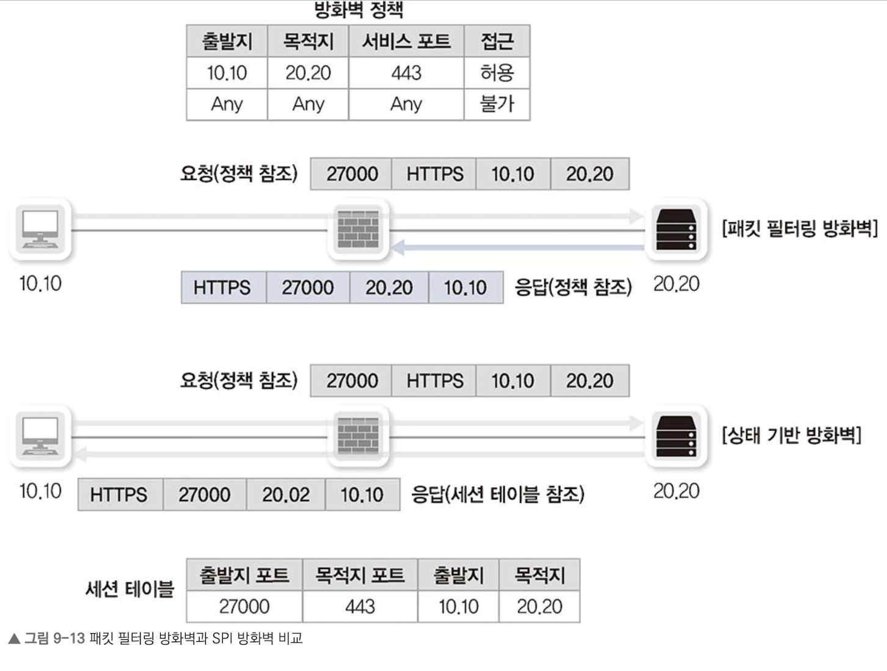
내부에서 외부 인터넷으로 통신을 시도해 받은 응답과 외부에서 내부로 직접 들어오는 패킷을 구분.

## 9.3.4 방화벽 동작 방식
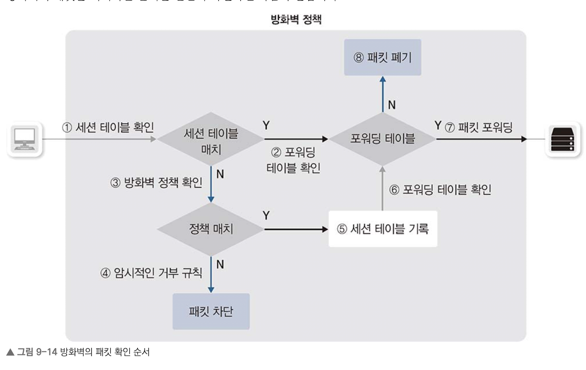

OSI 3, 4계층의 세부 필드도 함께 확인. TCP 컨트롤 플래그에 따라 동작이 변하거나 시쿼스나 ACK 번호가 갑자기 바뀌는 TCP Anti-Replay 기능 탑재.

## 9.3.5 ALG
방화벽은 애플리케이션 헤더 정보를 인지하지 못한다.
FTP 액티브 모드 처럼 플로우 방향이 다른 프로토콜에 대해서 패킷 인과 관계를 인지할 방법이 없다.
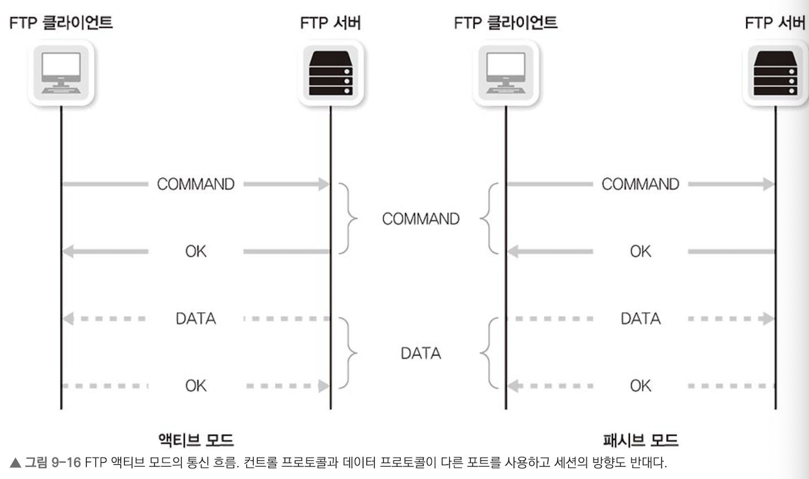

방화벽은 ALG(Application Layer Gateway)를 통해 PAT 기능이 동작하는 방화벽에서 PAT를 정상 통과하지 못하므로 프로토콜들을 자동으로 인지해 **애플리케이션 정보를 변경**해주거나 **세션 테이블을 만들어주는 작업**을 수행.

## 9.3.6 방화벽의 한계
SPI 엔진을 사용하는 방화벽은 OSI 3, 4계층에서만 동작하므로 많은 한계 존재.
ALG 기능은 근복적으로 바이러스 감지 맟 백도어나 인터넷 웜을 방어할 수 없다.
또한 알려진 취약점을 악용한 다양한 공격을 방어할 수 없다.

웜 공격을 막기 위해 IPS와 같은 다양한 네트워크 보안 장비가 개발되었다.

 

# 9.4 IPS, IDS
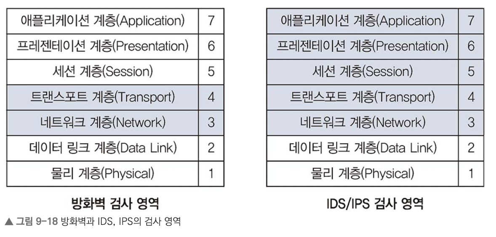
애플리케이션 정보를 통해 필터링을 위해 사용.

## 9.4.1 IPS, IDS의 정의
- IDS(Instrusion Detection System): 공격자가 시스템을 해킹할 때 탐지를 목적으로 개발된 시스템.
- IPS(Instrusion Prevention System): 공격 발견 시 직접 차단.
    - 일반적으로 호스트 기반 보단 네트워크 기반 IPS 사용.

## 9.4.2 IPS, IDS의 동작 방식
### 9.4.2.1 패턴 매칭 방식
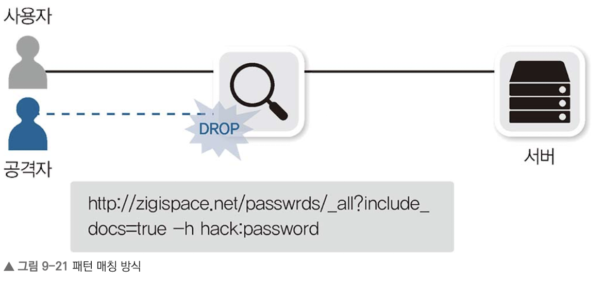
특별한 문자열을 모니터링하고 있다가 DB에 매칭되는 패킷이 들어오면 공격을 방어.

### 9.4.2.2 어노말리 공격 방어
DB 기반 방어는 DB 업데이트로 모든 공격을 저장하기에 무리가 있다.
화이트리스트를 도입하여 이를 해결한다.
- 프로파일 어노말리
    - 평소 관리자가 정한 기준이나 IPS 모니터링 기준과 다른 행위를 공격으로 판단
    - 얘를 들어 평소 1MB 이하 트래픽이 방생하다 수십 MB 이상 트래픽 발생 시 
    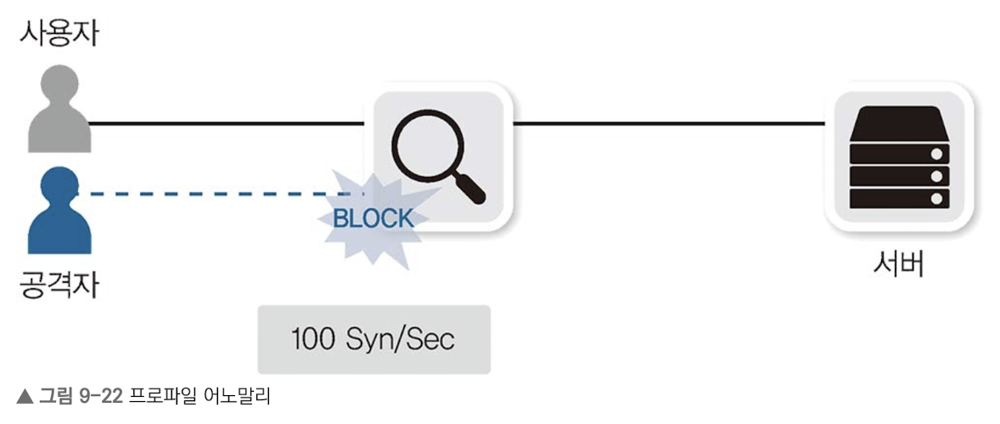

- 프로토콜 어노말리
    - 실제 서비스 포트에서 동작하는 프로토콜과 다른 경우 공격으로 판단.
    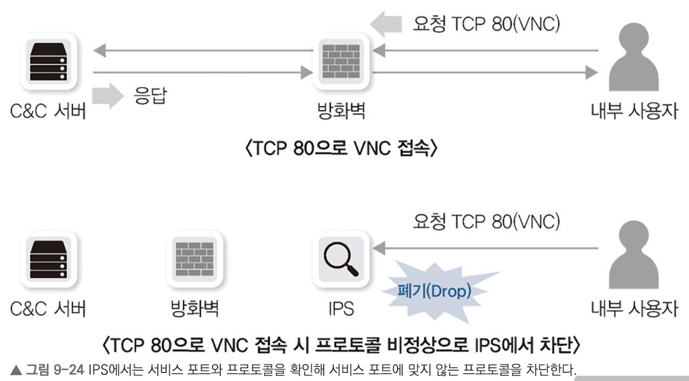

## 9.4.3 IPS, IDS의 한계와 극복 (NGIPS)
빠른 속도로 애플리케이션 레벨 까지 확인을 위해 플로 엔진을 사용. 프롤엔진은 패킷이 흘러가는 상황을 모니터링하기 때문에 비교적 우회가 쉽다.

`NGIPS`는 애플리케이션을 인지하거나 다양한 시스템과 연동할 수 있고, APT 공격을 방어하는 일부 기능을 탑재.

 

# 9.5 DDoS 방어 장비
> `C&C 서버`는 Command & Control 서버의 약자로, 사이버 공격자가 악성코드에 감염시킨 컴퓨터(좀비PC)들을 원격으로 제어하고 명령을 내리는 데 사용하는 서버

직접적인 공격 대신 해커들은 정상적인 서비스가 불가능하도록 만드는데에 초점이 맞춰지며, DDoS가 성행. 이를 막기 위한 DDoS 전용장비가 등장.

## 9.5.1 DDoS 방어 장비의 정의
## 9.5.2 DDoS 방어 장비 동작 방식
DDoS 공격을 탐지해 공격을 수행하는 IP 리스트를 넘겨주면, 방어 장비나 ISP 내부에서 이 IP를 버리는 것이 가장 흔한 방어 기법.
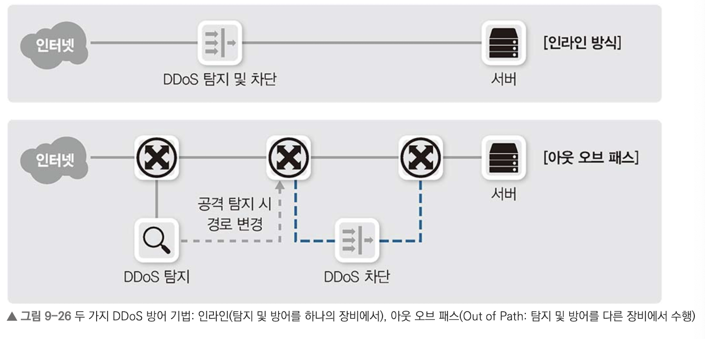

DDoS 장비는 프로파일링 기법을 통해, 평소 데이터 흐름을 습득해 일반적인 대역폭, 세션량, 초기 접속량, 프로토콜별 사용량 등을 저장. 이 데이터와 일치하지 않는 과도한 트래픽을 알려주고 차단.

## 9.5.3 DDoS 공격 타입
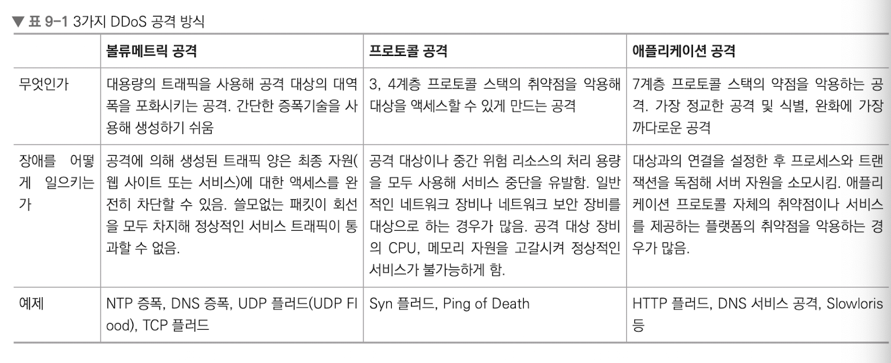

## 9.5.4 볼류메트릭 공격
회선 사용량이나 그 이상의 트래픽을 과도히 발생시켜 회선을 사용하지 못하도록 방해.
ISP 내부나 사용자 네트워크 최상단에서 완화해야 함.

### 9.5.4.1 좀비 PC를 이용한 볼류메트릭 공격
적은 대역폭으로 중간 리플렉터에 패킷을 보내면 이 트래픽이 증폭되는 증폭 공격을 사용.
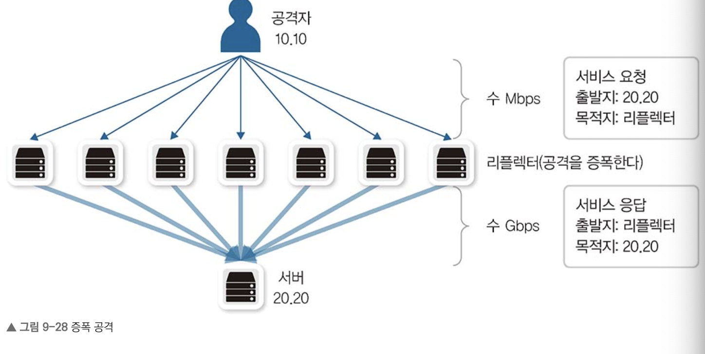

 

# 9.6 VPN
공중망을 이용해 논리적으로 직접 연결하는 것처럼 망을 구성하는 기술
VPN은 공용 망(인터넷)을 사용하므로 암호화와 인증 같은 보안 강화 기술이 필요.

## 9.6.1 VPN 동작 방식
터널링 기법을 사용.

### Host To Host
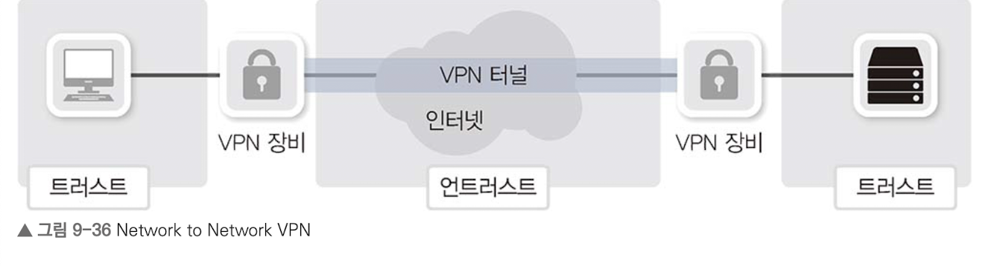
본사-지사 같은 특정 네트워크를 가진 두 종단을 연결하는 경우.
IPSEC 프로토콜을 가장 많이 사용.

### Network To Network
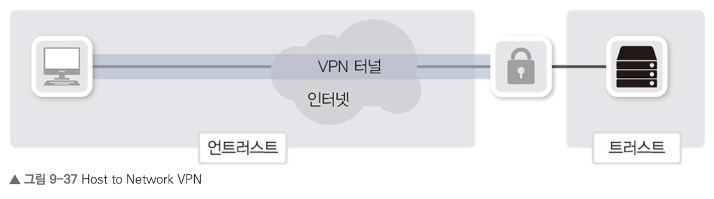
모바일 사용자가 일반 인터넷망을 통해 사내망으로 연결하는 경우.
IPSEC과 SSL 프로토콜이 범용적으로 사용됨.
