# 2장. 자바 메모리 영역과 메모리 오버플로
## 2.1 들어가며
C 개발자와 다르게 자바 개발자는 가상 머신이 제공하는 자동 메모리 관리 메커니즘 덕에 로직 개발에만 집중할 수 있다.

그러나 문제가 터졌을 때 JVM의 메모리 관리 기법을 알아야 문제 해결이 가능하다.

## 2.2 런타임 데이터 영역
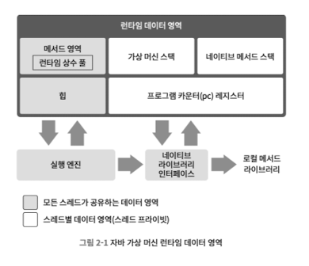
자바 가상 머신에선 위 그림처럼 메모리를 런타임 데이터 영역들로 관리한다.

### 2.2.1 프로그램 카운터
- 작은 메모리 영역으로, 현재 실행 중인 스레드의 다음에 실행할 바이트코드 명령어를 가르킴.
- 멀티스레딩은 CPU 코어를 여러 스레드가 교대로 사용
  - 따라서, 스레드 전환 후 이전에 실행하다 멈춘 지점을 알아야 복구가 가능 <- PC가 이를 담당
  - 각 스레드에 영향을 받지 않아야 하기에 `스레드 프라이빗 메모리`라고 함.
- 스레드가 네이티브 메서드 실행 중일 때 PC 값은 Undefined다.

### 2.2.2 자바 가상 머신 스택
- **자바 메서드를 실행**하는 스레드의 메모리 모델을 설명
- 각 메소드 호출 시 마다 JVM는 스택 프레임을 만들어 지역 변수 테이블, 피연산자 스택, 동적 링크, 메서드 반환값 등의 정보를 저장.
- 지역변수 테이블
  - 기본 데이터 타입(boolean, byte 등), 객체 참조, 반환 주소 타입 저장.
  - 일반적으로 32비트 슬롯 단위로 데이터를 저장
- 자바 메서드는 스택 프레임에서 지역 변수용으로 할당받아야 할 공간이 이미 완벽하게 결정되어 잇음

### 2.2.3 네이티브 메서드 스택
- 가상 머신 스택과 비슷하나 **네이티브 메서드를 실행**할 때 사용.
- 가상 머신 구현자가 원하는 형태로 자유롭게 표현됨.
- 스택 허용 깊이 초과 시 StackOverflowError, 스택 확장 실패하면 OutOfMemoryError를 던짐

### 2.2.4 자바 힙
- 자바 애플리케이션이 사용하는 가장 큰 메모리.
- 모든 스레드가 공유.
  - 객체 할당 효율 높이고자 스레드 로컬 할당 버퍼 여러 개로 나눔.
  - 이는 메모리 회수와 할당을 빨리하기 위해.
- 가상 머신 구동될 때 만들어짐.
- 모든 객체 인스턴스가 이 영역에 할당됨.
- 가비지 컬렉터가 관리
- 자바 힙 크기 고정 및 확장 가능. (`-Xmx`와 `-Xms` 사용)
- 새로운 인스턴스 할당할 공간없으면 OutOfMemoryError 던짐.

### 2.2.5 메서드 영역
- 가상 먼신이 읽어 들인 타입 정보, 상수, 정적 변수, JIT 컴파일러가 컴파일한 코드 캐시 등
- 모든 스레드가 공유.
- 과거 핫스팟 VM은 메서드 영역까지 GC하기로 결정.
  - 명세에는 특정 방식이 정해져 있지 않아 VM마다 달랐음.
  - 이 설계로 메모리 오버플로 가능성이 커지며 영구 세대의 최대크기를 제한하는 방식으로 사용하게 됐다.
  - 32비트 시스템에서 4GB 한계까지 문제가 없지만, String::intern()처럼 성능 문제가 생기는 경우도 있었다.
  - 그 이후 영구 세대로 관리하던 문자열 상수와 정적 변수 등을 자바 힙으로 옮겼다.
  - JDK8부턴 영구 세대라는 용어를 없애며 네이티브 메모리에 메타스페이스를 구현했다.
- GC를 하지 않아도 상관없다.
  - 회수할 대상이 거의 상수 풀과 타입이라서 회수 효과가 떨어짐.

## 2.3 핫스팟 가상 머신에서의 객체 들여다보기
### 2.3.1 객체 생성
- new 명령에 해당하는 바이트 코드 만나면, 이 명령의 매개 변수가 상수 풀 안의 클래스를 가리키는 심벌 참조인지 확인
- 이 심벌 참조가 뜻하는 클래스가 로딩, 해석, 초기화되었는지 확인
- 로딩이 완료된 클래스라면 새 객체를 담을 메모리를 할당

**[ 메모리 할당 ]**
자바 힙은 사용 중인 메모리와 여유 메모리가 뒤섞여 있어서 포인터를 밀쳐 내기가 어려움

> 포인터 밀치기란?
> 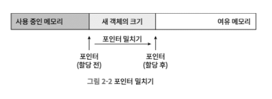

- 가용 메모리 블록들은 목록으로 딸 관리
- 객체 인스턴스를 담기에 충분한 공간을 찾아 할당한 후 목록을 갱신
- 이를 `여유 목록(free list)`라 한다

**[ 멀티스레딩에서의 객체 생성 ]**
- 여유 메모리의 시작 포인터 위치를 수정하는 일이 thread-safe하지 않음
- 해결방법
  1. 메모리 할당을 동기화
  2. 스레드마다 다른 메모리 공간 할당

- 스레드는 자바 힙 내 작은 크기의 메모리를 할당받앙 사용 (`스레드 로컬 할당 버퍼 TLAB`) 
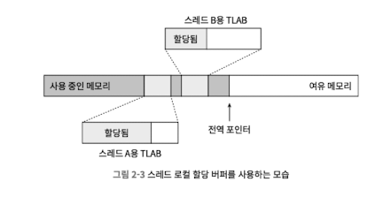

- 메모리 할당이 끝나면 VM은 할당받은 공간을 0으로 초기화 (객체 헤더 제외)
- TLAB 사용 시, 초기화는 TLAB 할당 시 미리 수행
- 따라서 객체 인스턴스 필드 초기화 없이 사용할 수 있음

**[ 객체 필요한 설정 ]**
- 어느 클래스의 인스턴스인지, 클래스의 메타 정보는 어떻게 찾는지, 이 객체의 해시코드는 무엇인지 등
- 각 객체의 객체 헤더에 저장

**[ 생성자 실행으로 마무리 ]**
- 생성자(클래스의 <init>() 메서드) 실행됨

```
<자바 코드>       <바이트코드>
   new ------>  new           : 자바 가상 머신 관점에서 객체 생성(메모리 할당 등)
         |
         ⌙--->  invokespecial : 자바 프로그램 관점에서 객체 생성(생성자 실행)
```

### 2.3.2 객체의 메모리 레이아웃

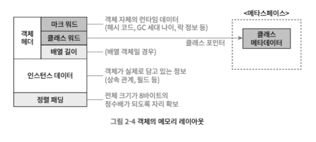

**[ 객체 헤더 ]**
- 객체 헤더가 가진 정보
  1. 객체의 런타임 데이터 (마크 워드)
  2. 객체의 클래스 관련 메타데이터를 가리키는 클래스 포인터(클래서 워드)

- JVM은 객체 헤더의 메타데이터로부터 자바 객체의 크기를 얻음
- 객체 헤더에 저자오디는 객체 타입은 배열에 담긴 '원소'의 타입

**[ 인스턴스 데이터 ]**
- 객체가 실제로 담고 있는 정보
- 예) 프로그램 코드에서 정의한 타입의 필드 관련 내용, 부모 클래스 유무, 부모 클래스에서 정의한 모든 필드
- 기본 할당 전략에선 길이가 같은 필드들은 항상 같이 할당되고 저장됨

**[ 정렬 패딩 ]**
- 존재하지 않을 수도 있고, 특별한 의미 없이 자리만 차지하는 역할
- 모든 객체 크기가 8바이트여야 하기 때문에, 비트 채우기 용

### 2.3.3 객체에 접근하기
- <<자바 가상 머신 명세>>는 참조 타입을 단지 '객체를 가리키는 참조'라고만 정했을 뿐, 힙에서 객체의 정확한 위치를 알아내는 구체적인 방법을 정의하지 않음
- 객체 접근 방식
  1. 핸들 방식
    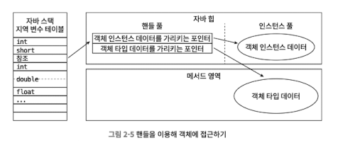
    - 자바 힙에 핸들 저장용 풀이 별도로 존재
    - 장점: 안정적인 핸들의 주소가 저장됨. 가비지 컬렉션 과정에서의 객체 이동 시, 인스턴스 데이터 포인터만 바꾸면 됨.
  2. 다이렉트 포인터 방식
    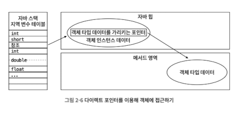
    - 자바 힙에 위치한 객체에서 인스턴스 데이터뿐 아니라 타입 데이터에 접근하는 길도 제공
    - 장점: 빠른 속도. 핸들을 경유하지 않기 때문. 

## 2.4 실전:OutOfMemoryError 예외
```
-Xms20m -Xmx20m -XX:+HeapDumpOnOutMemoryError
```
- 자바 힙 크기를 20MB로 제한
- 메모리가 오버플로 됐을 때 가상 머신이 예외 발생 시점의 힙 메모리 스냅숏을 파일로 저장

### 2.4.1 자바 힙 오버플로
```java
public class Main {
    static class OOMObject {
    }

    public static void main(String[] args) {
        List<OOMObject> list = new java.util.ArrayList<>();
        while (true) {
            list.add(new OOMObject());
        }
    }
}
```

```
Exception in thread "main" java.lang.OutOfMemoryError: Java heap space
	at org.example.Main.main(Main.java:14)

Process finished with exit code 1
```

- 메모리 이미지 분석 도구로 힙 덤프 스냅숏을 분석해보자.

[ 힙 덤프 파일이 생성안되서 추후 작성 ]

# 3장. 가비지 컬렉터와 메모리 할당 전략
## 3.1 들어가며
최초의 GC를 개발한 존 멕카시는 GC가 해결해야할 문제 3가지를 다음과 같이 말함.
- 어떤 메모리를 회수해야 하나?
- 언제 회수해야 할까?
- 어떻게 회수해야 할까?

비록 GC가 자동화지만 메모리 할당 내부를 알아야 메모리 누수 문제를 해결할 수 있다.

## 3.2 대상이 죽었는가?
### 3.2.1 참조 카운팅 알고리즘
**[ 원리 ]**
1. 객체를 가리키는 참조 카운터를 추가. 참조하는 곳이 늘어날 때마다 +1
2. 참조하는 곳이 사라질 때마다 -1
3. 카운터 값이 0이면 객체가 사용되지 않음.
  
**[ 모순 ]**
```java
public static void testGC() {
  ReferenceCountingGC A = new ReferenceCountingGC();
  ReferenceCountingGC B = new ReferenceCountingGC();

  A.instance = B;
  B.instance = A;

  A = null;
  B = null;

  System.gc();
}
```

- 위 경우에 A와 B의 참조 카운트가 1인 상태에서 각 객체 참조 값을 null로 처리
- 이 경우 A, B는 사용되지 않지만 카운트가 1인 상태

### 3.2.2 도달 가능성 분석 알고리즘
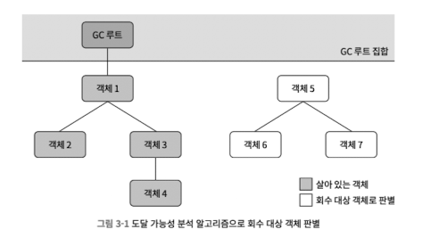
- 주류 프로그래밍 언어들은 `도달 가능성 분석 알고리즘` 이용
- 탐색 과정에서 만들어지는 경로를 참조 체인
- GC 루트로부터 도달 불가능한 객체는 더 이상 사용할 수 없는게 확실시 -> 회수 대상

**[ GC 루트 가능 객체 ]**
- 가상 머신 스택에서 참조하는 객체: 현재 실행중인 메서드에서 쓰는 매개 변수, 지역 변수 등
- 메서드 영역에서 클래스가 정적 필드로 참조하는 객체: 자바 클래스의 참조 타입 정적 변수
- 메서드 영역에서 상수로 참조되는 객체: 문자열 테이블 안의 참조
- 네이티브 메서드 스택에서 JNI(네이티브 메서드)가 참조하는 객체
- 자바 가상 머신 내부에서 쓰이는 참조: 기본 데이터 타입에 해당하는 Class 객체 등
- 동기화 락(synchronized 키워드)로 잠겨 있는 모든 객체
- JVM 내부 상황을 반영하는 JMXBean: JVMTI에 등록된 콜백, 로컬 코드 캐시 등

**[ 영역 간의 참조 ]**
- 객체는 다른 영역에 있는 객체도 참조 가능
- 따라서, 연관 영역 객체들도 GC 루트 집합에 포함해야 됨

### 3.2.3. 다시 참조 이야기로
- 참조의 의미
  - 메모리가 여유롭다면 그냥 두고, GC를 하고 나서도 메모리가 매우 부족하면 그때 회수하는 객체

**[ 참조의 종류 ]**
- 강한 참조
  - `new Obejct();`
  - 프로그램 코드에서 참조를 할당
  - 강한 참조 남아있으면 절대 회수하지 않음
- 부드러운 참조
  - 부드러운 참조만 남으면 메모리 오버플로 나기 직전에 두 번째 회수를 위한 회수 목록에 추가
  - 두 번째 회수 후에도 메모리가 부족하면 그때 메모리 오버플로 예외를 던짐
  - JDK 1.2에서 SoftReference 클래스로 추가됨
- 약한 참조
  - 다음 번 GC까지만 살아남음
  - JDK 1.2에서 WeakReference 클래스로 추가됨
- 유령 참조
  - 객체 수명에 영향 주지 않고, 객체 인스턴스 가져오는 것도 불가능
  - 목적: 대상 객체가 회수될 때 알림을 받기 위해
  - JDK 1.2에서 PhantomReference 클래스로 추가됨

### 3.2.4 살았나 죽었나?
- 도달 불가능으로 판단한 객체라고 반드시 죽어야 하는건 아님.
- GC 루트와 연결된 참조 체인을 찾지 못한 객체는 첫번째 표시 이후 필터링 진행
  - 필터링 조건: 종료자(finalize())를 실행해야 하는 객체인가?
- finalize() 실행해야 하는 객체 판명 시 F-Queue라는 대기열에 추가됨.
- JVM이 우선 순위 스레드를 생성해 F-Queue에 든 메서드의 finalize() 실행 시킴
  - JVM은 끝날때까지 기다리지 않음
- finalize()는 죽음 직전의 마지막 기회.

```java
public class Main {
    public static Main SAVE_HOOK = null;

    public void isAlive() {
        System.out.println("이야, 나 아직 살아 있어. :)");
    }

    @Override
    protected void finalize() throws Throwable {
        super.finalize();
        System.out.println("finalize() 실행됨");
        Main.SAVE_HOOK = this; // 자신의 참조 할당
    }

    public static void main(String[] args) throws Throwable {
        SAVE_HOOK = new Main();

        // 회수 대상이 첫 번째 기회를 잡아 스스로를 구원한다.
        SAVE_HOOK = null;
        System.gc();
        // 종료자 스레드의 우선순위가 낮으니 0.5초간 기다린다.
        Thread.sleep(500);
        if (SAVE_HOOK != null) {
            SAVE_HOOK.isAlive();
        } else {
            System.out.println("안 돼, 내가 죽다니. :(");
        }

        // 다음 코드는 위와 완전히 같지만 이번에는 자가 구원에 실패한다.
        SAVE_HOOK = null;
        System.gc();
        // 종료자 스레드의 우선순위가 낮으니 0.5초간 기다린다.
        Thread.sleep(500);
        if (SAVE_HOOK != null) {
            SAVE_HOOK.isAlive();
        } else {
            System.out.println("안 돼, 내가 죽다니. :(");
        }
    }
}
```

```
finalize() 실행됨
이야, 나 아직 살아 있어. :)
안 돼, 내가 죽다니. :(
```

- 어떤 객체든 시스템이 finalize()를 호출해 주는 건 오직 한번뿐.
- 가능한 사용하지 말자. 실행 비용이 높고 불확실성도 큼
- JDK 9부터 Deprecated
- finalize() 대신 try-finally 등 방법으로 대체.

### 3.2.5 메서드 영역 회수하기
- 메서드 영역을 반드시 청소할 필요 없음.
- 회수 조건이 까다로워 효율이 힙보다 훨씬 떨어짐.

**[ 회수 대상 ]**
- `상수`
  - 자바 힙 회수와 비슷
  - 단순히 사용안되면 삭제
- `클래스`
  - 조건1: 자바 힙에서 해당 클래스와 하위 클래스 인스턴스가 하나도 존재하지 않을 것
  - 조건2: 이 클래스를 읽어 들인 클래스 로더가 회수됐을 것. JSP 리로딩 처럼 설계된 클래스 로더 없이는 충족 불가.
  - 조건3: 이 클래스에 해당하는 java.lang.Class 객체를 아무 곳에서도 참조하지 않고, 리플렉션 기능으로 이 클래스 메서드를 이용하지 말 것/

- 다시 말하지만, 반드시 회수할 필요가 없다.
- `-verbose:class`, `-Xlog:class+load=info`, `Xlog:class+unload=info` 매개 변수로는 클래스가 로딩되고 언로딩되는 정보 확인 가능

## 3.3 가비지 컬렉션 알고리즘
- 객체 생상 판별 기능은 `참조 카운팅 GC`와 `추적 GC`가 존재.
- 대 부분은 추적 GC 사용

### 3.3.1 세대 단위 컬렉션 이론
**[ 가설 ]**
1. 약한 세대 가설: 대다수 객체는 일찍 죽는다.
2. 강한 세대 가설: GC 과정에서 살아남은 횟수가 늘어날수록 더 오래 살 가능성이 커진다.
3. 세대 간 참조 가설: 세대 간 참조의 개수는 같은 세대 안에서의 참조보다 훨씬 적다.

- 자바 힙을 두 개 영역(신세대, 구세대)로 나눔
- 신세대에서 대부분 죽고, 살아남은 소수만 구세대로 승격.
- 다른 세대에 존재하는 객체들을 참조하는 상황이 나올 수 있음
- 따라서, 고정된 GC 루트로 도달 가능성 분석하지말고, 구세대 객체까지 모두 탐색해야 함
- 그러나, 세대 간 참조는 적기 때문에
  - 세대 간 참조 일일히 기억 대신, 신세대에 `기억 집합`이라는 전역 데이터 구조 가짐
  - 구세대를 작은 조각 몇 개로 나누고, 그중 어느 조각에 세대 간 참조가 있는지 기록해 관리

> - 부분 GC
>   - 마이너 GC(신세대 GC): 신세대만 대상으로 하는 GC
>   - 메이저 GC(구세대 GC): 구세대만 대상으로 하는 GC
>     - CMS 컬렉터만 구세대를 따로 회수
>   - 혼합 GC: 신세대 전체와 구세대 일부를 대상으로하는 GC.
>     - G1 컬렉터만 이렇게 동작
> - 전체 GC
>   - 자바 힙 전체와 메서드 영역까지 모두를 대상으로 하는 GC

### 3.3.2 마크-스윕 알고리즘
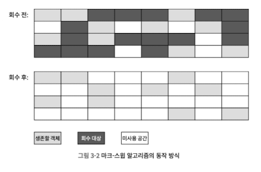
- 뒤이어 나온 컬렉션 알고리즘들의 기초.
- 단점
  - 실행 효율이 일정하지 않다.객체 많을수록 효율이 떨어짐
  - 메모리 단편화 심함.

### 3.3.3 마크-카피 알고리즘
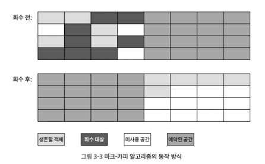
- 가용 메모리를 똑같은 크기의 두 블록으로 나눠 한 번에 한 블록만 사용
- 꽉 차면 살아남은 객체들만 다른 블록에 복사하고 기존 블록을 한 번에 청소
- 대부분 이 알고리즘 사용. But 메모리 영역을 1:1로 안나눔
- 단점
  - 대다수 객체가 살아남으면 메모리 복사에 시간 허비
  - 대다수가 회수되면 생존한 소수의 객체만 복사
  - 가용 메모리를 절반으로 줄여 낭비 제법 심함

### 3.3.4 마크-컴펙트 알고리즘

- 마크-스윕과 차이는 메모리 이동이 일어난다는 점
- 구세대에선 회수 때마다 살아남는 객체가 많음
  - 따라서, 생존한 객체를 이동시킨 후, 이동된 객체들을 가리키던 기존 참조들을 모두 갱신하기는 매우 부담
- 객체 이동 시
  - 단점: 회수 작업이 복잡해지고, 이동시키지 않으면 할당 작업이 복잡
  - 전체 프로그램의 `처리량`이 기준이라면 객체 이동시키는 편이 효율적
- 객체 이동시키지 않을 시
  - 단점: 메모리 할당하고 접근 빈도가 GC보다 훨씬 많으므로 할당과 접근 효율 떨어짐
  - 전체적인 처리량이 나쁨
  - 그러나 컬렉터의 효율이 높음
- 대부분 경우 메모리 파편화를 감내하면서 마크-스윕 사용하다가, 객체 할당에 영향을 줄 만큼 파편화 심해지면 마크-컴펙트를 돌려 연속 공간 확보.

## 3.4 핫스팟 알고리즘 상세 구현
### 3.4.1 루트 노드 열거
- `루트 노드 열거`란 도달 가능성 분석 알고리즘에서 **GC 루트 집합으로부터 참조 체인을 찾는 작업**.
- 최근 자바 앱 용량이 커지면서 풀 스캔이 부담스러움
- 루트 노드 열거는 반드시 일관성이 보장되는 스냅숏 상태에서 수행해야 한다.
  - 열거 작업 동안 실행 서브시스템이 특정 시점으로 고정된 것처럼 보여야 한다.
  - 이 때문에 GC 시에 모든 사용자 스레드가 일시 정지해야 한다.
- 현재 주류 JVM은 정확한 GC를 사용.
  - 따라서 사용자 스레드가 정지한 후 실행 콘텍스트와 전역 참조의 위치를 확인 안해도 됨.
- 핫스팟은 `OopMap`이라는 데이터 구조로 사용자 스레드 일시 정지 문제 해결

### 3.4.2 안전 지점
- OopMap을 통해 GC 루트들을 빠르고 정확하게 열거
  - 하지만, 참조 관계나 OopMap의 내용을 변경할 수 잇는 명령어가 많으면, 명령어 모두에 OopMap을 만들어 넣으면 메모리 사용이 많아짐
  - 그래서, 모든 명령어 각각에 OopMap 생성하지 않고, 안전 지점이라는 특정한 위치에만 기록
- 안전 지점 기준
  - 프로그램이 장시간 실행될 가능성이 있는가?
  - 장시간 실행될 가능성을 보여 주는 상황은 명령어 흐름이 다중화될 때다.
  - 예) 메서드 호출, 순환문, 예외 처리 등
- GC가 시작되면, JNI 호출을 실행 중인 스레드를 제외한 모든 스레드가 가장 가까운 안전 지점까지 실행하고 멈추게할 방법 필요
  - 선제적 멈춤
    - 스레드의 코드가 가비지 컬렉터를 신경 쓸 필요 없음
    - GC 실행 시, 시스템이 모든 사용자 스레드를 인터럽트
    - 사용자 스레드 중단 위치가 안전 지점 아니면 해당 스레드 재개 및 안전 지점에서 멈추게 함.
  - 자발적 멈춤
    - 가비지 컬렉터가 스레드 수행에 관여하지 않음
    - 플래그 비트를 설정, 각 스레드가 실행 중 플래그를 polling.
    - 플래그 값이 true면 가장 가까운 안전 지점에서 멈춤

### 3.4.3 안전 지역
- 안전 지점은 실행 중이 아닌 프로그램(프로세서를 할당 받지 못한 프로그램)에 대한 루트 노드 열거를 보장하지 않음.
- `안전 지역`은 일정 코드 영역에서는 참조 관계가 변하지 않음을 보장 
  - 안전 지점 안이면 어디서든 GC를 시작해도 무방하다는 뜻

### 3.4.4 기억 집합과 카드 테이블
- 세대 간 참조를 해결하기 위해, 신세대에 기억 집합 데이터 구조를 둠
- 기억 집합
  - 비회수 영역(회수 대상이 아닌 영역)에서 회수 영역을 가리키는 포인터들을 기록하는 추상 데이터 구조
  ```c
  Class RememberedSet {
    Object[] set[OBJECT_INTERGRENERATIONAL_REFERENCE_SIZE];
  }
  ```
  - 공간과 관리 비용이 상당히 높음
  - GC 시 컬렉터는 기억 집합을 통해 특정 비회수 영역에서 회수 영역을 가리키는 포인터가 존재하지만 확인하면 됨
  - 기록 단위를 더 크게 잡아 공간과 관리 비용을 절약함 -> 카드 정밀도

- 카드 테이블
  - 카드 정밀도로 기억 집합 구현
  - 기억 집합은 추상 데이터 구조. (기억 집합=Map, 카드 테이블=HashMap 느낌?)

> 카드 정밀도란?
> : 레코드 하나(카드)가 메모리 블록 하나에 매핑됨. 특정 레코드가 마킹되어 있으면, 해당 블록에 세대 간 참조를 지닌 객체가 존재한다는 뜻

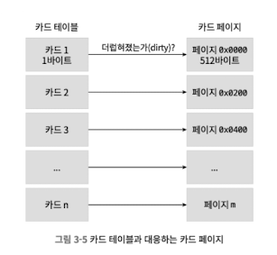
- 세대 간 포인터 갖는 필드가 있으면, 카드 테이블에서 해당 원소를 1로 표시하고, 그 원소는 dirty라고 부름.
- 세대 간 포인터를 갖는 객체가 하나도 없다면 0으로 표시
- 더럽혀진 원소만 확인하면 세대 간 포인터를 포함하는지 알기 쉬움.

### 3.4.5 쓰기 장벽
- 더렵혀지고 더럽히는 주체가 무엇인지 알아야 함.
- 읽기 장벽
  - 동시 비순차 실행 문제를 해결하기 위한 메모리 장벽 기술
- 쓰기 장벽
  - 가상 머신 수준에서 '참조 타입 필드 대입'시 끼어드는 AOP aspect로 비유하면 됨.
  - 이를 통해 카드 테이블을 업데이트함
- 이는 오버헤드 존재 및 공유 문제 발생 가능
  - 거짓 공유: 여러 스레드가 서로 다른 변수 수정 시, 그 변수들이 마침 같은 캐시 라인에 저장될 경우, 서로 영향을 주는 것.
    - 그러나 이는 원소가 더럽혀지지 않았을 때만 더럽히는 방식으로 피할 수 잇음.

### 3.4.6 동시 접근 가능성 분석
- 도달 가능성 분석 알고리즘으로 객체의 생사를 판단
- 표시 단계의 실시 정지 시간이 힙 크기에 비례해 증가하면 거의 모든 GC에 악영향을 줌.
- 이를 줄이기 위해 일관성 보장되는 스냅샷 상태에서 탐색
- 그러나 스냅샷 사용 시 두가지 문제점 있음
  1. 죽은 객체를 살았다고 잘못 표시할 가능성.
  2. 살아 잇는 객체를 죽었다고 표시할 가능성.
  
## 3.5 클래식 가비지 컬렉터
- JDK 7 ~ JDK 11까지 오라클 JDK의 핫스팟 VM에 포함된 모든 가비지 컬렉터.
- 고성능, 저지연 컬렉터들과 구분하려고 클래식이라고 부름.

### 3.5.1 시리얼 컬렉터
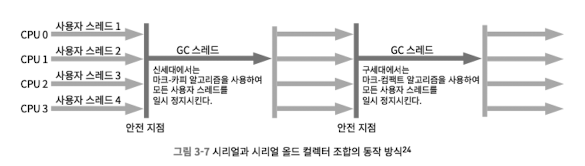
- 가장 기초적이고 오래된 컬렉터
- 단일 스레드로 동작
- 간단하고 효율적 / 메모리 사용량 적음
- 단일 스레드이기에 Stop the workd 시간 증가 가능

### 3.5.2 파뉴 컬렉터
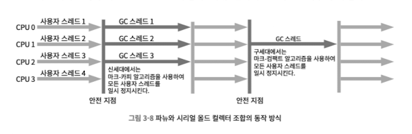
- 여러 스레드를 활용하여 시리얼 컬렉터를 병렬화
- CMS 컬렉터와 조합하여 사용할 수 있는 유일한 컬렉터 였음

### 3.5.3 페러렐 스캐빈지 컬렉터
- 마크-카피 알고리즘에 기초하여, 여러 스레드로 병렬로 회수
- 차이점: 처리량을 제어하는데 목표
```
처리량 = 사용자 코드 실행 시간 / (사용자 코드 실행 시간 + 가비지 컬렉터 실행 시간)
```
- 응답 시간 빠르면 사용자 경험 개선
- 처리량 높으면 프로세서 자원을 효율적으로 처리하여 전체 작업을 바르게 끝냄

### 3.5.6 CMS 컬렉터
- 마커와 스윕 단계를 사용자 스레드와 동시에 수행
- 목적: 가비지 컬렉션에 따른 일시 정지 시간을 최소화
- 사용자 경험이 중요한 앱, 브라우저 등에 적합

**[ 과정 ]**

1. 최초 표시 (스탑 더 월드)
2. 동시 표시 (사용자 스레드와 동시에)
3. 재표시    (스탑 더 월드)
4. 동시 쓸기 (사용자 스레드와 동시에)

**[ 장점 ]**
- 프로세스 자원에 아주 민감
  - 동시성을 위해 설계된 프로그램은 모두 프로세서 자원에 민감함.
  - 동시 수행 단계에서 사용자 스레드를 멈추지 않더라도 앱을 느리게 하여 전체 처리량을 떨어뜨림.
- 부유 쓰레기 발생
  - 어떤 객체는 표시 스레드가 지난 간 직후에 쓰레드로 수행되는 경우가 있음
  - 이런 객체는 쓸기 시 회수되지 않고, 다음 GC를 기다려야 함
- 사용 메모리 공간이 많이 먹음
  - 구세대가 거의 가득찰때까지 여유롭게 기다리지 않음
  - 동시 쓸기 동안에도 프로그램이 올바르게 동작해야 하므로 메모리 공간이 더 필요
- 마크 앤 스윕 알고리즘 고질적 문제인 파편화

### 3.5.7 G1 컬렉터(가비지 우선 컬렉터)

