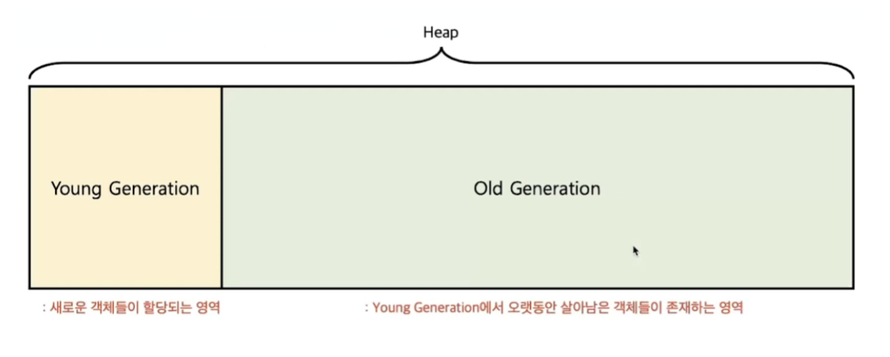
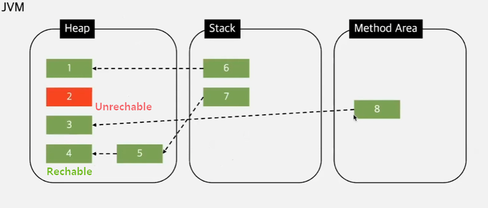

# Garbage Collection in Java
## GC는 왜 필요한가요?
C언어와 같은 예전 프로그래밍 언어에서는 개발자가 malloc()으로 메모리를 할당하고 free()로 직접 해제해야 했습니다.
만약 메모리 해제를 잊어버리면 **메모리 누수(Memory Leak)**가 발생하여 시스템 장애로 이어질 수 있었죠.
Java는 이러한 문제를 해결하기 위해 GC를 도입했습니다.
GC는 더 이상 어떤 변수도 참조하지 않는 '쓰레기 객체'를 알아서 정리해 줍니다.

## GC의 단점: "Stop-the-World"
GC가 작동하기 위해서는 애플리케이션의 모든 실행 스레드를 잠시 멈춰야 합니다.
이를 **"Stop-the-World"**라고 부릅니다. 
이 시간이 길어지면 애플리케이션의 응답 속도가 느려지고 성능 저하의 원인이 됩니다.
따라서 효율적인 GC란 이 "Stop-the-World" 시간을 최소화하는 것을 목표로 합니다.

## GC Heap
GC는 **힙(Heap)**이라는 메모리 영역에서 작동합니다.
JVM은 효율적인 GC를 위해 힙 영역을 두 가지로 나누어 관리합니다.
이를 `Weak Generational Hypothesis` 가설에 기반한 설계라고 합니다.

> **_NOTE:_**
> ### 약한 세대 가설(Weak Generational Hypothesis) 이란?
> 1. 대부분의 객체는 금방 Unreachable 된다.
> 2. 오래된 객체에서 새로운 객체로의 참조는 아주 적게 존해한다.
> 즉 객체 대부분은 일회성이며, 메모리에 오래 상주하는 경우가 드물다.

### Young Generation
- 새롭게 생성된 객체가 할당되는 영역
- 대부분의 객체가 금방 Unreachable이 되기에 많은 객체가 YG에 생성 됐다가 사라짐.
- `Minor GC`: YG에 대한 GC

## Old Generation
- YG에서 Reachable을 유지하여 살아남은 객체가 복사되는 영역
- YG보다 공간이 크고, 가비지는 적게 발생
- `Major GC(Full GC)`: OG에 대한 GC

### YG 자세히
YG는 또 3가지 영역으로 나뉜다.
- Eden
    - `new`를 통해 새로 생성된 객체
    - 정기적인 Garbage 수집 후, 살아남은 객체들은 Survivor 영역으로 보냄
- Survivor 0 & Survivor 1
    - 최소 1번의 GC 이상 살아남은 객체
    - Survivor 영역 규칙에 따라, S0 또는 S1 둘 중 하나에는 꼭 비어 있어야 함.

### 메모리 동작 과정
1. 새로운 객체 생성
    - 메모리 할당 과정에서 새로운 객체를 생성하는 단계
    - YG에서 새로운 객체가 생성이 되며 이후 가비지 컬렉터는 ‘Eden 영역’에 해당 객체를 할당
2. Young Genration 내에서 객체 이동: Promotion Inside Young Genration
    - 객체 생성 이후 일정 시간이 지나거나 Eden 영역이 가득 차면 GC는 Eden 영역에 있는 객체들을 스캔하여 참조되지 않은 객체들을 식별하고 메모리에서 해제
    - 이때 참조되지 않은 객체들은 가비지로 간주되어 회수되며 참조되어 살아남은 객체들은 Survivor 영역으로 이동
3. YG에서 OG로 승격
    - Survivor 영역에 있는 객체들 중 일정한 조건을 충족한 객체들을 OG로 이동시킴
    - 이를 통해 오랫동안 사용되는 객체들은 OG에서 관리되며, YG에서는 주로 단기간만 사용되는 객체들이 관리됨

## GC 대상

- 특정 객체가 garbage인지 아닌지 판단하기 위해서 `도달성`, `도달능력`(Reachability) 이라는 개념을 적용
- 객체에 레퍼런스가 있다면 `Reachable`로 구분
- 객체에 유효한 레퍼런스가 없다면 `Unreachable`로 구분해버리고 수거 

> [!important]
> `Reachable` : 객체가 참조되고 있는 상태
> `Unreachable` : 객체가 참조되고 있지 않은 상태

