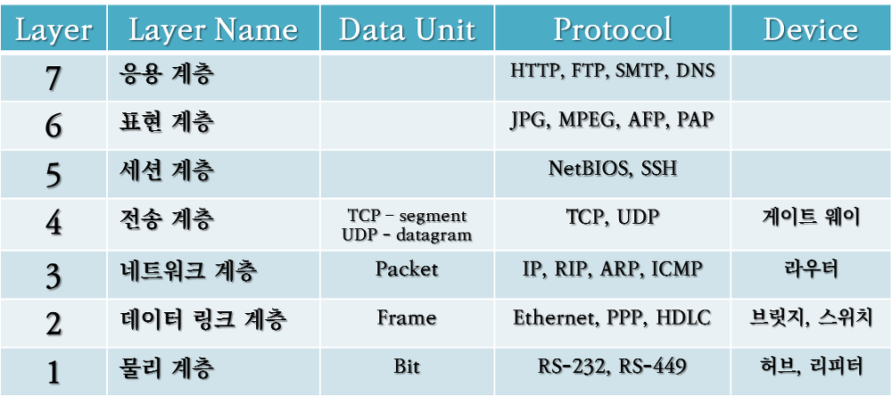
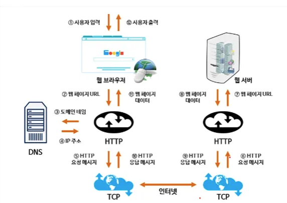
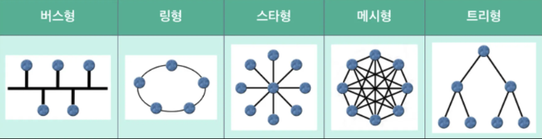

# 공통 질문
## 1. OSI 7 계층과 TCP/IP 4계층
### OSI 7 계층

- 7계층 (Application) : 사용자가 네트워크를 통해 데이터를 주고받을 수 있도록하는 레이어
    - HTTP, SMTP
- 6계층 (Presentation) : 데이터 형식을 정의하는 레이어
- 5계층 (Session) : 컴퓨터끼리 통신을 위한 세션을 만드는 레이어
- 4계층 (Transfort) : 프로세스 간 `세그먼트` 전송을 지원하는 레이어
    - TCP, UDP, Port
- 3계층 (Network) : 호스트 간 `패킷`을 라우팅하는 레이어
    - IP, routing 프로토콜
- 2계층 (DataLink) : 네트워크 간 `프레임` 전송을 지원
    - 이더넷, 와이파이
- 1계층 (Physical) : 실제 와이어를 통한 `비트` 전송
    - 케이블, 리피터, 허브

### TCP/IP 4계층
- 4계층 (Applicaion) : 사용자가 네트워크를 통해 데이터를 주고받을 수 있도록하는 레이어
    - OSI 7계층의 Application + Presentation + Session
- 3계층 (Tranport) : 프로세스 간 세그먼트를 전송하는 레이어
    - TCP, UDP
- 2계층 (Internet) : 패킷을 라우팅하고, IP 주소를 통해 목적지로 전송. Network와 비슷
    - IP, ICMP, ARP
- 1계층 (Network Interface) : 데이터를 물리적 장치로 전송
    - Physical + DataLink

## 2. TCP, UDP의 차이
- TCP는 연결 지향형 서비스로 3-웨이-핸드셰이크 과정을 통해 연결한다. 따라서 높은 신뢰성을 보장하지만, 속도가 느리다는 단점이 있다.
- UDP는 비연결 서비스로 연결 여부를 확인하지 않고 데이터그램을 전달한다. 따라서 신뢰성은 보장하지 않지만, 속도가 빠르다.

## 3. 3-Way-Handshake
### 개념
TCP에서 신뢰성 보장을 위해 통신 시작을 위한 논리적 연결 과정
### 과정
1. 클라이언트가 서버에게 연결 요청을 알리는 SYN 패킷 전송
2. 서버는 클라이언트의 SYN을 받고, 연결을 승인하는 ACK와 자신의 연결 요청인 SYN 패킷 전송
3. 클라이언트는 서버의 SYN과 ACK을 받은 후, 응답으로 ACK을 서버에 전송

## 4. 4-Way-Handshake
### 개념
TCP 연결 종료 시, 클라이언트와 서버의 연결 해제 과정
### 과정
1. 클라이언트가 서버에 FIN 플래그 전송
2. 서버는 FIN을 받고, 확인 메시지 ACK 전송. 서버는 CLOSE_WAIT 상태가되며, 아직 전송되지 않은 데이터를 모두 전송
3. 서버는 모든 데이터를 전송 후, 클라이언트에게 FIN 플래그 전송
4. 클라이언트가 FIN을 받고, 확인 메시지인 ACK를 서버에 전송. 클라이언트는 TIME_WAIT 상태에서 대기하여 아직 전송되지 않은 데이터가 있을 가능성 대비한 후 소켓을 닫음

## 5. 흐름제어
### 개념
- 송신측과 수신측 간의 데이터 처리 속도 차이를 해결하기 위한 기술
- 수신측 처리 속도가 느릴 경우, 수신 버퍼의 오버플로우를 막기 위해, 수신 버퍼의 남은 용량을 확인하며 데이터를 전송
- 송신측은 수신 윈도우 정보를 활용해 데이터 전송을 조절
### 방법
- Stop and Wait : 송신측이 한 번에 하나의 패킷을 전송. 수신측의 ACK 받은 후 다음 패킷 전송
- Sliding Window : 파이프라인을 통해 패킷을 전송하기 위해 송신측에서 설정한 윈도우 크기를 이용하는 방법.

## 6. 혼잡제어
### 개념
송신자 전송속도와 네트워크 처리속도 차이로 인한 문제. 라우터에 너무 많은 데이터가 들어오는 경우 제대로된 기능 수행 불가. 네트워크 혼잡을 막기 위해 송신측의 데이터 전송 속도를 조절.
### 방법
1. AIMD : 패킷 전송 성공 시, 윈도우 크기를 1씩 증가. 혼잡 감지 시 전송 속도를 절반으로 줄임. 공평하지만, 초기 전송 속도 느림
2. Slow Start : AIMD의 느린 초기 속도 향상을 위해 지수 함수로 증가 시킴. ssthresh값 도달 시, 윈도우 크기를 1씩 증가 시킴. 
3. Fast Retransmit : ACK 3개 연속 도착하면, 즉시 재전송
4. Fast Recovery : 혼잡 발생 시, 윈도우 크기를 절반 줄임.

## 7. UDP
### 개념
데이터를 데이터그램 단위로 처리하는 비연결형 전송 프로토콜. 신뢰성 보장하지 않아 순서가 바뀌거나 손실될 수 있음
빠른 전송 속도로 인해 DNS에서 주로 사용됨.

### TCP와의 차이점
TCP는 3-Way-Handshake를 통한 연결 과정이 필요하지만, UDP는 필요하지 않아 낮은 오버헤드를 가짐.

### DNS에서의 사용
DNS 쿼리는 요청과 응답 크기가 매우 작고, 연결 유지가 필요없기 때문에 UDP 사용. 데이터 크기가 512 바이트를 넘거나 Zone Transfer가 필요할 경우 TCP를 사용합니다.

## 8. www.naver.com에 접속할 때 생기는 과정

1. 사용자가 브라우저에 URL 입력
2. DNS 서버에 도메인 네임으로 서버의 진짜 주소 찾음
3. IP 주소로 웹 서버에 TCP 3 handshake로 연결 수립
4. 클라이언트는 웹 서버로 HTTP 요청 메시지를 보냄
5. 웹 서버는 HTTP 응답 메시지를 보냄

## 9. 네트워크 토폴로지

1. 버스 토폴로지 : 

## 10. 네트워크 병목현상
### 개념
네트워크 내 특정 부분의 데이터 처리 용량이 부족하여 전체 네트워크 성능이 저하되는 현상
### 발생 지점
- 네트워크 장비 용량 한계 : 라우터, 스위치, 케이블 과부하
- 대역폭 제한 : 대역폭이 부족하여 데이터 트래픽이 원활히 흐르지 못해 지연 발생
- 서버 성능 제한 : 서버에 동시 요청

### 해결 방법
- 대역폭 확장
- 로드 밸런싱
- 네트워크 장비 업그레이드
- 캐시 및 데이터 압축

## 11. 로드 밸런싱이란
- 둘 이상의 서버에 부하를 효율적으로 분산시켜 웹 서비스의 성능을 높이고 무중단 서비스 제공
- RoundRobin, Least Connections, Source
- 로드 밸런서 장애 방지를 위해 이중화 방식 사용
- 하나의 Active 상태로 작동하고 다른 하나는 Passive 상태로 대기
- 장애가 발생하면 Passive 상태의 로드밸런서가 즉시 작동해 트래픽 처리

# 추가 질문
### Port는 어떤 계층에 포함되는가?
- Transport 계층

### Transport 계층의 전송 단위
- TCP: 세그먼트
- UDP: 데이터그램

### TCP 종료 시, 4-Way-Handshake를 쓰는 이유
- 클라이언트에서 더 이상 데이터를 보내지 않지만, 서버에선 아직 데이터를 보내고 있을 수 있기 때문 (Half-Close)

### 흐름제어와 혼잡제어의 차이점
- 흐름제어 : 송신부와 수신부 사이의 처리속도 차이를 극복하기 위해
- 혼잡제어 : 송신부와 네트워크 사이의 처리속도 차이를 극복하기 위해

### 리버스프록시와 로드밸런싱의 차이
- 리버스 프록시: 웹 서버 또는 서버 그룹에 대한 게이트웨이 역할을 하여, 클라이언트로부터 서버의 익명성을 제공
- 리버스 프록시는 로드 밸런서로서 역할할 수 있음

### 로드밸런서 종류
- L7 로드벨런서 : application 계층에서 HTTP 헤더, 쿠키 같은 값을 통해 부하 분산
- L4 로드밸런서 : IP주소와 포트번호를 통한 로드밸런싱 수행