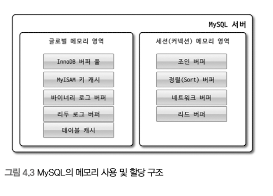
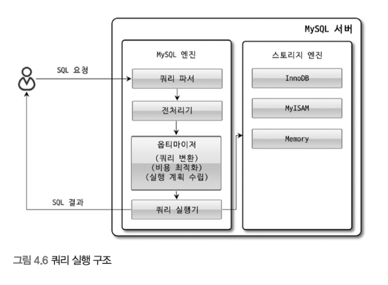
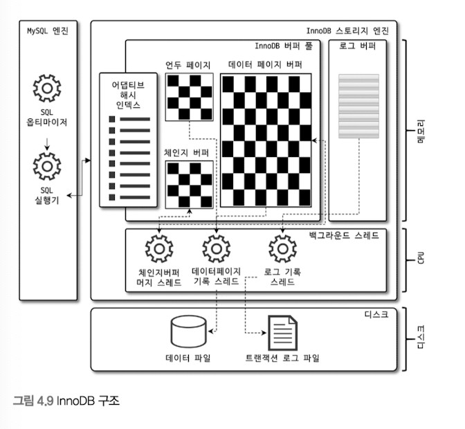
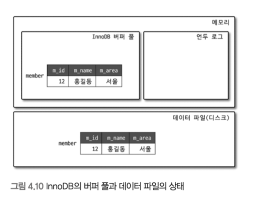
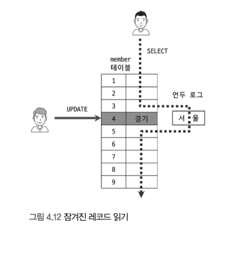

# 4. 아키텍처
## 4.1 MySQL 엔진 아키텍처
다른 RDBMS와 다른 방식을 가지고 있다.

### MySQL 엔진
- 클라이언트로부터 접속 및 쿼리 요청을 처리하는 커넥션 핸들러
- SQL 파서 및 전처리기
- 옵티마이저

### 스토리지 엔진
- 실제 데이터를 디스크 스토리지에 저장하거나 디스크 스토리지로부터 데이터 읽어오기 담당
- MySQL 엔진과 다르게 여러 개를 동시 사용 가능
- 지정된 스토리지 엔진이 처리
    > CREATE TABLE test_table (fd1 INT, fd2 INT) ENGINE=INNODB;

### 핸들러 API
- MySQL 엔진의 쿼리 실행기에서 데이터를 읽거나 쓸 때, 스토리지 엔진에 요청을 보내는데, 이 요청을 핸들러 API가 처리

### MySQL 스레딩 구조

- MySQL 서버는 스레드 기반으로 작동하며, `포그라운드 스레드`와 `백그라운드 스레드`로 구분

### 포그라운드 스레드
- 최소한 MySQL 서버에 접속된 클라이언트 수만큼 존재
- 주로 각 클라이언트 사용자가 요청하는 쿼리 문장 처리
- 커넥션이 종료되면 다시 르세드 캐시로 되돌아감
  - 이미 스레드 캐시에 일정 개수 이상의 대기 스레드가 있으면, 넣지 않고 종료 시킴
  - 최대 스레드 개수는 `thread_cache_size` 시스템 변수 사용
- MySQL의 데이터 버퍼나 캐시로부터 가져옴
  - 여기에 없는 경우 직접 디스크의 데이터나 인덱스 파일로부터 읽어옴

### 백그라운드 스레드
- Insert Buffer를 병합하는 스레드
- 로그를 디스크로 기록하는 스레드
- InnoDB 버퍼 풀의 데이터를 디스크에 기록하는 스레드
- 데이터를 버퍼로 읽어 오는 스레드
- 잠금이나 데드락을 모니터링하는 스레드

- 쓰기는 지연될 수 있지만, 읽기는 절대 지연되면 안된다.
  - 대부분 쓰기 작업을 버퍼링해서 일괄 처리하는 기능 탑재
  - 그러나 MyISAM은 사용자 스레드가 쓰기 작업까지 함께 처리

### 메모리 할당 및 사용 구조

- 글로벌 메모리 영역은 MySQL 서버 시작 시 OS로부터 할당

### 글로벌 메모리 영역
클라이언트 스레드 수와 무관하며, 모든 스레드에 의해 공유됨
- 대표적인 사례
  - 테이블 캐시
  - InnoDB 버퍼 풀
  - InnoDB 어댑티브 해시 인덱스
  - InnoDB Redo 로그 버퍼

### 로컬 메모리 영역
- MySQL 서버상 존재하는 클라이언트 스레드가 쿼리를 처리하는데 사용
- 클라이언트 커넥션으로부터 스레드를 하나씩 할당
- 절대 공유되지 않음

- 대표적인 사례
  - 정렬 버퍼
  - 조인 버퍼
  - 바이너리 로그 캐시
  - 네트워크 버퍼

### 플러그인 스토리지 엔진 모델
- 부가적인 기능을 제공하는 스토리지 엔진을 위해 제공

### 컴포넌트
- 8.0부터 기존 플러그인 아키텍처를 대체하기 위해 컴포넌트 아키텍처 지원

### 쿼리 실행 구조

- 쿼리 파서
  - 요청으로 온 쿼리 문장을 토큰으로 분리해 트리 형태로 작업
  - 문법 오류 캐치 및 전달
- 전처리기
  - 파서 트리를 기반으로 문자의 구조적 문제 확인
  - 예약어, 객체 존재 여부, 접근 권한 파악
- 옵티마이저
  - 쿼리 문장을 저렴한 비용으로 가장 빠르게 처리할지 결정
- 실행 엔진
  - 만들어진 계획대로 각 핸들러에게 요청해서 받은 결과를 또 다른 핸들러에게 요청하는 역할
- 핸들러(스토리지 엔진)
  - 실행 엔진 요청에 따라 데이터를 디스크로 저장하고 읽어 오는 역할 담당

### 쿼리 캐시
- SQL 실행 결과를 메모리에 캐시하고, 동일 쿼리가 실행되면 즉시 반환
- 그러나 데이터 정합성 보장을 위한 동시성 저하가 문제가 되어 8.0에서 삭제됨

### 스레드 풀
- 엔터프라이즈 에디션에서만 제공
- 사용자 요청 처리 스레드 개수를 줄이는 역할
  - 제한된 CPU로 제한된 스레드 처리만 집중하도록 하여 서버 자원 소모 줄임
- 눈에 띄는 성능 향상은 없지만, 적절한 스레드 개수 및 유효 시간 설정을 통해 불필요한 컨텍스트 스위칭을 줄임

### 트랜잭션 지원 메타데이터
- 테이블 구조 정보와 스토어드 프로그램 등의 정보를 메타데이터라고 함
- 이런 메타 데이터를 5.7에선 FRM 파일에 저장하고 관리했지만, 파일 기반은 트랜잭션을 지원하지 않아 비정상 종료되면 데이터 유실되는 문제가 발생
- 8.0에선 InnoDB의 테이블에 저장하도록 개선

## 4.2 InnoDB 스토리지 엔진 아키텍처

- 거의 유일하게 레코드 기반 잠금 제공
  - 이로 인해 높은 동시성 처리 가능

### PK에 의한 클러스터링
- InnoDB 모든 테이블은 기본적으로 PK를 기준으로 클러스터링되어 저장됨.
- 이 때문에 PK는 다른 보조 인덱스보다 비중이 높게 설정됨

### 외래 키 지원

### MVCC
- Lock-free 일관된 읽기 제공
- InnoDB는 Undo log로 이 기능을 구현

예를 들어 READ_COMMITED인 환경에서 다음을 실행해보자.
`INSERT INTO member(m_id, m_name, m_area) VALUES (12, '홍길동', '서울'); COMMIT;`

이 경우, InnoDB 버퍼 풀과 디스크에 정확하게 레코드가 생성된다.

`UPDATE member SET m_area='경기' WHERE m_id=12;`

여기서 특정 필드를 업데이트하게 될 경우, 언두 로그에는 이전 값을 가지고 있다.
만약 이 상태에서 조회를 하게 되면, 격리 수준에 따라 버퍼 풀이나 언두 로그 중 한 곳에서 데이터를 읽게 된다.
그리고 COMMIT을 수행하면 언두 로그는 삭제되면 디스크에 저장된다.

### Non-Locking Consistent Read

SERIALIZABLE이 아닌 격리 수준에선 순수한 SELECT의 경우, 다른 트랜잭션 변경 여부 상관없이 잠금 대기 없이 바로 실행
이때 언두 로그를 이용하여 변경 전 데이터를 읽는다.

### 자동 데드락 감지
- 잠금 대기 목록을 그래프 형태로 관리
- 교착 상태에 빠진 트랜잭션들을 찾아 그중 하나를 강제 종료
  - 강제 종료 판단은 언두 로그 레코드를 더 적게 가진 트랜잭션
- 일반 서비스에선 잠금 목록 검사가 부담되지 않지만, 동시 초리 스레드가 매우 많을 경우 잠금도 많아져 데드락 감지가 느려진다.
- 이를 위해 데드락 감지 해지 설정도 존재

### 자동화된 장애 복구
- 자동 복구할 수 없는 손상이 있으면 멈추고 MySQL 서버를 종료함
- mysqldump를 이용해 데이터를 가능한 만큼 백업
  - 그 데이터로 서버의 DB와 테이블 다시 생성
- 복구를 위한 옵션이 있고, 강도를 조절할 수 있다.

### InnoDB 버퍼 풀
- 디스크의 데이터 파일이나 인덱스 정보를 메모리에 캐시해 두는 공간
- 쓰기 작업 지연시켜 일괄 작업으로 처리하는 버퍼 역할도 수행
- 변경된 데이터를 모아두기 때문에 랜덤 I/O 횟수를 줄임

- 버퍼 풀의 크기 설정
  - OS와 각 클라이언트 스레드가 사용할 메모리도 충분히 고려해서 설정해야 함
  - 레코드 버퍼는 각 클라이언트 세션에서 테이블의 레코드를 읽고 쓸 때 사용하는 공간
    - 이 공간이 메모리를 꽤 많이 사용함
  - 추천 설정 방법
    - 전체 메모리가 8G 미만이면 50% 정도만 설정
  - 버퍼 풀 크기 변경은 크리티컬하므로 한가할 때 설정해야 함
  - 또한, 내부적으로 128MB 청크 단위로 쪼개어 관리되기에 128MBB 단위로 설정하는 것이 좋다.
