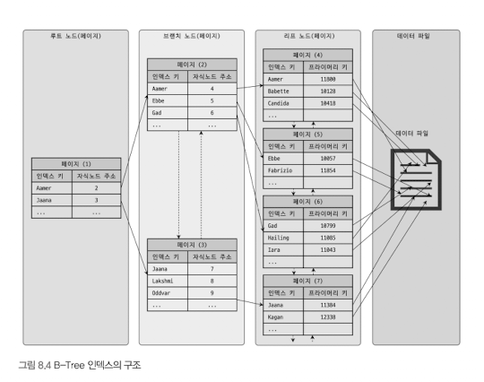
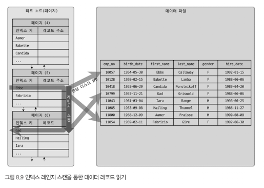
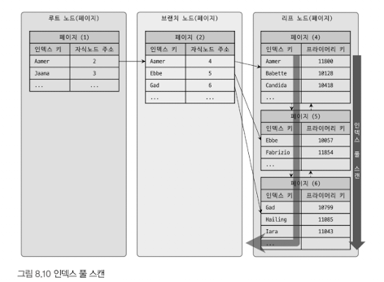
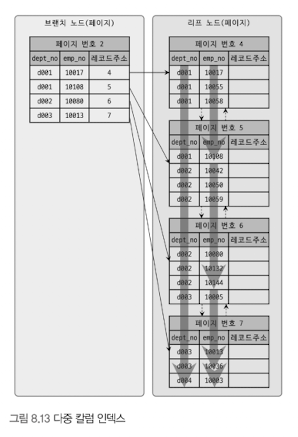
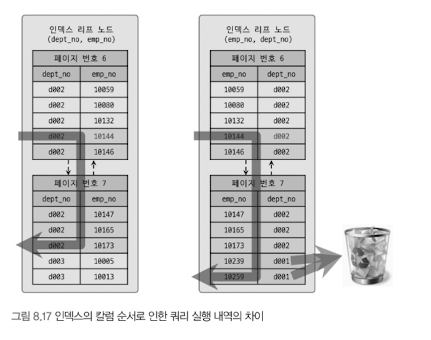
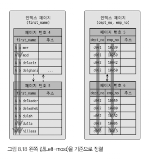
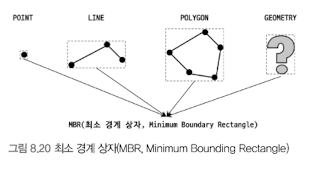

# 8.1 디스크 읽기 방식
## 8.1.1 하드 디스크 드라이브(HDD)와 솔리드 스테이트 드라이브(SSD)
- SSD의 장점은 기존 HDD보다 랜덤I/O가 훨씬 빠르다는 것이다.
- 일반적인 웹 서비스(OLTP) 환경에선 SSD가 HDD보다 훨씬 빠르다.

## 8.1.2 랜덤 I/O와 순차 I/O
- 순차 I/O는 3개의 페이지 (3 x 16KB)를 디스크에 기록하기 위해 1번의 시스템콜 요청
- 랜덤 I/O는 3개의 페이지를 디스크에 기록하기 위해 3번 시스템콜 요청
- 여러 번 쓰기 또는 읽기를 요청하는 랜덤 I/O 작업이 작업 부하가 훨씬 더 크다.
- 작은 데이터를 빈번히 읽고 쓰기 때문에 MySQL 서버에는 그룹 커밋이나 바이너리 로그 버퍼(또는, InnoDB 로그 버퍼) 등의 기능이 내장됨.
- SSD도 랜덤 I/O는 순차 I/O보다 전체 Throughput이 떨어짐.
- 즉, 일반적인 쿼리 튜닝은 랜덤 I/O 자체를 줄이는 것이 목적.

# 8.2 인덱스란?
- 칼럼의 값을 주어진 순서로 미리 정렬해서 보관하는 방법.
- 인덱스는 SortedList와 마찬가지고 저자오디는 칼럼의 값으로 정렬 상태를 유지한다.
- SortedList의 장점
  - 데이터 저장될 때마다 항상 정렬해야하므로 저장이 오래걸림
  - INSERT, UPDATE, DELETE 성능을 희생하고 읽기 속도를 높이는 기능

# 8.3 B-Tree 인덱스
- 가장 먼저 도입된 알고리즘, 가장 범용적인 목적으로 사용되는 인덱스 알고리즘

## 8.3.1 구조 및 특성


- 인덱스 키 값은 모두 정렬돼 있지만, 데이터 파일의 레코드는 정렬돼 있지 않고 임의의 순서로 저장됨.
- 만약 레코드 삭제되어 빈 공간 생기면, 그 다음 INSERT는 삭제된 공간을 재활용하도록 DBMS가 설계되어 있어 INSERT 순서가 보장되지 않음.


- InnoDB 스토리지 엔진을 사용하는 테이블에선 Primary Key가 ROWID의 역할을 함.
- 프라이머리 키를 주소처럼 사용하기 때문에 논리적인 주소를 가짐.
- 모든 세컨더리 인덱스 검색에서 데이터 레코드를 읽기 위해서 반드시 프라이머리 키를 저장하는 B-Tree를 다시 한번 더 검색함.

## 8.3.2 B-Tree 인덱스 키 추가 및 삭제
### 8.3.2.1 인덱스 키 추가
- 리프 노드가 꽉 차서 저장할 수 없으면, 리프 노드가 분리돼야 하는데, 이는 상위 브랜치 노드까지 처리 범위가 넓어짐.
- 따라서, 쓰기 작업(새로운 키 추가 작업)에 비용이 많이 듬.
- 비용 예측
  - 테이블 레코드 추가 작업 비용 = 1이라고 가정하면, 인덱스에 키 추가 작업 비용을 1.5로 예측할 수 있다.
  - 인덱스가 3개가 있다면, 인덱스가 하나도 없는 경우 작업 비용이 1이고, 3개인 경우에는 5.5 정도의 비용(1.5 * 3 + 1)정도가 예측됨.
  - 대부분 메모리와 CPU에서 처리하는 시간이 아니라 디스크로부터 인덱스 페이지를 읽고 쓰는데 걸리는 시간이다.
- 필요하면 인덱스 키 추가 작업을 지연시켜 나중에 처리할 수 잇음.
  - 하지만, 프라이머리 키나 유니크 인덱스는 중복 체크가 필요하므로 즉시 추가함.

### 8.3.2.2 인덱스 키 삭제
- 해당 키 값이 저장된 B-Tree의 리프 노드를 찾아서 삭제 마크만 하면 작업 완료.
- 디스크 쓰기가 필요하므로 이 작업 역시 디스크 I/O가 필요한 작업.

### 8.3.2.3 인덱스 키 변경
- 인덱스 키 값에 따라 저장될 리프 노드 위치가 결정됨.
  - 따라서, B-Tree의 키 값이 변경되는 경우에는 인덱스상의 키 값만 변경하는 것이 불가능
- 먼저 키 값 삭제 후, 새로운 키 값을 추가하는 형태로 처리.
- 테이블에 대한 이 작업 모두 체인지 버퍼로 지연 처리 가능.

### 8.3.2.4 인덱스 키 검색
- 인덱스 트리 탐색은 SELECT에서만 사용하는 것이 아니라 UPDATE, DELETE 처리를 위해서도 항상 레코드를 먼저 검색해야 함.
- 인덱스 키 값에 변형이 가해진 후 비교되는 경우, 절대 B-Tree의 빠른 검색 기능 사용 불가능
  - 이미 변형된 값은 B-Tree 인덱스에 존재하지 않기 때문이다.
- 레코드 잠금이나 넥스트 키락(갭락)이 검색을 수행한 인덱스를 잠근 후, 테이블의 레코드를 잠그는 방식으로 구현.
  - UPDATE, DELETE 문장이 실행될 때 테이블에 적절히 사용할 수 잇는 인덱스가 없으면, 전체 레코드를 잠가버림.

## 8.3.3 B-Tree 인덱스 사용에 영향을 미치는 요소
### 8.3.3.1 인덱스 키 값의 크기
- 디스크에 데이터를 저장하는 가장 기본 단위를 페이지 (또는 블록)이라고 함.
- 버퍼 풀에서 데이터를 버퍼링하는 기본 단위
- 인덱스는 페이지 단위로 관리됨.
- `innodb_page_size`로 4KB ~ 64KB러 페이지 크기 설정 가능
- 인덱스 키가 16byte라고 가정하면, 페이지 종류별로 대략 6바이트 ~ 12바이트까지 다양한 크기의 값을 가질 수 잇음.


- 인덱스 페이지(16KB)에 몇 개의 키를 저장할 수 잇을까?
  - 키 값 16바이트: 16*1024/(16+12) = 585개 저장 가능
  - 키 값 32바이트: 16*1024/(32+12) = 372개 저장 가능
- 레코드 500개를 읽어야 한다면 인덱스 페이지의 키 값 크기를 16바이트로 하는 것이 좋다.
- 후자는 최소 2번 이상 디스크로부터 읽어야 함.

- InnoDB 버퍼 풀의 크기는 제한적이므로, 하나의 레코드를 위한 인덱스 크기가 커지면 커질수록 메모리에 캐시할 수 있는 레코드 수가 즐어듬.

### 8.3.3.2 B-Tree 깊이.
- 상당히 중요하지만 직접 제어할 수 없는 방법.
- 깊이가 3인 경우, 최대 몇 개의 키 값을 저장할까?
  - 키 값이 16바이트: 최대 2억(585 * 585 * 585)
  - 키 값이 32바이트: 최대 5천만(372 * 372 * 372)
- 인덱스 키 값 크기가 커지면 커질수록, 하나의 인덱스 페이지에 담을 수 있는 인덱스 키 값 개수 적어짐.
  - 그 때문에 같은 레코드 건수라 하더라도 B-Tree 깊이가 깊어져서 디스크 읽기가 더 많이 필요하게 됨.

### 8.3.3.3 선택도(기수성)
- 선택도(Selectivity) 또는 기수성(Cardinality): 모든 인덱스 키 값 가운데 유니크한 값의 수
  - 중복 값이 많아질수록 기수성와 선택도 떨어짐.

### 8.3.3.4 읽어야 하는 레코드의 건수
- 테이블에 레코드가 100만 건이 저장돼 있는데, 그중 50만 건을 읽어야하는 쿼리가 있는 경우,
  - 옵티마이저에선 인덱스를 통해 1건을 읽는 것이 직접 레코드에서 읽는 것 보다 4~5배 비용이 더 많이 듬.
  - 인덱스를 통해 읽어야할 레코드 건수가 전체 테이블 레코드의 20~25% 넘으면 인덱스를 이용하지 않고, 직접 읽음.

## 8.3.4 B-Tree 인덱스를 통한 데이터 읽기
### 8.3.4.1 인덱스 레인지 스캔
- 가장 대표적인 접근 방식
- 검색해야할 인덱스의 범위가 결정됐을 때 사용하는 방식

```sql
SELECT * FROM employees WHERE first_name BETWEEN 'Ebbe' AND 'Gad';
```

- 루트 노드에서부터 비교를 시작해 최종적으로 리프 노드까지 찾아가서 레코드 시작 지점을 찾음
- 리프 노드의 레코드만 순서대로 읽으면 됨.


- 어떤 방식으로 스캔하든, 해당 인덱스를 구성하는 칼럼의 정순 또는 역순을 정렬된 상태로 레코드를 가져옴.
- 데이터 파일을 읽어올 때, 레코드 한 건 한건 단위로 랜덤 I/O가 일어남.
- 3건의 레코드가 검색 조건에 일치하면, 데이터 레코드를 읽기 위해 랜덤 I/O가 최대 3번 발생
- 따라서, 인덱스를 통해 데이터 레코드를 읽는 작업이 비용이 많이 듬.

1. **인덱스 탐색**: 인덱스에서 조건을 만족하는 값이 저장된 위치를 찾음
2. **인덱스 스캔**: 탐색된 위치부터 필요한 만큼 인덱스를 차례대로 읽음
3. **레코드 읽기**: 인덱스 키와 레코드 주소를 통해 레코드가 저장된 페이지를 가져엄

### 8.3.4.2 인덱스 풀 스캔
- 인덱스의 처음부터 끝까지 모두 읽는 방식
- 쿼리의 조건절에 사용된 칼럼이 인덱스의 첫 번째 칼럼이 아닌 경우 사용
- 쿼리가 인덱스에 명시된 칼럼만으로 조건을 처리할 경우 사용
- 데이터 레코드까지 모두 읽어야 한다면 이 방식으로 처리되지 않음.



- 인덱스 리프 노드의 제일 앞 또는 제일 뒤부터 링크드 리스트를 따라 풀스캔
- 인덱스 레인지 스캔보다 느리지만, 테이블 풀 스캔보다 효율적
- 테이블보다 작기 때문에 테이블 풀 스캔보다 적은 디스크I/O로 쿼리 처리

### 8.3.4.3 루스 인덱스 스캔


- 인덱스 레인지 스캔과 비슷하지만, 중간에 불필요한 인덱스 키 값은 무시.
- GROUP BY 나 집합 함수 가운데 MAX(), MIN() 함수에 대해 최적화할 때 사용.

### 8.3.4.4 인덱스 스킵 스캔
인덱스 값이 정렬돼 있어, 인덱스 구성하는 칼럼의 순서가 매우 중요.
```sql
ALTER TABLE employees
ADD INDEX ix_gender_birthdate (gender, birth_date);
```

```sql
# 인덱스를 사용하지 못하는 쿼리
SELECT * FROM employees WHERE birth_date>='1965-02-01';

# 인덱스를 사용할 수 있는 쿼리
SELECT * FROM employees WHERE gender='M' AND birth_date>='1965-02-01';
```
- ix_gender_birthdate에서 birth_date가 두번째로 위치하기 때문에 첫 번째 쿼리에선 인덱스를 탈 수 없음.
- 8.0부터 gender 칼럼 건너뛰고, birth_date 칼럼만으로 인덱스 검색 가능하게 해주는 `인덱스 스킵 스캔` 최적화 기능 도입됨


- gender가 M,F를 갖는 ENUM 타입이므로 아래 처럼 2개의 쿼리를 실행하는 것과 비슷하게 최적화 실행.
```sql
SELECT gender, birth_date FROM employees WHERE gender='M' AND birth_date>='1965-02-01';
SELECT gender, birth_date FROM employees WHERE gender='F' AND birth_date>='1965-02-01';
```

- 인덱스 스킵 스캔 사용시 단점
  - WHERE 조건절에 조건이 없는 인덱스의 선행 칼럼의 유니크한 값의 개수가 적어야 함.
  - 쿼리가 인덱스에 존재하는 칼럼만으로 처리 가능해야 함(커버링 인덱스)

## 8.3.5 다중 칼럼 인덱스

- 2개 이상의 칼럼을 포함하는 인덱스
- 인덱스의 두 번째 칼럼은 첫 번째 칼럼에 의존해서 정렬됨.
- 즉, 두 번째 칼럼의 정렬은 첫 번째 칼럼이 똑같은 레코드에서만 의미가 있음

## 8.3.6 B-Tree 인덱스의 정렬 및 스캔 방향
- 정렬 규칙에 따라 인덱스의 키 값은 항상 오름차순 또는 내림차순으로 정렬되어 저장됨.
- 어떤 인덱스가 오름차순으로 생성됐다고 해서 그 인덱스를 오름차순으로만 읽을 수 있다는 뜻은 아님.

### 8.3.6.1 인덱스의 정렬
- 인덱스 생성 시점에 인덱스를 구성하는 각 칼럼의 정렬을 오름차순 또는 내림차순으로 설정할 수 있다.

#### 8.3.6.1.1 인덱스 스캔 방향
- 인덱스는 항상 오름차순으로만 정렬돼 있지만, 최댓값부터 거꾸로 읽으면 내림차순으로 값 가져올 수 잇음.
  - 이를 옵티마이저가 알고 잇다.


#### 8.3.6.1.2 내림차순 인덱스
```sql
SELECT * FROM employees ORDER BY first_name ASC LIMIT 10;
SELECT * FROM employees ORDER BY first_name DESC LIMIT 10;

CREATE INDEX ix_firstname_asc ON employees (first_name ASC);
CREATE INDEX ix_firstname_asc ON employees (first_name DESC);
```


> 
> - 용어 정리
>   - 오른차순 인덱스: 작은 값의 인덱스 키가 B-Tree의 왼쪽으로 정렬된 인덱스
>   - 내림차순 인덱스: 큰 값의 인덱스 키가 B-Tree의 왼쪽으로 정렬된 인덱스
>   - 인덱스 정순 스캔: 인덱스 키의 크고 작음 관계없이 인덱스 리프 노드의 왼쪽 페이지부터 오른쪽으로 스캔
>   - 인덱스 역순 스캔: 인덱스 키의 크고 작은 관계없이 인덱스 리프 노드의 오른쪽 페이지부터 왼쪽으로 스캔

- 1천만 건의 데이터를 기준으로 정순, 역순 스캔하면서 마지막 레코드 1건만 봔환해보자.
```sql
SELECT * FROM t1 ORDER BY tid ASC LIMIT 12619775, 1;
# 1 row in set (4.15 sec)

SELECT * FROM t1 ORDER BY tid DESC LIMIT 12619775, 1;
# 1 row in set (5.35 sec)
```
- 역순 정렬 쿼리가 정순 정렬 쿼리보다 28.9% 더 시간이 걸림
- InnoDB 스토리지 엔진에서 정순 스캔과 연순 스캔은 페이지 간의 Double Linked List를 통해 Forward하냐 Backward하느냐의 차이만 있지만,
  - 실제 내부적으론 인덱스 역순 스캔이 인덱스 정순 스캔에 비해 느릴 수밖에 없음.

1. 페이지 잠금이 인덱스 정순 스캔에 적합한 구조
2. 페이지 내에서 인덱스 레코드가 단방향으로만 연결된 구조


<br/>

## 8.3.7 B-Tree 인덱스의 가용성과 효율성
### 8.3.7.1 비교 조건의 종류와 효율성
- 다중 칼럼 인덱스에서 각 칼럼 순서와 비교 조건에 따라 인덱스 칼럼 활용이 달라짐

```sql
SELECT * FROM dept_emp WHERE dept_no='d002' AND emp_no >= 10114;
```

- 케이스 A: INDEX(dept_no, emp_no)
- 케이스 B: INDEX(emp_no, dept_no)


- 케이스 A의 경우, dept_no로 조건을 5개로 필터링한 이후 emp_no로 비교한다.
- 케이스 B의 경우, 먼저 dept_no를 하지 않기 때문에 비교 과정이 7개로 많아진다.

### 8.3.7.2 인덱스의 가용성
- 케이스 A: INDEX (first_name)
- 케이스 B: INDEX (dept_no, emp_no)


- 하나의 칼럼으로 검색해도 값의 왼쪽 부분에 없으면 인덱스 레인지 스캔 불가능
- 다중 칼럼 인덱스에서 왼쪽 칼럼 값을 모르면 인덱스 레인지 스캔 불가능

```sql
SELECT * FROM employees WHERE first_name LIKE '%mer';
```
- first_name에 저장된 값을 왼쪽부터 비교하지만, %로 인해 비교가 불가능 -> 인덱스 레인지 스캔 불가

```sql
SELECT * FROM dept_emp WHERE emp_no>=10144;
```
- dept_no 조건 없이 emp_no 값만으로만 검색하면 인덱스 효율적 사용 불가능

<br/>

# 8.4 R-Tree 인덱스
- 2차원 데이터를 인덱싱하고 검색하는 목적의 인덱스
- GIS와 GPS 기반 서비스에서 주로 사용

## 8.4.1 구조 및 특성
- 여러 기하학적 도형 정보를 관리할 수 있는 데이터 타입 제공
- MBR(Minumum Bounding Rectangle)로 해당 도형을 감싸는 최소 크키의 사각형


## 8.4.2 R-Tree 인덱스의 용도
- WGS84(GPS) 기준의 위도, 경도 좌표 저장에 주로 사용
- 위도, 경도 좌표뿐 아니라 CAD/CAM 소프트웨어 또는 회로 디자인 등 좌표 시스템에 기반을 둔 정보에 대해서는 모두 적용

<br/>

# 8.5 전문 검색 인덱스
- B-Tree 인덱스는 실제 칼럼 값이 1MB이더라도 1MB 전체의 값을 인덱스 키로 사용하지 않고, 3072바이트까지만 잘라서 인덱스 키로 사용

# 8.10 클러스터링 인덱스


## 8.10.1 자식 테이블의 변경이 대기하는 경우


- 현재 자식 테이블의 외래 키를 확인화기 위해 부모 테이블에 접근해야 하는데, 현재 부모가 commit 되지 않아 대기 발생.

- 실제로 잠금 대기가 오래 되면 타임아웃으로 트랜잭션이 튕긴다.

## 8.10.2 부모 테이블의 변경 작업이 대기하는 경우


- 정의된 외래키의 특성(ON DELETE CASCADE) 때문에 부모 레코드가 삭제됨녀 자식 레코드도 동시에 삭제되는 식으로 작동.
- 따라서, tb_parent의 id=1인 레코드 삭제를 위해, 자식 테이블인 tb_child의 작업이 끝날 때까지 잠금 대기 발생.

