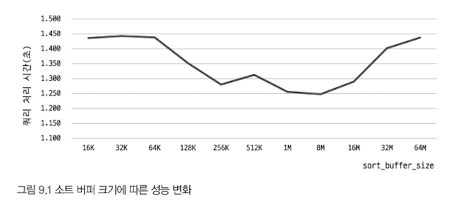
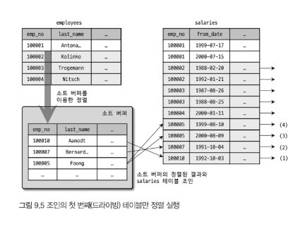
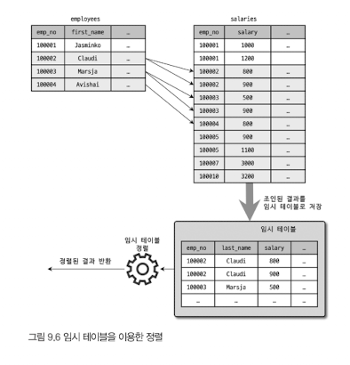

# 9.1 개요
## 9.1.1 쿼리 실행 절차
1. SQL을 Parse Tree로 분리
    - syntex 오류 발견
2. Parse Tree를 확인하면서 어떤 테이블과 어떤 인덱스를 읽을지 선택
    - 불필요한 조건 제거 및 복잡한 연산 단순화
    - 여러 테이블 조인이 있는 경우, 어떤 순서로 테이블을 읽을지 결정
    - 각 테이블에 사용된 조건과 인덱스 통계 정보를 이용해 사용할 인덱스 결정
    - 가져온 레코드들을 임시 테이블에 넣고 다시 한번 가공해야 하는지 결정
3. 수립된 실행 계획대로 스토리지 엔진에 레코드 읽어오도록 요청, MySQL 엔진에서 스토리지 엔진으로부터 받은 레코드를 조인하거나 정렬

- 1, 2 단계는 MySQL 엔진에서 처리, 3 단계는 MySQL 엔진과 스토리지 엔진이 동시에 참여 처리

## 9.1.2 옵티마이저의 종류
- **규칙 기반 최적화**
    - 옵티마이저에 내장된 우선순위에 따라 실행 계획을 수립
    - 통계정보(테이블 레코드 건수나 칼럼값 분포도)를 조사하지 않고 실행 계획 수립
    - 따라서, 사용자 데이터는 분포도가 다양하기에 거의 사용되지 않음
- **비용 기반 최적화**
  - 각 단위 작업 비용 정보와 대상 테이블의 예측된 통계 정보를 이용해 실행 계획별 비용 산출
  - 대부분의 DBMS에서 사용

# 9.2 기본 데이터 처리
## 9.2.1 풀 테이블 스캔과 풀 인덱스 스캔
- 풀 테이블 스캔
  - 인덱스를 사용하지 않고 테이블의 데이터를 처음부터 끝까지 읽어서 요청된 작업을 처리
  - 조건
    - 테이블 레코드 건수가 너무 작아서 인덱스가 느릴 경우
    - WHERE 절이나 ON 절에 인덱스를 이용할 수 잇는 적절한 조건이 없는 경우
    - 인덱스 레인지 스캔을 사용할 수 잇는 쿼리라고 하더라도, 옵티마지어가 판단한 조건 일치 레코드 건수가 너무 많은 경우
  - 대부분 DBMS는 풀 테이블 스캔 시, 한꺼번에 여러 개의 블록이나 페이지 읽어오는 기능 내장
    - Read ahead: 어떤 영역의 데이터가 앞으로 필요해지리라는 것을 예측해서 요청이 오기 전에 미리 디스크에서 읽어 InnoDB 버퍼 풀에 가져다 두는 것
    - Foreground 스레드가 페이지 읽기 실행하지만, 특정 시점부터는 읽기 작업을 Background 스레드에 넘김
      - 넘겨받음 Background 스레드는 한 번에 4개 또는 8개씩 페이지를 읽으면서 계속 수를 늘림
      - 최대 64개 페이지까지 읽어서 버퍼 풀에 저장함
    ```sql
    SELECT COUNT(*) FROM employees;
    ```
    - 위 쿼리처럼 단순히 레코드 건수만 필요로 하는 쿼리는 용량이 작은 인덱스를 선택하여 작동

## 9.2.2 병렬 처리
- `innodb_parallel_read_threads` 시스템 변수로 하나의 쿼리를 최대 몇 개의 스레드로  처할지 변경
```sql
SET SESSION innodb_parallel_read_thread=2;
```

## 9.2.3 ORDER BY 처리(Using filesort)
- 정렬 처리 방법


- 인덱스를 이용하도록 튜닝이 불가능한 경우
  - 정렬 기준이 너무 많아서 요건별로 모두 인덱스 생성이 불가능한 경우
  - GROUP BY 결과 또는 DISTNCT 같은 처리의 결과를 정렬해야 하는 경우
  - UNION의 결과와 같이 임시 테이블의 결과를 다시 정렬하는 경우
  - 랜덤하게 결과 레코드를 가져와야 하는 경우

### 9.2.3.1 소트 버퍼
- 별도 메모리 공간(소트버퍼)을 할당 받아 정렬 하는 방식
- `sort_buffer_size` 라는 시스템 변수로 촤대 공간 설정
- 단점
  - 정렬할 레코드 건수가 소트 버퍼 할당 크기보다 큰 경우, 여러 조각으로 나눠서 처리하는데, 이 과정에서 임시 저장을 위해 디스크를 사용
  - 이를 `멀티 머지`라고 부른다.


- 너무 큰 sort_buffer_size는 성능이 떨어뜨림
- 보통 56KB ~ 1MB 미만으로 설정
- 소트 버퍼는 세션 메모리 영역에 할당 -> 여러 클라이언트가 공유하지 않아 정렬 작업 많으면 메모리 공간이 커짐

### 9.2.3.2 정렬 알고리즘
- 정렬 기준 칼럼만 소트 버퍼에 담을지에 따라 `싱글 패스`, `투 패스`로 정렬 모드 나뉨

#### 9.2.3.2.1 싱글 패스 정렬 방식
```sql
SELECT emp_no, first_name, last_name
FROM employees
ORDER BY first_name;
```


- 처음 테이블을 읽을 때 정렬에 필요없는 last_name 칼럼까지 가져와 소트 버퍼에 담고 정렬

#### 9.2.3.2.2 투 패스 정렬 방식
- 정렬 대상 칼럼과 PK 값만 소트 버퍼에 담아서 정렬
- 정렬된 순서대로 다시 PK로 테이블을 읽어 SELECT할 칼럼을 가져옴


- 최신 버전에선 싱글 패스 정렬 바식을 주로 사용
- 싱글 패스 방식은 정렬 대상 레코드의 크기나 건수가 작은 경우 빠름
- 투 패스 방식은 정렬 대상 레코드의 크기나 건수가 많은 경우 효율적

### 9.2.3.3 정렬 처리 방법


#### 9.2.3.3.1 인덱스를 이용한 정렬
- 조건
  - 반드시 ORDER BY에 명시된 칼럼이 드라이빙 테이블에 속하고,
  - ORDER BY의 순서대로 생성된 인덱스가 있어야 함
- 인덱스로 이미 정렬이 돼있어 그냥 순서대로 읽기만 하면 됨

#### 9.2.3.3.2 조인의 드라이빙 테이블만 정렬
- 조인을 실행하기 전, 첫번째 테이블의 레코드를 먼저 정렬한 다음 조인을 실행하는 것
- 드라이빙 테이블의 칼럼만으로 ORDER BY 절을 작성해야 한다

```sql
SELECT *
FROM employees e, salaries s
WHERE s.emp_no=e.emp_no
  AND e.emp_no BETWEEN 100002 AND 100010
ORDER BY e.last_name;
```
- 만족한 조건
  - WHERE 절의 검색 조건은 테이블의 PK를 이용한다
  - 드리븐 테이블의 조인 칼럼인 emp_no 칼럼에 인덱스가 있다


1. 인덱스로 "emp_no BETWEEN 100002 AND 100010" 조건을 만족하는 9건을 검색
2. 검색 결과를 last_name 칼럼으로 정렬 수행(Filesort)
3. 정렬된 결과를 순서대로 읽으면서 salaries 테이블과 조인을 수행해 86건의 최종 결과를 가져옴

#### 9.2.3.3.3 임시 테이블을 이용한 정렬
- 2개 이상의 테이블을 조인해서 그 결과를 정렬해야 할 경우, 임시 테이블 필요
- 정렬해야할 레코드 건수가 가장 많아 가장 느림



#### 9.2.3.3.4 정렬 처리 방법의 성능 비교
- ORDER BY나 GROUP BY 같은 작업은 WHERE 조건을 만족하는 레코드를 LIMIT 건수만큼 가져와서 처리할 수 없다.
- 모든 레코드를 가져와서 그루핑 작업을 해야 비로소 LIMIT로 건수를 제한할 수 있기 때문

인덱스를 사용하지 못하는 정렬이나 그루핑 작업이 왜 느리게 작동하는지 알아보자
- 쿼리가 처리되는 방법
  - 스트리밍 처리
  - 버퍼링 처리

##### 9.2.3.3.4.1 스트리밍 방식
- 클라이언트는 MySQL 서버가 일치하는 레코드를 찾는 즉시 전달 받아 동시에 가공 작업 시작 가능
- 웹 서비스 같은 OLTP 환경에서 빠른 응답 시간이 중요
- LIMIT같은 건수 제한하는 조건들은 쿼리의 전체 실행 시간을 상당히 줄여줄 수 있다.

##### 9.2.3.3.4.2 버퍼링 방식
- ORDER BY나 GROUP BY 같은 처리는 쿼리의 결과가 스트리밍되는 것이 불가능
  - WHERE 조건에 일치하는 모든 레코드 패치 -> 정렬하거나 그루핑해서 차례대로 보내야 함
- 즉, MySQL에서 그루핑이나 정렬을 버퍼링 한 후 일괄 처리

- 인덱스 사용한 정렬 방식만 스트링 형태로 처리
- 나머지는 버퍼링된 후에 정렬

```sql
SELECT *
FROM tb_test1 t1, tb_test2 t2
WHERE t1.col1=t2.col1
ORDER BY t1.col2
LIMIT 10;
```

**[tb_test1이 드라이빙되는 경우]**
| 정렬 방법 | 읽어야 할 건수 | 조인 횟수 | 정렬해야 할 대상 건수 |
|:-------:|------------|---------|------------------|
| 인덱스 사용 | tb_test1: 1건 <br/> tb_test2: 10건 | 1번 | 0건 |
| 조인의 드라이빙 테이블만 정렬 | tb_test1: 100건 <br/> tb_test2: 10건 | 1번 | 100건 (tb_test1 테이블 레코드 건수만큼 정렬 필요) |
| 임시 테이블 사용 후 정렬 | tb_test1: 100건 <br/> tb_test2: 1000건 | 100건(tb_test1 테이블의 레코드 건수만큼 조인 발생) | 1,000건 (조인된 결과 레코드 건수를 전부 정렬해야 함) |

**[tb_test2이 드라이빙되는 경우]**
| 정렬 방법 | 읽어야 할 건수 | 조인 횟수 | 정렬해야 할 대상 건수 |
|:-------:|------------|---------|------------------|
| 인덱스 사용 | tb_test2: 10건 <br/> tb_test1: 10건 | 10번 | 0건 |
| 조인의 드라이빙 테이블만 정렬 | tb_test2: 1000건 <br/> tb_test1: 10건 | 10번 | 1000건 (tb_test2 테이블 레코드 건수만큼 정렬 필요) |
| 임시 테이블 사용 후 정렬 | tb_test2: 1000건 <br/> tb_test1: 100건 | 1000건(tb_test2 테이블의 레코드 건수만큼 조인 발생) | 1000건 (조인된 결과 레코드 건수를 전부 정렬해야 함) |

### 9.2.3.4 정렬 관련 상태 변수
- 주요 작업에 대해서 해당 작업의 실행 횟수를 상태 변수로 저장
- 지금까지 몇 건의 레코드나 정렬 처리를 수행했는지, 소트 버퍼 간의 병합 작업은 몇 번 발생했는지 등

```sql
FLUSH STATUS;
SHOW STATUS LIKE 'Sort%';
+-------------------+--------+
| Variable_name     | Value  |
+-------------------+--------+
| Sort_merge_passes | 13     |
| Sort_range        | 0      |
| Sort_rows         | 300024 |
| Sort_scan         | 1      |
+-------------------+--------+
```

## 9.2.4 GROUP BY 처리
- 인덱스를 이용할 때
  - 타이트 인덱스 스캔
  - 루스 인덱스 스캔

### 9.2.4.1 인덱스 스캔을 이용하는 GROUP BY (타이트 인덱스 스캔)
- 그룹 함수 등의 그룹값을 처리해야 해서 임시 테이블이 필요할 수도 있음
- 인덱스가 이미 정렬되어 있어 별도의 정렬 작업이나 내부 임시 테이블 필요 없음

### 9.2.4.2 루스 인덱스 스캔을 이용하는 GROPU BY
```sql
EXPLAIN
  SELECT emp_no
  FROM salaries
  WHERE from_date='1985-03-01'
  GROUP BY emp_no;
```
1. (emp_no, from_date) 인덱스를 차례대로 스캔하면서 emp_no의 첫 번째 유일한 값 '10001'을 찾아냄
2. (emp_no, from_date) 인덱스에서 emp_no가 '10001' 인 것 중 from_date가 '1985-03-01' 인 레코드만 가져옴.
3. (emp_no, from_date) 인덱스에서 emp_no의 그 다음 유니크한 값을 가져옴
4. 3번 단계에서 결과가 더 없으면 처리 종료하고, 겨로가가 있다면 2번 과정으로 돌아가 반복 수행

- Prefix Index는 루스 인덱스 스캔 사용이 불가능
- 인덱스 레인지 스캔: 유니크한 값이 많을수록 성능 향상
- 루스 인덱스 스캔: 유니크한 값이 적을수록 성능 향상

**[루스 인덱스 스캔이 사용 불가능한 패턴]**
```sql
-- // 집합 함수 사용
SELECT col1, SUM(col2) FROM tb_test GROUP BY col1;

-- // GROUP BY에 사용된 칼럼이 인덱스 구성 칼럼의 왼쪽부터 일치하지 않기 때문
SELECT col1, col2 FROM tb_test GROUP BY col2, col3;

-- // SELECT 절으 ㅣ칼럼이 GROUP BY와 일치하지 않기 때문
SELECt col1, col3 FROM tb_test GROUP BY col1, col2;
```

### 9.2.4.3 임시 테이블을 사용하는 GROUP BY
```sql
EXPLAIN
  SELECT e.last_name, AVG(s.salary)
  FROM employees e, salaries s
  WHERE s.emp_no=e.emp_no
  GROUP BY e.last_name;
```
- 인덱스를 사용할 수 없어 임시 테이블 방식을 사용
- GROUP BY 절의 칼럼들로 구성된 유니크 인덱스를 가진 임시 테이블 생성

## 9.2.5 DISTINCT 처리
- MIN(), MAX() 또는 COUNT() 같은 집합 함수와 함께 사용하는 경우, 집합 함수가 없는 경우에 따라 영향 범위가 달라짐

### 9.2.5.1 SELECT DISTINCT
- GROUP BY와 동일한 방식으로 처리
- DISTINCT는 모든 SELECT 칼럼에 대해서 적용됨
  ```sql
  SELECT DISTINCT first_name, last_name FROM employees;
  SELECT DISTINCT (first_name), last_name FROM employees;

  -- // 모두 똑같이 작동
  ```


### 9.2.5.1 집합 함수와 함께 사용된 DISTINCT
- 집합 함수의 인자로 전달된 칼럼값이 유니크한 것들을 가져옴
```sql
SELECT COUNT(DISTINCT s.salary)
FROM employees e, salaries s
WHERE e.emp_no = s.emp_no
AND e.emp_no BETWEEN 100001 AND 100100;
```
- employess과 salaries를 조인한 결과에서 salary 칼럼의 값만 저장하기 위한 임시 테이블을 만들어서 사용
- 만약 COUNT(DISTINCT e.last_name)이 추가되면 salary만 저장하는 임시 테이블 + last_name만 저장하는 임시 테이블 총 2개가 사용됨

## 9.2.6 내부 임시 테이블 활용
- 사용자가 생성한 임시 테이블(CREATE TEMPORARY TABLE)와 달리 내부적인 임시 테이블은 쿼리 처리 완료 시 자동삭제

### 9.2.6.1 메모리 임시 테이블과 디스크 임시 테이블
- 메모리에 저장되는 임시 테이블: TempTable 스토리지 엔진
- 디스크에 저장되는 임시 테이블: InnoDB 스토리지 엔진
- 메모리의 TempTable 크기가 커지면 MMAP 파일로 전환
  - 디스크 테이블로 전환하는 것보다 오버헤드 적음

# 9.3 고급 최적화
## 9.3.1 옵티마이저 스위치 옵션
