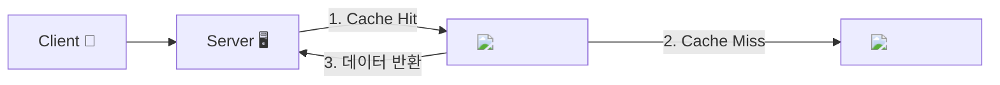
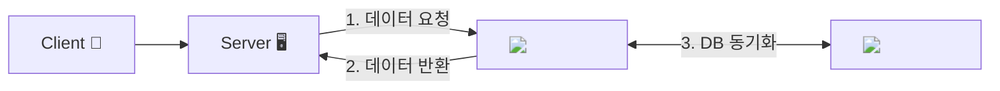
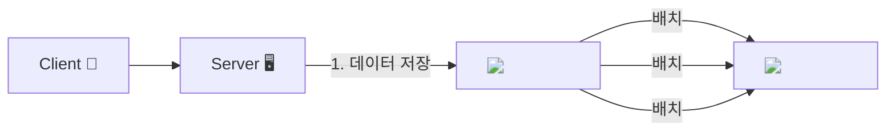
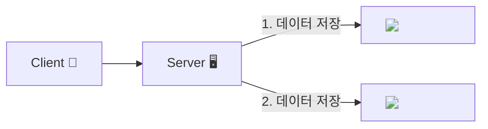
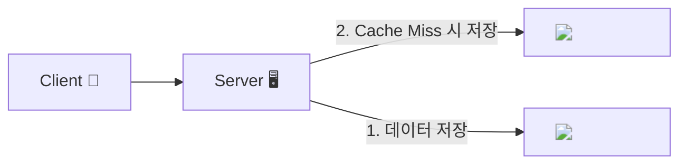

# 개요
캐싱전략은 DB와의 데이터 정합성을 해결하기 위함이다.
크게 전략은 `캐시 읽기 전략`과 `캐시 쓰기 전략`으로 나뉜다.

# 캐시 읽기 전략
## Look Aside 패턴

- = Cache Aside 패턴
- 데이터를 찾을때 캐시에 있는지 먼저 확인. 캐시에 없으면 DB 조회.
- 반복적인 읽기가 많은 호출에 적합
- 원하는 데이터만 별도로 캐시에 저장하여 구성
- 캐시와 DB가 분리되어 있어 캐시 장애 대비 구성.
  - 예를 들어 Redis가 다운되더라도 DB에서 데이터 가져올 수 있기에 서비스 문제 없음
- 캐시에 붙어있던 connection이 많은 상태에서 redis가 멈추면 DB 과부하 발생

> [Cache Warming]
> 미리 캐시에 데이터를 넣어두는 작업.
> 이 작업을 하지 않으면, 캐시 미스 시 DB 부하가 발생한다.
> Redis는 인메모리이기에 TTL을 잘 조정해야 함.

## Read Through 패턴

- 캐시에서만 데이터를 읽어오는 전략
- 데이터 동기화를 라이브러리 또는 캐시 제공자에게 위임
- 데이터 조회에서 전체 속도가 느림
- Redis 다운되면 서비스 불가능
  - 이를 대비하여 `Replication` 또는 `Cluster`로 구성하여 가용성 높임
- 캐시와 DB 간 데이터 동기화

# 캐시 쓰기 전략
## Write Back 패턴

- 캐시와 DB 동기화를 비동기함
- **캐시에 데이터를 모아 배치 저장**
  - 쓰기 쿼리 회수 비용과 부하를 줄일 수 잇음
- Write가 빈번하면서 Read 시 많은 리소스 소모되는 서비스에 적합
- 데이터 정합성 확보
- 자주 사용되지 않는 불필요한 리소스 저장
- 캐시에서 오류가 발생하면 데이터 영구 손실

## Write Through 패턴

- DB와 캐시에 동시에 데이터 저장
- 데이터 저장 시, 캐시에 먼저 저장후 DB에 바로 저장
- DB 동기화 작업을 캐시에게 위임
- DB와 캐시가 항상 동기화되어 항상 최신 상태 유지 -> 데이터 일관성 유지
- 데이터 유실이 없어야 하는 상황에 적합
- 자주 사용하지 않는 불필요한 리소스 저장
- 매 요청마다 두번의 Write 발생 -> **생성, 수정이 많으면 성능 이슈**

## Write Around 패턴

- 모든 데이터는 DB에 저장
- Cache miss 발생 시, 캐시에도 데이터 저장
- 캐시와 DB 간 데이터 불일치 발생 가능
- Write Through보다 훨씬 빠름

# 캐시 저장 방식 지침
- 자주 사용되면서 자주 변경되지 않는 데이터 사용 시 유리
- 캐시는 휘발성이므로 중요한 정보나 민감한 정보 등은 저장하지 않아야 함
- 장애 발생 시 대응방안도 마련해야 함

# 캐시 제거 방식 지침
- 캐시 구성 시 기본 만료 정책을 설정해야 함
- TTL이 너무 짧으면 캐시 사용 이점이 없음
- 반대로 TTL이 너무 길면 메모리 부족 현상 발생 가능

## Cache Stampede 현상
- 대규모 트래픽 환경에서 TTL이 너무 작으면 발생
- 자주 조회되는 키가 만료되는 그 순간 DB로 가서 찾는 duplicate read 발생

# 캐시 공유 방식 지침
- 여러 인스턴스에서 캐시를 공유
- 그에 따라 여러 트랜잭션에 의해 데이터 정합성 문제가 발생할 수 있음.
- 따라서, 데이터 충돌을 위해 아래 같은 애플리케이션 개발 방식을 취함.

1. 데이터 변경 전, 데이터가 검색된 이후 변경되지 않았는지 일일히 확인
2. Lock을 이용하여 데이터 업데이트

# 캐시 가용성 지침
- 캐시는 빠른 성능 확보와 데이터 전달을 위해 사용해야 함.
- 데이터 영속성을 보장하지 않음