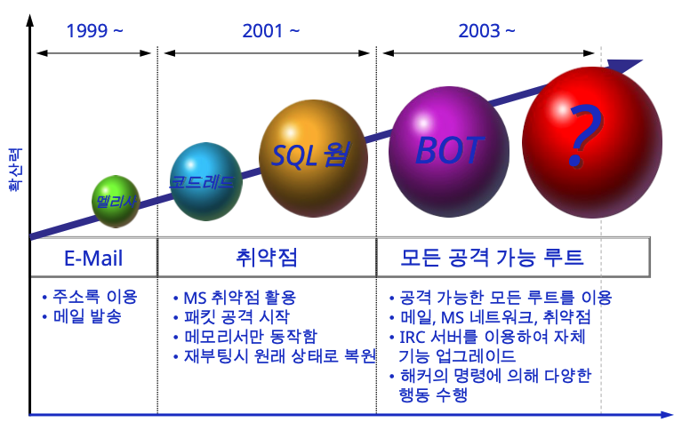

# 1주차
## 1. 정보보호 개론 소개
- 보안 : 자산의 본래 가치가 손상되지 않도록 내, 외부의 각종 위협으로부터 자산을 적절한 방법으로 보호하는 것
- 정보보호 : 의도적, 비의도적이든 변조, 파괴, 서비스 지체, 불법적 노출로부터 정보 보호

### 보안의 3대요소 (CIA)
1. `가용성`: 정보 자산에 대해 적절한 시간에 접근 가능
    - 예) DDoS로 서비스 이용 불가

2. `기밀성`: 인가된 사용자만 정보 자산에 접근
    - 예) 경쟁 업체에서 상대 업체 기술 훔침
    - 도청, 도난
    - 보안 시스템이 기밀성과 관련

3. `무결성`: 적절한 권한을 가진 사용자에 의해 인가된 방법으로만 정보 변경
    - 예) 은행 잔고를 누군가 변경
    - 일상생활에서도 중요

- CIA + 인증 : 데이터나 서비스 이용을 위해 신분과 행위를 식별
    - 기기 - 신분증, OTP
    - 지식 - 아이디, 패스워드
    - 생체 - 지문, 망막

- CIA + 책임추적성 : 모든 행위의 기록과 추적 제공
    - 문제: 증거를 남기지 않음
- CIA + 접근제어 : 데이터나 서비스 이용에 대한 허가 또는 거부 기능
    - 문제: 비문으로 분류 안 한 경우

## 2. 보안 위협의 유형
- 보안 위협: 발생 시 자산에 손상을 발생시킬 수 있는 잠재적 가능성 가지는 사건이나 행동
- 보안 취약점: 위협에 사용되어질 자산 내의 약점
- 정장적인 정보의 통신과정
    1. 정보 전송 요청
    2. 정보 전송 수락
    3. 정보 전송

### 정보 위헙 요소
1. `가로막기` : 출발지로부터 정보가 특정 이유로 분실되거나 목적지 도착 못함
2. `가로채기` : 제 3자가 정간에 가로채 기밀성 침해
3. `정보수정` : 정보를 변조후 전송하여 일관성 침해
4. `정보위조` : 미허가 사용자가 잘못된 정보 전송 및 시스템에 위조 정보 전송

## 3. 정보보호 조금 더 알아보기
### 보안 분야
- 시스템 보안 : 계정관리, 권한관리
- 네트워크 보안 : 분산공격, 세션 하이제킹, 디도스
- 물리적 보안 : 시설관리, CCTV
- 모바일 보안 : 버퍼오버플로우, 악성앱

## 공격 당하는 이유
1. 복잡한 시스템 : 모든 시스템 복잡 -> 버그 내제
2. 공격자 : 다양한 목적의 공격자
3. 인적요인 : 보안성보다 성능을 선택
4. 투자 : 보안의 우선순위가 낮음 -> 선점효과(조기 소프트웨어 배포)

 

# 2주차
## 2-1. 소프트웨어 버그
- 소프트웨어 : 컴퓨터 프로그램 및 그와 관련된 문서
- 응용 소프트웨어 : 특정 응용 분야에서 사용
    - 예) 워드, 엑셀
- 시스템 소프트웨어 : 응용 소프트웨어를 지원하는 소프트웨어
    - 예) OS

### 10대 소프트웨어 버그
1. 소련 조기 경보 시스템 오류 (1983)
    - 햇볕을 미사일로 오인
2. AT&T 전화망 마비 (1990)
    - 코드 한 줄이 버그 발생
3. 아리안5 폭발 (1996)
    - 64비트 숫자를 16비트 공간 할당 (오버플로우)
4. 에어버스 A380 지연 (2006)
    - 소프트웨어 호환 문제
5. 화성 기후 탐사선 미터법 문제 (1998)
6. EDS 컴퓨터 시스템 지급 문제
7. 밀레니엄 버그
8. 랩탑 폭발 사고
9. 지멘스 여권 시스템 문제
10. LA 공항 이륙 불가 사건

## 2-2. 소프트웨어 보안
- 보안과 기능및 편리성과의 이율배반적 관계
### 보안 위협
- 정보누출
- 정보 변조
- 디도스 공격
- 스푸핑
- 불법 접근

### 보안 위렵과 기술
보안 `대책`이 새로운 `취약점` 발생하기도 함
- 브루트포스에 대비해 로그인 실패를 세번으로 하면?
    -> DoS 공격 가능

## 2-3. 악성코드
- 바이러스, 웜, 트로이목마 등 기기를 감염하고 통제하기 위한 해커 프로그램
### 악성코드 역사

### 악성코드 개발자와 이유
- 이유: 정보 취득, 스팸발송, 디도스 등
- 개발자 : 개인, 범죄조직, 정보기관 등

### 대응 방안
- 신뢰 기업 백신 사용
- 보안패치
- 사회공학 접근 대비
- 공부폴더 사용 제한(읽기 전용)
- 비밀번호 주기적 변경

 

# 3주차
## 3-1. 네트워크 개념 소개
- 둘 이상의 컴퓨터 집합
### 4단계 기본 동작
1. request
2. indicate
3. response
4. confirm

### 네트워크 주소
- MAC 주소
    - 물리적 주소
    - 데이터링크 레이어의 주소
    - 48비트 16진수
        - 앞 6개: 네트워크 카드 회사
        - 뒤 6개: 시리얼

## 3-2. 인터넷과 우리의 일상
### 인터넷 연결 필요한 정보
1. IP 주소
2. 첫번째 홉 라우터 주소
3. DHCP의 DNS 주소

### 정보 얻는 과정
- 클라이언트가 DHCP로부터 정보얻기 위해 request를 브로드캐스트함

### URL 접속 과정
1. 브라우저에 URL 입력
2. 클라이언트에서 구글 DNS에 IP 주소 받음
    - 라우터 보내기 위해 MAC 주소 필요
    - ARP를 통해 MAC 주소 받음
    - 첫번째 홉 라우터의 맥 주소를 통해 DNS 쿼리(프레임)을 전송
3. TCP 3-way-handshake
4. TCP 소켓을 통해 클라-서버 간 요청 및 응답

## 3-3. 인터넷 주소 추적해보기
- IPConfig : 시스템 정보 조회
    - IP주소, 서브넷마스크, 기본 게이트웨이
- Ping : 시스템이 네트워크에 연결됐는지 확인
- Traacert : 호스트와 목저지 사이의 모든 hop 조회
    - 라우팅 경로를 확인

# 4주차
## 4-1. 네트워크를 활용한 다양한 보안 문제점들 이해하기
1. Address 스푸핑 : 속이기
    - ARP 스푸핑 : A가 마치 B인것 처럼 S에게 보임
    - 소스 라우팅 공격 : C가 마치 B인것처럼 S에게 보임

2. IP 단편화 공격 : 수신 쪽에서 단편들이 모두 올때까지 관리
3. 트래픽 증폭 공격 : IP에서는 브로드캐스팅 허용

### TCP 계층에서의 공격
1. TCP SYN Flooding
    - SYN 보내고 ACK에 응답하지 않음 -> 큐가 차게 되어 처리불가

### 어플리케이션 계층 공격
- Mail Bomb : 메일 서버 용량 가득 채우기 (DoS)

## 4-2. 네트워크 보안
### 방화벽
- 신뢰되지 않는 외부 네트워크, 내부 네트워크 사이 패킷의 규칙에 따라 차단
- 접근제어, 로깅 및 추적, 인증, 데이터 암호화

### 스크리닝 라우터
- Transport와 Network 에서 실행
- IP와 포트 접근 제어
- 외부와 내부 경계선
- `패킷 필터링`으로 방화벽 역할
    - 합법적인 트래픽도 공격에 활용 가능

### Instrusion Detection System
- 방화벽의 검증 과정이 트래픽 공격에 사용되는 것을 방지
- 데이터와 호스트 행동 모니터링 및 공격 감지

1. 시그니처 기반 : 알려진 공격 패턴과 매칭
2. 변칙 기반 : 통계 또는 머신러닝으로 규정
3. 네트워크 기반 : 가고오디지 않은 패킷 분석
4. 호스트 기반 : 단일 호스트 위에서 로그 분석

## 4-3. 네트워크 보안 문제점 분석
- 풋 프인팅 : 공격 대상 정보 수집
- 스캔 : 공격 서버 작동 여부와 서비스 확인
    - 방화벽과 IDS 우회
- Ping 과 ICMP 스캔 : 시스템 정상여부 확인
- TCP Open 스캔 : 가장 기본인 Port 열린 여부 확인
    - SYN 전송 -> 열렸으면 SYN+ACK | 닫혔으면 RST+ACK
- 스텔스 스캔: 스캔 시 자신의 위치 숨김
    - TCP Half Open 스캔 : 열린 경우 RST 즉시 보냄
- UDP 스캔 : 포트가 닫힌 경우 ICMP Unreachable 패킷 보냄
    - 열린 경우 응답 없음
    - 신뢰하기 어려움

 

# 5주차
## 5-1. 암호와 정보보호
- 암호: 상대방이 쉽게 읽을 수 없어 마구 섞음
    - 퍼즐에서 가장 중요한 부분
- 암호화 : 메시지 존재 숨기는 것이 아닌 메시지 의미 감추기
    - 상호 합의된 알고리즘 사용
    - 기밀성 보장
- 복호화 : 평문으로 바꾸기

### 종류
- Shift 암호 : 몇 글자 뒤에 꺼로 변경
    - 예) A DOG -> B EPH
    - 관사에 의해 쉽게 파악 가능

## 5-2. 대칭 및 비대칭 암호
### 대칭키
- 대칭 암호 : 암호화, 복호화 모두 사용되는 키
- 강한 알고리즘 가져야 함
- 문제: 대칭키를 어떻게 전송할 것인가?

### 공개키(비대칭 키)
- 비대칭 암호 : 암호화 복호화 키 다름

- 무료로 배포 - 누구나 공개 키로 암호화하여 발송 가능 (RSA)
- 개인 키로만 메시지 복호화 가능

### 전자 서명
- 문서에 사인을 컴퓨터 기술로 구현
- 발신인 신원 보증 : 부인 방지
- 전자서명 변경을 막는 것이 아니라 문서의 변경 행위 여부를 검출

- 개인 키로 암호화 : 서명 작성
- 공개키로 복호화 : 서명 검증

### 해싱
- 다양한 길이의 메시지를 고정길이의 해쉬 값, 메시지로 변환
- 크립토그래피 알고리즘 (역해싱 불가능)

## 5-3. 암호화를 활용한 이메일 보내기
- PGP: 인터넷 전자우편을 암호화하고 복호화하는 프로그램

 

# 6주차
## 6-1. 컴퓨터 바이러스
사용자 컴퓨터에서 사용자 몰래 프로그램 변형해 자신을 복사하는 프로그램
1980 : 최초의 악성코드
2000 : 악성 코드의 주류

### 특징
1. 자기복제
2. 빠른 확산
3. 트래픽 부하 증가

### 분류
- 원시형 : 자기 복제, 파괴 기능
- 매크로 : 스크립트 실행 환경에서 전파
- 암호형 : 파악 힘들도록 암호화 됨
- 은폐형 : 안티 바이러스로 부터 은폐
- 다형성 : 진단을 우회
- 차세대

### 확산
- 네트워크
- 이메일
- 웹사이트

### 탐지 및 제거
- 바이러스 시그니처 스캔

## 6-2 웜
- 다른 파일 감염 없이 스스로 증식
### 특징
- 소프트웨어 취약점
- 네트워크 사용
- 공유 장치로 퍼져 나감
- 스크립트, 메크로에서 확산

## 6-3 트로이목마
- 전문가가 의도적으로 제작
- 설치 과정에 바이러스, 웜에 의한 것이 많음
- 의도하지 않은 코드를 정상 프로그램에 삽입
- 자기 스스로 복제하지 않음

### 백도어
정상적인 인증 과정 거치지 않는 공격

 

# 7주차
## 7-1. 디지털 포렌식
- 포렌식 : 범죄에 관한 과학 수사
- 디지털 포렌식 : 전자 증거물을 사법기관에 제출하기 위해 데이터 수집, 분석 ,보고서 작성 과정

### 특징
1. 비가시성
2. 변조 가능성
3. 복제 용이성
4. 대규모성
5. 휘발성
6. 초국경성

### 증거능력 요건
1. 진정성
2. 무결성
3. 원본성
4. 신뢰성

## 7-2. 디지털 포렌식 기술
### 타임라인 분석
- 파일의 FAT와 NTFS의 일치 여부 분석
- 멀웨어의 시간 처리, 공격자의 타임라인 숨기기 힘듬
- 여러 시스템에서 시간 정보 가짐
- 전체적인 흐름 파악

### 데이터 복구

## 7-3. 디지털 포렌식 증거
### 절차
1. 조사 준비
2. 현장 대응
3. 증거 확보 및 수집
4. 운반 및 확인
5. 조사 및 분석
6. 보고 및 증언

### 증거 인정
1. 동일성
2. 무결성
3. 신뢰성

### 무결성 입증방법
- 해쉬 알고리즘

 

# 9주차
## TCP 세션 하이재킹
- 세션: 망 환경에서 사용자간 또는 컴퓨터 간의 대화를 위한 논리적 연결
- 세션 하이재킹 : 세션을 가로챔

### 시퀀스 넘버에 따른 TCP 연결 상태
- 동기화 상태 : 정상
- 비동기화 상태 : 하이재킹을 당해 비동기화 상태가 됨

- 비동기화 만드는 방법
    - 서버에서 초기 설정 단계의 접속을 끊고 다른 시퀀스 넘버로 새로운 접속 생성
    - 대량의 널 데이터 전송

### 하이재킹 과정
1. 클라와 서버 모두 Established
2. 세션이 완전히 끊어지지 않는 시퀀스 넘버에서 RST 전송. 서버는 잠시 Closed됨
3. 공격자는 새로운 Request 전송

## ARP 스푸핑
- 송신자와 수신자에게 공격자의 MAC주소라고 속이고, 공격자에게 온 데이터를 수신자에게 그대로 전송

### 증상
1. 네트워크 속도 저하
2. 악성코드 삽입 가능
3. 장기적인 ARP 패킷 다량 수신

## IP 스푸핑
- 자신의 IP 주소를 타깃의 IP 주소로 속이고 접근
- 전제 조건 : 트러스트 관계
    - 스니핑 방지를 위해 로그인 없이 접속하게 함 (IP 이용)

 

# 10주차
## 10-1. DNS 개념
### 취약점
1. 서버 리스트 노출
2. DNS 소프트웨어
3. 버전 정보 노출
4. 관리자 계정 및 메일 관리 취약
5. DDOS
6. 중간자 공격에 취약

## 10-2. DNS 캐시 포이즈닝
- 캐시 DNS에 정상적인 IP가 아닌 공격자가 설정한 IP로 이동하도록 수정

### 해결책
- 내부와 외부를 분리
- 동적 DNS 업데이트 제한
- DNSSEC : 공개키 암호화로 전자 서명 도입

## 10-3. 파밍
- 컴퓨터 기반 사회공학 기법 중 하나

- 파밍 : 도메인 자체를 탈취
- 피싱 : 금융기관으로 위장하여 잘못된 접속 유도

### 해결책
OTP, 중요 파일 저장 금지

## 10-4. 피싱
- 신뢰하는 송신자로 속임
- 기술과 사회공학적 방법 융합
- 금전적 피해 유발
- 역동성 및 급속한 진화

