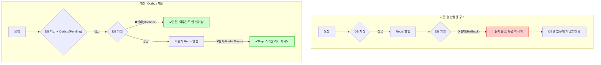

# 개요
`Transactional Outbox Pattern`은 MSA나 분산 시스템 개발 시, 분산 트랜잭션을 처리하기 위한 패턴 중 하나이다.
특히, DB에 데이터를 저장하고, 그 변경 사항을 메시지 브로커에 발행하는 상황에 처리하는 패턴으로 유명하다.
내가 Onetool 프로젝트를 수행하면서 마주쳤던 상황을 바탕으로 Transactional Outbox Pattern을 적용해보고자 한다.

# 문제 해결
## 1. DB는 저장했는데, 메시지는 안 가요.
이커머스 주문 로직을 생각해보자. 사용자가 주문을 하면 DB에 주문 정보를 INSERT 하고, 배송 팀에게 알리기 위해 메시지 큐에 이벤트를 발행해야 한다.

```java
@Transactional
public void order(OrderDto dto) {
    orderRepository.save(dto.toEntity());

    messageProducer.send("order-topic", dto);
}
```

이 로직에서 발생할 수 있는 오류 상황을 정리해보자.
- 시나리오 A: DB 저장 성공했지만, 네트워크 이슈로 메시지 발생이 실패하면 -> 데이터 불일치 발생 (배송이 안되는 문제)
- 시나리오 B: 메시지는 발행했는데, DB 트랜잭션 커밋 직전에 에러가 나서 롤백되면 -> 유령 메시지 발생 (주문은 없는데, 배송되는 문제)

이런 Dual-Write 문제를 해결하기 위해 Outbox Pattern을 사용한다.

<br/>

## 2. Transactional Outbox Pattern 이란?
상태를 변경하는 비즈니스 데이터와 발송해야할 메시지를 동일한 DB 트랜잭션 안에서 저장하는 패턴이다.

### 핵심 아이디어
메시지를 바로 브로커에 보내지 말고, 일단 DB 안에 있는 우체통(Outbox Table)에 넣자, 그리고 배달은 나중에 하자.

### 왜 사용하는가?
1. 원자성 보장
    - 비즈니스 로직과 메시지 발행 의도가 하나의 트랜잭션으로 묶이기에 원자성이 보장됨.
2. At-Least-Once (최소 1회 전송)
    - 브로커가 잠시 장애가 나도, DB에 메시지가 남아 있어 나중에 재전송 가능
3. Non-Blocking
    - 메시지 브로커의 응답 속도에 비즈니스 로직이 영향 받지 않음.

## 3. Spring Boot에서의 구현 전략
Outbox 구현 방식은 크게 두 가지로 나뉜다.

1. Polling publisher
2. Transaction Long Tailing(CDC)

여기서는 별도의 복잡한 인프라 없이 애플리케이션  레벨에서 구현 가능한 Spring Events + Polling 하이브리드 방식을 사용하고자 한다.

### 구현 시나리오
1. Transaction: 주문 저장 + Outbox 저장
2. Event: 트랜잭션 커밋 후 애플리케이션 이벤트 발행
3. Listener: 이벤트를 받아 비동길 메시지 브로커 전송
4. Scheduler: 혹시라도 전송 실패한 메시지를 주기적으로 찾아 재전송

### 구현
```java
@Entity
public class OutboxEvent {
    @Id
    @GenerationValue(strategy = GenerationType.IDENTITY)
    private Long id;
    private String aggregateType; // "ORDER"
    private Long aggregateId;     // orderId
    private String payload;       // JSON
    private String status;        // "PENDING", "PUBLISHED"
}
```

```java
@Transactional
public void createOrder(OrderDto orderDto) {
    Order order = orderRepository.save(orderDto.toEntity());

    OutboxEvent event = new OutboxEvent("ORDER", order.getId(), toJson(order), "PENDUNG");
    outboxRepository.save(event);

    // 스프링 이벤트 발행
    eventPublisher.publishEvent(new OrderCreatedEvent(event));
}
```

```java
@Component
public class OutboxEventListener {

    @Async
    @TransactionalEventListener(phase = TransactionPhase.AFTER_COMMIT)
    public void handleOutboxEven(OrderCreatedEvent event) {
        kafkaProducer.send("order-topic", event.getPAyload());
        outboxService.markAsPublished(event.getId());
    }
}
```

### 상세 단계별 설명
#### 1. 비즈니스 로직 & 이벤트 발행 (ChatService)
1. 사용자가 메시지를 보냅니다.
2. ChatService는 ChatMessage를 DB에 저장합니다.
3. eventPublisher.publishEvent()를 호출합니다.

#### 2. Outbox 기록 (Listener - BEFORE_COMMIT)
- 트랜잭션이 커밋되기 직전(BEFORE_COMMIT), Spring이 ChatOutboxListener.saveOutbox()를 깨웁니다.
- 이 리스너는 ChatOutbox 엔티티를 생성하여 DB에 저장합니다. (상태: PENDING)

> 핵심: 이 작업은 ChatService와 동일한 트랜잭션 안에서 일어납니다. 즉, ChatMessage와 ChatOutbox는 **동시에 저장되거나, 동시에 실패(롤백)**합니다. (원자성 보장)

#### 3. DB 커밋
- 이제 실제 DB 커밋이 일어납니다.
- 만약 이 시점에 DB 오류가 나면? -> 메시지도 안 생기고, Outbox도 안 생깁니다. Redis에도 안 보냅니다. 데이터 정합성이 완벽하게 유지됩니다.

### 4. Redis 발행 (Listener - AFTER_COMMIT)
- DB 커밋이 성공하면, Spring은 ChatOutboxListener.publishToRedis()를 실행합니다.
- 이 메서드는 Redis에 메시지를 쏘고(convertAndSend), 성공하면 아까 저장해둔 ChatOutbox의 상태를 PUBLISHED로 바꿉니다.

#### 5. 실패 시 Scheduler
- 만약 4단계(Redis 발행) 도중에 서버가 죽거나 Redis가 터지면?
- DB에는 ChatOutbox가 PENDING 상태로 남아있습니다.
- 별도로 돌아가는 **스케줄러(Poller)**가 5초마다 PENDING 상태인 애들을 찾아서 Redis에 다시 보내고 상태를 업데이트합니다.


### 트랜잭션은 어떻게 처리할까?
```
[Transaction 1: ChatService.saveMessage]
-------------------------------------------------------
|  1. ChatMessage 저장 (INSERT)                       |
|  2. 이벤트 발행                                     |
|  3. [Listener] Outbox 저장 (INSERT, PENDING)        |
-------------------------------------------------------
           ⬇️ (Commit 시도)
      [DB Commit 성공!]
           ⬇️
-------------------------------------------------------
[Transaction 2: Listener.publishToRedis] (별도 실행)
-------------------------------------------------------
|  4. Redis 발행 (Network I/O)                        |
|  5. Outbox 상태 변경 (UPDATE, PUBLISHED)            |
-------------------------------------------------------
           ⬇️ (Commit 시도)
      [DB Commit 성공!]
```

## 속도가 느리진 않을까?
DB 커밋 성공 시에 Redis 발행이 수행되기 때문에 동기적으로 발생한다.
이 부분을 해결하기 위해 @Async를 이용하여 Redis 바행과 Outbox 수정 로직을 비동기로 처리한다.

## 실패 시나리오

