# 단일 서버
하나의 서버에 웹 앱, 데이터베이스, 캐시 등이 실행되는 것을 의미한다.

# 데이터베이스
사용자가 많아지면 웹/모바일 트래픽과 데이터베이스 트개픽을 나누어 부하를 막아야한다.
## 어떤 데이터베이스를 사용할 것인가?
- 비-관계형 데이터베이스가 바람직할 경우
    - 아주 낮은 응답 레이턴시가 요구됨
    - 비정형이라 관계형 데이터가 아님 -> Join 연산이 필요없음
    - 데이터를 직렬화하거나 역직렬화 할 수 있기만 하면 됨
    - 아주 많은 양의 데이터를 저장할 필요가 있음

# 수직적 규모 확장 vs 수평적 규모 확장
스케일 업: 수직적 규모 확장으로 서버에 고사양 자원을 추가하는 행위
스케일 아웃: 수평적 규모 확장으로 더 많은 서버를 추가하는 행위

- 수직적 규모 확장의 단점
    - 고사양 자원 추가에는 한계가 있다.
    - 장애에 대한 자동복구나 다중안 방안을 제시하지 않는다. -> 서버 장애 시 서비스 완전 중단

따라서 수평적 규모 확장법이 보다 적절. 이를 위해 로드밸런서를 도입하는 것이 최선이다.

## 로드밸런서
로드밸런서는 웹 서버와 통신하여 접속이 가능한 서버의 사설 IP로 요청을 한다.

## 데이터베이스 다중화
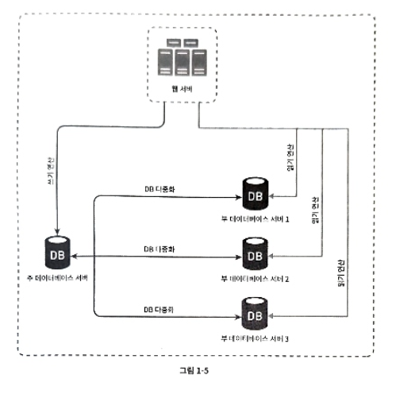
마스터 서버(쓰기 연산 지원), 슬레이브 서버(읽기만 지원)를 나누어 데이터베이스를 다중화.

- 장점
    - 하나의 데이터베이스로 부하되는 것을 막는다.
    - 하나의 DB 서버가 파괴되어도 다른 DB 서버로 복구가 가능하다.
    - 가용성이 높아진다.

- 작동 방식
    - 슬레이브 서버가 한 대이고 서버가 다운되면, 다른 슬레이브 서버가 생길 때까지 마스터 서버가 모든 요청을 처리한다.
    - 마스터 서버가 다운되면, 한 대의 슬레이브 서버가 마스터로 승격된다. 이 경우, 슬레이브 서버가 최신화되어 있지 않으면 복구 스크립트로 없는 데이터를 복구한다. 이 경우, 여러 마스터 서버가 있는 경우 복구가 더욱 쉬워진다.

# 캐시
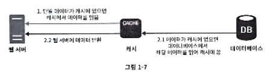
데이터를 메모리 안에 두고, 데이터베이스에 직접 접근하지 않고 바로 데이터를 전송하는 방식.

## 캐시 계층
데이터가 잠시 보관되는 곳으로 DB보다 빠르다.

읽기 주도형 캐시 전략: 캐시에 읽을 데이터가 없는 경우엔 데이터베이스에 직접 접근하여 데이터를 가져오는 방식

## 캐시 사용 시 유의할 점
- [ ] 갱신은 자주 안 일어나지만 참조가 빈번하게 일어나는가?
- [ ] 휘발되어도 상관없는 데이터를 저장할 것인가?
- [ ] 적절한 만료 시간을 정해 너무 자주 DB에 접근하지 않도록 하거나 캐시에 오래 상주하게 안해야 한다.
- [ ] 데이터베이스와의 데이터 일관성은 어떻게 해결할 것인가?
- [ ] 캐시 서버를 한 대만 둘 경우에 발생하는 SPoF에 대해 어떻게 해결할 수 있을 것인가?
- [ ] 캐시 메모리를 얼마나 크게 잡을 것인가?
- [ ] 캐시가 꽉 찬 경우 어떤 데이터를 방출할 것인가?

# CDN
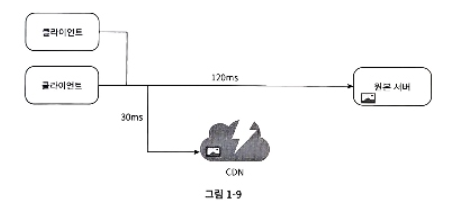
정적 콘텐츠 전송 시 지리적으로 분산된 서버의 네트워크이다. 이미지, 비디오, CSS, JS 파일 등을 캐시할 수 있다.

- 작동 방식
    - 사용자가 웹사이트 방문 시, 사용자와 가장 가까운 CDN 서버가 정적 콘텐츠 전달.
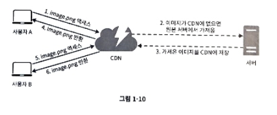

## CDN 사용 시 고려해야 할 사항
- 비용: CDN은 제3 사업자가 운영하므로 요금 대비 이득이 크지 않으면 빼는 것이 좋다.
- 적절한 만료 시한 설정: 시의성이 중요한 콘텐츠의 경우 고려
- CDN 장애 대처 방안: CDN 자체가 죽어도 작동 방안을 마련해야함.

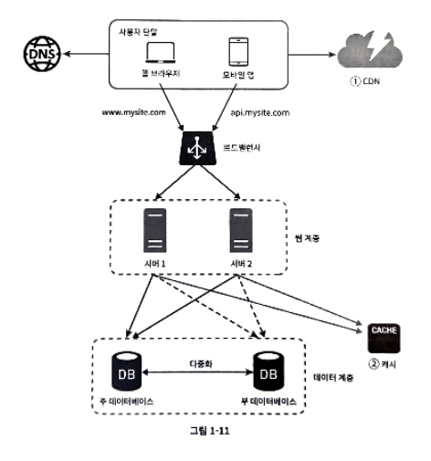

# 무상태 웹 계층
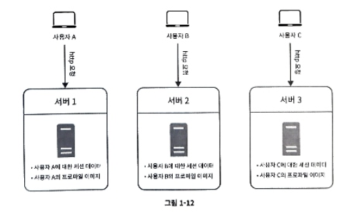
웹 계층을 수평적으로 확장하기 위해 사용자 세션 정보를 웹 계층에서 제거해야 한다. 이를 하나의 지속성 저장소에 보관하여 필요할 때 가져오도록 하는것이 바람직하다.

## 상태 정보 의존적인 아키텍처
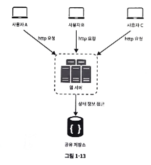
상태 정보를 보관하는 서버는 서버에 상태 정보가 저장되므로 같은 클라이언트는 같은 서버로 전송해야 한다.
이를 위해 로드밸런서에서 `고정 세션` 을 제공하지만, 이는 매우 복잡한 기능이다. (서버 장애 처리 복잡)

그래서 별도의 저장소에 세션 정보를 저장하도록 하고, 이는 공유되어 사용된다.
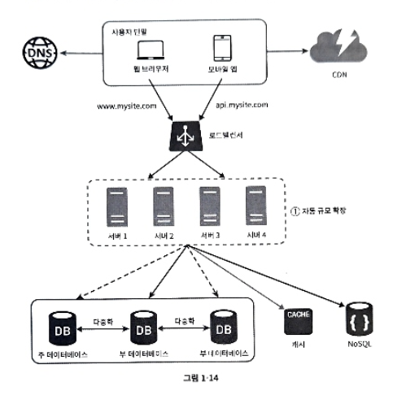
# 데이터 센터
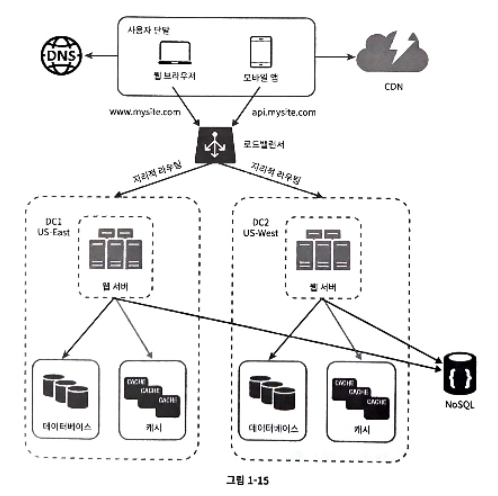
사용자는 장애가 없을 경우, 가장 가까운 서버로 요청이 간다. 이를 데이터 센터로 두어 여러 지역에 같은 웹서버, DB, 캐시 등이 복제되어 운영되는 방식을 데이터센터라고 한다.

- 기술적 난제
    - 트래픽 우회: 올바른 데이터 센터를 찾도록 트래픽 우회가 필요
    - 데이터 동기화: 데이터 센터마다 별도의 DB를 사용하므로 각 데이터센터마다 데이터 동기화가 필요.
    - 테스트와 배포: 여러 데이터 센터가 위치하므로 하나의 작업에 대해서도 여러 데이터센터에서 테스트 및 자동화해야 한다.

# 메시지 큐
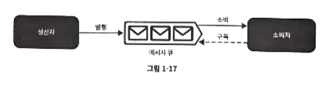
메시지의 무손실(큐에서 소비되기 까지 메시지 손실 안됨)을 보장하는 비동기 통신.

이 경우, 생산자 서버가 고장나더라도 메시지 소비가 가능핟ㅏ.

# 로그, 메트릭 그리고 자동화
- 로그: 에러 로그 모니터링을 통해 서버 수정 가능. -> 단일 로깅도 가능하지만, 여러 서버 통합 로깅도 가능
- 메트릭: 메트릭을 통해 사업과 관련된 정보 얻기 가능
    - 호스트 단위 메트릭: CPU, 메모리, 디스크 I/O
    - 종합 메트릭: DB 계층의 성능, 캐시 계층의 성능
    - 핵심 비즈니스 메트릭: 일별 능동 사용자, 수익, 재방문
- 자동화: CI/CD를 통해 개발 생산성 향상

## 메시지 큐, 로그, 메트릭, 자동화 등을 반영하여 수정한 설계안
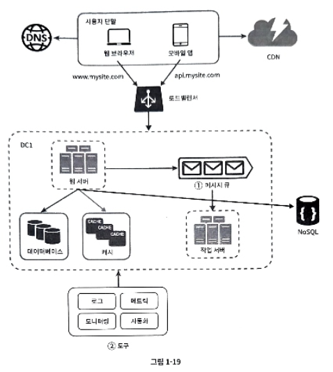
- 메시지 큐는 각 컴포넌트가 보다 느슨히 결화됨.
- 로그, 모니터링, 메트릭, 자동화를 위한 별도의 장치를 추가.

# 데이터베이스의 규모 확장
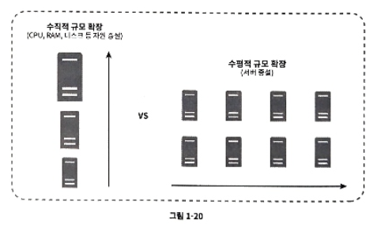
- 수직적 확장의 경우, 단일 장애점 대체 방안이 불가능하고, 비용이 많이 들며, 한계가 있다.

## 수평적 확장
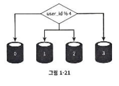
샤딩을 통해 같은 스키마를 여러 DB 서버에 두어 데이터를 분산 저장한다.
예를 들어 user_id % 4를 해시 함수로 설정하여 샤드(user_id % 4)에 저장한다.

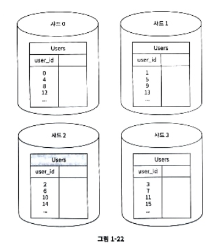
샤딩을 위해선 `샤딩 키(파티션 키)`를 적절히 정해야 한다. 올바른 데이터베이스에 접근하기 위해 샤딩 키를 이용하기 때문이다.
아까 예시에선 user_id가 샤딩 키.

- 기술적 난제
    - 데이터의 재 샤딩: 데이터가 많아져 하나의 샤드로 감당이 어렵거나, 데이터 분포가 균일하지 않은 경우.
    - 유명인사 문제: 저스틴 비버에 대한 정보가 저장된 샤드에는 많은 부하가 발생한다.
    - 조인과 비정규화: 샤드로 쪼개게 되면 조인과 비정규화가 불가능해진다.

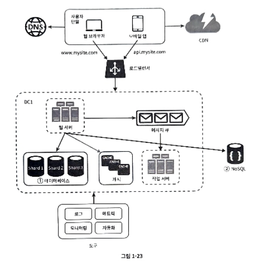