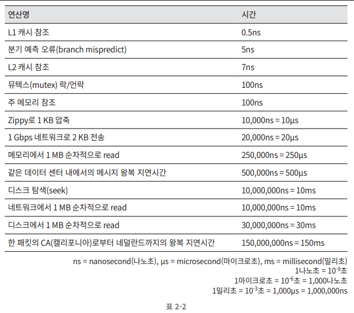
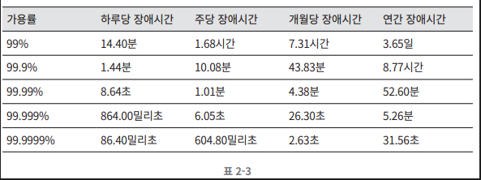

면접 시 시스템 용량이나 성능 요구사항을 개략적으로 추정하라는 요구를 받을 수 있다.
이 경우를 위해 대략적인 기본 수치들을 숙지하고 있는 것이 좋다.

## 모든 프로그래머가 알아야 하는 응답지연 값

이를 통해 다음과 같은 결론이 나온다.

- 메모리는 빠르지만 디스크는 아직도 느리다.
- 디스크 탐색(seek)은 가능한 한 피하라.
- 단순한 압축 알고리즘은 빠르다.
- 데이터를 인터넷으로 전송하기 전에 가능하면 압축하라.
- 데이터 센터는 보통 여러 지역 (region)에 분산되어 있고, 센터들 간에 데이터를 주고받는 데는 시간이 걸린다.

## 가용성에 관계된 수치들
대부분의 서비스는 99%에서 100% 사이의 가용성 값을 가진다. 이런 가용성을 표를 통해 정리해놨다.

## 예제: 트위터 QPS와 저장소 요구량 추정

[ 가정 ]
- MAU는 3억명
- 50%의 사용자가 트위터 매일 사용
- 평균적으로 각 사용자는 매일 2건의 트윗을 올림
- 미디어를 포함하는 트윗은 10%정도
- 데이터는 5년간 보관

[ 추정 ]
- QPS 추정치
    - DAU = 3억 * 50% = 1.5억
    - QPS = 1.5억 * 2트윗 / 24시간 / 3600초 = 약 3500
    - 최대 QPS(Peek QPS) = 2 * QPS = 약 7000

- 미디어 저장을 위한 저장소 요구량
    - 평균 트윗 크기
        - tweet_id에 64바이트
        - 텍스트에 140바이트
        - 미디어에 1MB
    - 미디어 저장소 요구량: 1.5억 * 2 * 10% * 1MB = 30TB/일
    - 5년간 미디어 보관을 위한 저장소 요구량: 30TB * 365 * 5 = 약 55PB

## 팁
- 근사치를 활용한다.
    - 예를 들어, "99987/9.1"과 같은 자세한 계산 대신 "100,000/10"로 간소화한다.
- 가정들은 적어 두라. 나중을 위해
- 단위를 붙이라.
- 많이 출제되는 개략적 규모 추정 문제는 QPS, 최대 QPS, 저장소 요구량, 캐시 요구량, 서버 수 등을 추정하는 것이다.
