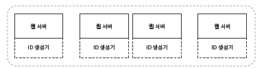
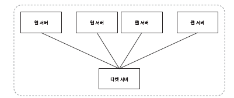
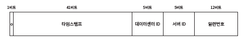
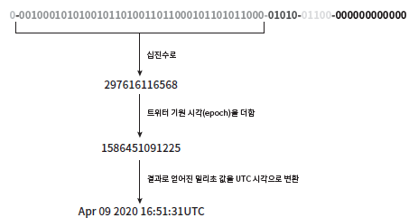

분산 데이터베이스 시, `auto_increment` 사용을 하게되면 ID가 중복되거나 이를 방지하기 위해 지연이 발생할 수 있다.
따라서 유일성을 보장하는 ID 사례를 알아보자.

# 1단계 문제 이해 및 설계 범위 확정
- ID 특성은?
  - 유일하고 정렬 가능
- 새로운 레코드에 붙일 ID는 항상 1만큼 큰 값이어야 하는가?
  - ID는 시간이 흐를수록 커질 테지만 언제나 1씩 증가한다고 할 수 없다. 다만, 아침에 만든ID보다 저녁에 만든 ID가 큰값을 가져야 한다.
- ID는 숫자로만 구성되나?
  - 그렇다.
- 시스템 규모는 어느정도 인가?
  - 초당 10,000 ID 생성해야 한다.

이 질문을 바탕으로 정리하면 다음과 같다.
1. ID는 유일해야 한다.
2. ID는 숫자로만 구성되어야 한다.
3. ID는 64비트로 표현될 수 있는 값이어야 한다.
4. ID 발급 날짜에 따라 정렬 가능해야 한다.
5. 초당 10,000개의 ID를 만들 수 있어야 한다.

# 2단계 개략적 설계안 제시 및 동의 구하기
**선택지**
- 다중 마스터 복제
- UUID
- 티켓 서버
- 스노우플레이크

## 다중 마스터 복제

`auto_increment`를 활용한다. 다만 1이 아닌 k만큼 증가시켜 중복되지 않도록 한다.
- 장점
  - 규모 확장 가능
    - 데이터베이스 늘리면 생산 가능 ID 수도 늘릴 수 있음
- 단점
  - 데이터 센터의 개수 및 규모 확의 어려움
  - 유일성 but 시간 흐름에 맞추어 커지도록 보장 힘듬
  - 서버 추가하거나 삭제가 어려움

## UUID

- 유일성 보장
- 128비트
- **장점**
  - 구현 단순
  - 규모 확장이 쉬움
- **단점**
  - 128비트로 길다. (요구사항 3번 위반)
  - 시간순 정렬 불가능 (요구사항 4번 위반)
  - 숫자가 아닌 값이 포함 (요구사항2번 위반)

## 티켓 서버

- 유일성 보장
- `auto_increment`기능을 갖춘 별도의 DB 서버 구축 및 중앙 집중화

- **장점**
  - 유일성 보장 및 숫자만으로 구성 가능
  - 구현 쉽고, 중소 규모 애플리케이션 적합
- **단점**
  - 티켓 서버가 SPOF가 되기 쉬움

## 스노우플레이크

- 64비트 구조
  - sign 비트(1비트): 음수, 양수 구분
  - timestamp(41비트): 기원 시각(epoch) 이후로 몇 ms 경과했는지 표기
  - Datacenter ID (5비트): 32개의 데이터센터 지원 가능
  - 서버 ID(5비트): 데이터센터당 32개 서버 사용 가능
  - 일련번호(12비트): 각 서버에서 ID 생성할 때마다 일련번호 1만큼 증가. 1ms 경과시 0으로 초기화.

# 3단계 상세 설계
위 방법 중 스노우플레이크를 통해 ID 구조 다이어그램 작성

## 타임스탬프

타임스탬프 최대값은 2^41-1 = 2,199,023,255,551 ms.
즉 69년간 동작 가능.

## 일련번호
2^12 = 4096개의 일련번호 부여 가능.

# 4단계 마무리
## 추가 논의 사항
- **시계 동기화**
  - 이번 설계 시, ID 생성 서버들이 전부 같은 시계 사용한다고 가정
  - 가정은 하나의 서버가 여러 코어에서 실행될 경우 유효하지 않을 수 잇음
  - 여러 서버가 물리적으로 독립된 여러 장비에서 실행되는 경우도 마찬가지.
  - `Network Time Protocol`이 가장 보편적인 수단.
- **각 section의 길이 최적화**
  - 동시성이 낮고 수명이 긴 애플리케이션이라면 일련번호 절의 길이를 줄이고 타미스탬프 절의 길이를 늘리는게 효과적
- **고가용성**
  - ID 생성기는 필수 불가결 컴포넌트이므로 아주 높은 가용성 제공 필요.
