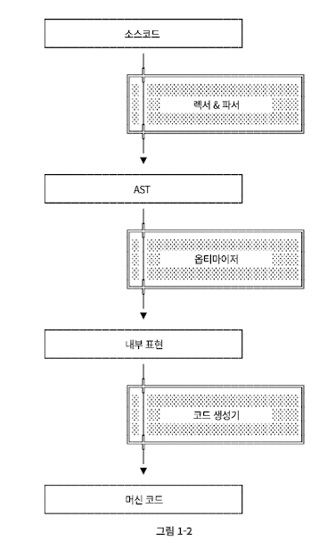
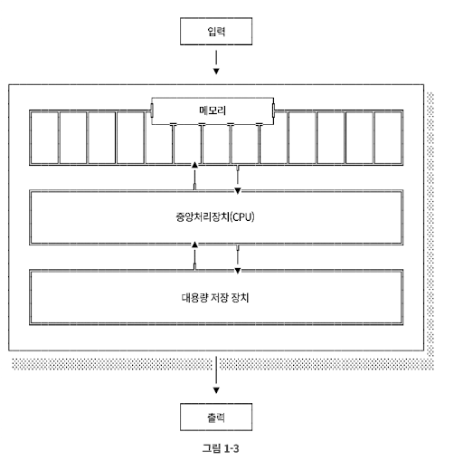
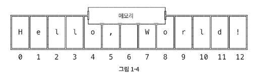
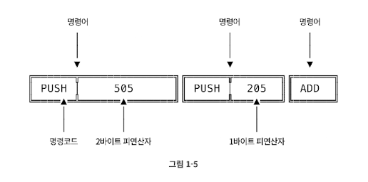
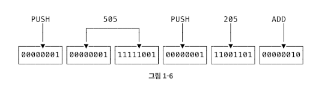

컴파일러와 가상 머신 모두 추상 개념 패턴일 뿐.
웹 서버, 인터프리터와 같이 크기나 복잡도에 따라 다양한 구현체가 있는 개념일 뿐이다.

## 컴파일러
소스 프로그래밍 언어로 작성된 컴퓨터 코드를 목적 프로그래밍 언어로 변환하는 소프트웨어다. 번역기의 한 유형으로 주로 컴퓨터 같은 디지털 장치를 지원하는데 쓰인다.

## 컴파일러 상세

렉서가 소스코드를 토큰화하고, 파서가 토큰을 파싱한다.이를 프론트엔드라고 부른다. 즉, 텍스트가 AST로 변환된다.

옵티마이저라는 컴포넌트가 AST를 또다른 내부 표현(IR)으로 변환한다. 이 형태는 매우 다양하다. 중요한 것은 별도로 만들어낸 IR이 최적화 및 목적 언어로 변환하는 과정에 더 안성맞춤이기 때문.

[ 옵티마이저 최적화 과정 ]
- `dead-code elimination`: 불필요한 코드 제거
- 단순한 산술 연산을 미리 계산
- `code motion`: 반복문 몸체에 있을 필요 없는 코드 밖으로 빼기

마지막으로 코드 제네레이터가 목적 언어로 된 코드를 생성. 이를 백엔드라고 부른다.

## 가상 머신과 실제 머신
- 가상 머신은 프로그래밍 언어 구현위해 사용됨.
- 머신이 하드웨어가 아닌 소프트웨어로 만들어져 가상이라고 부름 = 완전히 추상적인 개체/
- 즉, 컴퓨터가 하는 행위를 모방한다.

## 실제 머신

### CPU 과정
1. 메모리에서 명령어를 fetch. PC가 다음 명령어의 메모리상 주소를 알려줌.
2. 명령어를 decode.
3. 명령어를 실행. 레지스터를 통해 실행.

### 메모리
메모리는 워드라는 단위로 주소를 구분.

[ 예 ]
- 8비트, 메모리 크기가 13바이트인 컴퓨터

- 이 컴퓨터에서 주소 4에 있는 워드는 'o'가 해당된다.
- 즉, 메모리 주소를 가져와 메모리 어딘가에 저장해두고, 포인터를 만들어 사용한다.

워드는 컴퓨터 마다 크기가 다르므로, 워드 어드레싱이 아닌 `바이트 어드레싱` 방식을 사용하기도 한다.

최근에는 메모리 접근이 추상화되어 있고, 가상 메모리나 보안 정책으로 접근이 어렵다.

## 스택
후입선출로 관리되는 메모리 영역.
콜 스택을 구현하기 위해 만들어짐.

### CPU가 콜 스택을 쓰는 이유
- CPU는 프로그램 실행을 위해 특정 정보를 계속 파악해야 한다.
- 이 정보를 알아야 하는 순간이 왓을 때 콜 스택이 도움이 된다.

예를 들어, 어떤 함수 끝난 후, 실행할 명령어가 무엇인지 알아야한다. 즉, 명령어 실행 후 다시 돌아갈 주소를 알아야 하는데, 콜 스택이 없으면 직접 메모리를 선형 탐색해야 한다.

CPU는 콜 스택을 저장하는 레ㅅ지스터를 가지고 있다. 여기에 스택 포인터를 저장하게 된다.

## 가상 머신이란 무엇일까?
가상 머신은 실행 루프를 가지며, 컴퓨터처럼 인출-복호화-실행 주기로 반복된다.
즉, PC, Stack, StackPoint를 코드로 구현하게 된다.

### 왜 만들어야 하는가?
이식성 때문이다. 하나의 프로그램을 돌리기 위해 모든 컴퓨터 아키텍처마다 새로운 컴파일러를 만들어야 한다.

또한 가상머신은 도메인에 특화된다. 실제 머신의 경우, 하드웨어에 대한 유지 보수 및 성능까지 고려해야 하기 때문에 난이도가 올라간다.

## 바이트코드

가상 머신은 바이트코드를 실행한다. 머신이 어떤 일을 해야하는지 알려주는 명령어로 구성된다.
즉, 스택 push, pop과 같은 명령어를 알려준다.

이를 메모리 상의 주소로 저장한다. `라툴 엔디안`과 `빅 엔디안`을 사용한다.

예를 들어 PUSH = 1, ADD = 2를 참조하고, 정수를 빅 엔디안으로 저장한 예가 위와 같다.

이런 바이트코드를 어셈블리어를 통해 사람이 직접 읽을 수 있도록 표현한다.