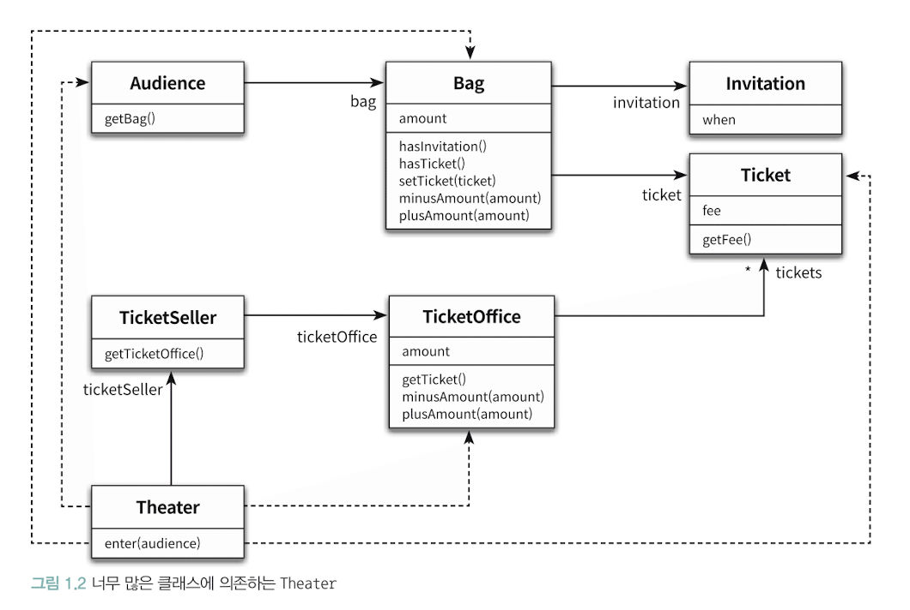
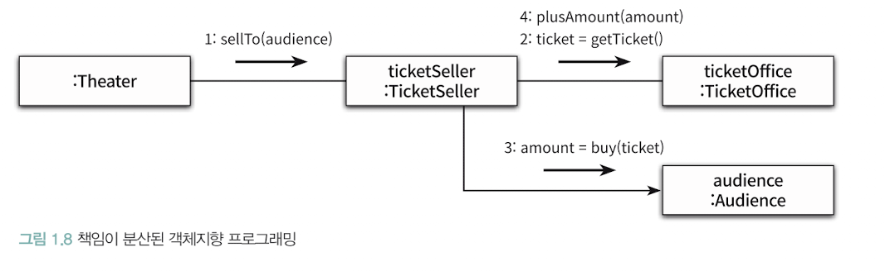

# 기존 설계

# 무엇이 문제인가?
## 흐름 예상 어려움
Theater 클래스의 enter 메서드의 수행 업무 흐름
- 소극장은 관람객 가방을 열어 초대장 확인
- 가방 안에 초대장 있음ㄴ, 판매원은 매표소에 보관된 티켓을 관람객 가방에 넣음
- 가방 안에 초대장 없으면, 관람객 가방에서 티켓 금액만큼 현금을 꺼내 매표소에 적립 한 후, 매표소에 보관된 티켓을 관람객 가방 안에 옮김.

이 방식의 경우, 관람객과 판매원이 소극장에게 수동적인 존재이다.
그렇게 되면 다른 사람들이 코드를 읽는데 어려움이 발생한다.

## 변경에 취약
의존성이 매우 많이 발생하여 결합도가 높아지고, 이는 결국 변경에 취약해지게 된다.

# 개선하기
기존에 빈약한 도메인을 개선하고자 책임을 분리하도록 하자.

TicketSeller 클래스가 Audience를 파라미터로 받아 티켓을 검사하도록 하자.
그 이후 Audience 클래스에서 Ticket을 사도록 메서드를 만들자.
더 나아가 Bag을 의인화를 통해 티켓 여부 및 저장을 수행하도록 책임을 위임할 수도 있다.

## 절차지향과 객체지향
기존 Theater가 중앙집중으로 운영되고 있어, 이를 넓게 보면 Proccess와 데이터 역할만하는 Audience, TicketSeller, Bag로 구분할 수 있다.
이 방식은 데이터 변경으로 인해 지역적으로 고립시키기 어렵다.

## 책임의 이동
이런 데이터 흐름적 사고를 막기 위해 책임을 이동시켜 빈약한 도메인 모델을 해결하도록 하자.

## 왜 설계해야 하는가?
요구사항은 언제든지 변경될 수 있다. 그때 코드 수정을 최소화해야 버그를 회피할 수 있게 된다.

