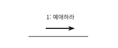
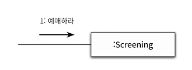
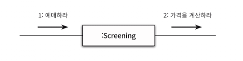
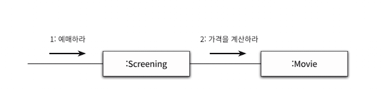
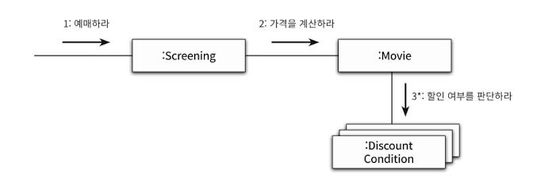
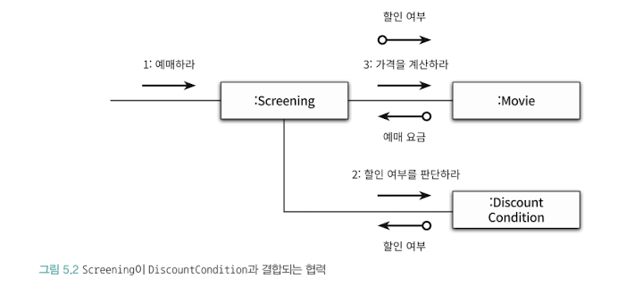

# 1. 책임 주도 설계를 향해
### 데이터보다 행동을 먼저 결정하라
너무 이른 시기에 데이터에 초점 맞추면, 캡슐화가 약화 -> 낮은 응집도와 높은 결합도 -> 변경에 취약

### 협력이라는 문맥 안에서 책임을 결정하라
- 객체에게 할당된 책임의 품질은 협력에 적합한 정도로 결정
- 책임은 객체의 입장이 아니라 객체가 참여하는 협력에 적합해야 한다. -> 객체의 책임을 어떻게 식별해야 하는가에 대한 힌트를 제공
- 메시지가 클라이언트의 의도를 표현한다는 사실에 주목
  - 객체를 결정하기 전에 객체가 수신할 메시지를 먼저 결정하는 점

# 2. 책임 할당을 위한 GRASP 패턴
어떤 책임을 할당해야 할 때 가장 먼저 고민해야 하는 유력한 후보는 도메인 개념


### 정보 전문가에게 책임을 할당
- 사용자에게 제공해야 하는 기능은 영화를 예매하는 것


> 메시지를 수신할 적합한 객체는 누구인가?

- INFORMATION EXPERT 패턴은 객체가 자신이 소유한 정보와 관련된 작업을 수행하는 것을 표현
  - 정보는 데이터와 다름
- 상영은 영화 정보, 상영 시간, 상영 순번처럼 영화 예매에 필요한 정보를 가지고 있기에 영화 예매 전문가이다.



그러나 예매 과정에서 필요한 가격 계산 작업은 Screening으로 불가능하다. 영화 한 편의 가격을 Movie가 가지고 있기 때문이다.





- 영화가 할인 가능한지 판단 후 할인 정책에 따라 할인 요금을 제외한 금액을 계산
- 따라서, Movie는 할인 여부를 판단하라 메시지를 전송해서 외부의 도움을 요청


할인 정보는 DiscountCondition이 가지므로 DiscountCondition에게 메시지를 전송

### 낮은 결합도

- 설계는 트레이드오프 활동
- 왜 Movie가 DiscountCondition과 협력하는 방법을 사용할까?

- Movie와 DiscountCondition은 이미 결합돼 있기 때문에 Movie를 DiscountCondition과 협력하도록 하면 결합도를 추가하지 않아도 된다.
```java
public class Movie {
    private String title;
    private Duration runningTime;
    private Money fee;
    private List<DiscountCondition> discountConditions;

    private MovieType movieType;
    private Money discountAmoint;
    private double discountPercent;
}
```

### 높은 응집도
- Screening의 책임은 예매를 생성하는 것
- 만약 Screening이 DiscountCondition과 협력하면, 영화 요금 계산이라는 책임도 떠안게 됨.
- 이는 Screening이 할인 여부 판단, Movie에서 필요한 정보를 알게됨.
Screening과 DiscountCondition이 협력하게 되면 Screening은 서로 다른 이유로 변경되는 책임을 젊어지게 되므로 응집도가 낮아짐

### 창조자에게 객체 생성 책임을 할당
- 영화 예매 협력의 최종 결과물은 Reservation 인스턴스를 생성하는 것
- Screening은 예매를 수행하기 때문에 Reservation의 창조자로 적합하다.

