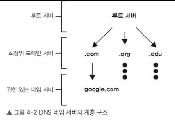
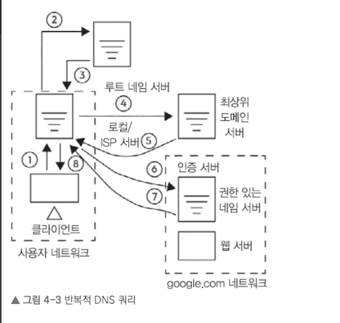
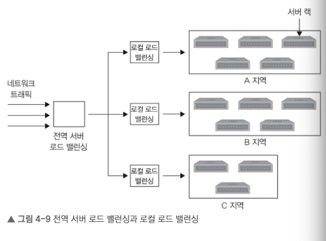
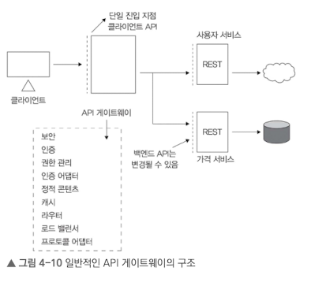

# 4.1 DNS 이해
DNS는 사용자가 웹 브라우저에 입력한 도메인 이름을 컴퓨터가 웹 사이트와 리소스를 찾는 데 사용하는 IP 주소로 변환

- 아키텍처
  - 네임 서버:사용자 쿼리에 응답하는 DNS 서버
  - 리소스 레코드: DNS DB는 매핑 정보를 리소스 레코드(RR)라는 단위로 저장
    - A 레코드: 호스트 이름 - IP 매핑
    - NS 레코드: 도메인 DNS 요청을 처리할 수 있는 권한 있는 네임 서버가 어디인지 알려줌
    - CNAME: 별칭 - 실제 도메인 이름 매핑
  - 캐싱: DNS 여러 단계 마다 캐싱을 하여 부하 줄임
  - 계층 구조: 계층적으로 되어 있어 쿼리 부하를 부하 시킴

- 계층

  - 루트 서버: 로컬 리졸버에서 쿼리 받아 .com, .edu, .us 같은 최상위 도메인의 네임 서버 정보 관리
  - 최상위 도메인 서버(TLD): 권한 있는 네임 서버 IP 주소 보유 (.com TLD -> google.com 보유)
  - 권한 있는 네임  서버

- 과정
    1. 리졸버가 사용자 쿼리 시작
    2. 루트 서버가 TLD 가리킴
    3. TLD가 권한 있는 네임 서버 가리킴
    4. 권한 있는 네임 서버가 최종 IP 주소 전달
    5. 이런 계층 구조로 DNS는 인터넷 규모로 확장 가능

## 4.1.1 DNS 쿼리
### 반복접 쿼리

- 로컬 DNS 리졸버로 모든 과정 직접 처리
- 루트 서버, TLD, 권한 있는 네임 서버 순차적으로 직접 통신

### 재귀적 쿼리

- 루트 서버 -> TLD -> 권한 있는 네임 서버 -> TLD -> 루트 서버

# 4.2 DNS의 확장성, 신뢰성, 일관성
## 4.2.1 확장성
계층 구조 덕분에 단계별로 부하를 분산시켜 전 세계에서 발행하는 쿼리 수십억 건을 처리할 수 있는 확장성을 가짐

## 4.2.2 신뢰성
- 여러 단계에서 캐싱을 사용 -> 일부 DNS 응답못해도 빠르게 전달 가능
- UDP 사용 -> 응답 없을 때 요청을 재전송하는 방식으로 보완

## 4.2.3 일관성
- 강한 일관성을 유지하는 대신 높은 성능을 목표로 설계
- 캐시 TTL과 점진적 업데이트가 반영되도록하여 최종 일관성을 적용
- DNS는 여전히 성능이 최우선

# 4.3 로드 밸런서
- 여러 서버에 고르게 트래픽 분산시켜 특정 서버에 과부하가 걸리는 걸 방지
- 속도가 느려진 서버의 요청을 다른 정상 서버로 재전송
- 서버 풀에 서버를 추가하여 수평 확장이 가능

## 4.3.1 로드 밸런서 위치
클라이언트와 프런트엔드 서버 사이, 다층 시스템의 각 계층 사이, 여러 인스턴스 서비스 간에 배치 등 다양하게 사용가능
각 계층을 서로 독립적으로 보호하여 상위 계층에 영향을 덜 미침

즉, 로드 밸런서는 시스템의 중요 지점에서 트래픽을 분산시켜 전체적인 확장성과 가용성을 높이는 역할

## 4.3.2 로드 밸런서의 장점
- 헬스 체크를 통해 서버 상태 확인
- TLS 연결을 종료 시켜, 백엔드 서버에서 TLS 복호화를 거치지 않아 과부하르 막음
  - 로드 밸런서에서 암호화된 데이터를 복호화하여 백엔드 서버에 보냄

## 4.3.3 전역 로드 밸런싱과 로컬 로드 밸런싱
- 전역 서버 로드 밸런싱 (GSLB)
  
  - 다양한 지역의 데이터 센터 간에 트래픽을 분산
- 온 프레미스 방식이나 서비스 형태로도 사용이 가능

## 4.3.4 DNS와 전역 로드 밸랜서
DNS도 전역 서버 로드 밸런싱 역할을 어느정도 수행
- DNS 로드 밸런싱에서 여러 IP 주소를 가지고, 라운드 로빈으로 트래픽을 여러 데이터 센터로 분산
  - 라운드 로빈 방식의 DNS 로드 밸런싱에는 한계
    - ISP별로 발생하는 트래픽 차이 반영 어려움
    - 서버 다운 시 감지가 어려움

## 4.3.5 로드 밸런서가 사용하는 알고리즘
- 라운드 로빈 스케줄링: 서버 간 성능 차이나 현재 부하는 고려 안함
- 가중치 기반 라운드 로빈: 가중치 높은 서버가 더 많은 요청을 받도록 설정
- 최소 연결 알고리즘: 요청 수가 가장 적은 서버에 할당 -> 처리 시간이 긴 요청에 대해 고르게 분배 가능
- 최소 응답 알고리즘
- IP 해시, URL 해시, 일관성 해시 알고리즘

### 정적 알고리즘 vs 동적 알고리즘
- 정적 알고리즘
  - 서버 상태를 실시간 반영하지 않고, 미리 설정된 서버 구성에 따라 요청 분배
  - 정교한 로드 밸런싱이 불가능
- 동적 알고리즘
  - 서버 상태나 최근 상태를 고려하여 요청 분배
  - 통신 비용 증가하고 시스템이 복잡해짐

### 스테이트풀 vs 스테이트리스
- 스테이트풀 로드 밸런서
  - 모든 로드 밸런서가 상태 정보를 공유 -> 시스템 복잡, 확장성 한계
- 스테이트리스 로드 밸런서
  - 클라이언트의 세션 상태를 일관된 해싱 알고리즘을 사용하여 서버와 매핑
  - 서버 추가 및 삭제, 일시적 사용 불가 시 기존 세션 요청을 올바른 서버로 라우팅하기 어려움

즉, 스테이트풀 방식은 가용성과 신뢰성이 높고, 스테이트리스 방식은 속도가 빠르고 확장성이 높고 구현이 더 간단하다.
실무에선 이를 혼용해서 사용하곤 한다.

## 4.3.6 OSI 모델의 각 계층에서 로드 밸런싱
- 전송 계층 (4계층)
  - TCP, UDP 프로토콜 기반 부하 분산
  - 일부 로드 밸런서는 TLS 종료 기능 제공
  - 속도가 빠름
- 응용 계층 (7계층)
  - HTTP 등 응용 계층 데이터 기반 부하 분산
  - 더 정교한 요청 분배 가능
  - 부하를 최적화 가능

## 4.3.7 로드 밸런서의 배치
- 0단계: DNS 시스템으로 특정 웹 사이트나 서비스에 대해 여러 IP 주소를 선택적으로 제공해 트래픽 분산
- 1단계: 특수 라우터를 통해 라운드 로빈 같은 규칙이나 IP 주소를 기준으로 트래픽 분배
- 2단계(전송계층): 동일한 사용자 세션이나 연관된 데이터 요청이 한 로드 밸런서로 일관되게 전달 (일관된 해싱 등 사용)
- 3단계(응용계층): 로드 밸랜서를 주요 서버와 직접 연결. 서버 상태 모니터링 및 정상 작동 서버 간 트래픽 분산

## 4.3.8 로드 밸런서의 구현
하드웨어 로드밸런서는 비용이 크지만, 대용량 트래픽 처리가 가능
소프트웨어 로드밸런서는 다양한 상황에 맞춰 분배 가능, 클라우드 로드밸선서(LBaaS)로 간편하게 사용도 가능

## 4.4 애플리케이션 게이트웨이
- 클라이언트와 백엔드 서비스 사이에서 트래픽을 가로채며 라우팅, 보안 강화, 성능 가속, 분석, 유연성 등 지원
- 여러 독립 서비스를 하나의 통합 API로 묶는 MSA 기반 아키텍처에 특화

## 4.4.1 애플리케이션 게이트웨이의 기능과 역할
- 고급 요청 라우팅
  - 호스트 이름, 경로, 헤더, 요청을 보낸 IP 주소 등 다양한 조건에 따라 전달
- 보안
  - 게이트웨이에서 공통 보안 기능 관리
  - TLS 종료, DDoS 방어 등 WAF 통합하여 보안 강화
- 가속화와 오프로딩
  - 성능 향상 위해 캐싱, 압축, TCP 연결 관리, TLS 오프로딩 등 수행
  - CPU 부하가 많이 걸리는 작업을 게이트웨이가 대신 처리
- 모니터링
  - 로그, 메트릭 등 종합 파악 -> 전체 트래픽 분석

# 4.5 마이크로서비스 아키텍처
- 여러 MS를 하나의 논리적 API 묶어 클라이언트에 제공
- 서비스 디스커버리와 동적 요청 라우팅을 통해 백엔드 서비스로 효율적 연결
- 횡단 관심사를 중앙에 처리 -> 중복 코드 제거
- 백엔드 서비스와 상관없이 게이트웨이 새 버전을 독립적으로 배포

# 4.6 클라우드 네이티브 애플리케이션 게이트웨이 서비스 개요
- AWS: ALB로 AWS 서비스와 컨테이너로 들어오는 트래픽 라우팅 처리
- Azure: 응용 계층의 로드 밸런싱 제공
- GCP: 통합 방화벽 기능 제공,CDN 제공
- K8S: Istio, Kong, Traefik, Ambassador 같은 인그레스 컨트롤러는 K8s 클러스터에서 API 게이트웨이 역할 수행

# 4.7 온프레미스 옵션
- Kong: Kong Gateway, Kong Mesh는 경량 프록시 서버로 API 게이트웨이와 서비스 메시 기능 제공
- Tyk: 강력한 접근 제어, 개발자 포털 기능, REST API 기반 구성 기능을 갖춘 오픈 소스 게이트웨이
- NGINX: API 게이트웨이 & 로드 밸런서
- HAProxy: 경량화된 로드 밸런서 및 프록시, 응용 계층에서 요청 관리
