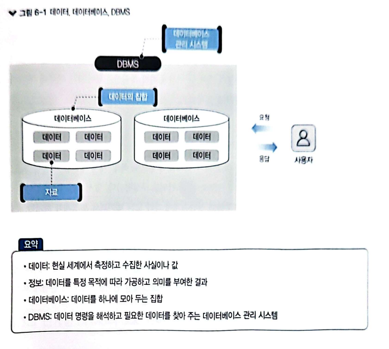
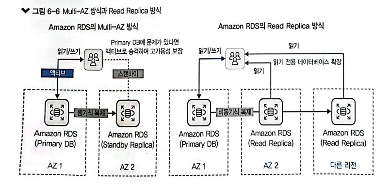

# 6장. AWS 데이터베이스 서비스

이론: 완료
실습: 완료

> EBS와 RDS에는 어떤 것을 저장하나요?
> 

물론이죠! 예를 들어, 온라인 쇼핑 웹 애플리케이션을 운영한다고 가정해 봅시다.

1. **EBS를 사용하는 경우**: 이 애플리케이션을 호스팅하기 위해 EC2 인스턴스를 시작하고, 각 인스턴스에 EBS 볼륨을 연결할 수 있습니다. 이 볼륨은 웹 애플리케이션의 소스 코드, 이미지, 사용자 업로드 파일 등과 같은 정적 파일을 저장하는 데 사용될 수 있습니다. 또한 데이터베이스 서버와 분리된 별도의 EBS 볼륨을 사용하여 데이터베이스 로그 파일이나 기타 데이터베이스 관련 파일을 저장할 수도 있습니다.
2. **RDS를 사용하는 경우**: 이 애플리케이션에서는 주문, 제품 정보, 고객 정보 등과 같은 동적 데이터를 저장해야 할 때 RDS를 선택할 수 있습니다. RDS를 사용하면 MySQL, PostgreSQL 등의 관계형 데이터베이스 엔진을 선택할 수 있으며, 데이터베이스 인스턴스를 설정하고 관리할 필요가 없습니다. 주문 데이터, 제품 목록 및 사용자 프로필과 같은 동적 데이터는 RDS의 데이터베이스 인스턴스에 저장되고 관리됩니다.

요약하자면, EBS는 정적 파일 저장을 위해 사용되고, RDS는 동적 데이터베이스를 관리하기 위해 사용됩니다. 이 두 서비스를 함께 사용함으로써 안정적이고 확장 가능한 웹 애플리케이션을 구축할 수 있습니다.

 

# 1. 데이터베이스와 DBMS

## 1.1 데이터와 데이터베이스

## 1.2 데이터베이스 모델 유형

### 계층형 데이터베이스 모델

- 트리 구조를 기반으로, 데이터는 1:N으로 상하 종속 관계 구조
- 접근은 빠르나, 구조 변경에 대한 유연성 부족

### 네트워크형 데이터베이스 모델

- 1:1, 1:N, N:N 형태의 구조 지원
- 하위 개체는 다수의 상위 개체를 가질 수 있음.
- 개체 간 복잡성으로 전반적인 구조 파악 힘듬

### 관계형 테이터베이스 모델

- 열과 행으로 된 테이블이라는 최소 단위로 구성

### 객체 지향형 데이터베이스 모델

- 객체라는 형태의 최소 단위로 표현
- 관계형 DB와의 호환성 문제와 복잡성
- 특수 분야에서만 사용됨.

> 스토리지 서비스(EBS, EFS, S3)와의 차이점
출처: [https://chucoding.tistory.com/69](https://chucoding.tistory.com/69)

한 컴퓨터 안에 웹서버 + DB 서버
or 웹서버 DB 서버를 따로 두냐

→ Multi-AZ 때문에 RDS를 많이 사용함 (+ OS 및 DB 설치 및 관리 따로 안해도됨)

 

# 2. AWS 데이터베이스 서비스

## 2.1 Amazon RDS

> 💡 클라우드 환경에서 관계형 DB

- 관계형 DB 엔진을 선택할 수 있다.

- 모니터링 및 지표와 이벤트 알람으로 높은 관리 효율성
- 상대적 저렴한 비용
- 간편 복제 기능 지원 (Multi-AZ, Read Replica)

### Multi-AZ 복제 방식

> 💡 활성 상태인 Primary DB에 문제가 생기면, 보조인 Standby Replica가 대기 상태에서 Primary DB로 승격되어 동적으로 유지됨.

- 데이터 정합성 : 데이터가 서로 일관되게 일치
    - 동기식 복제 : 데이터에 변화가 일어나면 원본 데이터를 복제해서 전달하여 동기화
- 목적: 고가용성 유지

### Read Replica 복제 방식

> 💡 원본 데이터를 Primary DB에 두고, 읽기 전용 복제 데이터를 Read Replica에 유지

- Read Replica는 읽기 처리 빠르고, 확장 가능
- RDS는 최대 다섯 개의 Read Replica를 복제할 수 있음.
- 다른 리전까지 Read Replica 가져올 수 있음
- 목적 : 성능을 확장하는 것

 

## 2.3 Amazon Aurora

> 💡 AWS 자체의 클라우드 데이터베이스 엔진

- 고성능의 데이터베이스 처리 가능
- 오픈 소스 기반으로 우수한 호환성
- 비용 효율이 높음
- Amazon RDS에서 관리되며 프로비저닝, 패치, 백업, 복원, 장애 복구 등 작업 수행

### Amazon Aurora 복제 방식

- 스토리지 내결함성이 우수
    - 예) MySQL은 DB 인스턴스에 EBS 스토리지가 연결되어 서로 다른 가용 영역으로 동기식 복제가 됨.
    - 그러나, Amazon Aurora는 공유 스토리지를 통해 **최소 세 개의 가용 영역에서 두 개씩 총 여섯 개의 복제 데이터**를 가지고 있어 더욱 안정적으로 서비스

> MySQL은 EBS와 RDS를 통째로 복제, Aurora는 가용영역 별로 이미 데이터를 가지고 있음?

 

## 2.4 Amazon DynamoDB

> 💡 NoSQL. 키-값 데이터베이스

- SQL문을 사용하지 않음.
- 개체가 서로 연결되어 있지 않음
- 키: 식별자, 값: 단순한 개체 뿐만 아니라 복잡한 비정형 데이터도 가능
- 별도 서버 구축 없는 서버리스

 

## 2.5 Amazon ElastiCache

> 💡 인-메모리 데이터베이스

- 데이터 많으면 느리므로 대용량 데이터에는 비적합

### for Memcached

- 보편적으로 사용되는 메모리 객체 캐싱 시스템
- Memcached와 호환하여 사용

### for Redis

- 데이터베이스, 캐시, 메시지 브로커 및 대기열 용도로 사용
- Redis 기반으로 1밀리초 미만의 지연시간을 자랑

본인 확인용 메시지 인증번호 저장
