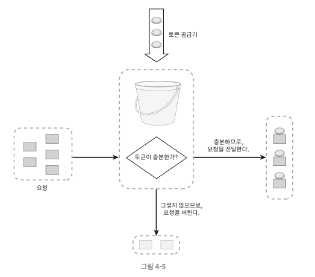
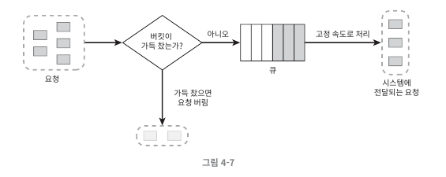
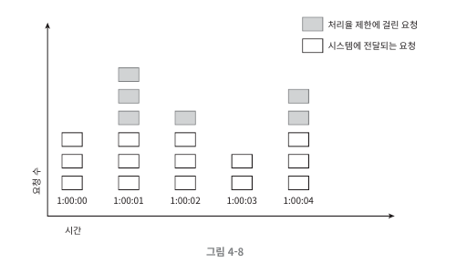
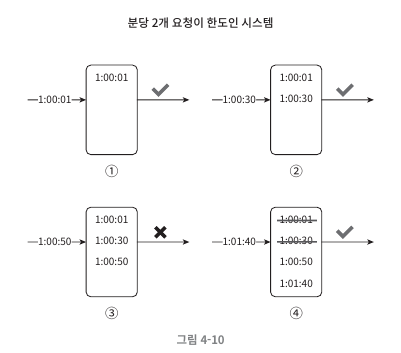
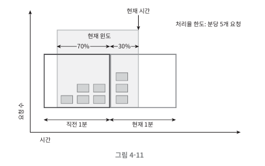
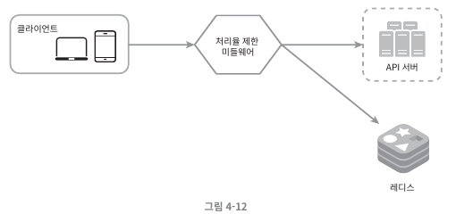
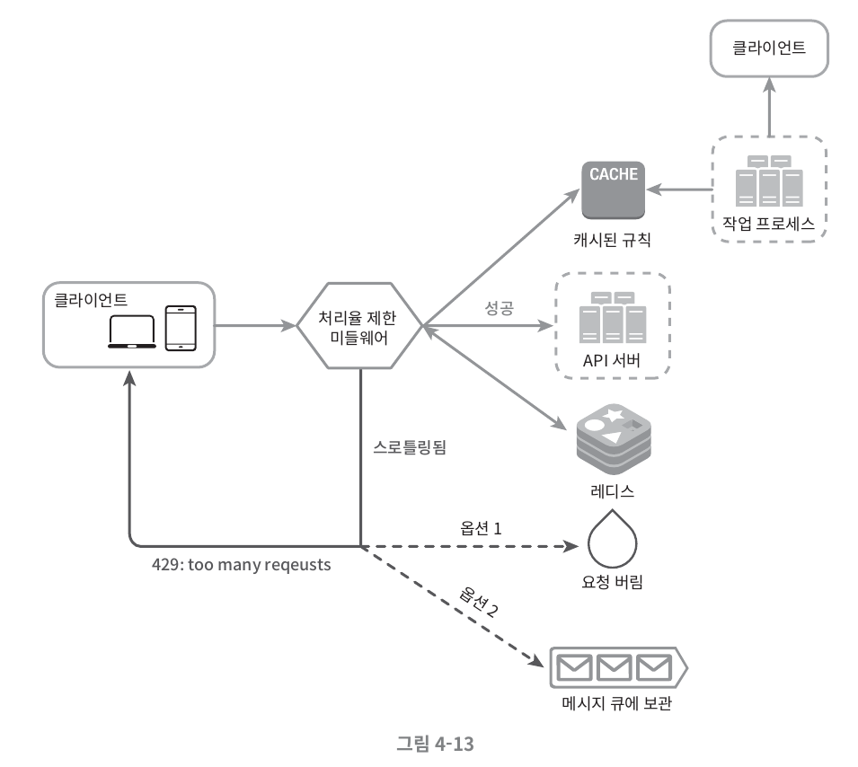
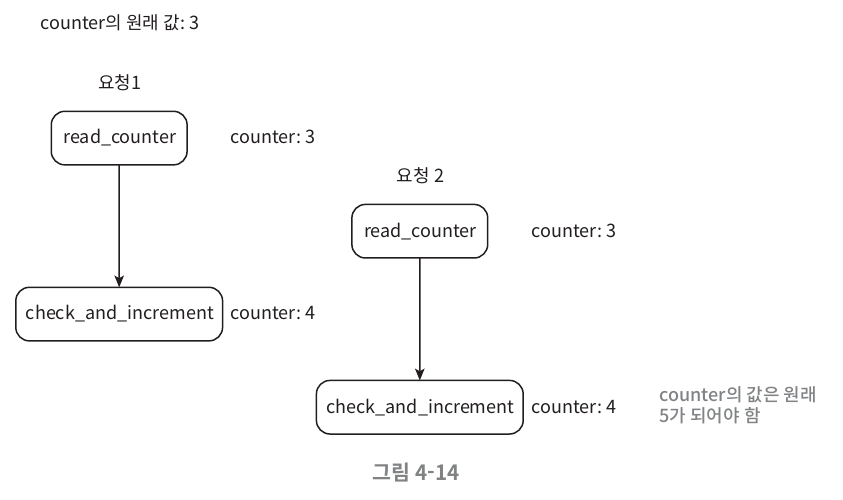

`처리율 제한 장치`: 클라이언트 또는 서비스가 보내는 트래픽의 처리율을 제어하기 위한 장치

- API 처리율 제한 장치 장점
    - **DoS 공격에 의한 자원 고갈 방지**: 트위터 3시간 동안 300개 트윗만 쓰기 가능
    - **비용 절감** : 불필요한 스케일 아웃 방지 및 고가용성 가능.
    - **서부 과부하 방지** : 봇으로 인한 트래픽 걸래냄.

# 1단계 문제 이해 및 설계 범위 확정

지원자: A, 면접관: B
A: 어떤 종류의 처리율 제한 장치를 설계해야 하는가? 클라이언트 또는 서버 중 어디 인가요?
B: 서버 측 API 장치 입니다.
A: 어떤 기준으로 API 호출을 제어하나요?
B: 다양한 형태의 제어 규칙을 저의하는 유연한 시스템입니다.
A: 시스템 규모는 어느 정도인가요?
B: 대규모 요청을 처리해야 합니다.
A: 시스템이 분산환경에서 동작해야 하나요?
B: 그렇습니다.
A: 처리율 제한 장치를 독립된 서비스로 만들어야 하나요? 아니면 애플리케이션 코드에 포함되나요?
B: 결정을 스스로 내려주세요.
A: 요청이 처리율 제한 장치로 걸러지면 사실을 사용자에게 알려야하나요?
B: 그렇습니다.

# 2단계 개략적 설계안 제시 및 동의 구하기
## 처리율 제한 장치는 어디에 둘 것인가?
- 클라이언트에 둘 경우
  - 부적합
  - 클라이언트 요청은 쉽게 위변조 가능
- 서버에 둘 경우
- 미들웨어로 둘 경우
  - 보통 API 게이트웨이가 처리율 지원함.
  
**[ 고려 사항 ]**
- 프로그래밍 언어, 캐시 서비스 등 현재 기술 스택을 점검하자.
- 사업에 적합한 처리율 제한 알고리즘을 선택하자.
- MSA 설계일 경우, API 게이트웨이를 이미 포함한다면, 처리율 제한 기능 또한 게이트웨이에 포함시켜야 한다.
- 처리율 제한 서비스를 직접 만드는 데는 시간이 든다. 상용 API 게이트웨이를 사용하자.

## 처리율 제한 알고리즘

**주요 알고리즘**
- 토큰 버킷
- 누출 버킷
- 고정 윈도 카운터
- 이동 윈도 로그
- 이동 윈도 카운터

### 토큰 버킷 알고리즘
- 보편적으로 사용.
- 아마존과 스트라이프가 API 요청 통제 위해 사용


토큰 버킷은 저장된 용량을 갖는 컨테이너. 예를 들어 용량이 4인 버킷에 주기적으로 토큰이 추가된다.
- 각 요청은 처리될 때마다 하나의 토큰을 사용.
  - 충분한 토큰이 있는 경우, 토큰을 꺼내 요청을 시스템에 전달.
  - 충분한 토큰이 없는 경우, 드롭됨.

이 알고리즘의 핵심은 `버킷 크기`와 `토큰 공급률`을 어떻게 할 것인가 이다.
**사용 예시**
- 사용자마다 하루에 한 번만 포스팅 할 수 있고, 친구는 150명까지 추가 가능하며, 좋아요 버튼은 다섯 번까지만 누를 수 있다면, 사용자마다 3개의 버킷을 둬야 한다.
- IP 주소별로 처리율 제한을 적용하려면 IP주소마다 버킷을 하나씩 할당해야 한다.
- 시스템의 처리율을 초당 10,000개 요청으로 제한하고 싶다면, 모든 요청이 하나의 버킷을 공유하도록 해야 한다.

**장점**
- 구현이 쉽다.
- 메모리 사용이 효율적이다.
- 짧은 시간 집중되는 트래픽 처리 가능.

**단점**
- `버킷 크기`와 `토큰 공급률`을 적절히 튜닝해야 한다.

### 누출 버킷 알고리즘
토큰 버킷 알고리즘 + 고정된 요청 처리율


- 버킷 크기: 큐 사이즈
- 처리율: 지정된 시간당 처리할 요청 개수 (초 단위)
  
**장점**
- 메모리 사용이 효율적이다.
- 고정된 처리율로 안정적 출력이 필요한 경우 적합하다.

**단점**
- 단시간 많은 트래픽 몰릴 경우, 최신 요청이 버려진다.
- `버킷 크기`와 `처리율`을 적절히 튜닝해야 한다.

### 고정 윈도 카운터 알고리즘
- 타임라인을 고정된 간격의 윈도로 나누고, 각 윈도마다 카운터를 붙임.
- 요청이 접수될 때마다 이 카운터의 값은 1씩 증가됨.
- 카운터 값이 임계치에 도달하면 새로운 요청은 새 윈도가 열릴 때까지 버려짐.

즉, 1초마다 3개의 요청만 받고, 나머지 요청은 버린다.



**문제점**
1분당 5개의 요청만 받도록 큐를 해놨다고 가정하자.
그러나 **2:00:30에 5개의 요청**과 **2:01:00에 5개의 요청**을 연속으로 받게될 경우, 우리가 설정한 1분당 5개 요청이 아닌 **1분당 10개의 요청을 처리한 것**과 같다.

**장점**
- 메모리 사용이 효율적이다.
- 이해하기 쉽다.
- 윈도가 닫히는 시점에 카운터를 초기화하므로 **특정 트래픽 패턴 처리에 적합**하다.

**단점**
- 윈도 경계 부근에 일시적으로 많은 트래픽 몰리는 경우, 예상 처리 한도보다 많은 양의 요청을 처리한다. (문제점 참고)

### 이동 윈도 로깅 알고리즘
`고정 윈도 카운터 알고리즘`의 문제점 해결을 위해 탄생.
- 요청의 타임 스탬프 추적 (보통 Redis의 Sorted set에 보관)
- 새 요청이 오면 만료된 타임스탬프는 제거.
- 새 요청의 타임 스탬프를 로그에 추가.
- 로그 크기가 허용치보다 같거나 작으면 요청을 시스템에 전달. 그렇지 않으면 처리 거부.


예를 들어, 분당 최대 2회의 요청만 처리한다고 가정.

- **요청 1:00:01** 허용.
- **요청 1:00:30** 허용.
- **요청 1:00:50** 로그 추가. 허용 한도를 넘기에 요청을 거부.
**- 요청 1:01:40** 추가. `[1:00:40, 1:01:40)`에 포함되지 않는 **1:00:01**과 **1:00:30**을 로그에서 삭제

**장점**
- 정교하다. 어느 순간을 보더라도 처리율 한도를 넘지 않는다.

**단점**
- 타임스탬프 보관을 위한 다량의 메모리를 사용한다.

### 이동 윈도 카운터 알고리즘
고정 윈도 카운터 + 이동 윈도 로깅



예를 들어, 한도가 분당 7개의 요청. 이전 1분 동안 5개의 요청, 현재 1분 동안 3개의 요청이 왔다고 하자.
현재 1분의 30% 시점에는 어떻게 될까?
- 현재 1분간 요청 수 + 직전 1분간 요청 수 * 이동 윈도와 직전 1분이 겹치는 비율
- 3+5*70%=6.5개이다.

**장점**
- 이전 시간대의 평균 처리율에 따라 현재 윈도 상태를 계산하므로 짧은 시간에 몰리는 트래픽 대응 가능.
- 메모리 효율이 좋다.

**단점**
- 직전 시간대에 도착한 요청이 균등하게 분포되어 있다고 가정하기 때문에 다소 느슨하다.(하지만 이 문제는 생각만큼 심각한 것은 아니다.)


## 개략적인 아키텍처
얼마나 많은 요청이 왔는지 추적하는 `카운터`를 추적 대상별(사용자별, IP별 등)로 두고, 카운터의 값이 어떤 하노를 넘어서면 거부할 것인지 선택하는 것이 끝이다.

빠른 접근을 위해 인메모리 저장하는 것이 권장된다. 또한, 만료 정책을 사용하기도 쉽다.
따라서, 보통 Redis를 사용한다.
- INCR: 메모리에 저장된 카운터 값을 1만큼 증가.
- EXPIRE: 카운터에 타임아웃 값을 설정. 설정 시간 지나면 자동 삭제.


1. 클라이언트가 처리율 제한 미들웨어에게 요청.
2. 처리율 제한 미들웨어는 레디스의 지정 버킷에서 카운터 가져와서 한도 검사.

# 3단계 상세 걸계
- 처리율 제한 규칙은 어덯게 만들어지고 어디에 저장되는가?
- 처리가 제한된 요청들은 어떻게 처리되는가?

## 처리율 제한 규칙
`Lyft`는 처리율 제한 오픈소스이다.
```yml
domain: messaging
descriptors:
  - key: message_type
    Value: marketing
    rate_limit:
        unit: day
        requests_per_unit: 5
```
해석: 마케팅 메시지의 최대치를 하루 4개로 제한한다.

```yml
domain: auth
descriptors:
  - key: auth_type
    Value: marketing
    rate_limit:
        unit: minute
        requests_per_unit: 5
```
해석: 클라이언트가 분당 5회 이상 로그인 할 수 없도록 제한한다.

## 처리율 한도 초과 트래픽의 처리
어떤 요청이 한도 제한 걸리면 API는 429 응답을 응답한다.

### 처리율 제한 장치가 사용되는 HTTP 헤더
사용자는 HTTP 응답 헤더를 통해 처리율 제한 장치와 관련된 정보를 얻을 수 있다.

- X-Ratelimit-Remaining: 윈도 내에 남은 처리 가능 요청의 수.
- X-Ratelimit-Limit: 매 윈도마다 클라이언트가 전송할 수 있는 요청의 수.
- X-Ratelimit-Retry-After: 한도 제한에 걸리지 않으려면 몇 초 뒤에 요청을 다시 보내야 하는지.

## 상세 설계

1. 처리율 제한 규칙은 디스크에 보관하고, worker 프로세스가 수시로 캐시에 저장.
2. 클라이언트가 요청을 서버에 보내면 요청은 처리율 제한 미들웨어가 걸린다.
3. 처리율 제한 미들웨어는 제한 규칙을 캐시에서 가져옴.
   1. 카운터 및 마지막 요청 타임스탬프를 Redis Cache에서 가져옴.
   2. 처리율 제한에 걸리지 않으면 API 서버로 전송.
   3. 처리율 제한에 걸리면 **429 too many requests에러** 전송. 해당 요청 버리거나 메시지 큐에 보관

### 분산 환경에서의 처리율 제한 장치의 구현
여러 대의 서버와 병렬 스레드를 지원하기 위해 아래 문제를 해결해야 한다.
- Race Condition
- Synchronization

**경쟁 조건**
현재 아래와 같은 동작이 원자적으로 수행되어야 한다.

- Redis에서 카운터 값을 읽는다.
- Counter + 1이 임계치를 넘는지 확인.
- 넘지 않으면 레디스에 보관된 카운터 값을 1 증가.


만약 두 요청이 위 그림과 같이 임계영역을 두 개의 프로세스가 접근하는 문제가 발생한다.
이를 해결하기 위해 **성능이 떨어지는 Lock** 대신 아래 두 방법을 사용한다.
1. 루아 스크립트
2. Redis의 SortedSet

**동기화 이슈**
여러 대의 처리율 제한 장치 서버가 있는 경우 동기화가 필요하다.
예를 들어, C1이 S1에 요청을 보내고, C2는 S2에 요청을 보낸다고 하자. 그러나 stateless 특성상, 각 처리율 제한 장치는 클라이언트에 대한 정보를 가지고 있지 않다.
이를 해결하기 위해 `sticky session`을 활용하지만, 규모 확장이 어렵기 때문이다.

- 해결책
  - 레디스와 같은 중앙 집중형 데이터 저장소 사용.

**성능 최적화**
1. 에지 서버를 통해 사용자 인근 서버로 전달하여 지연시간을 줄임.
2. 제한 장치 간 데이터 동기화로 최종 일관성 모델 사용. (6장 키-값 저장소 설계의 데이터 일관성 참고)

**모니터링**
모니터링을 통해 튜닝을 하는 것이 중요하다.
- 채택된 처리율 제한 알고리즘이 효과적인가?
- 정의한 처리율 제한 규칙이 효과적인가?

# 4단계 마무리
그 밖에 생각해볼 부분.

- hard 또는 soft 처리율 제한
  - hard: 요청 개수는 임계치를 절대 넘어설 수 없다.
  - soft: 요청 개수는 잠시 동안 임계치를 넘어설 수 있다.
- 다양한 계층에서의 처리율 제한
  - 7계층 말고, 3계층 처리도 가능하다.
  - 예, Iptables를 통한 IP 주소에 적용.
- 처리율 제한을 회피하는 방법. 클라이언트를 어떻게 설계하는 것이 좋을까?
  - 클라이언트 측 캐시를 사용하여 API 호출 횟수 줄이기.
  - 처리율 제한의 임계치를 이해하고, 짧은 시간 동안 너무 많은 메시지 보내지 않도록 하기.
  - 예외나 에러 처리하는 코드 도입으로 클라이언트 단에서 우아한 복구가능하도록 하기.
  - 재시도 로직을 구현할 때 충분한 백오프 시간 두기.
