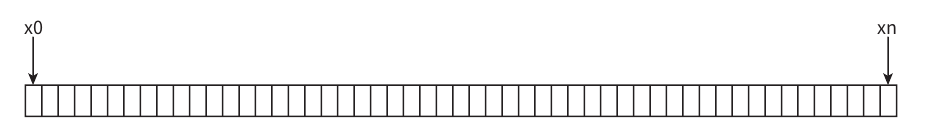
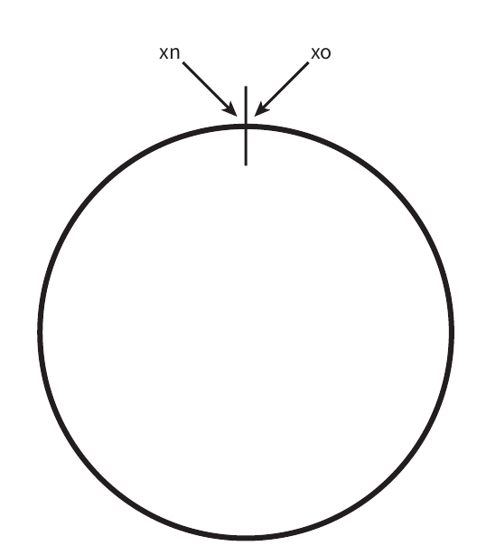
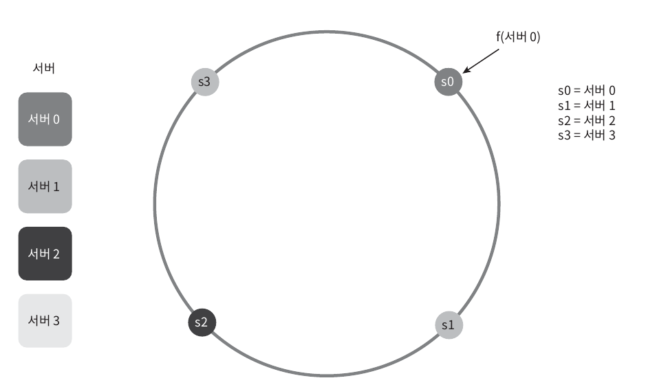
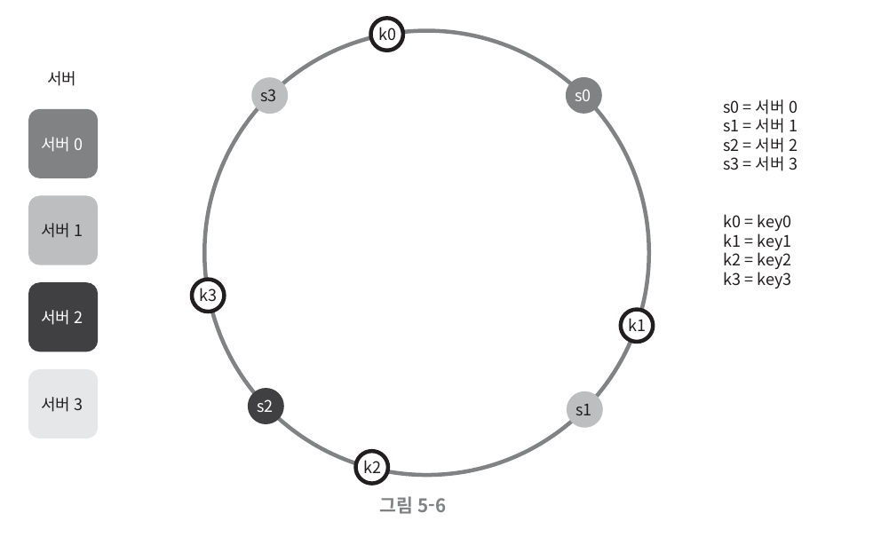
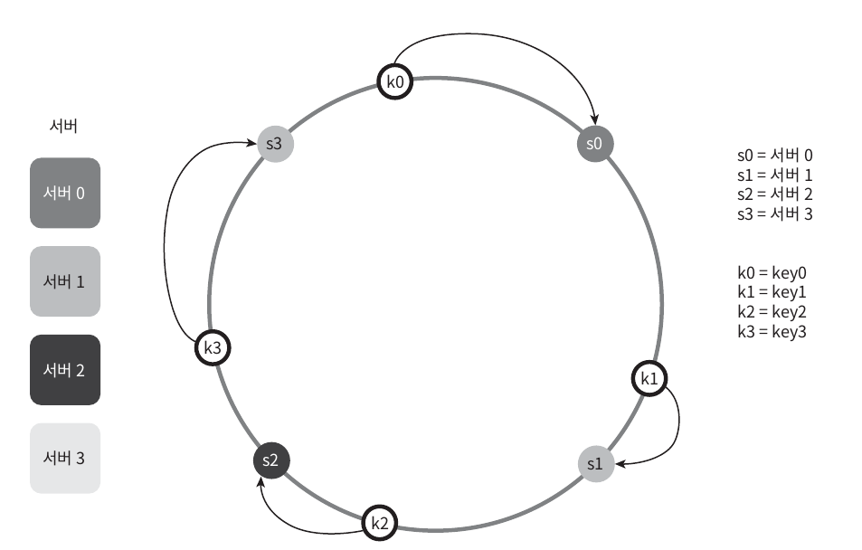
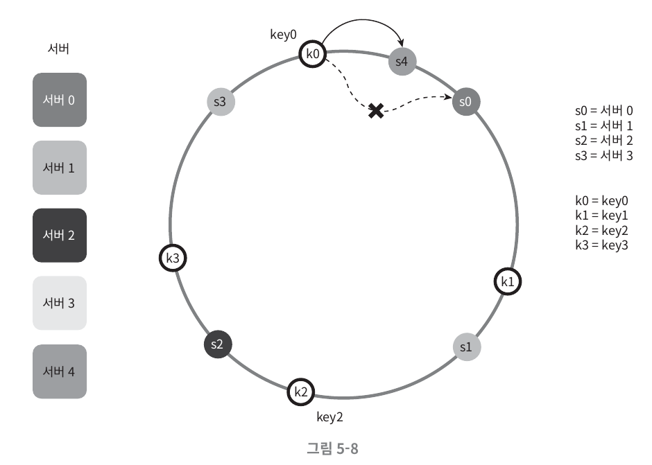
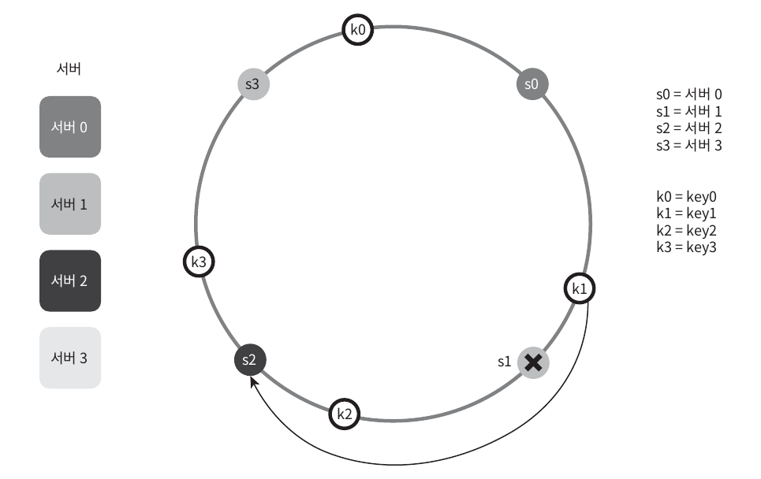
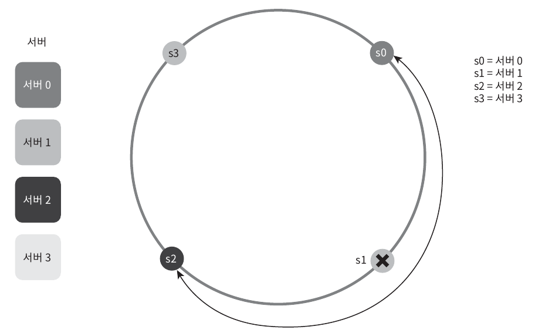
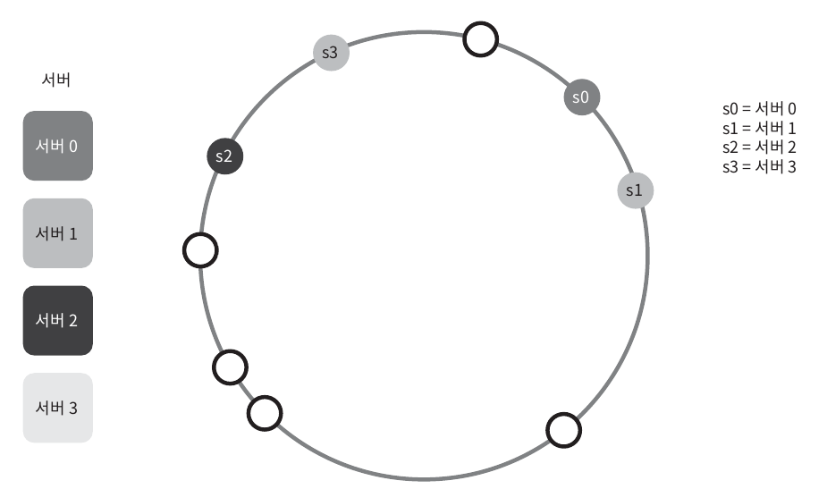
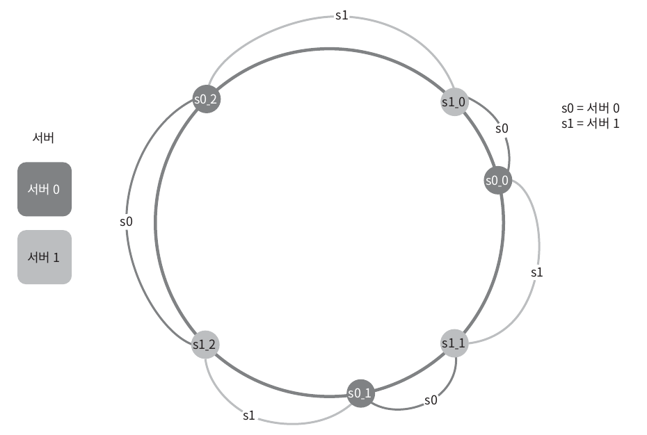

# 해시 키 재배치(rehash) 문제
N개의 캐시 서버를 사용하기 위해선 서버들에게 균등하게 부하을 주어야한다. 그러기 위해 해시를 이용하여 인덱스를 생성하는 편이다.

```
serverIndex = hash(key)%N (N은 서버의 개수이다)
```
그런데 이런 식의 해싱은 서버를 균등하게 부하를 주지 못하기 때문에 문제가 생긴다.

# 안정 해시
해시 테이블 크기가 조정될 때 평균적으로 오직 k/n개의 키만 재배치하는 해시 기술. (k: 키 개수, n: 슬롯)

## 구성 요소
### 해시 공간과 해시 링
해시 함수로 `SHA-1`의 해시 공간 범위는 0 ~ 2^160-1 까지이다. 이처럼 예를 들어 x1 ~ xn-1까지 해시 공간을 가진다고 가정하자.


이 해시 공간의 양쪽을 구부리면 다음과 같다.


### 해시 서버
서버 IP나 이름을 이 링 위의 어떤 위치에 대응시킬 수 있다.


### 해시 키


해시 키 재배치를 위해 캐시할 키를 해시 링 위에 올리자.

### 서버 조회

해당 키의 위치로부터 시계 방향으로 링을 탐색해서 만나는 첫 번째 서버를 할당한다.

### 서버 추가

k0는 s0을 할당받았다가 s4가 생기면, s4가 먼저 탐색되므로 s4를 할당받는다.

### 서버 제거

s1을 삭제하면 그 다음으로 탐색되는 s2을 할당받는다. 결론적으로 s2는 k1과 k2를 할당하게 된다.

## 기본 구현법의 문제
기본적으로 안정 해시 알고리즘은 다음 절차로 이루어진다.
- 서버와 키를 균등 분포 해시 함수로 해시 링에 배치
- 키의 위치에서 링을 시계 방향으로 탐색하다 만나는 최초의 서버가 키가 저장될 서버

이 접근법에는 2가지 문제가 있다.

### 1. 서버가 추가되거나 삭제될 경우, 파티션 크기가 불균등해진다.

예를 들어, s1이 삭제가 되면 s0와 s2 사이의 공간이 훨씬 많아지는 문제가 생긴다.

### 2. 키의 균등 분포를 달성하기 어렵다.

예를 들어, 위 그림처럼 s1과 s3에는 어떤 키도 저장되지 않는다.

## 해결책1: 가상 노드
하나의 서버를 가르키는 노드를 여러개 만드는 것이 `가상 노드`이다.
예를 들어 ,s0를 가르키는 노드는 s0_0, s0_1, s0_2 세 개의 노드가 사용된다.


- 장점
  - 가상 노드를 늘릴 수록 키의 분포는 점점 더 균등해진다.
- 단점
  - 가상 노드 데이터를 저장할 공간이 더 필요해진다.
