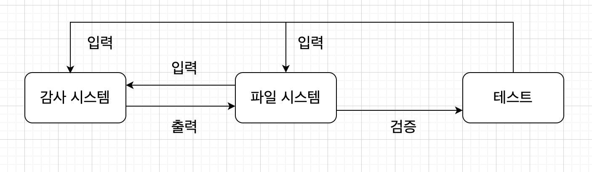
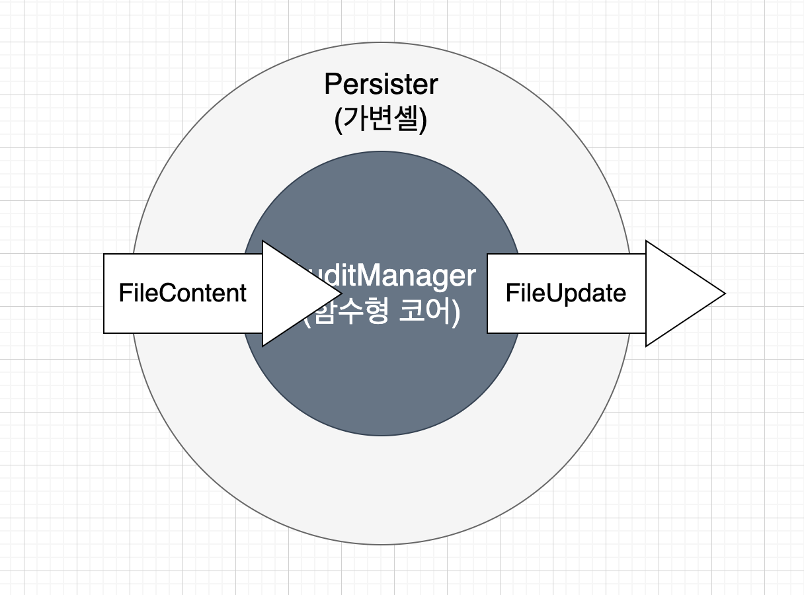
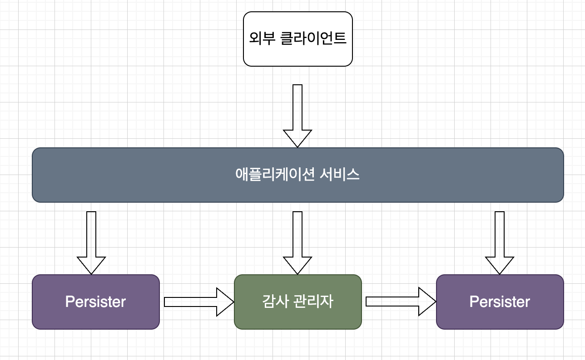

# 4. 좋은 담위 테스트의 4대 요소
## 4.1 좋은 단위 테스트의 4대 요소 자세히 살펴보기

- 회귀 방지
- 리팩터링 내성
- 빠른 피드백
- 유지 보수성

### 4.1.1 첫 번째 요소: 회귀 방지
코드는 재산이 아니라 책임이다. 코드 베이스가 커질수록 잠재먹인 버그에 더 많이 노출된다. 따라서 회귀에 대한 보호를 개발하는 것이 중요하다.

- 테스트 중에 실행되는 코드의 양
- 코드 복잡도
- 코드의 도메인 유의성

실행되는 코드가 많을수록 테스트에서의 회귀가 나타날 가능성이 높다. 최상의 보호를 위해선 해당 라이브러리, 프레임워크 ,외부 시스템을 테스트 범주에 포함시켜 의존성을 검증하는 것이다.

### 4.1.2 두 번째 요소: 리팩터링 내성

> 테스트를 빨간색으로 바꾸지 않고 기본 애플리케이션 코드를 리팩터링할 수 있는지에 대한 척도

기반 코드를 수정하면 정상적으로 작동되어도 테스트가 빨간색으로 바뀌는 상황이 있다. 이를 `거짓 양성`(허위 경보)이라고 한다.

테스트가 지속 가능한 성장을 하는 매커니즘은 다음과 같다.
- 기존 기능이 고장 났을 때 테스트가 조기 경고를 제공한다.
- 코드 변경이 회기로 이어지지 않을 것이라고 확신하게 된다.

거짓 양성은 이 두 가지 이점을 방해한다. 이는 타당한 실패도 무시하게 만든다. 또한, 거짓 양성이 빈번하면 테스트 스위트에 대한 신뢰가 서서히 떨어진다.

### 4.1.3 무엇이 거짓 양성의 원인인가?
테스트와 SUT의 구현 세부 사항이 많이 결합할수록 허위 경보가 더 많이 생긴다. 테스트는 최종 사용자 관점에서 행해져야 한다.

<!-- 내용 이해 못함 -->

## 4.2 첫 번째 특성과 두 번째 특성 간의 본질적인 관계
### 4.2.1 테스트 정확도 극대화

|  |  | 작동 | 고장 |
| --- | --- | --- | --- |
|  | **테스트 통과** | 올바른 추론 | 2종 오류(거짓 음성) |
|  | **테스트 실패** | 1종 오류(거짓 양성) | 올바른 추론 |

회귀 방지를 통해 거짓음성을 예방할 수 있다. 반대로 거짓 양성의 경우에는 리팩터링 내성이 도움이 된다.

> 테스트 정확도 = 신호(발견된 버그 수) / 소음(허위 경보 발생 수)

허위 경보가 울리지 않더라도 버그를 찾을 수 없는 테스트는 소용이 없다. 반대로 모든 버그를 찾더라도 소음이 많으면 테스트 정확도가 0에 가까워진다.

### 4.2.2 거짓 양성과 거짓 음성의 중요성: 역학 관계
거짓 양성(허위 경보)와 거짓 음성(알려지지 않은 버그)는 초기에 중요하지 않다. 초기에는 코드에 대한 기억이 생생하기 때문이다. 그러나 코드 베이스가 커질수록 이런 잡음들은 테스트의 신뢰를 떨어뜨린다. 따라서, 중대형 프로젝트에선 이런 거짓에 대한 주의가 필요하다.

## 4.3 세 번째 요소와 네 번째 요소: 빠른 피드백과 유지 보수성
- 테스트가 얼마나 이해하기 어려운가? : 테스트 크기는 작을수록 가독성이 올라간다. 테스트 코드를 일등 시민 취급하지 말고 제품 코드만큼 중요하다.
- 테스트가 얼마나 실행하기 어려운가?: 프로세스 외부 의존성으로 작동 시, 의존성을 해결하는데에 많은 시간을 할애하게 된다.

## 4.4 이상적인 테스트를 찾아서

- 회귀 방지
- 리팩터링 내성
- 빠른 피드백
- 유지 보수성

네 가지 테스트의 합산을 통해 점수를 내야 테스트를 평가할 수 있다. 

### 4.4.1 이상적인 테스트를 만들 수 있는가?
이상적인 테스트는 만들 수 없다. 왜냐하면 회귀 방지, 리펙터링 내성, 빠른 피드백은 상호 배타적이기 때문이다. 따라선 ,셋 중 하나를 희생해야 나머지 둘을 최대로 할 수 있다. 어떤 것을 희생해야할지 극단적인 사례를 통해 확인해보자.

### 4.4.2 극단적인 사례1: 엔드 투 엔드 테스트
엔드 투 엔드는 많은 코드를 테스트 하기에 회귀 방지를 할 수 있다. 또한 거짓 양성에 면역되어 리팩터링 내성도 우수하다. 왜냐하면 최종 사용자 관점에서 세부 구현은 중요하지 않기 때문이다. 그러나 엔드 투 엔드는 느리다는 단점이 존재한다.

### 4.4.3 극단적인 사례2: 간단한 테스트
```java
@Test
void tests() {

    User sut = new User;

    String name = sut.getName();

    assertThat(name).isEqualTo("Jhon Smith");
}
```

위와 같이 단순한 코드는 거짓 양성이 생길 가능성이 적어 리팩터링 내성에 강력하다. 또한 매우 빠른 피드백도 가능하다. 그러나 너무 짧이 때문에 회귀 방지에 특화되지 않는다.

### 4.4.4 극단적인 사례3: 깨지기 쉬운 테스트

UserRepository를 통해 findById()를 수행한다고 가정해보자. findById()에는 어떤 SQL이 들어가도 결과만 같으면 상관없다. 이는 리팩터링 내성에 취약하다는 단점이 있다.

### 4.4.5 이상적인 테스트를 찾아서: 결론
| 이름 | 리펙터링 내성 | 회귀 방지 | 빠른 피드백 |
| ------ | :-: | :-: | :-: |
| **엔드 투 엔드 테스트** | O | O | X |
| **간단한 테스트** | O | X | O |
| **깨지기 쉬운 테스트** | X | O | O |

어떤 특성도 0이 되어서는 안된다. 그렇다면 어떤 요소를 희생해야할까?

`리팩터링 내성`을 포기할 수 없는 이유는 테스트에 리팩터링 내성이 있거나 없거나 둘 중 하나이기 때문이다. 따라서, 리펙터링 내성을 최대화하면서 `빠른 피드백`과 `회귀 방지`에서 적절한 타협을 이루는 거이 좋다.

> **[ CAP 정리 ]**
>
> 분산 데이터 저장소는 다음 세 가지 보증 모두를 동시에 제공할 수 없다.
>
> - 일관성: 모든 읽기가 최근의 응답을 반영할 것
> - 가용성: 모든 요청이 응답을 수신하는 것
> - 분할 내성: 네트워크 분할에도 시스템이 계속 작동할 것

## 4.5 대중적인 테스트 자동화 개념 살펴보기
테스트 피라미드는 테스트 유형의 적절한 비율을 나타내는 모형이다.

단위 테스트는 속도가 가장 빠르기 때문에 가장 많이 있는 반면, 엔드 투 엔드 테스트의 경우 속도가 매우 느리다는 점때문에 많은 비율을 차지하지 않는다. 그러나 어느 계층이더라도 리펙터링 내성을 최대로 가져가야하는 거은 변하지 않는다.

### 4.5.2 블랙박스 테스트와 화이트박스 테스트 간의 선택

> - 블랙박스 테스트: 시스템 내부 구조를 몰라도 시스템 기능을 검사하는 테스트 방법. 무엇을 해야하는지를 중심으로 구축
> - 화이트박스 테스트: 애플리케이션 내부 작업을 검증. 소스 코드에서 파생

|  | 회귀 방지 | 리펙터링 내성 |
|---|---|---|
| **화이트박스 테스트** | 좋음 | 나쁨 |
| **블랙박스 테스트** | 나쁨 | 좋음 |

화이트박스 테스트의 경우, 소스코드에 의존하기 때문에 테스트 대상 코드과 결합하게 된다. 이는 테스트가 쉽게 깨질 수 있어 리팩터링 내성이 나쁘다.

리팩터링 내성은 타협할 수 없기 때문에 블랙바스 테스트를 통해 진행하는 것이 바람직하다. 그러나 테스트를 분석할 때는 화이트박스 방법을을 사용할 수 있다. 결국 두 가지 방법을 적절히 사용하는 것이 좋다.

<br/>

# 5. 목과 테스트 취약성

## 5.1 목과 스텁 구분
테스트 더블은 크게 목(목, 스파이)과 스텁(스텁, 더미, 페이크)로 나뉜다.

- 목은 외부로 나가는 상호 작용을 모방하고 검사하는데 도움이 됨. 즉, SUT가 상태를 변경하기 위한 의존성을 호출하는 것에 해당
- 스텁은 내부로 들어오는 상호 작용을 모방하는 데 도움이 된다. 즉, SUT가 입력 데이ㅓ를 얻기 위한 의존성을 호출하는 것에 해당

목은 SUT와 관련 의존성 간의 상호작용을 모방하고 검사한다. 반면 스텁은 모방만 한다.

### 5.1.2 도구로서의 목과 테스트 대역으로서의 목
```java
class emailTest {

    @Mock
    private IEmailGateway mock;

    @Test
    void sending_a_greetings_email() {
        Controller sut = new Controller(mock);

    }
}
```

여기서 사용되는 mock은 테스트 대역으로서의 목을 의미하고, Mock 클래스는 도구로서의 목을 의미한다.
또한 만약 mock 인스턴스에 sutb 추가된 경우 목이 아님을 명심하자.

### 5.1.3 스텁으로 상호 작용을 검증하지 말라
```java
@Test
void creting_a_report() {
    var stub = Mockito.mock(IDatabase.class);
    when(stub.getNumberOfUser()).thenReturn(10);

    var sut = new Controller(stub);
    Report report = sut.createReport();

    verify(stub).getNumberOfUser();
}
```

최종 결과가 아닌 사항을 검증하는 `과잉 명세`의 예시이다. 테스트가 스텁과의 상호작용을 확인하기 때문에 테스트 취약성을 초래한다.

### 5.1.4 목과 스텁 함께 쓰기
```java
@Test
void purchase_fails_when_not_enough_inventory() {
    var storeMock = Mockito.mock(IStore.class);
    when(stub.hasEnoughInventory(eq(Product.Shampoo, eq(5))))
        .thenReturn(false);
    var sut = new Customer();

    bool success = sut.purchase(
        storeMock,
        Product.Shampoo,
        5
    );

    assertThat(sucess).isEqualTo(false);
    verify(storeMock).removeInventory(Product.Shampoo, 5, Times.Never);
}
```
이 경우, hasEnoughInventory()에 응답을 설정한 다음 removeInventory()가 호출됬는지 검즈안다. 이는 위배되지 않는 예시이다.

### 5.1.5 목과 스텁은 명령과 조회에 어떻게 관련돼 있는가?
명령과 조회를 하나의 메서드에서 분리시켜야 한다는 CQS 원칙에 따라 목과 스텁을 구분해서 사용해야 한다. `명령`의 경우 반환 값이 없지만 부작용을 초래하기 때문에 목을 사용해햐하고, `조회`의 경우 값을 반환하지만 부작용이 없기 때문에 스텁을 사용하는 것이 좋다.

## 5.2 식별할 수 있는 동작과 구현 세부 사항
테스트에 거짓 양성(허위 경보)가 발생하는 이유는 코드의 구현 세부 사항과 결합돼 있기 때문이다. 이런 강결합을 피하기 위해 다음과 같은 사항들을 고려해야한다.

### 5.2.1 식별할 수 있는 동작은 공개 API와 다르다
모든 코드는 2차원으로 분류 된다.
- 공개 API 또는 비공개 API
- 식별할 수 있는 동작 또는 구현 세부 사항

공개, 비공개 API의 경우 접근제어자(private, public 등)을 통해 구분이 가능하다.  식별할 수 있는 동작일면 다음 중 하나여야 한다.

- 클라이언트가 목표를 달성하는 데 도움이 되는 연산을 노출하라. 연산은 계산 수행 혹은 부작용을 초래 혹은 둘 다하는 메서드이다.
- 클라이언트가 목표를 달성하는 데 도움이 되는 상태를 노출하라. 상태는 시스템의 현재 상태다.

잘 설계된 API는 `식별할 수 있는 동작`과 `공개 API`가 일치한다. 그러나 종종 시스템의 구현 세부 사항이 노출되기 시작한다.

### 5.2.2 구현 세부 사항 유출: 연산의 예

이름을 업데이트하는 메서드가 있다고 해보자. 이를 변경하기 위해 UserController는 name 필드에 직접 접근하여 값을 변경할 수도 있다.

```java
class User {

    public String name;

    public String normalizeName(String name) {
        String result = String.trim(name);

        if(result.length > 50)
            return result.subtring(0, 50);

        return result;
    }
}


class UserController {

    public void renameUser(String newName, int userId) {
        User user = getUserFromDatabase(userId);

        String normalizedName = user.nomalizeName(newName);
        user.name = normalizedName;

        saveUserToDatabase(user);
    }
}
```


- `이름`: 식별할 수 있는 동작이면서 공개 API
- `정규화된 이름`: 구현 세부 사항이면서 공개 API -> **구현 세부 사항 유출**

따라서 이를 setter에 정규화된 이름을 비공개하여 해결이 가능하다.

```java
class User {

    private String name;

    public void setName(String newName) {
        this.name = normalizeName(newName);
    }

    public String normalizeName(String name) {
        String result = String.trim(name);

        if(result.length > 50)
            return result.subtring(0, 50);

        return result;
    }
}


class UserController {

    public void renameUser(String newName, int userId) {
        User user = getUserFromDatabase(userId);

        user.setName(normalizedName);

        saveUserToDatabase(user);
    }
}
```

### 5.2.3 잘 설계된 API와 캡슐화
장기적으로 코드베이스 유지 보수를 위해 캡슐화가 중요하다. 그 이유는 코드 복잡도를 줄여 개발 속도 향상과 버그 감소를 이룰 수 있다.

- 구현 세부 사항을 숨겨 내부 손상을 방지함
- 연산이 클래스의 불변성을 위반하지 않도록 함

### 5.2.4 구현 세부 사항 유출: 상태의 예

## 5.3 목과 테스트 취약성 간의 관계
### 5.3.1 육각형 아키텍처 정의
애플리케이션 계층과 도메인 계층(비즈니스 로직)을 분리하여 조직의 경쟁력을 향상시킨다. 

- 도메인 계층과 애플리케이션 서비스 계층 간의 관심사 분리
- 애플리케이션 내부 통신: 애플리케이션 계층 -> 도메인 계층으로의 단방향 의존만 지향한다. 따라서, 외부 환경과 도메인 계층을 완전 격리가 가능하다.
- 애프리케이션 간의 통신: 외부 애플리케이션은 도메인 계층에 직접 접근할 수 없다.

### 5.3.2 시스템 내부 통신과 시스템 간 통신
연산을 수행하기 위한 여러 클래스 간의 협력은 식별할 수 있는 동작이 아니므로 구현 세부 사항에 해당한다. 따라서, 이런 시스템 내부 통신은 테스트가 취약해진다.

반대로 시스템 간 통신은 두 애플리케이션 간 소통을 위한 형식이 정해져있기 때문에 목을 사용한 테스트가 간편하다. 반대로 시스템 내부 통신은 구현 세부 사항과 결합되며 리팩터링 내성 지표가 미흡해진다.

### 5.3.3 시스템 내부 통신과 시스템 간 통신의 예
예를 들어
- 고객이 상점에서 제품을 구매한다
- 매장 내 제품 수량이 충분하면
    - 재고가 상점에서 줄어든다.
    - 고객에게 이메일로 영수증을 발송한다.
    - 확인 내역을 반환한다.

```java
class CustomerController {
    public bool purchase(int customerId, int productId, int quantity) {
        Customer customer = _customerRepository.getById(customerId);
        Product product - _productRepository.getById(productId);

        bool isSuccess = customer.purchase(_mainStore, product, quantity);

        if(isSuccess) {
            _emailGateway.sendReceipt( customer.email, product.name, quantity);
        }
        return isSuccess;
    }
}
```

이 코드에 대해 `이메일 발생 테스트`와 재고가 `충분할 때 구매가 되는 테스트`를 진행해보자.

```java
@Test
void successful_purchase() {
    var mock = Mockito.mock(IEmailGateway);
    var sut = new CustomerController(mock);

    bool isSuccess = sut.purchase(1, 2, 5);

    assertThat(isSuccess).isEqualTo(true);
    verify(mock).sendReceipt(eq("customer@email.com"), eq("shampoo"), 5);
}
```


```java
@Test
void successful_purchase() {
    var storeMock = Mockito.mock(IStore);
    when(storeMock.hasEnoughInventory()).thenReturn(true);
    var customer = new Customer();

    bool isSuccess = customer.purchase(1, 2, 5);

    assertThat(isSuccess).isEqualTo(true);
    verify(storeMock).removeInventory();
}
```

두 번째 테스트의 경우 목표를 달성하는데 도움이 되는 연산이나 상태가 아니기 때문에 테스트하기가 어려워졌다. 또한 removeInventory()의 경우 구현 세부 사항이기에 취약한 테스트라고 볼 수 있다.

## 5.4 단위 테스트의 고전파와 런던파 재고
런던파는 무분별한 목 사용으로 구현 세부 사항에 결합돼 테스트에 리팩터링 내성이 없게 된다. 그러나 고전파는 테스트간의 공유하는 의존성만 교체하기 때문에 리팩터링 내성이 저하되는 문제를 해결할 수 있다.

### 5.4.1 모든 프로세스 외부 의존성을 목으로 해야 하는 것은 아니다

만약 외부 애플리케잇ㄴ을 통해서만 외부 의존성이 접근 가능한 경우에 이를 대체할 순 없다. 그러나 외부 시스템에 대해 프록시 같은 역할을 하고 클라이언트가 직접 접근할 수 없다면, 하위 호환성 요구 사항은 사라진다. 이러한 시스템 통신 패턴은 구현 세부 사항이 된다.

예를 들어 애플리케이션 데이터베이스는 외부 시스템도 접근이 불가능하다. 완전히 통제권을 가진 프로세스 외부 의존성에 목을 사용하면 깨지기 쉬운 테스트로 이어진다. 따라서 데이터베이스와 애플리케이션은 하나의 시스템으로 취급해야 하다. 이는 피드백 속도가 저하된다는 문제가 있긴 하다.

### 5.4.2 목을 사용한 동작 검증

<br/>

# 6. 단위 테스트 스타일
## 6.1 단위 테스트 세 가지 스타일
### 6.1.1 출력 기반 테스트
SUT에 입력을 넣고 생성되는 출력을 점검하는 방식. 다른 말로 함수형이라고도 한다.

### 6.1.2 상택 기반 ㅅ테스트
작업이 완료된 후 시스템 상태를 확인하는 것. 상태란 SUT나 협력자 중 하나 또는 데이터베이스나 파일 시스템 등과 같은 프로세스 외부 의존성의 상태등을 의미한다.

### 6.1.3 통신 기반 테스트
목을 통해 SUT와 협력자 간의 통신을 검증


## 6.2 단위 테스트 스타일 비교
### 6.2.1 회귀 방지와 피드백속도 지표로 스타일 비교하기

**[회귀 방지 지표]**
- 테스트 중 실행되는 코드의 양
- 코드 복잡도
- 도메인 유의성

통신 기반 테스트에서의 느린 속도를 제외하고 거의 비슷한 피드백 속도롤 자랑한다.

### 6.2.2 리팩터링 내성 지표로 스타일 비교하기
- 출력 기반 테스트는 테스트 대상 메서드에만 결합되므로 거짓 양성 방지가 가장 우수
- 상태 기반 테스트는 거짓 양성이 되기 쉽다. 
- 통신 기반 테스트는 대부분 허위 경보에 가장 취약하다. 

### 6.2.3 유지 보수성 지표로 스타일 비교하기
유지 보수성은 다음 두가지 특성을 정의 된다.
- 테스트를 이해하기 얼마나 어려운가
- 테스트를 실행하기 얼마나 어려운가

**출력 기반 테스트의 유지 보수성**

항상 짧고 간결하므로 유지 보수가 쉽다. 또한 프로세스 외부 의존성을 다루지 않는다. 따라서 가장 좋다.

**상태 기반 테스트의 유지 보수성**

종종 출력 기반보다 더 많은 공간을 차지하여, 출력 기반보다 유지 보수가 쉽지 않다.
상태 기반의 경우 직접 필드마다 검증을 해야하기 때문에 검증부가 길어지는 단점이 있다. 따라서 클래스가 값에 해당하고 값 객체로 변환할 수 있을 때만 효과적이다. 그렇지 않으면 `코드 오염`으로 이어진다.


**통신 기반 테스트의 유지 보수성**

가장 유지보수가 어렵다. 테스트 대역과 상호 작용 검증을 설정해야하므로 공간 차지가 심하다.

## 6.3 함수형 아키텍처 이해

### 6.3.1 함수형 프로그래밍이란?
수학적 함수를 사용한 프로그래밍이다. 호출 횟수에 상관없이 주어진 입력에 대해 동일한 출력을 생성한다. 이는 테스트가 짧고 간결하여 유지 보수성이 뛰어나고 거짓 양성 빈도가 낮다. 그러나 `숨은 입출력`에 의해 테스트가 어려워질 수 있다.

**[숨은 입출력 유형]**
- 부작용: 메서드 시그니처에 표시되지 않은 출력. 인스턴스 상태 변경 등 부작용 발생
- 예외
- 내외부 상태에 대한 참조: DateTime.now()와 같은 함수 결과에 영향을 주는 라이브러리

해당 메서드의 호출을 반환 값으로 대체할 수 있는지 확인항 `참조 투명성`을 가지도록 해야 한다.

```java
public Comment addComment(String text) {
    var comment = new Comment(text);
    _comments.add(comment); // <- 부작용
    return comment;
}
```

### 6.3.2 함수형 아키텍처란?

부작용을 완전히 없애는 것은 불가능하므로 부작용을 비즈니스 연산 끝으로 몰아서 비즈니스 로직을 부작용과 분리한다.

- 결정을 내리는 코드(= 불변 코어): 부작용이 필요 없기 때문에 수학적 함수를 사용해 작성
- 해당 결정에 따라 작용하는 코드(= 가변 셸): 수학적 함수로 내려진 결정을 DB의 변경 등과 같이 가시적인 부분으로 변환

1. 가변 셸은 모든 입력을 수집한다.
2. 함수형 코어는 결정을 생성한다.
3. 셸은 결정을 부작용으로 변환한다.

## 6.4 함수형 아키텍처와 출력 기반 테스트로의 전환

```java
 public class AuditManager
{
    private readonly int _maxEntriesPerFile;
    private readonly string _directoryName;

    public AuditManager(int maxEntriesPerFile, string directoryName)
    {
        _maxEntriesPerFile = maxEntriesPerFile;
        _directoryName = directoryName;
    }

    public void AddRecord(string visitorName, DateTime timeOfVisit)
    {
        string[] filePaths = Directory.GetFiles(_directoryName);
        (int index, string path)[] sorted = SortByIndex(filePaths);

        string newRecord = visitorName + ';' + timeOfVisit.ToString("s");

        if (sorted.Length == 0)
        {
            string newFile = Path.Combine(_directoryName, "audit_1.txt");
            File.WriteAllText(newFile, newRecord);
            return;
        }

        (int currentFileIndex, string currentFilePath) = sorted.Last();
        List<string> lines = File.ReadAllLines(currentFilePath).ToList();

        if (lines.Count < _maxEntriesPerFile)
        {
            lines.Add(newRecord);
            string newContent = string.Join("\r\n", lines);
            File.WriteAllText(currentFilePath, newContent);
        }
        else
        {
            int newIndex = currentFileIndex + 1;
            string newName = $"audit_{newIndex}.txt";
            string newFile = Path.Combine(_directoryName, newName);
            File.WriteAllText(newFile, newRecord);
        }
    }
}
```
1. 작업 디렉터리에서 전체 파일 목록을 검색
2. 인덱스별로 정렬
3. 아직 감사 파일이 없으면 첫 번째 파일 생성
4. 감사 파일이 있으면 최신파일 가져오고, 파일 항목 수가 한계에 도달한 경우 새 레코드를 추가하거나 새 파일 생성



AuditManager 클래스는 파일 시스템과 연관되어 있어 그대로 테스트하기 어렵다. 또한 파일 읽고 내용 확인 후 삭제해야만 한다. 이는 유지 보수성을 떨어뜨린다. 파일 시스템은 거기다 느리기 까지하다.

### 6.4.2 테스트를 파일 시스템에서 분리하기 위한 목 사용
```c#
public class AuditManager
    {
        private readonly int _maxEntriesPerFile;
        private readonly string _directoryName;
        private readonly IFileSystem _fileSystem;

        public AuditManager(
            int maxEntriesPerFile,
            string directoryName,
            IFileSystem fileSystem)
        {
            _maxEntriesPerFile = maxEntriesPerFile;
            _directoryName = directoryName;
            _fileSystem = fileSystem;
        }

        public void AddRecord(string visitorName, DateTime timeOfVisit)
        {
            string[] filePaths = _fileSystem.GetFiles(_directoryName);
            (int index, string path)[] sorted = SortByIndex(filePaths);

            string newRecord = visitorName + ';' + timeOfVisit.ToString("s");

            if (sorted.Length == 0)
            {
                string newFile = Path.Combine(_directoryName, "audit_1.txt");
                _fileSystem.WriteAllText(newFile, newRecord);
                return;
            }

            (int currentFileIndex, string currentFilePath) = sorted.Last();
            List<string> lines = _fileSystem.ReadAllLines(currentFilePath);

            if (lines.Count < _maxEntriesPerFile)
            {
                lines.Add(newRecord);
                string newContent = string.Join("\r\n", lines);
                _fileSystem.WriteAllText(currentFilePath, newContent);
            }
            else
            {
                int newIndex = currentFileIndex + 1;
                string newName = $"audit_{newIndex}.txt";
                string newFile = Path.Combine(_directoryName, newName);
                _fileSystem.WriteAllText(newFile, newRecord);
            }
        }

        private (int index, string path)[] SortByIndex(string[] files)
        {
            return files
                .Select(path => (index: GetIndex(path), path))
                .OrderBy(x => x.index)
                .ToArray();
        }

        private int GetIndex(string filePath)
        {
            // File name example: audit_1.txt
            string fileName = Path.GetFileNameWithoutExtension(filePath);
            return int.Parse(fileName.Split('_')[1]);
        }
    }

    public interface IFileSystem
    {
        string[] GetFiles(string directoryName);
        void WriteAllText(string filePath, string content);
        List<string> ReadAllLines(string filePath);
    }

```

IFileSystem을 통해 파일 시스템 작업을 캡슐화 한다.
이를 통해 파일 시스템에 작업에 대한 목 수행이 가능하다. 파일 변경과 같은 통신의 부작용은 애플리케이션의 식별할 수 있는 동작이다. 따라서 이는 목을 사용하기에 타당한 유스케이스이다.

이 방법은 목을 통해 복잡한 설정이 발생하여 유지 보수성이 뛰어나지 않다.

### 6.4.3 함수형 아키텍처로 리팩터링하기
Persister라는 가변 셸을 두어 파일에 둘러싼 결정만 책임지게 할 수 있다.



```c#
public class AuditManager
{
    private readonly int _maxEntriesPerFile;

    public AuditManager(int maxEntriesPerFile)
    {
        _maxEntriesPerFile = maxEntriesPerFile;
    }

    public FileUpdate AddRecord(
        FileContent[] files,
        string visitorName,
        DateTime timeOfVisit)
    {
        (int index, FileContent file)[] sorted = SortByIndex(files);

        string newRecord = visitorName + ';' + timeOfVisit.ToString("s");

        if (sorted.Length == 0)
        {
            return new FileUpdate("audit_1.txt", newRecord);
        }

        (int currentFileIndex, FileContent currentFile) = sorted.Last();
        List<string> lines = currentFile.Lines.ToList();

        if (lines.Count < _maxEntriesPerFile)
        {
            lines.Add(newRecord);
            string newContent = string.Join("\r\n", lines);
            return new FileUpdate(currentFile.FileName, newContent);
        }
        else
        {
            int newIndex = currentFileIndex + 1;
            string newName = $"audit_{newIndex}.txt";
            return new FileUpdate(newName, newRecord);
        }
    }

    private (int index, FileContent file)[] SortByIndex(
        FileContent[] files)
    {
        return files
            .Select(file => (index: GetIndex(file.FileName), file))
            .OrderBy(x => x.index)
            .ToArray();
    }

    private int GetIndex(string fileName)
    {
        // File name example: audit_1.txt
        string name = Path.GetFileNameWithoutExtension(fileName);
        return int.Parse(name.Split('_')[1]);
    }
}
    
```
```c#
public struct FileUpdate
{
    public readonly string FileName;
    public readonly string NewContent;

    public FileUpdate(string fileName, string newContent)
    {
        FileName = fileName;
        NewContent = newContent;
    }
}

public class FileContent
{
    public readonly string FileName;
    public readonly string[] Lines;

    public FileContent(string fileName, string[] lines)
    {
        FileName = fileName;
        Lines = lines;
    }
}
```
```c#
    public class Persister
    {
        public FileContent[] ReadDirectory(string directoryName)
        {
            return Directory
                .GetFiles(directoryName)
                .Select(x => new FileContent(
                    Path.GetFileName(x),
                    File.ReadAllLines(x)))
                .ToArray();
        }

        public void ApplyUpdate(string directoryName, FileUpdate update)
        {
            string filePath = Path.Combine(directoryName, update.FileName);
            File.WriteAllText(filePath, update.NewContent);
        }
    }
```

Persister는 파일을 가져오거나 파일을 업데이트하는 기능만을수행한다. AuditManager는 전체적인 흐름만을 수행하며 업데이트같은 애용들은 명령을 반환하므로서 해결한다. 이제 이렇게 분리된 내용들을 service에서 호출하기만 하면 된다.

```c#
public class ApplicationService
{
    private readonly string _directoryName;
    private readonly AuditManager _auditManager;
    private readonly Persister _persister;

    public ApplicationService(string directoryName, int maxEntriesPerFile)
    {
        _directoryName = directoryName;
        _auditManager = new AuditManager(maxEntriesPerFile);
        _persister = new Persister();
    }

    public void AddRecord(string visitorName, DateTime timeOfVisit)
    {
        FileContent[] files = _persister.ReadDirectory(_directoryName);
        FileUpdate update = _auditManager.AddRecord(
            files, visitorName, timeOfVisit);
        _persister.ApplyUpdate(_directoryName, update);
    }
}
```



```c#
public class Tests
{
    [Fact]
    public void A_new_file_is_created_when_the_current_file_overflows()
    {
        var sut = new AuditManager(3);
        var files = new FileContent[]
        {
            new FileContent("audit_1.txt", new string[0]),
            new FileContent("audit_2.txt", new string[]
            {
                "Peter; 2019-04-06T16:30:00",
                "Jane; 2019-04-06T16:40:00",
                "Jack; 2019-04-06T17:00:00"
            })
        };

        FileUpdate update = sut.AddRecord(
            files, "Alice", DateTime.Parse("2019-04-06T18:00:00"));

        Assert.Equal("audit_3.txt", update.FileName);
        Assert.Equal("Alice;2019-04-06T18:00:00", update.NewContent);
        Assert.Equal(
            new FileUpdate("audit_3.txt", "Alice;2019-04-06T18:00:00"),
            update);
        update.Should().Be(
            new FileUpdate("audit_3.txt", "Alice;2019-04-06T18:00:00"));
    }
}
```
파일 시스템에 대해 목 사용(의존성 추가) 없이 새로운 레코드 생성에 대한 테스트가 가능해졌다.

## 6.5 함수형 아키텍처의 단점 이해하기

### 6.5.1 함수형 아키텍처 적용 가능성
의사 결정 절차의 중간 결과에 따라 플세스 외부 의존성에서 추가 데이터를 질의할 수 있다. 예를 들어 지난 24시간 동안 방문 횟수가 임계치를 초과하면 감사 시스템이 방문자의 접근 레벨을 확인해야 한다고 해보자. 접근 레벨을 확인하기 위해 addRecord()에서 IDatabase를 전달받아 사용할 수 있다. 그러나 이는 `숨은 입력`이 발생한다. 따라서 더 이상 출력 기반 테스트가 불가능하다.

해결 방법 두 가지

1. 애플리케이션 서비스 전면에서 한 번에 수집
2. 애플리케이션 서비스가 AutidManager.addRecord() 수행하기 전에 isAccessLevelCheckRequired()를 수행한 후에 만약 true를 반환하면 접근 레벨을 DB에서 가져와 addRecord()에 전달한다.

첫번째 방법은 매번 모든 데이터를 가져오므로 성능 저하가 발생한다. 두번째는 데이터베이스 호출 결정 여부가 AuditManager가 아니라 서비스로 넘어간다.

<br/>

# 7. 가치 있는 단위 테스트를 위한 리팩터링
