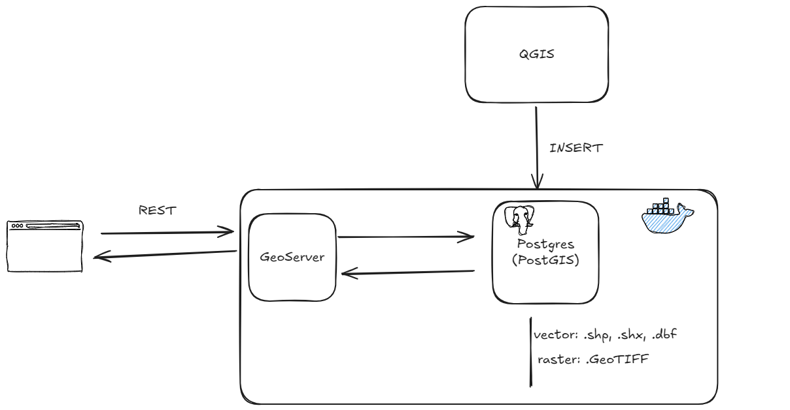
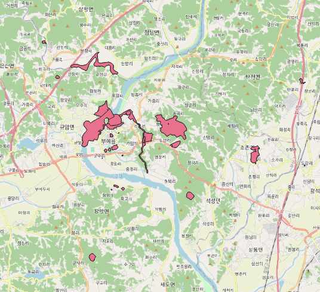
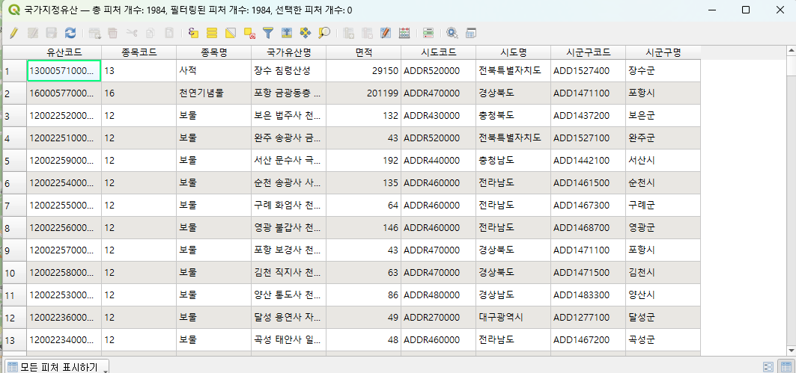

# ✏️ 기획
벡터 이미지와 레스터 이미지를 지도에 표시해주는 서비스를 개발하려고 한다.
현재 사용으로 기본 기술스택은 다음과 같다.

- RDB: PostgreSQL + PostGIS(GIS 파일 저장 익스텐션)
- 서버: GeoServer
- 프론트: HTML+CSS+JS
- DB 관리: QGIS

## 아키텍처


## 개발 순서
1. PostgreSQL의 PostGIS 익스텐션 설치
2. 로컬에서 QGIS와 PostgreSQL 연결
3. QGIS를 통해 PostgreSQL에 파일(shp, dbf 등) 삽입
4. GeoServer의 저장소에 PostgreSQL 연결 및 PostgreSQL에 있는 레이어 가져와서 저장하기
5. 프론트에서 GeoServer API 콜하기 

데이터베이스는 어떻게 띄울 것인가?
- supabase로 띄우기

## 데이터
- 벡터 데이터 (문화유산)
    - shp: 점선면을 구성하는 실제 좌표
    - dbf: shp에 대한 위치 속성 정보를 가지는 데이터베이스 파일
    - shx: shp와 dbf를 연결해주는 인덱스 파
- 레스터 데이터 (항공사진)
    - GeoTiff: 이미지 파일 + 지리 참조 정보인 TIFF 파일
        - 실제 지구상의 위치와 그림 파일을 견결한 지도

### 백터 데이터
- [국가유산청 문화재 공간정보 서비스](https://www.data.go.kr/data/15089320/fileData.do)



이렇게 지도 상에 단순하게 섹터가 그려진다. 이 섹터에 대한 내용은 다음 사진처럼 데이터베이스 형태로 뽑아서 사용이 가능하다.



### 레스터 데이터
- [국토교통부 국토리지정보원 항공사진](https://www.data.go.kr/data/15059918/fileData.do)

## 기능
<!-- TODO 250910 회의 후 추가 예정 -->

<br/>

# 🛠️개발 과정
## 주의할 점
좌표계의 경우, 데이터들은 기본적으로 `EPSG:5179`를 사용한다. 따라서, QGIS 상에서 업로드 할 때에도 기본 좌표계를 설정하여 삽입해야 한다.

GeoServer의 API 엔드포인트의 경우, `http://localhost:8080/geoserver/wms`을 사용해야 한다.


# GeoServer

클라이언트가 GeoServer에 요청할 수 있는 정보는 크게 OGC 표준 서비스와 REST API를 통해 나뉩니다. 지도 표출 및 데이터 분석에 주로 사용되는 OGC 표준 서비스는 WMS, WFS, WCS가 대표적입니다.

각 서비스가 어떤 정보를 제공하는지 주요 요청과 URL 예시와 함께 정리해 드릴게요.

(※ URL 예시에서 http://localhost:8080/geoserver/는 본인의 GeoServer 주소, test:국가지정유산은 [작업공간명]:[레이어명]으로 변경해서 사용하세요.)

## WMS (Web Map Service) 🗺️
지도 이미지를 요청하는 서비스입니다. 서버에서 모든 스타일링을 적용해 완성된 그림 파일을 클라이언트에 전달하므로, 빠르고 간단하게 지도를 화면에 띄울 수 있습니다.

### 1. GetCapabilities
목적: 해당 WMS 서비스가 제공하는 레이어 목록, 사용 가능한 스타일, 지원 좌표계, 이미지 포맷 등 서비스의 모든 메타데이터 정보를 XML 형식으로 받아옵니다.

URL 예시:
```
http://localhost:8080/geoserver/test/wms?service=WMS&version=1.1.0&request=GetCapabilities
```

### 2. GetMap
목적: 특정 지역(BBOX), 크기(WIDTH/HEIGHT), 레이어(LAYERS)에 해당하는 지도 이미지를 요청합니다. 가장 핵심적인 WMS 요청입니다.

URL 예시:
```
http://localhost:8080/geoserver/test/wms?service=WMS&version=1.1.0&request=GetMap&layers=test:국가지정유산&bbox=14127089,4511599,14144421,4521494&width=768&height=436&srs=EPSG:3857&format=image/png
```

### 3. GetFeatureInfo
목적: GetMap으로 생성된 지도 이미지의 특정 픽셀 좌표(X, Y)에 어떤 피처(객체)가 있는지 속성 정보를 요청합니다. 지도 클릭 시 팝업을 띄우는 기능에 사용됩니다.

URL 예시:
```
http://localhost:8080/geoserver/test/wms?service=WMS&version=1.1.0&request=GetFeatureInfo&layers=test:국가지정유산&query_layers=test:국가지정유산&info_format=application/json&bbox=14127089,4511599,14144421,4521494&width=768&height=436&x=350&y=200&srs=EPSG:3857
```

## WFS (Web Feature Service) 📊
원본 벡터 데이터 자체를 요청하는 서비스입니다. 좌표, 속성값 등이 포함된 GeoJSON, GML 등의 형식으로 데이터를 받아오므로, 클라이언트에서 직접 스타일링, 클러스터링, 데이터 분석 등을 수행할 수 있습니다.

### 1. GetCapabilities
목적: WFS 서비스가 제공하는 피처 타입(레이어) 목록, 지원하는 기능 및 버전 정보 등 메타데이터를 XML 형식으로 받아옵니다.

URL 예시:
```
http://localhost:8080/geoserver/test/wfs?service=WFS&version=1.0.0&request=GetCapabilities
```

### 2. DescribeFeatureType
목적: 특정 피처 타입(레이어)의 데이터 구조(스키마), 즉 어떤 속성 필드(컬럼)들이 있고 각 필드의 데이터 타입이 무엇인지 정보를 요청합니다.

URL 예시:
```
http://localhost:8080/geoserver/test/wfs?service=WFS&version=1.0.0&request=DescribeFeatureType&typeName=test:국가지정유산
```

### 3. GetFeature
목적: 특정 피처 타입(레이어)의 실제 데이터를 요청합니다. WFS의 가장 핵심적인 요청이며, 필터링(CQL/ECQL)을 통해 원하는 조건의 데이터만 선택적으로 가져올 수 있습니다.

URL 예시 (모든 데이터 요청):
```
http://localhost:8080/geoserver/test/wfs?service=WFS&version=1.0.0&request=GetFeature&typeName=test:국가지정유산&outputFormat=application/json
```

URL 예시 (필터링 적용):
```
http://localhost:8080/geoserver/test/wfs?service=WFS&version=1.0.0&request=GetFeature&typeName=test:국가지정유산&outputFormat=application/json&cql_filter=l_kor_nm LIKE '%사지%'
```

## 기타 서비스
### WCS (Web Coverage Service) 🛰️
목적: 래스터 데이터(위성영상, 수치표고모델 등)의 원본 데이터 값을 요청하는 서비스입니다. WMS가 이미지를 주는 것과 달리, WCS는 특정 지역의 고도값, 밴드값 등 실제 데이터 값을 반환합니다.

### REST API ⚙️
목적: GeoServer의 설정 및 관리를 자동화하기 위한 인터페이스입니다. 작업공간/저장소/레이어 생성 및 삭제, 스타일 업로드, 데이터 업로드 등 GeoServer 관리자 페이지에서 할 수 있는 대부분의 작업을 코드를 통해 수행할 수 있습니다.

URL 예시 (레이어 정보 조회):
```
http://localhost:8080/geoserver/rest/layers/test:국가지정유산.json
```