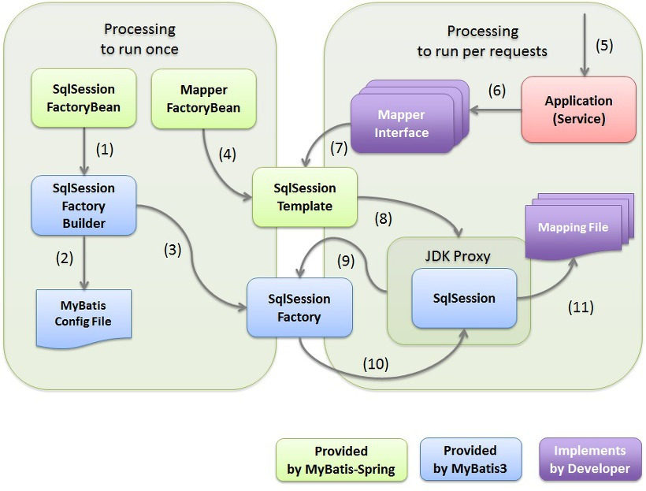

# 레거시 코드
## Mybatis

ORM 이전에 MyBatis를 이용하여 SQL 쿼리를 정의하는 XML 파일을 의미한다.

### sql-mapper.xml
```xml
<?xml version="1.0" encoding="UTF-8"?>
<!DOCTYPE mapper PUBLIC "-//mybatis.org//DTD Mapper 3.0//EN" "http://mybatis.org/dtd/mybatis-3-mapper.dtd">
<mapper namespace="egovframework.example.sample.service.impl.SampleMapper">

	<resultMap id="sample" type="egovframework.example.sample.service.SampleVO">
		<result property="id" column="id"/>
		<result property="name" column="name"/>
		<result property="description" column="description"/>
		<result property="useYn" column="use_yn"/>
		<result property="regUser" column="reg_user"/>
	</resultMap>

	<insert id="insertSample" parameterType="SampleVO">

			INSERT INTO SAMPLE
				( ID
				  , NAME
				  , DESCRIPTION
				  , USE_YN
				  , REG_USER )
			VALUES ( #{id}
				  , #{name}
				  , #{description}
				  , #{useYn}
				  , #{regUser} )

	</insert>

	<update id="updateSample">

			UPDATE SAMPLE
			SET ID=#{id}
				, NAME=#{name}
				, DESCRIPTION=#{description}
				, USE_YN=#{useYn}
				  WHERE ID=#{id}

	</update>

	<delete id="deleteSample">

			DELETE FROM SAMPLE
			WHERE ID=#{id}

	</delete>

	<select id="selectSample" resultMap="sample">

			SELECT
				ID, NAME, DESCRIPTION, USE_YN, REG_USER
			FROM SAMPLE
			WHERE ID=#{id}

	</select>

    <select id="selectSampleList" parameterType="searchVO" resultType="egovMap">

			SELECT
				ID, NAME, DESCRIPTION, USE_YN, REG_USER
			FROM SAMPLE
			WHERE 1=1
			<if test="searchKeyword != null and searchKeyword != ''">
		        <choose>
		            <when test="searchCondition == 0">
						AND	ID LIKE '%' || #{searchKeyword} || '%'
					</when>
		            <when test="searchCondition == 1">
						AND	NAME LIKE '%' || #{searchKeyword} || '%'
					</when>
				</choose>
			</if>
			ORDER BY ID DESC
			LIMIT #{recordCountPerPage} OFFSET #{firstIndex}
	</select>

	<select id="selectSampleListTotCnt" parameterType="searchVO" resultType="int">

			SELECT COUNT(*) totcnt
			FROM SAMPLE
			WHERE 1=1
			<if test="searchKeyword != null and searchKeyword != ''">
		        <choose>
		            <when test="searchCondition == 0">
						AND ID LIKE '%' || #{searchKeyword} || '%'
					</when>
		            <when test="searchCondition == 1">
						AND	NAME LIKE '%' || #{searchKeyword} || '%'
					</when>
				</choose>
			</if>
	</select>
</mapper>
```
- `<resultMap>`
    - DB 조회 결과를 자바 객체 속성에 자동 매핑해주는 규칙
- `<insert id="insertSample">` - 데이터 생성
    - SampleVO 객체에 담긴 데이터를 SAMPLE 테이블에 새로 추가합니다.
    - #{...}: SampleVO 객체의 속성값(예: #{id}는 sampleVO.getId()의 값)을 가져와 SQL 쿼리에 삽입합니다.

- `<update id="updateSample">` - 데이터 수정
    - id가 일치하는 행의 데이터를 전달된 파라미터 값으로 수정합니다.

- `<delete id="deleteSample">` - 데이터 삭제
    - id가 일치하는 행을 SAMPLE 테이블에서 삭제합니다.

 - `<select id="selectSample">` - 단일 데이터 조회
    - id가 일치하는 하나의 데이터를 조회합니다.
    - resultMap="sample": 조회 결과를 맨 위에서 정의한 sample 규칙에 따라 SampleVO 객체로 변환하여 반환합니다.

- `<select id="selectSampleList">` - 목록 조회 (검색 및 페이징)
    - 검색 조건에 맞는 데이터 목록을 페이징 처리하여 조회합니다.
    - parameterType="searchVO": SearchVO라는 객체를 파라미터로 받으며, 이 안에는 검색어(searchKeyword)나 페이지 정보(firstIndex 등)가 들어있습니다.
    - `<if>` / `<choose>` / `<when>`: **동적 SQL(Dynamic SQL)**입니다. searchKeyword가 비어있지 않을 때만 WHERE 조건문을 동적으로 추가하여 검색 기능을 구현합니다.
    - resultType="egovMap": 전자정부프레임워크에서 제공하는 특별한 Map 객체입니다. DB 컬럼의 스네이크 케이스(reg_user)를 자바의 카멜 케이스(regUser)로 자동 변환해줘서 편리합니다.
    - LIMIT / OFFSET: 데이터베이스 페이징 처리 구문입니다. 특정 위치(OFFSET)에서부터 정해진 개수(LIMIT)만큼의 데이터만 가져옵니다.

- `<select id="selectSampleListTotCnt">` - 전체 개수 조회
    - selectSampleList와 동일한 검색 조건으로, 전체 데이터가 총 몇 개인지`(COUNT(*))`를 조회합니다.
    - "총 128개의 게시물"처럼 표시하거나, 전체 페이지 수를 계산하는 등 페이징 처리에 필수적입니다


### Mapper 설정 클래스
이렇게 작성된 sql-mapper.xml을 configuration에서 설정해야한다.
```java
@Configuration
@MapperScan(basePackages="egovframework.example.sample.service.impl")
public class EgovConfigMapper {

	@Bean
	public SqlSessionFactoryBean sqlSessionFactory(@Qualifier("dataSource") DataSource dataSource) throws IOException {
		PathMatchingResourcePatternResolver pmrpr = new PathMatchingResourcePatternResolver();
		SqlSessionFactoryBean sqlSessionFactoryBean = new SqlSessionFactoryBean();
		sqlSessionFactoryBean.setDataSource(dataSource);
		sqlSessionFactoryBean.setConfigLocation(pmrpr.getResource("classpath:/egovframework/sqlmap/example/sql-mapper-config.xml"));
		sqlSessionFactoryBean.setMapperLocations(pmrpr.getResources("classpath:/egovframework/sqlmap/example/mappers/*.xml"));
		return sqlSessionFactoryBean;
	}

	@Bean
	public SqlSessionTemplate sqlSession(SqlSessionFactory sqlSessionFactory) {
		return new SqlSessionTemplate(sqlSessionFactory);
	}

}
```

- `@MapperScan` : `@Mapper` 붙은 Mapper 인터페이스 주입 받음
- `sqlSessionFactory()`
    - DataSource 설정
    - `.setConfigLocation`: MyBatis 설정 XML 지정 (sql-mapper-config.xml)
    - `.setMapperLocations`: MyBatis Mapper XML 파일 지정
- `sqlSession()`
    - SqlSessionTemplate: 개발자가 직접 SQL 세션 여닫는 것을 대신 처리해줌.

### Mapper 클래스
```java
@Mapper
public interface SampleMapper {
	void insertSample(SampleVO vo) throws Exception;
}
```

### Service 클래스
```java
@Service
@RequiredArgsConstructor
public class EgovSampleServiceImpl extends EgovAbstractServiceImpl implements EgovSampleService {

	private static final Logger LOGGER = LoggerFactory.getLogger(EgovSampleServiceImpl.class);

	/** SampleDAO */
	private final SampleMapper sampleDAO;

	/** ID Generation */
	private final EgovIdGnrService egovIdGnrService;

	@Override
	public String insertSample(SampleVO vo) throws Exception {
		LOGGER.debug(vo.toString());

		/** ID Generation Service */
		String id = egovIdGnrService.getNextStringId();
		vo.setId(id);
		LOGGER.debug(vo.toString());

		sampleDAO.insertSample(vo);
		return id;
	}
}
```

- MyBatis Mapper XMl과 연동된 SamppleMapper를 DI 받는다.
- 사용 시, Mapping된 sampleDAO.insertSample(vo);를 통해 DB에 접근한다.

## MyBatis에서도 N+1이 생긴다.
N+1은 프레임워크 문제가 아니라 데이터를 조회하는 로직 패턴으로 발생한다.

### 예시
```java
public interface BoardMapper {
    // 1. 게시글 목록 조회
    List<BoardVO> getBoardList();
    
    // 2. 특정 사용자 정보 조회
    UserVO getUserById(String userId);
}
```

```java
@Service
public class BoardService {

    @Autowired
    private BoardMapper boardMapper;

    public List<BoardWithUserDTO> getBoardsWithUsers() {
        // --- 1. 첫 번째 쿼리 실행 ---
        // 게시글 목록을 가져옵니다. (SQL 1번 실행)
        List<BoardVO> boards = boardMapper.getBoardList();
        
        List<BoardWithUserDTO> result = new ArrayList<>();

        // --- 2. 목록을 반복하며 N번의 추가 쿼리 실행 ---
        // 각 게시글에 대해 작성자 정보를 가져옵니다. (SQL N번 실행)
        for (BoardVO board : boards) {
            // ❗ 루프 안에서 DB 쿼리를 호출하는 것이 바로 N+1의 원인입니다.
            UserVO user = boardMapper.getUserById(board.getUserId()); 
            result.add(new BoardWithUserDTO(board, user));
        }

        return result; // 총 1 + N 번의 쿼리가 실행됨
    }
}
```

이 예시의 경우, JOIN을 이용하여 하나의 쿼리에서 모든 정보가 출력될 수 있도록 해야한다.
```xml
<select id="getBoardListWithUser" resultType="BoardWithUserDTO">
    SELECT
        B.BOARD_ID,
        B.TITLE,
        U.USER_ID,
        U.USER_NAME
    FROM
        BOARD B
    JOIN
        USER U ON B.USER_ID = U.USER_ID
</select>
```

## SQL Injection에 대해
`${...}` 대신 `#{...}` 사용하기

-  `#{...}`
    - PreparedStatement
    - 파라미터를 처리하도록 만듬
    - 예를 들어, `#{userId}`에 `'1' OR '1'='1'`을 넣어도 해당 내용이 치환되는게 아니라 해당 값을 가지는 userID를 찾도록 하기 때문에 안전함.
    ```xml
    <select id="getUser" resultType="User">
        SELECT * FROM USERS WHERE USER_ID = #{userId}
    </select>
    ```
- `${...}`
    - 문자열 치환
    - 문자열을 바로 대입해버림
    - userId에 '1' OR '1'='1'을 입력하면, 최종적으로 실행되는 SQL은 다음과 같이 변조
        ```sql
        SELECT * FROM USERS WHERE USER_ID = '1' OR '1'='1'
        ```
