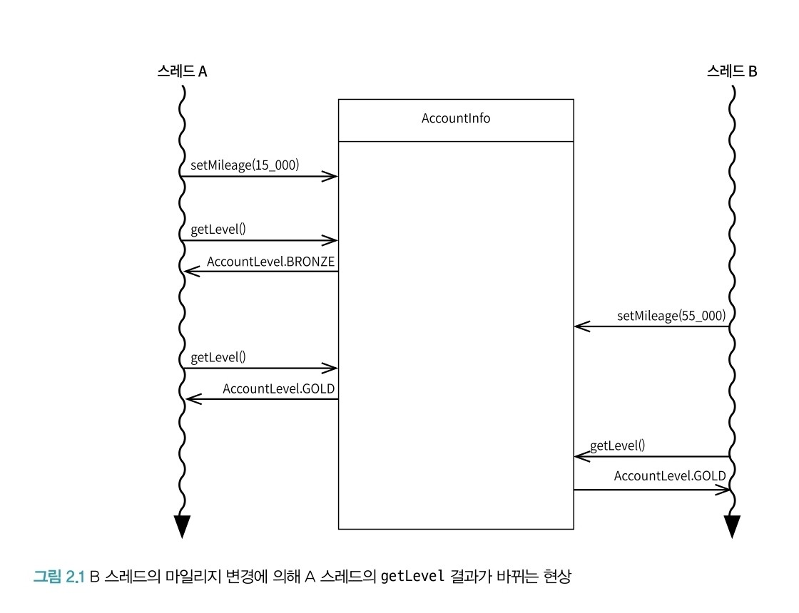
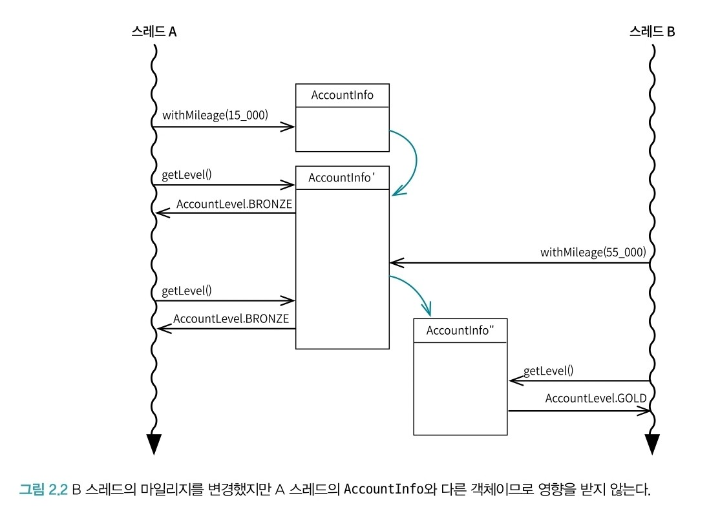
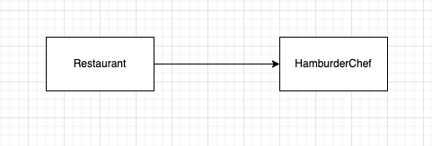
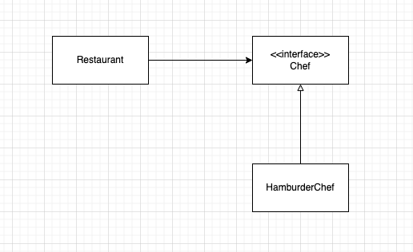
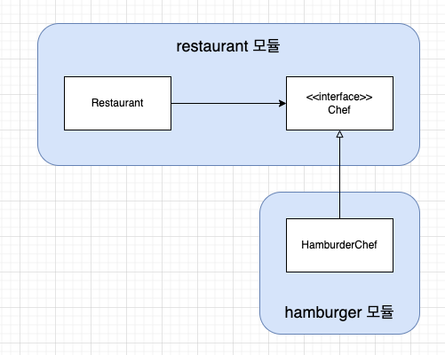
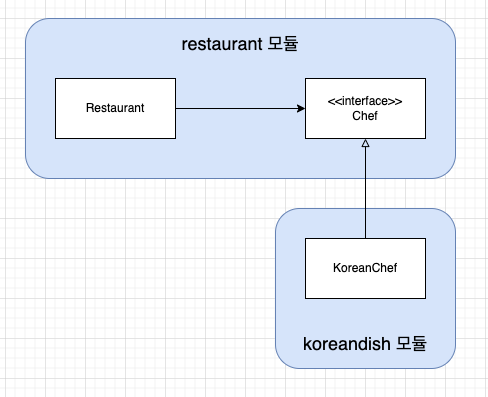
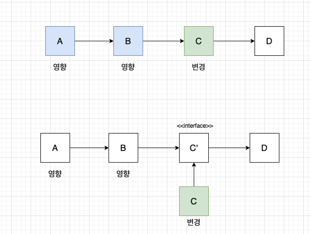
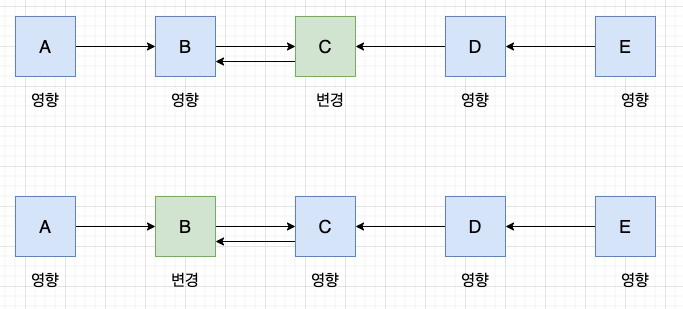

# 1. 절차지향과 비교하기
- 순차지향: 코드를 위에서 아래로 순차적으로 실행한다는 의미
- 절차지향: Procedure(=Function)이므로 `함수지향 프로그래밍`을 의미

### 스프링에서의 순차지향 프로그래밍 예시
```java
public class RestaurantService {

    private final StoreRepository repository;

    public long calculateRevenue(long restaurantId) {
        List<Store> stores = storeRepository.findByRestaurantId(restaurantId);
        long revenue = 0;
        for (Store store : stores) {
            for (Order order: store.getOrders()) {
                for (Food food : ordet.getFoods()) {
                    revenue += food.getPrice();
                }
            }
        }
    }
}
```
위 코드는 서비스에 모든 일들을 수행하도록 만들어둔 코드이다. 자세히 보면 Store, Order, Food는 단순히 값을 가지는 VO의 역할만을 수행하게 된다. 따라서, 이는 순차지향 프로그래밍으로 볼 수 있다.

> 빈약한 도메인 모델로 볼 수 있다. 

따라서, calculateRevenue와 같은 일을 객체 내부에서 수행할 수 있도록 수정해야 하낟.

- 객체에 어떤 메시지를 전달할 수 있게 됐다.
- 객체가 어떤 책임을 지게 됐다.
- 객체는 어떤 책임을 처리하는 방법을 스스로 알고 있다.

### 객체가 책임을 가지도록 하자.
- 업무 효율 향상. 객체가 어떻게 협력할지, 어떤 책임을 맡을지 결정하면 병렬로 작업이 가능하다.
- 개개인은 자신이 담당한 객체의 책임만 제대로 구현하면 된다.

이런한 책임을 제대로 수행됐는지 확인하기 위해 `테스트 코드`를 작성하낟.

## 1.1 책임과 역할
절차지향 프로그래밍은 프로시저 마다 책임을 분리시키고, 객체지향 프로그래밍은 객체에게 책임을 분리시켜 사용한다.
책임은 객체를 통해서만 이루어지지 않고, 라이브러리 (absolute, abs 등)을 통한 책임도 가능하다.

### C는 왜 객체지향이 아닐까?
단순히 class 문법을 지원하지 않아서가 아니다. Java를 예로 들면 인터페이스를 통해 추상화된 역할을 할당할 수 있고, 그 역할을 객체에게 부여할 수 있다.
```java
interface Calculable {
    long calculateRevenue();
    long calculateProfit();
}

class Order implements Calculable {

    private List<Calculable> items;

    @Override
    public long calculateRevenue() {
        // 생략
    }
}
```

이를 객체지향의 다형성이라고 하며, 이를 통해 추후 Order에 새로운 필드(Calculable를 상속받는)가 생성되어도, 필드 및 메서드를 수정할 필요가 없어 훨씬 유지보수가 쉬워진다는 강점이 있다.

## 1.2 TDA 원칙
Tell, Don't Ask의 약자로 객체에게 직접 시키라는 의미이다.
```java
public class Shop {
    
    public void sell(Account account, Product product) {
        long price = product.getPrice();
        long mileage = account.getMoney();
        if (mileage >= price) {
            account.setMoney(mileage - price);
        }
    }
}


public class Account {
    
    private long money;
}
```
위 코드에서 Shop 객체에선 Account와 Product의 Getter를 통해 값을 받아와 계산하는 메서드가 존재한다. 이를 아래와 같이 바꾸자.

```java
public class Shop {
    
    public void sell(Account account, Product product) {
        long price = product.getPrice();
        long mileage = account.getMoney();
        if (mileage >= price) {
            account.setMoney(mileage - price);
        }
    }
}

public class Account {
    
    private long money;

    public boolean canAfford(long amount) {
        return money >= amount;
    }

    public void withdraw(long amount) {
        money -= amount;
    }
}
```

Shop에서 사용자의 잔액을 물어보지 않고, Account에게 잔액을 물어보도록 바꾼다. 이는 아까의 내용가 결을 같이하는 내용이다. **Getter와 Setter는 프로그래머로 하여금 절차지향적 사고를 하도록 유도한다.** 따라서, 객체를 데이터 덩어리가 아니라 책임을 가질 수 있도록 수정하는 것이 좋다.

<br/>

# 2. 객체의 종류

## VO
Color 객체는 객체이면서 동시에 값을 가진다.
```java
class Color {
    
    public int r;
    public int g;
    public int b;
    
    // 생략
}
```
여기서 말하는 값이란 무엇일까? 먼저 값의 특징에 대해 알아보자.

- 값의 특징
    - 불변성 : 값은 변하지 않는다 (숫자 1은 영훤히 숫자 1이다.)
    - 동등성 : 값의 가치는 항상 같다. (숫자 1은 언제나 숫자 1의 가치를 갖는다.)
    - 자가 검증 : 값은 그자체로 올바르다. (1은 1.01도 아니고, 그냥 1 그자체이다.)

### 불변성
소프트웨어는 불확실성의 복잡계이다. 따라서 코드에 대한 불변성을 보장하여 설계를 간단하게 해소시킬 수 있고, 여러 버그에 대한 대비도 가능하다.

자바에선 이런 불변성을 보장하기 위해 `final` 을 제공한다. 따라서, 값 객체에는 final을 통해 멤버 변수의 불변성을 보장하자.

```java
class Color {
    
    public final int r;
    public final int g;
    public final int b;
    
    // 생략
}
```

그러나 멤버 변수의 객체가 final로 지정되어 있어도 이는 불변성을 보장하지 않을 수 있다. 아래 코드처럼 Rectangle의 멤버 변수가 final이 아니면 얼마든지 변경될 수 있기 때문이다.

```java
class Color {
    
    public final int r;
    public final int g;
    public final int b;
    public final Rectangle rentangle;
    
    // 생략
}

class Rectangle extends Shape {

    private int width;
}
```

또한, 메서드에 대해서도 불변성이 보장되어야 한다. 예를 들어, 랜덤으로 R,G,B 값을 반환하는 랜덤 메서드의 경우가 이에 포함된다.

마찬가지로 상속을 통해서도 불변성이 깨질 수 있다. 만약 상속하는 부모 클래스의 멤버 변수가 final이 아닌 경우, 자연스럽게 이를 상속받은 자식 클래스는 불변성을 보장하지 않는다.

**가변 객체에선 메서드 결과가 예측되지 않는다.**
```java
public class AccountInfo {

    private long mileage;

    public AccountLevel getLevel() {
        if (mileage > 100_000) return AccountLevel.DIAMOND;
        else if (mileage > 50_000) return AccountLevel.GOLD;
        // 생략
    }
}
```

위에서 마일리지 값에 따라 AccountLevel이라는 ENUM을 반환하도록 구현되어 있다. 이 메서드를 두 개의 스레드가 참조할 경우 어떤 사태가 발생할까?



하나의 AccountInfo를 사용하기 때문에 getLevel()의 결과가 매번 달라질 수 있다. 따라서, 이를 방지하기 위해 AccountInfo의 mileage를 불변 멤버로 변경 후, 매번 새로운 AccountInfo를 반환하도록 수정하면 된다.

```java
public class AccountInfo {

    private final long mileage;

    public AccountLevel getLevel() {
        if (mileage > 100_000) return AccountLevel.DIAMOND;
        else if (mileage > 50_000) return AccountLevel.GOLD;
        // 생략
    }

    public AccountInfo withMileage(long mileage) {
        return new AccountInfo(this.id, mileage);
    }
}
```




### 동등성
> 동일성: 두 객체의 주소값이 같은 경우
>
> 동등성: 두 객체의 내용이 같은 경우

VO는 불확실성을 해결하기 위해 사용된다. 이는 동일성 보단 동등성이라는 개준을 사용한다.
기존 Java의 hashCode()와 equals()는 메모리 주소를 바탕으로 객체의 동일성을 검증한다. 이 때문에 값 객체에 대한 동등성 비교를 위해 추가적인 오버라이딩이 필요하다. 그러나 신뢰할 수 있는 객체를 만든다면 이런 불필요하고 가독성을 해치는 오버라이딩이 필요하지 않다. 이에 대한 차선책으로 Lombok의 @Value를 사용해보자.

### 자가 검증
> 한번 생성된 VO의 멤버 변수에는 이상한 값이 들어 있을 수 없다.

VO를 호촐하는 곳에서 if-else, try-catch와 같은 불필요한 검증 코드를 추가하지 않고, VO 자체에서 검증하는 코드를 추가하여야 한다.

## DTO
데이터 전송에 사용되는 객체로 단순하게 데이터를 하나하나 일일히 나열해서 전달하는게 불편해서 하나로 묶어 보내려고 만들어진 객체를 의미한다.

### 1. DTO는 어디에도 사용될 수 있다.
프로세스 간, 계층 간 데이터 이동 뿐 아니라 머세드를 호룿하는데 필요한 데이터를 한 번에 묶어서 보낼 때 어느 곳에서나 사용될 수 있다.

### 2. DTO에서 Getter, Setter가 꼭 필요하지 않다.
Java에선 보통 멤버 변수를 private으로 선언하여 직접 접근을 막고 있다. 캡슐화 관점에서 Getter, Setter를 통한 멤버변수 접근이나 public을 통한 직접 접근이나 모두 같은 코드로 받아들인다. 따라서, 관습적으로 private을 선언하여 오히려 멤버 변수 접근을 어렵게 하지 않고 public을 통해 자유롭게 접근할 수 있도록 하는 것도 하나의 방법이 될 수 있다.

> **public 변수를 지양하는 이유**
>
> `user.getEmail()`은 행동에 의존하는 것이고, `user.email`은 속성에 의존하는 것이다. 따라서, 캡슐화의 정보 은닉을 달성하기 위해 private와 Getter를 사용하는 것이다.

### 3. DTO는 데이터베이스 뿐 아니라 여러 계층에서 사용이 가능하다.
request, response 뿐 아니라 Controller - Service에서도 사용될 수 있다.

> **@Data 롬복 사용을 지양하는 이유**
>
> @Data 추가 시, 게터, 세터, toString 등의 어노테이션이 자동으로 적용된다. 그러나 이는 `이 객체는 객체가 아니라 그저 데이터 덩어리다` 라고 선언하는 것과 같아 개발자로 하여금 데이터 위주의 사고를 하도록 만든다고 생각한다.

## DAO
DB와의 연결 관리, 데이터 CRUD 수행, 보안 취약성 고려한 쿼리 작성 등의 역할을 하는 객체이다

이 객체를 만드는 이유는 도메인 로직과 DB 연결 로직을 분리하여 핵심인 비즈니스 로직의 가독성을 향상시키기 위해서이다.

### 자가 점검: 도메인 로직과 DB 로직이 분리되었는가?

- 서비스 컴포넌트에서 SQL 쿼리를 만든다.
- 서비스 컴포넌트에서 LIKE 검색을 위한 "%" 문자열을 앞뒤로 붙인다.
- 서비스 컴포넌트에서 EntityManager를 이용한다.
- 서비스 컴포넌트에서 JPA 관련 클래스나 인터페이스를 임포트한다.
- 주 DB로 RDB를 사용할 경우, 서비스 컴포넌트의 코드를 변경해야만 다른 도큐먼트 데이터베이스로 전환할 수 있다.


## Entity
### 도메인 엔티티
어떤 도메인 문제를 해결하고자 만들어진 클래스 모델로, 일반적인 소프트웨어 개발 분야에서 엔티티라함은 이를 의미한다.
예를 들어, 은행이라는 비즈니스 도메인을 해결하기 위해 Account, Transaction, Money라는 도메인 엔티티가 주어진다. 이 중 Account, Transaction은 식별자, 생명주기를 가지는 등 특별한 기능을 갖는데 이들을 주로 도메인 엔티티라고 부른다.

도메인 엔티티의 특징은 두 가지이다.

> 1. 식별 가능한 식별자를 갖는다.
>
> 2. 비즈니스 로직을 갖는다.

### DB 엔티티
데이터베이스를 표현하기 위해 유무형의 객체로서 서로 구별되는 것을 의미한다.

### JPA 엔티티
@Entity가 붙어 테이블과 1:1 대응이 되는 개념이다. 이는 DB 엔티티에 더 가까운 의미를 가진다. 따라서 엔티티보단 영속성 객체라고 부리는 것이 더 맞는 표현이다. @Entity는 영속성 객체를 만들기 위한 도구일 뿐이다.

> **도메인 엔티티와 JPA 엔티티를 구분짓는 이유**
> 
> 엔티티를 JPA 엔티티로 인식할 경우, RDB에 종속되는 프로그램을 만들 확률이 높다.
> 만약 MySQL을 사용하다 MongoDB로 주 DB를 변경한다고 했을 때, MongoDB는 컬렉션이라는 개념을 사용하기 때문에 혼란이 발생할 수 있다. 

<br/>

# 3. 행동
자동차라는 객체를 만들 때, 두 가지의 코드가 나올 수 있다.
```java
// 1.
public class Car {
    public void drive() {}
    public void changeDireciton(float amount) {}
}

// 2.
public class Car {

    private float speed;
    private float direciton;
}
```

위 두 코드 중 객체지향적으로 잘 짜여진 코드는 당연히 1번이다. 만약 2번 코드의 클래스 이름을 정한다고 생각해보자.

```java
public class ??? {

    private float speed;
    private float direciton;
}
```
??? 안에 어떤 이름을 정해야 좋을까? Car 보단 더 넓은 개념의 Vehicle이 더 올바르다고 생각이 든다. 이처럼 객체지향적 코드를 위해선 멤버 변수가 아닌 행동 중심의 설계가 필요하다.

## 3.1 덕 타이핑
> 덕 테스트: 만약 어떤 새가 오리처럼 걷고, 헤엄치고, 꽤꽥거리는 소리를 낸다면 나는 그 새를 오리라고 부를 것이다.

이를 소프트웨어 개발에선 턱 테스트 처럼 행동이 같다면 같은 클래스라고 부른다는 의미이다.
타입 스크립트의 예시를 들어보자. Duck이라는 클래스에 walk, swim quakquak 이라는 메서드가 있고, UnkownBird라는 클래스에도 똑같이 3개의 메서드와 1개의 추가 필드가 있다고 해보자. 이 상태에서 `Ducker = new UnkownBird()`가 정상적으로 작동한다! 이는 **행동이 같으면 같은 클래스로 본다**는 덕 타이핑 개념과 일치하는 타입 스크립트의 개발 철학이다.

## 3.2 행동과 구현
자동차의 각도를 변경하는 메서드를 구현하려니 어쩔 수 없이 **각도라는 멤버 변수가 생긴다.** 행동을 고민할 땐 구현이나 알고리즘을 고민해선 안된다. 오롯이 어떤 메시지를 처리할지만 고민하면 된다. 이를 해결하기 위해 인터페이스를 통해 행위를 정의해보자.

```java
public interface Car {

    void drive();
    void changeDirection(float amount);
    void accelerate(float speed);
    void decelerate(float speed);
}
```
인터페이스에는 오롯이 어떤 행동을 어떻게 시킬 수 있는지만 선언할 수 있다. 이를 통해 협력 방식을 정해 높기 때문에 용이할 수 있다.

## 3.3 인터페이스
행동이 곧 인터페이스는 아니다. '나를 조작하고 싶다면 이런 메시지를 보내면 된다'라고 외부에 알려주는 수단이다. 인터페이스는 별도의 접근 제어자를 설정하지 않아도 public으로 동작한다. 이를 통해 코드의 재사용성을 높이고 유지보수가 쉬워진다.

## 3.4 행동과 역할

만약 클라이언트가 자동차 클래스를 만들어 달라고 하면, 개발자는 데이터 위주의 설계를 하게 된다. 그렇게 자동차 클래스를 만들었는데 갑자기 자전거로 바꿔달라고 하면, 거의 모든 데이터를 수정해야 하는 참사가 발생한다. 
자동차는 시레이고, 탈것은 혁할이다. 따라서, 실체 집중한 데이터적 사고 보단, 역할에 집중한 행위적 사고를 하도록 해야한다. 역할을 고민하지 않고 구현체에 집중하면 해당 클래스를 개발하는 개발자만의 생각이 반영된 클래스가 나온다.

따라서, 아래 처럼 질문을 통해 역할을 정하는 것이 좋다.

- 자동차는 어떤 행동을 하는 객체인가요?
- 꼭 자동차이어야 하나요?
- 자동차라는 클래스를 만들어서 달성하려는 목표가 무엇인가요?

> 역할과 추상은 명백히 다른 개념이다. 따라서 무분별한 추상화가 좋다는 의미가 아니라는 것을 명심하자.

## 3.5 메서드
어떤 객체가 협력 객체에 요청을 보낼 때 어떤 특정 메서드나 함수를 실행한다고 생각한다. 함수의 정의는 `각 입력값은 정확히 하나의 출력값으로 대응된다`라는 부분이 중요하다. 아래 코드에서 이런 개념이 통용되는지 판단해보자.

```java
class Car implements Vehicle {
    void ride() {}
}


class Bicycle implements Vehicle {
    void ride() {}
}

class User {

    void ride(Vehicle vehicle) {
        // User 클래스는 어떤 객체의 메서드를 실행하게 될까?
        // Car 객체의 ride()? Bicycle의 ride()
        // 실행되기 전까지 알 수 없다.
    }
}
```

이는 함수의 정의힌 정확한 하나의 출력값으로 대응 되지 않는다. 실제로 어떤 방법으로 일을 어떻게 처리할지는 객체가 정한다. 그래서 객체지향에서는 객체가 수행하는 함수를 메서드라고 부른다. 이처럼 User의 ride()는 함수가 아니라 메서드라고 부르는 것이 올바른 표현일 것이다.


# 4. SOLID
## 4.1 단일 책임 원칙 (SRP)

클래스에 너무 많은 책임이 할당돼선 않되고, 단 하나의 책임만 있어야 한다. 이는 추후 코드의 변경이 쉬워지는 기반이 된다. SRP를 통해 변경으로 인한 영향 범위를 최소화할 수 있다.
책임이란 


> 하나의 모듈은 하나의, 오직 하나의 액터에 대해서만 책임을 져야 한다.

`액터`는 메시지를 전달하는 주체로, 어떤 클래스를 사용하게 될 액터가 한 명이라면 단일 책임 원칙을 지키는 것이고 여럿이면 위반하고 있는 것이다.

즉, SRP의 목표는
- 클래스가 변경됐을 때 영향을 받는 액터가 하나여야 한다.
- 클래스를 변경할 이유는 유일한 액터의 요구사항이 변경될 때로 제한되어야 한다.

### 예시

```java
class Developer {

    private String name;
    private int age;

    void sleep();
    void createDatabase(); // 백엔드 업무
    void createView(); // 프론트엔드 업무
    void repairInfra(); // 데브옵스 업무
}
```

Developer라는 클래스 내부에서 백엔드, 프론트엔드, 데브옵스 이렇게 3개의 엑터가 사용되고 있다. 이는 SRP 위반으로 엑터를 나누도록 코드를 수정하면 된다.

```java
class DeveloperFacade {
    
    private String name;
    private int age;

    void sleep();
}

class Frontend {
    void createView(); // 프론트엔드 업무
}

class Backend {
    void createDatabase(); // 백엔드 업무
}
```

## 1.2 개방 폐쇄 원칙 (OCP)
> 클래스의 동작을 수정하지 않고 확장할 수 있어야 한다.

시스템을 운영하면서 코드를 변경하는 것은 매우 위험한 일이다. 따라서 코드를 확장하고자 할 때 취할 수 있는 최고의 전략은 기존 코드를 아예 건드리지 않는 것이다. 이는 책임과 역할을 분리시켜 현실시킬 수 있다.
OCP의 목적은 확장하기 쉬우면서 변경으로 인한 영향 범위를 최소화하는 것이다.

## 1.3 리스코프 치환 원칙 (LSP)

> 기본 클래스의 계약을 파생 클래스가 제대로 치환할 수 있는지 확인하라

LSP는 다형성을 지원하기 위한 원칙으로, **부모 클래스의 행동 규약을 자식 클래스에서 위반하면 안된다!**

### 예시1
```java
@Setter
class Rectangle {

    protected long width;
    protected long height;


}

class Square extends Rectangle {

    public Square(long length) {
        super(length, length);
    }
}
```
이 코드에는 버그가 존재한다.
```java
Rectangle rectangle = new Square(10);
rectangle.setHeight(5);

// 10, 5 ???
```
직사각형이지만 가로와 세로의 길이가 다른 도형이 되어버린다. 이는 `파생 클래스가 기본 클래스의 모든 동작을 완전히 대체할 수 있어야 한다`는 LSP에 위반된다.
따라서, 이를 해결하기 위해 예시 2 처럼 수정을 해보았다.


### 예시 2
```java
@Setter
class Rectangle {

    protected long width;
    protected long height;


}

class Square extends Rectangle {

    public Square(long length) {
        super(length, length);
    }

    @Override
    public void setWidth(long width) {
        super.width = width;
        super.height = width;
    }

    @Override
    public void setHeight(long height) {
        super.width = height;
        super.height = height;
    }
}
```
위 코드에서 Square(정사각형)은 직사각형(Rectangle)과 다르게 width와 heigth를 지정할 때 모두 같은 값으로 변경되도록 작성되어 있다.이 경우도 완벽히 LSP를 해결한 것이 아닐 수 있다. 기본 클래스에서 setHeight 시, width까지 변경하도록 하는 것은 의도가 아닐 수 있기 때문이다.

또한, 이 경우 코드를 직접 확인하면 알 수 있지만 코드가 복잡해질수록 이런 로직이 잘안보이게 된다. 따라서, 초기 개발자의 작성 의도를 파악하기 위해 `테스트 코드`를 작성하는 것이 좋다.


## 1.4 인터페이스 분리 원칙 (ISP)
> 클라이언트별로 세분화된 인터페이스를 만들어라

통합된 인터페이스를 세분화된 인터페이스로 만드는 것이 좋은 이유는 일반적으로 인터페이스가 통합되면 인터페이스의 역할이 두루뭉술해지기 때문이다.
예를 들어 BeanNameAware, BeanFactoryAware 이 두 가지의 인터페이스를 BeanAware라는 통합인터페이스롤 구현한다고 가정하자. 만약 BeanNameAware의 역할만 필요한 클래스는 쓸데없이 BeanFactoryAware 인터페이스의 메서드 또한 구현해야하기 때문에 불편해진다.


## 1.5 의존성 역전 원칙 (DIP)
1. 고수준 모듈은 추상화에 의존해야 한다.
2. 고수준 모듈이 저수준 모듈에 읜존해서는 안 된다.
3. 저수준 모듈은 추상화를 구현해야 한다.

# 4.2 의존성
> 의존: 다른 객체나 함수를 사용하는 상태

일반적으로 소프트웨어에서 결합도와 의존성이 낮을수록 좋다고 평가한다. 그러면 우리는 어떻게 하면 의존성을 약화시킬 수 있을까?

### 4.2.1 의존성 주입
필요한 의존성을 외부에서 넣어주는 방식을 말한다.

```java
// 파라미터 주입
class HamburgerChef {
    public Food make (
        Bread bread,
        Meat meat,
        Vegetable vegetable,
        Sauce sauce
    ) {
        return Hamburger.builder()
            .bread(bread)
            .meat(meat)
            .vegetable(vegetable)
            .sauce(sauce)
            .build();
    }
}

// 수정자 주입
@Setter
class HamburgerChef {
    private Bread bread,
    private Meat meat,
    private Vegetable vegetable,
    private Sauce sauce

    public Food make () {
        return Hamburger.builder()
            .bread(bread)
            .meat(meat)
            .vegetable(vegetable)
            .sauce(sauce)
            .build();
    }
}

// 생성자 주입
@AllArgsConstructor
class HamburgerChef {
    private Bread bread,
    private Meat meat,
    private Vegetable vegetable,
    private Sauce sauce

    public Food make () {
        return Hamburger.builder()
            .bread(bread)
            .meat(meat)
            .vegetable(vegetable)
            .sauce(sauce)
            .build();
    }
}
```

의존성 자체를 완전히 제거하기란 불가능하다. 의존성 주입은 의존성을 약화시키는 역할을 한다.

`new`를 사용할 경우 더 이상 다른 객체가 사용될 여지가 사라진다.
```java
// 파라미터 주입
class HamburgerChef {
    public Food make (
        
        Meat meat,
        Vegetable vegetable,
        Sauce sauce
    ) {
        Bread bread = new Bread();
        return Hamburger.builder()
            .bread(bread)
            .meat(meat)
            .vegetable(vegetable)
            .sauce(sauce)
            .build();
    }
}
```

위 코드에서 파라미터로 받게되는 meat, vegetable 같은 변수는 부모 클래스나 자식 클래스가 올 수 있으나, Bread는 new로 정의를 해버렸기 때문에 더 이상 다른 객체가 사용될 여지가 사라진다.
즉, 상세한 구현 객체에 의존하는 것을 피하고 구현 객체가 인스턴스화되는 시점을 최대한 뒤로 미뤄야 한다.

## 4.2.2 의존성 역전 (DIP)
SOLID의 5가지 원칙 중 가장 중요한 원칙이다.

> 세부 사항에 의존하지 않고 정책에 의존하도록 코드를 작성하라



Restaurant는 HamburgerChef를 의존하고 있다. 이는 상위 모델인 Restaurant가 하위 모델인 HamburgerChef를 의존하고 있기 때문에 문제가 있다.



HamburgerChef 입장에서 화살표가 들어오는 구조에서 나가는 구조로 변경되면서 의존성을 역전시켰다. 이렇게 만들어진 의존성 역전은 경계를 만들게 된다.



상위 도뮬인 restaurant 모듈은 하위 모델인 hamburger 모듈을 의존하지 않는다. 따라서, 새로운 인터페이스를 통해 의존성을 역전 시키고 모듈의 경계를 만들 수 있다.



의존성을 역전시킬 경우, Hamburger 모듈 대신 다른 모듈이 올 경우 상위 모듈인 restaurant는 수정되지 않고도 변경이 될 수 있다.

### 의존성이 강조되는 이유

코드를 변경하거나 확장할 때 영향받는 범위를 최소솨할 수 있어야 한다. 의존성을 끊는 것이 우리의 목표이다.

**의존성 전이**



특정 컴포넌트를 수정하면 해당 컴포넌트를 의존하던 모든 컴포넌트의 수정이 필요하게 된다. 이를 의존성이 화살표의 역방향으로 전이된다라고 표현한다. 그러나 이를 의존성 역전을 통해 의존성 전이를 끊을 수 있다.

**순환 참조와 의존성 전이**



순환 참조는 의존성 전이 범위를 확장시키게 된다. 위 그림처럼 순환참조가 발생하는 B와 C에 대해 둘 중 어떤 컴포넌트에 변경이 생기더라도 전체 컴포넌트에 영향을 끼치게 된다. 따라서, 순환 참조는 사실상 같은 컴포넌트라는 선언과 같다. 


# 5. 순환 참조
순환 참조가 가장 많이 발생하는 곳은 JPA를 통한 양방향 참조이다.
```java
class TeamJpaEntity {
    // 생략

    @OneToMany(mappedBy = "myTeam")
    private List<MemberJpaEntity> members;
}

class MemberJpaEntity {
    // 생략

    @ManyToOne
    @JoinColumn(name = "my_team_id")
    private TeamJpaEntity teamJpaEntity;
}
```

양방향 매핑이라는 개념이 순환 참조라는 죄악의 면죄부처럼 사용되고 있다. 이 뿐만 아니라 MemberService와 TeamService 사이의 순환 참조도 대표적인 예시라고 볼 수 있다.

## 5.1 순환 참조의 문제점
### 1. 무한 루프
예를 들어, Member와 Cart가 일대일 양방향 매핑되어 있다고 가정해보자. 멤버를 조회하는 로직을 수행하면 결과가 어떻게 될까? Member 안의 Cart, Cart안의 Member, Member안의 Cart ... 무한 루프에 빠지게 되고 결국 에러가 발생한다. 이를 해결하기 위해 Jackson 라이브러리에선 @JsonIdentifyInfo 를 제공하여 직렬화 과정에서의 무한루프를 해결 가능하다. 그러나 이는 결과의 가독성이 떨어진다는 단점이 있다.

### 2. 시스템 복잡도
Team과 Member사이의 일대다 양방향 매핑을 단방향 매핑으로 변경하며 불필요한 참조를 없앨 수 있다.

```java
// 1. Member에 Team 식별자만을 가지도록 구현
class Team {
    private long id;
    private String name;
    private List<Member> members;
}

class Member {
    private long id;
    private String name;
    private long myTeamId;
    private int salary
}

// 2. 단방형 매핑 (상위 객체의 하위 객체 직접 참조 제거)
class Team {
    private long id;
    private String name;
}

class Member {
    private long id;
    private String name;
    private Team myTeam;
    private int salary
}
```
이렇게 구현될 경우, Team 객체만으로 팀원들의 salary를 가져오는 것이 불가능하기 때문에 TeamService 컴포넌트에서 이를 구현하면 쉽게 해결이 가능하다.

'접근 경로가 많다'라는 말은 언뜻 보면 좋게 들릴 수 있으나 소프트웨어 설계에선 좋지 않다. 경로가 많다는 뜻은 의존 관계가 복잡하여 복잡도가 높아지는 원인이 된다. 따라서, 단일 진입점을 만들어 필요한 객체가 있을 때 단방향으로 접근하도록 만드는 것이 좋다.

> ### 순환 참조의 메모리 누수 유발
>
> GC는 참조 횟수 계산 방식을 이용하여 참조 횟수가 0인 객체를 메모리에서 지우도록 작동한다. 그러나 최근에는 Mark-and-Sweep 알고리즘을 통해 훨씬 똑똑하게 메모리 누수를 확인하게 된다. 따라서, JVM에서의 스프링 개발자는 `순환 참조로 메모리 누수가 발생하기에 순환 참조를 피해야 한다`라고 말하기 어렵다

## 5.2 순환 참조 해결하는 법

### 1. 불필요한 참조 제거
Team-Member에서 `List<MemberJpaEntity>는 꼭 필요한 것인가?`. 팀원 목록을 모두 가지는 것은 과하고, n+1 쿼리가 발생할 위험 부담도 생긴다. 만약 팀원 목록이 필요할 경우, Repository 단에서 findByMemberId로 충분히 가져올 수 있다.

### 2. 간점 참조 사용
Member에서 Team을 직접 참조하기 보단 TeamId로 간접 참조하는 것도 하나의 방법이다.

> 한 방 쿼리보단 단순한 여러 쿼리가 효율적이다.
>
> 간접 참조를 사용하면 SQL 쿼리가 기존보다 몇 개 더 추가된다. 그러나 이것은 크게 문제가 되지 않는다. DB의 속도도 빠를 뿐 아니라, 간접 참조에 사용되는 식별자는 보통 기본 인덱싱되어 있고, 캐싱되어 있을 확률이 높기 때문에 매우 빠르다.
>
> 따라서, 한방 쿼리보단 짧은 여러 쿼리가 훨씬 빠를 수 있다.

### 3. 공통 컴포넌트 분리
A와 B 사이의 양방향 매핑을 하나의 C라는 컴포넌트를 A와 B가 의존하도록 수정할 수 있다. 이 경우 공통 기능을 분리하면서 책임 분배가 적절하게 재조정될 수 있기 때문에 강점을 지닌다.

### 4. 이벤트 기반 시스템 사용

스프링에선 이벤트 라이브러리를 제공하여 이벤트 기반 시스템을 쉽게 구현할 수 있다. 이 경우 각 컴포넌트는 자신에게 할당된 이벤트만 수행하기 때문에 동기 혹은 비동기 처리로 바꾸기 훨씬 간편하다. 또한 이는 현재 MSA의 기본 전략으로 사용되고 있다. 중앙 시스템을 Kafka와 같은 메시지 시스템으로 변경하여 사용할 수도 있다.

## 5.3 양방향 매핑에 대해
> 양방향 매핑은 도메인 설계시 어쩔 수 없이 나오는 순환 참조 문제에 사용하는 것이 바람직 하다.

