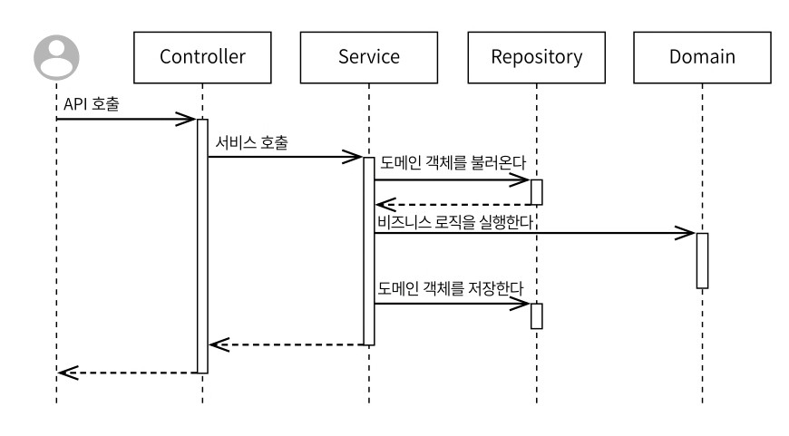

# 6. 안티패턴

## 6.1 스마트 UI
쉽게 말해서 컨트롤러에서 모든 비즈니스 로직, 인프라 로직을 수행하는 것을 말한다. 일반적으로 UI(컨트롤러 등)는 사용자의 입출력을 위한 창구로만 사용돼야 한다. 만약 그렇지 않으면 유지보수성과 확장성이 떨어진다. 다라서 컨트롤러의 역할은 무엇이 돼야 하는지 다시 한 번 생각해봐야 한다.

컨트롤러의 가장 큰 역할은 엔드포인트를 정의하고 API 사용자의 요청을 받아 그 결과를 응답 포맷에 맞춰 반환하는 것이다.

## 6.2 양방향 레이어드 아키텍처
보편적으로 레이어드 아키텍처는 아래와 같이 구현된다.
1. 프레젠테이션 레이어: 사용자와 상호작용 처리 및 결과 표시
2. 비즈니스 레이어: 비즤스 로직을 처리
3. 인프라스트럭처 레이어 : 외부 시스템 과의 상호작용 담당

당연하게 레이어 간 의존 방향은 단방향을 유지해야 한다.


Controller에서 @RequestBody로 받은 DTO인 PostCreateRequest를 서비스에서파라미터로 받는 경우는 위 사진과 같다. 이 경우, 비즈니스 레이어가 프레젠테이션 레이어에 의존하는 사태가 발생한다. 이를 `양방향 레이어드 아키텍처`라고 한다.

이런 경우 레이어는 컴포넌트를 구분하는 역할밖에 수행하지 못한다.

### 해결책1: 레이어별 모델 구성


`~Command`라는 서비스에 어떤 생성, 수정, 삭제 요청을 보낼 때 사용하는 DTO를 만들어 구분하자. 이 방법의 장점은 요청 DTO과 서비스 DTO를 분리를 분리할 수 있다. 이것이 장점인 예를 들어보자.

PostCreateRequest의 `writerId`를 클라이언트로부터 요청이 왔다고 하자. 이것의 유효성 검사를 레포지토리 전에 할 수 있는 방법이 있는가? 당연히 불가능하다. 따라서, PostCreateCommand에선 PostCreateRequest로 부터가 아니라 Principal로 부터 writerId를 받아 사용할 수 있다. 즉, 꼭 요청 DTO의 값을 가져와 사용할 필요가 없어진다.

그러나 모델은 적당히 세분화되고 적당히 통합돼야 DTO도 줄어들 수 있고, 복잡도도 많이 증가되지 않는다는 것을 명심하자.

### 해결책2: 공통 모듈 구성하기


공통 모듈로 분리하여 해결할 수 잇다. 그러나 이 방법은 core 모듈이 레이어라고 봐야하는가에 대한 논란이 있을 수 있다. 이 방법은 공통 코드를 한 곳에 모으는 것이지 공통된 레이어를 만드는 것이 아니기 때문에 core는 레이어가 아니다.

## 6.3 완화된 레이어드 아키텍처
컨트롤러가 바로 리포지터리를 사용하는 것과 같이 2개 이상의 레이어를 건너뛰어 통신하는 구조이며 안티패턴이다.
이는 개발자마다 코드가 중구난방에 위치하기 된다. 따라서, 레이어 간 통신은 레이어기리 이워져야 한다.

## 6.4 트랜잭션 스크립트
모든 API는 어떤 스크립트를 실행하고 응답하는 수준의 역할만 한다. 이처럼 트랜잭션 스크립트는 비즈니스 레이어에 위치한 서비스 컴포넌트가 모든 기능을 수행하고, 단순히 `트랜잭션만 걸려있는 스크립트`라는 의미이다.

이런 문제를 해겨ㅑㄹ하기 위해 서비스의 역할이 무엇인지 재고할 필요가 있다.
> 비즈니스 로직이 처리되는 주 영역은 도메인 모델이다.


개발자 A의 경우, 객체는 단순히 데이터와 매핑시키기 위한 존재로 사용되고 있다. 이런 코드는 서비스 로직을 점점 비대해지게 하는 트랜잭션 스크립트이다. 어플리케이션의 본질은 서비스가 아니라 도메인이어야 한다.



개발자 B는 비즈니스 로직을 도메인 객체에게 위임시켜 좀더 객체지행적인 코드로 완성되었다.

# 7. 서비스
> DDD는 '도메인 주도 설계'로 도메인을 중심에 놓고 소프트웨어를 설계하는 개발 방법론이다.

서비스는 도메인에서 발생하는 문제를 해결하기 위해 존재한다. 스프링 서비스는 도메인 객체가 처리하기 애매한 `연산` 자체를 표현하기 위한 컴포넌트이다. 


### 7.1 Manager

예를 들어, Product, Coupon, User 도메인이 있다고 할 때, 총 가격을 구하는 로직은 어디에 있는 것이 좋을까?

- user.calculatePrice(coupons, product)
- coupon.calculatePrice(user, product)
- product.calculatePrice(user, coupons)

첫 번째 방법은 `PriceManager`라는 매니저 클래스를 만들고 비즈니스 로직을 해당 클래스에서 처리하도록 하는 방법이다.
사실 ~Manager와 ~Service는 비슷한 의미이다. ~Manager는 도메인에 가까운 로직을 처리하고, ~Service는 애플리케이션의 실행에 초점을 맞춰져 있다.

다시 정리하면, 스프링의 서비스 컴포넌트는 다음 일을 처리한다.

- 저장소에서 데이터를 불러온다.
- 네트워크 호출 결과를 정리해서 객체에 넘겨준다.
- 저장소에 데이터를 저장한다.

## 7.2 서비스보다 도메인 모델

두 번째 방법은 도메인에서 처리하도록 하는 방법이다.
Cashier라는 객체를 만들어 그 곳에서 가격 계산을 처리하도록 설계할 수 있다.

> ### 단지 클래스 이름이 변한거 아닌가요?
>
> 클래스의 역할은 이름을 짓는 순간 결정된다. Cashier는 점원의 역할을 수행하며 능동적으로 일하게 된다.


> ### 객체지향으로 보는 서비스
>
> 1. 서비스는 얇게 유지하기
> 2. 서비스보다 풍부한 도메인 모델 만들기

`기존 도메인 객체에 들어갈 수는 없는지`와 `새로운 도메인 모델로 만들 수는 없는지`를 고민해봐야 한다.

개발은 도메인 모델 -> 도메인 서비스 -> 애플리케이션 서비스 순으로 우선순위를 정해 개발하는 것이 좋다.

## 7.3 작은 기계
- 서비스는 한번 생성하면 여러 번 사용하지만 그 자신은 바꿀 수 없다.
- 서비스는 작은 기계처럼 영원히 실행할 수 있다.

서비스는 어떤 가변 상태를 갖는 객체가 아니라 `계산식` 그 자체이다.

> ### 생성자 주입을 사용하는 이유
>
> 서비스는 불변해야 한다. 불변성을 유지하기 위해 예측할 수 있는 컴포넌트가 돼야 한다. 그리고 작고 얇아야 한다.
> **그러나 필드 주입과 수정자 주입은 불변으로 만들지 못한다.**
> 
> 또한, 생성자 주입을 이용하면 순환 참조를 미리 확인할 수 있다.


## 7.4 정리

1. 서비스의 멤버 변수는 모두 final로 만들기
2. 서비스에 Setter가 있으면 지우기
3. 서비스는 반드시 생성자 주입 사용하기
4. 서비스의 비즈니스 로직을 도메인에 양보하기
5. 서비스를 얇게 유지하기

<br/>

# 8. 레이어드 아키텍처
## 8.1 레이어드 아키텍처 최소 조건

1. 레이어 구조를 사용한다.
2. 레이어 간 의존 방향은 단방향으로 유지한다.
3. 레이어 간 통신은 인접한 레이어에서만 이뤄져야 한다.

레이어드 아키텍처는 누가 정의한 것이 아니라 제약 조건을 이용하기 위해 자연스럽게 생겨난 정책이다!!

## 8.2 잘못된 레이어드 아키텍처

### 1. JPA 엔티티를 우선

JPA 엔티티를 먼저 고려할 경우, 데이터적 사고로 개발할 가능성이 높다. 이는 레이어의 목적을 모호하게 만들어 데이터베이스 위주의 사고를 하게 만든다. 이 경우의 가장 큰 문제는 DB 테이블이 먼저 만들어지지 않으면 어떤 개발도 시작할 수 없게된다는 것이다.

### 2. API 엔드포인트 우선
이는 시스템을 도메인 요구사항 관점에서 보기 시작했기 때문이다. 그러나 이는 정확한 요구사항 분석이 이루어지지 않은 것일 수도 있다. 예를 들어 '계정 시스템을 만들어주세요.'라는 요구사항에 대해 정확한 기능에 대한 설명을 역으로 질문해야 한다.

이런 방식의 설계는 결국 시스템이 특정 프레임워크에 종속되는 결과를 낳는다. 지금은 단순한 API 서버를 만들지만, 나중에 웹소켓용 서버가 gRPC 서버가, 메시지 큐의 컨슈머가 될 수도 있는 것이다. 따라서, 이런 설계도 결국에는 트랜잭션 스크립트 같은 코드가 발생하게 된다.

### 본질을 다시 생각하기

진정한 의미의 백엔드 개발자는 스프링이나 JPA 없이도 성립할 수 있는 애플리케이션을 만들 수 있어야 한다. 갑자기 어느날 Spring과 JPA가 유료화되었다고 생각하면 훨씬 직접적으로 다가올 것이다. `세부 사항(JPA, Spring)에 대한 결정은 최대한 뒤로 미뤄라`라는 격언이 있듯이 기술 스택 설정 이전에 설계가 들어가야 할 것이다.

## 8.3 진화하는 아키텍처
> 시스템 개발의 첫 시작을 도메인으로 두면 된다

### 인지 모델 변경하기
도메인 레이어는 비즈니스 레이어에 포함된다. 즉, `비즈니스 = 도메인 + 어플리케이션` 이다. common, core 같은 패키지에 도메인 객체를 모아두어 관리한다. 중요한 것은 해당 객체들을 작성할 때는 `순수 자바 코드`로 작성해야 한다.
이렇게 될 경우, 외부 라이브러리에 종속되지 않는 도메인 레이어 개발이 가능하다. JPA나 Spring 없이도 원래 개발은 가능하다!!

풍부한 도메인 객체들을 먼저 만들고, 나중에 그 객체들을 뒷받침할 JPA 엔티티나 스프링 컴포넌트를 추가하면 된다.

> **[ 도메인의 필드 업데이트로 부터 불변성 지키기 ]**
>
> 도메인의 일부 필드를 업데이트할 경우, Setter를 사용하지 말고 새로운 객체를 생성하도록 변경하자.
> 
> 또한 해당 메서드를 `with~`로 명명하자.
> ```java
> public Account withNickname(String nickname) {
>    return Account.builder()
>    .id(this.id)
>    .email(this.email)
>    .nickname(nickname)
>    .build();
>}
> ```

Account와 AccountJpaEntity를 별개로 만들자. 그 이후, 영속성 객체를 도메인 객체로 변환하여 저장하도록 사용하자.

```java
public class AccountService {

    private final AccountJpaRepository accountJpaRepository;

    @Transactional
    puiblic Account updateNicknameById(long id, String nickname) {
        Account account = accountJpaRepository.findById(id)
            .orElseThrow(() -> new NotFoundException("account", id))
            .toModel();
        
        account = account.withNickname(nickname);

        accountJpaRepository.save(AccountJpaEntity.from(account));
    }
}
```

### JPA와의 결합 끊기
기존 아키텍처를 나타내면 다음과 같다.


Infrastructure 레이어인 Repository가 변경될 경우, 대부분의 Service의 코드 수정이 필요해진다.

민액, JPA를 능가하는 NEW-CONNECT라는 새로운 기술이 등장했다고 생각해보자. JPA를 해당 기술로 마이그레이션하기 위해선 기존 코드의 대부분을 갈아엎어야하는 문제점이 생긴다.

이런 문제를 `의존성 역전`을 통해 해결할 수 있다.


의존성 역전을 통해 Service가 Repository를 직접 의존하지 않도록 구현하자.

```java
public class AccountService {

    private final AccountRepository repository;

    @Transactional
    public Account updateNicknameById(long id, String nickname) {
        Account account = repository.findById(id);
        account = account.withNickName(nickname);
        accountRepository.save(account);
    }
}
```

```java
public interface AccountRepository {
    public Account findById(long id);

    public void save(Account account);
}
```

```java
public class AccountRepositoryImpl implements AccountRepository {

    private final AccountJpaRepository accountJpaRepository;

    @Override
    public Account findById(long id) {
        return accountJpaRepository.findById(id)
            .orElseThrow(() -> new NotFoundException("account", id))
            .toModel();
    }

    @Override
    public void save(Account account) {
        accountJpaRepository.save(AccountJpaEntity.from(account));
    }
}
```


위 처럼 코드 설계 시, JPA를 MongoDB로 변경해도 코드 수정이 RepositoryImpl에 그치게 된다.

### 웹 프레임워크와의 결합 끊기


## 8.4 새로운 접근법


이전 레이어드 아키텍처에서 도메인을 중심으로 정렬해보면 위 그림과 같다. 도메인이 가장 아래 있으면 가장 먼저 설계되어야 할 것이다.

# 9. 모듈
# 9.1 모듈성
모듈은 '어떤 목적을 수행하기 위해 분리된 작은 구성 단위'를 의미한다. 객체를 모듈로 보기에는 조금 지나친 해석이 있다.
소프트웨어 공학에서 모듈은 라이브러리 보다 넓고, 프로그램의 구성 요소보다는 좁은 개념이다.

> 모듈은 독립성과 은닉성을 만족하는 연관된 코드들의 묶음이다.

> 모듈 시스템은 연관된 코드들이 모듈성을 갖도록 도와주는 해결책이다.

타입 스크립트에서 제공하는 모듈에선 import와 exports라는 개념이 있다.
import는 '이 모듈은 어떤 외부 모듈에 의존하고 있는지'를 나타내고, export는 '이 모듈 중 어떤 컴포넌트만 외부로 노출할 것인지'를 나타낸다. 즉 각각 독립성(읜존성 관리)과 은닉성(캡슐화 관리)을 보장하고 있다.

자바의 패키지 시스템은 패키지 수준의 의존성 관리와 캡슐화 관리 기능을 지원하지 않는다. 단순한 폴더에 가깝다.
대신 Java9부터 module-info.java라는 모듈 디스크립터를 통해 모듈 시스템 사용이 가능하다.

그러면 Java8에선 모듈 관리를 어떻게 할 수 있을까?

### 독립성
먼저 '독립적이다'라는 말은 외부에 의존하는 사오항이 생기는 것 자체를 부정하지 않는다. 외부에 의존할 때 강한 의존이 생기는 것을 피하라는 의미일 뿐이다. 즉, `외부 시스템을 사용한다면 외부 시스템의 사용을 명시하라`라는 말이 중요하다.
의존성 관리를 위해선 하위 의존성을 명시하여 모듈이 독립적으로 사용되도록 해야 한다.

쉽게 말해, 의존성을 명시하는 행위는 '이 모듈을 사용하고 싶다면 모듈을 실행하는데 필요한 하위 의존성을 모두 가져와라'라고 하는 것과 같다. 모듈이 무조건 독립적으로 변하는 것이 아니라 중요한 것은 의존성을 관리하라는 것이다.

### 은닉성
우리가 은닉성을 추구해야하는 이유는 무엇일까? 하이럼 법칙은 다음과 같이 말한다.
> API 사용자가 충분히 많다면 계약이 어떻든 크게 중요하지 않다. 시스템의 모든 관측 가능한 행동은 사용자에 의해 결정된다.

즉, 사용자는 API를 온갖 해괴망측한 방법으로 사용할 것이기 때문이다. 

자바 패키지 시스템의 문제점 중 하나와 은닉성이 관련되어 있다. 바로 어떤 라이브러리를 가져오면 해당 라이브러리에 있는 모든 클래스를 사용할 수 있게 된다는 것이다.
이것이 왜 문제가 될까??

만약 A 프로젝트가 B 라이브러리에 있는 Temp 클래스를 참조한다고 해보자. B 라이브러리 개발자는 심각한 버그를 해결하기 위한 유일한 방법으로 Temp 클래스를 삭제했다. 이 경우, Temp 클래스를 사용하는 여러 프로젝트에선 문제가 발생한다.

위 사례처럼 모듈 수준의 인터페이스 관리가 필요하다. 모듈 사용자는 모듈이 책임지는 공개된 일부 기능에만 접근할 수 있어야 한다. 그래야 모듈 내부 변경되더라고 모듈 사용자에게 주는 영향 범위를 최소화할 수 있다.

<br/>

# 10. 도메인
## 10.1 소프트웨어 개발의 시작

사업가는 소프트웨어를 도메인을 실형시키기 위한 도구로 사용한다. 우리가 만드는 것은 일반 애플리케이션이 아닌 `도메인 애플리케이션`이다. 다라서, 도메인이 갖는 특성과 요구사항을 이해하고 개발해야 한다.

## 10.2 애플리케이션의 본질
프로젝트를 시작할 때, '스프링 웹을 미리 설정해야지', 'JPA나 QueryDSL을 사용할테니 관련 의존성을 미리 설정해야지', '테스트를 위한 H2 DB도 미리 설정해야지' 라고 생각한 적이 한 번쯤 있을 것이다. 아직 도메인 분석이 끝나지 않았는데 이런 접근은 바람직하지 않다. 사용하려는 기술은 추후 얼마든지 변경될 수 있고, 심지어 사용하지 않을수도 있다.

따라서 우리는 '이 프로젝트는 스프링과 JPA를 사용하는 프로젝트네' 대신 `이 프로젝트는 이런 도메인을 다루고 있네.`라는 관점을 가지고 프로젝트를 바라봐야할 것이다.

## 10.3 도메인 모델과 영속성 객체

도메인 모델과 영속성 객체(JPA 엔티티)를 구분해야 할까?

### 통합하기 전략

개발은 비용 싸움이다. 하나의 클래스만 잘 관리하면 되기에 굉장한 비용 절약이 가능하고, 개발속도도 빠르다. 그러나 클래스의 책임이 제대로 눈에 들어오지 않는다는 단점이 있다.

### 구분하기 전략

'구분하기 전략을 사용하면 ORM을 사용하는 이유가 없지 않나?' 라는 질문이 있을 수 있다. 애초에 구분하기 전략은 도메인이 ORM 같은 특정 라이브러리에 의존하지 않게 하기 위해 만들어진 전략이다.

<br/>

# 11. 알아두면 유용한 스프링 활용법

## 11.1 타입 기반 주입
NotificationChannel을 구현하는 EmailNotificationChannel(emailNC), SlackNotificationChannel(slackNC), ChatNotificationChannel(chatNC)가 있다고 가정해보자. 이 상태에서 PushNC를 새롭게 만들 경우, 아래 코드처럼 수정을 해던 경험이 있을 것이다.

```java
public class NotificationService {

    private final EmailNotificationChannel emailNotificationChannel;
    private final SlackNotificationChannel slackNotificationChannel;
    private final ChatNotificationChannel chatNotificationChannel;
    private final PushNotificationChannel pushNotificationChannel; // 추가

    public void notify(Account account, String message) {
        switch (accoutn.getNotificationType()) {
            case EMAIL:
                emailNotification.notify(account, message);
                break;
            
            //생략
            
            case PUSH: // 추가
                chatNotificationChannel.notify(account,message);
        }
    }
}
```

NotificationChannel의 구현체들을 List로 묶어 훨씬 간편하게 사용이 가능하다. 단 구현체들을 @Component를 통해 빈에서 관리되도록 하자.

```java
public class NotificationService {

    private final List<NotificationChannel> notificationChannels;

    public void notify(Account account, String message) {
        for (NotificationChannel notificationChannel : notificationChannels) {
            if(notificationChannel.supports(account)) {
                notificationChannel.notify(account, message);
            }
        }
    }
}
```

## 11.2 자가 호출

```java
class Something {

    public void doSomething1() {
        doSomething2();
    }

    @Transactional
    public void doSomething2() {

    }
}
```

스프링의 빈 메서드에서 발생하는 자가 호출은 개발자의 의도에서 벗어나는 결과를 만들 수 있다. doSomething2의 @Transactional은 프록시를 기반으로 동작한다. 따라서, 프록시를 통해 실행되지 않은 메서드는 트랜잭션 적용을 받지 못한다.

[Self-Invocation 문제 보기](https://github.com/likelion-onetool/backend/issues/114)

