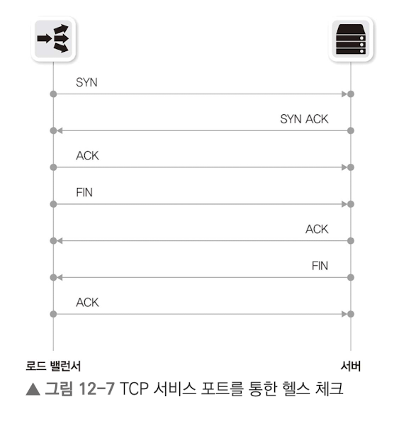
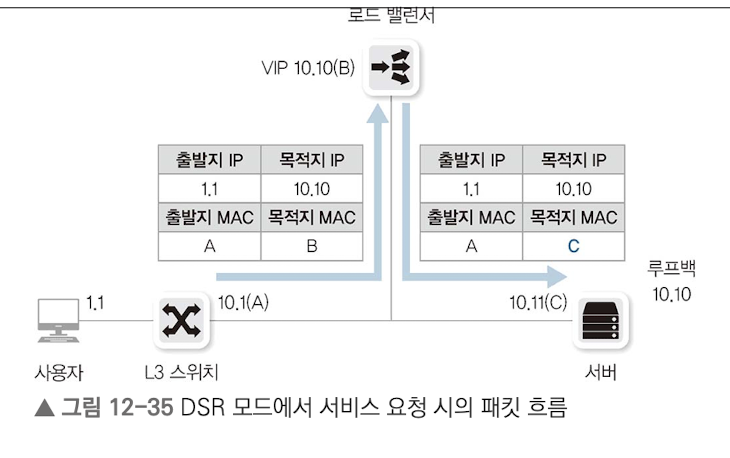
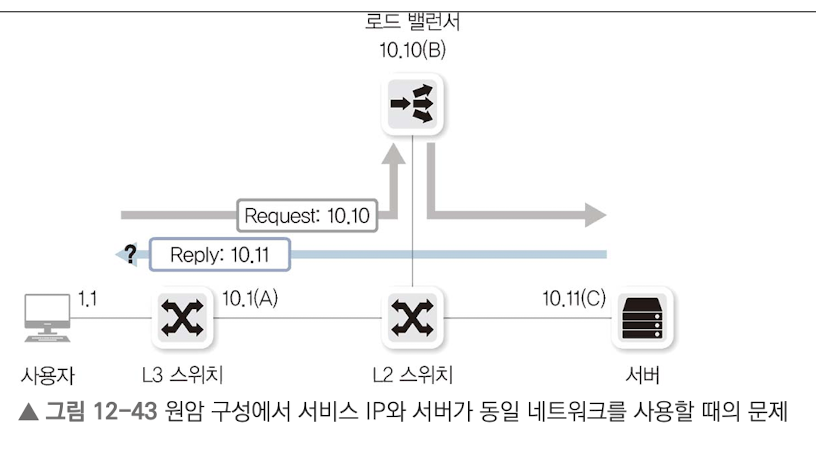

# 12.1 부하 분산이란?
두 대 이상의 서버로 구성하는데 각 서버 IP 주소가 다르므로 사용자가 서비스를 호출할 때 어떤 IP로 서비스를 요청할지 결정해야 한다. 또한 여러 서버의 장애를 판별하기 위해 로드 밸런서가 사용된다.

# 12.2 부하 분산 방법
 LACP는 두 개 이상의 인터페이스를 하나의 논리 인터페이스로 묶어 회선의 부하를 분산한다. 이처럼 로드 밸런서도 다수의 장비에 부하를 분산시키기 위해 가상 IP(Virtual IP)를 사용한다.

 VIP에는 리얼 IP가 바인딩되어 있다.

 # 12.3 헬스 체크
 부하 분산을 위해 주기적으로 각 서버에 헬스 체크를 하여 정상 서버인지 확인한다.

 ## 12.3.1 헬스 체크 방식
 ### 12.3.1.1 ICMP
 VIP에 연결된 리얼IP로 ICMP(ping)을 통해 헬스 체크 수행. 잘 사용되지 않음.

 ### 12.3.1.2 TCP 서비스 포트
서버의 서비스 포트를 확인하는 방법. 리얼 IP로부터 SYN, ACK를 받으면 서버에 다시 ACK로 응답하고 FIN을 보내 헬스 체크 종료.



### 12.3.1.3 TCP 서비스 포트: Half Open
3웨이 핸드셰이크, 4웨이 핸드셰이크가 아니라 SYN을 보내고 SYN ACK를 받은 이후 ACK 대신 RST를 보내 세션을 끊는다.


### 12.3.1.4 HTTP 상태 코드


### 12.3.1.5 콘텐츠 확인(문자열 확인)
지정된 콘텐츠가 정상적으로 응답되는지 확인.
정상 코드 값도 중복으로 확인하거나 문자열 자체를 일반적이 아닌 특정 문자열로 지정하도록 해야 한다.


## 12.3.2 헬스 체크 주기와 타이머
- 주요 타이머 값
    - 주기: 헬스 체크 패킷을 보내는 주기
    - 응답 시간: 헬스 체크 응답 기다리는 시간
    - 시도 횟수: 헬스 체크 실패 시 최대 시도 횟수
    - 타임아웃: 헬스 체크 실패 시 최대 대기 시간
    - 서비스 다운 시의 주기: 서비스 다운 시의 헬스 체크 주기

<br/>

# 12.4 부하 분산 알고리즘
| 알고리즘 | 설명 |
|:------:|-----|
| 라운드 로빈 | 순차적으로 분산. |
| 최소 접속 방식 | 현재 장비 중 가장 활성화 세션 수가 적은 장비로 분산 |
| 가중치 기반 라운드 로빈 | 라운드 로빈 + 가중치 |
| 가중치 기반 최소 접속 방식 | 최소 접속 방식 + 가중치 |
| 해시 | 해시 알고리즘 이용 |

- 라운드 로빈, 최소 접속 방식은 부하 비율이 비슷하지만, 동일한 출바지에 대한 응답 서버가 달라질 수 있어 세션 유지가 필요한 서비스에 적합하지 않다.
- 반대로 해시를 통해 세션 유지가 가능하도록하여 장바구니 문제를 해결할 수 있다.
- 라운드로빈이나 최소 접속 방식에선 스티키 옵션을 통해 세션 테이블을 바탕으로 세션 유지가 가능하도록 부하 분산이 가능하다.

<br/>

# 12.5 로드 밸런서 구성 방식
## 12.5.1 원암 방식

로드 밸런서가 스위치 옆에 있는 형태.

트래픽이 로드 밸런서를 경유하거나 경유하지 않을 수 있다. 부하 분산을 이용하는 트래픽은 로드 밸런서를 거치면서, Source NAT가 이루어진다.
반대로 부하 분산을 이용하지 않는 트래픽은 로드 밸런서를 거치지 않고 바로 통과한다.

스위치와 로드 밸런서 간의 대역폭을 최소화할 수 있고, 대역폭이 부족할 때 이 구간만 대역폭을 증설하면 되므로 인라인 방식보다 확장에 유리

## 12.5.2 인라인 구성

모든 트래픽이 로드밸런서를 통과하므로 로드 밸런서의 부하가 높아진다
4계층 이상 데이터를 처리하므로 처리 가능 용량이 L# 장비보다 적기 때문에 성능 고려가 필수.
응답 트래픽이 로드밸런서를 거치지 못하는 경우가 발생할 수도 있다.

<br/>

# 12.6 로드 밸런서 동작 모드
## 12.6.1 트랜스패런트
로드밸런서가 스위치처럼 동작. 부하 분산 서비스를 받지 않는 트래픽은 트랜스패런트 모드로 스위치 역할만 수행한다.

원암과 인라인 구성이 모두 가능하다. 다만 원암은 Source NAT가 필요하다.

### 요청 흐름

사용자가 VIP로 요청하기 때문에 목적지 IP를 리얼 IP로 변경한다. 마찬가지로 목적지 MAC도 리얼 MAC으로 변경.

### 응답 흐름

목적지 MAC 주소가 이미 게이트웨이의 MAC 주소를 갖고 있기에 변경할 필요가 없다.

인라인 사용 시, 동일 네트워크에서 서비스를 호출할 때 서비스 응답이 로드 밸런서를 거치지 않을 수 있다!

## 12.6.2 라우티드 모드
로드 밸런서가 라우팅 역할을 수행하는 모드. 사용자 방향과 서버 방향이 서로 다른 네트워크로 분리된 구성이다.

- 원암, 인라인 모두 구성 가능.
- 보안 강화 목적으로 서버쪽 네트워크를 사설로 구성해 서버에 직접 접속하는 것을 막는 용도로 사용되기도 함.

### 요청 흐름


### 응답 흐름


## 12.6.3 DSR 모드
로드 밸런서를 통해 서버로 유입된 후, 다시 로드 밸런서를 통하지 않고 서버가 사용자에게 직접 응답하는 모드.

- 요청 트래픽만 로드 밸런서 통과하므로 부하 감소
- 응답 패킷이 요청 패킷보다 크기 때문에 트래픽 부하 감소
- 로드밸련서 경우하지 않아, 문제 확인이 어려움.

트랜스패런트나 라우티드 방식 경우, 목적지 IP 주소가 Desitation NAT되고, 다시 VIP로 Source NAT 수행하는데 이 모드에선 사용이 불가능하다.이 때문에 비정상적인 응답으로 간주할 수도 있다. 루프백 인터페이스를 통해 해결할 수 있다.

```
------------+        +--------------+        +--------------------------+
|  클라이언트  |  -->  |  로드밸런서 (VIP) |  -->  |    실제 서버 A           |
| (Source IP: |        | (요청 전달)  |        |  (Real IP: RA)           |
|   Client)  |        +--------------+        |  (Loopback IP: VIP 설정) |
|            |                                +--------------------------+
|            |                                        |
|            |                                        V 응답 (Source IP: VIP)
|            |                                        (로드밸런서 우회)
+------------+                                        |
      ^                                               |
      | 응답 (Source IP: VIP)                          |
      +-----------------------------------------------+
```

 
 

 <br/>

 # 12.7 로드 밸런서 유의사항
 ## 12.7.1 원암 구성의 동일 네트워크 사용 시
원암 구성에서 서비스 네트워크오 ㅏ서버 네트워크가 동일한 네트워크로 구성될 경우, 로드 밸런서를 거치지 않고 바로 응답한다. 


이 경우, Source NAT가 되지 않아 패킷이 정상처리되지 않는다.

### 12.7.1.1 게이트웨이를 로드 밸런서로 설정


### 12.7.1.2 Source NAT 이용


### 12.7.1.3 DSR 모드


## 12.7.2 동일 네트워크 내에서 서비스 IP(VIP) ㅎ호출
