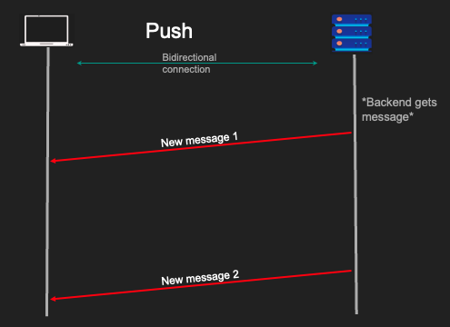
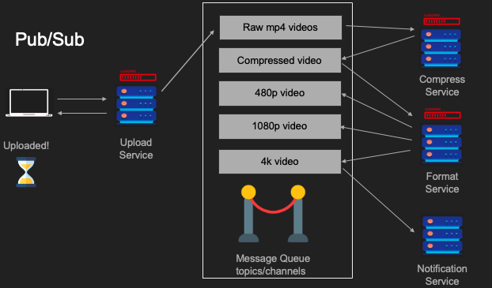

# Synchronous & Asynchronous
## Synchronous I/O
- Caller가 요청 후 blocks
- Caller cannot execute any code meanwhile.
- Receiver responds -> Caller unblocks

```c
//Program starts
//Program uses CPU to execute stuff
doWork();
//Program reads from disk
//Program can't do anything until file loads
readFile("largefile.dat");
//program resumes
doWork2();
```

## Asynchronous I/O
- Caller sends a request
- Caller can work until it gets a response.
### 1. 구현 방법
  - 콜백
    - 가장 기본적인 비동기 패턴
    - 작업 완료되면 호출된 함수를 인자로 전달하는 방식
  - Promise
    - 콜백 지옥을 해결하기위해 도입
    - 비동기 작업의 완료 또는 실패를 나타내는 객체
    - `.then()`은 성공 시 처리, `.catch()`는 실패시 처리 정의
  - Async/Await
    - Promise 기반 비동기 코드를 동기 코드처럼 간결하게 작성하는 문법
    - `await` 키워드로 해당 비동기 작업이 완료될 때까지 기다리는 것 같지만, 실제 메인 스레드를 차단하지 않고 다른 작업 처리

### 2. Node.js의 비동기 처리
  - Node.js는 단일 스레드 기반이지만, I/O 작업을 처리할 때 메인 스레드를 차단하지 않고 내부적으로 **Worker Thread**를 활용하거나 운영 체제의 비동기 I/O 기능(예: Linux의 epoll이나 Windows의 IOCP)을 이용합니다.
  - 이를 통해 메인 스레드는 계속해서 다른 요청을 처리할 수 있으며 높은 처리량을 유지합니다.

### 3. 실생활 예시
- 동기식 통신
    - 회의 중 질문과 답변

- 비동기식 통신
    - 이메일

### 4. 백엔드 시스템에서의 적용
- 비동기 백엔드 처리
  - 클라이언트의 요청이 오래 걸리는 작업일 경우, 백엔드는 즉시 응답을 보내고 실제 작업은 **큐(Queue)**에 넣어 비동기적으로 처리
  - 클라이언트는 작업 ID를 받아 나중에 작업 완료 여부를 확인

- 데이터베이스
    - 비동기 커밋
      - 트랜잭션이 완료되었을 때, 디스크에 실제로 기록될 때까지 기다리지 않고 즉시 성공을 반환
      - 데이터베이스는 나중에 디스크에 쓰기 작업을 수행
      - 이는 성능 향상을 가져오지만, 서버 다운 시 데이터 손실 위험 있음
    - 비동기 복제
      - 주 데이터베이스에 커밋이 발생하면, 이 변경 사항을 즉시 복제본에 복제하기 위해 기다리지 않고 비동기적으로 작업을 진행
      - 이는 복제본 간의 일관성이 잠시 깨질 수 있음.


# Push
## Request/Response는 항상 이상적이지 않다.
- Push는 **Client가 real time notification을 원하는 경우** 적합
  - 유저가 방금 로그인한 상황
  - 메시지가 막 도착한 상황

## Push란?

- Client가 Server에 연결됨.
- Server가 Client에게 데이터 전송
- Client는 Request할 필요가 없음.
- Bidirectional Protocol을 사용.
- Ex) RabbitMQ

## Pros and Cons
- Pros
  - Real Time
- Cons
  - Client는 반드시 Online
  - Client가 조작할 수 없음.
  - Bidirectional Protocol 필요.
  - 저사양 Clients에겐 `Polling`이 적합

# Short Polling
## Request/Response는 항상 이상적이지 않은 경우
- Request가 진행되는데 오래 걸림
    - ex) 유튜브 영상 업로드
- Backend에서 알림 보낼 때
    - ex) 유저가 막 로그인 한 경우

## Short Polling 이란?

- Client가 Request 보냄
- Server가 즉이 응답함
- Server는 계속 request를 처리함
- Client는 상태를 체킹.
- 다수의 '짧은' request와 response를 poll

## Pros and Cons
- Pros
  - Simple
  - 긴 실행 request에 적합
  - Client가 끊겨도 됨
- Cons
  - Too chatty
  - 네트워크 대역폭 중요
  - Backend Resource를 낭비함
  
# Long Polling
## Request/Response과 Polling이 이상적이지 않은 경우
- Request가 진행되는데 오래 걸림
    - ex) 유튜브 영상 업로드
- Backend에서 알림 보낼 때
    - ex) 유저가 막 로그인 한 경우
- Short Polling이 좋으나 너무 chatty할 경우
- Kafka같은 Long Polling 사용이 적합!

## Long Polling 이란?

- Client가 Request를 보냄.
- Server가 즉시 응답함.
- Server가 요청을 계속 처리함.
- Client가 상태를 체킹함.
- Server는 "절대" 응답하기 전까지 답하지 않음

## Pros and Cons
- Pros
  - 덜 chatty하고 Backend 친화적
  - Client는 연결 끊겨도 됨.
- Cons
  - Not Real Time

# Server Sent Events
## Request/Response의 한계
- 바닐라 Request/Response는 알림에 적합하지 않음
- Client는 Real Time 알림을 원함.
- Push도 좋지만 너무 제한적.
- HTTP를 위해 디자인됨.

## SSE 란?

- Response가 시작되고 끝남.
- Client가 Request를 보냄
- Server가 Response의 부분으로서 논리적 이벤트를 보냄.
- Server는 절대 Response의 끝을 보내지 않음.
- Client는 streams data를 파싱한다.

## Pros and Cons
- Pros
  - Real Time
  - Request/Response와 양립 가능
- Cons
  - Client는 반드시 온라인
  - Client는 handle 불가능
  - 저사양 Client에겐 Polling이 더 적합
  - HTTP/1.1 문제 (6 Connections)

# Publish & Subscribe

만약 유튜브 서버과 이런 식으로 되어 있을 경우, 업로드, 압축, 저작권 등등 각 기능에 대한 서비스 서버가 존재한다.
이 경우, 한 곳의 서버 사이에서 병목이 발생하면 서비스 전체가 느려지는 SPoF가 발생한다.


따라서, 이처럼 MessageQueue를 도입하여, 이슈를 발행하면 관련된 서버가 request를 받아 처리하는 방식이다.

## Pros and Cons
- Pros
  - Scales with Multiple Receivers
  - Grate for MSA
  - Loos Couping
  - Client가 실행중이지 않아도 작동
- Cons
  - 메시지 전송 문제 (Two general's problem)
  - Complexity
  - Network saturation

# Multiplexing vs. Demultiplexing

