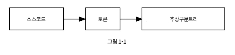

# 1장 렉싱
## 어휘 분석


- lexing: 소스코드를 토큰 열로 변환 (어휘 분석 이라고도 함)
- 토큰: 토큰을 파서에 입력하고 나면 두번째 변환 작업 진행
- 파서: 전달받은 토큰열을 `추상구문트리(AST)`로 변환
  - `let x = 5 + 5;`
  ```
  [
    LET,
    IDENTIFIER("x"),
    EQUAL_SIGN,
    INTEGER(5),
    PLUS_SIGN,
    INTEGER(5),
    SEMICOLON
  ]
  ```
  - 렉서는 공백을 파싱하지 않음

## 토큰 정의하기
token.go
```go
package token

const (
	ILLEGAL = "ILLEGAL" // 렉서가 알 수 없음
	EOF     = "EOF"     // 파일의 끝

	// 식별자 + 리터럴
	IDENT = "IDENT" // add, foobar, x, y, ...
	INT   = "INT"   // 1343456

	// 연산자
	ASSIGN = "="
	PLUS   = "+"

	// 구분자
	COMMA     = ","
	SEMICOLON = ";"

	LPAREN = "("
	RPAREN = ")"
	LBRACE = "{"
	RBRACE = "}"

	// 키워드
	FUNCTION = "FUNCTION"
	LET      = "LET"
)

type TokenType string

type Token struct {
	Type    TokenType
	Literal string
}
```

## 렉서
- 소스코드 입력받고, 소스코드를 표현하는 토큰열을 결과로 출력
- 입력받은 소스코드 훑어가면서 토큰 인식할 때마다 결과를 출력
- 버퍼도 필요없고 토큰 저장할 필요 없음 -> `NextToken()` 이용
- 상용버전에선 파일 이름과 행 번호를 토큰에 붙여 에러 추적을 한다.
- 복잡도를 낮추기 위해 이번에는 string으로만 다룬다.

  │ 필드   │ 타입 │ 설명                                   │
  |:------|:----|:--------------------------------------|
  │ input  │ string │ 렉싱할 입력 문자열입니다. │
  │ position │ int │ 입력에서 현재 위치 (현재 문자를 가리킴) │
  │ readPosition │ int │ 입력에서 현재 읽는 위치(현재 문자의 다음을 가리킴) │
  │ ch     │ byte │ 현재 조사하고 있는 문자를 나타냅니다.  │

## 첫 번째 REPL
`Read Eval Print Loop`로 콘솔 모드이다.

# 2장 파싱
## 파서
파서는 입력 데이터를 받아 자료구조를 만들어내는 소프트웨어 컴포넌트이다. 자료구조 형태는 parse tree, AST일 수 있고, 다른 계층 구조일 수 있다.

```js
> var input = '{"name": "Thorsten", "age": 28}';
> var output = JSON.parse(input);
> output
{ name: 'Thorsten', age: 28 }
> output.name
'Thorsten'
> output.age
28
>
```
위 코드의 JSON 파서처럼 직접 input을 바탕으로 자료구조를 만들게 된다.

## 파서 제너레이터를 사용하지 않는 이유
파서 제너레이터는 어떤 언어에 대한 공식적인 설명이 주어지면, 출력으로 파서를 생성하는 도구이다.
또한, 소스코드로 주어진다.

그러나 직접 구현을 하면서 파서 제너레이터의 장점 및 단점을 이애할 수 있다.

## Monkey 프로그래밍 언어 파서 만들기
파싱 시 두 가지 전략이 있다.
1. 하향식 : AST의 루트 노드를 생성하고 아래쪽으로 파싱하기
2. 사향식 : 반대방향으로

`재귀적 하향 파서`: 하향식으로 동작

직접 구현하는 파서의 단점
- 빠르지 않다.
- 에러-회복 프로세스가 없다.
- 에러가 날 수 잇는 구문 탐지 작업을 꼼꼼히 구현하지 않는다.

[ 재귀 하향 파서의 중요 부분 ]
```js
function parseProgram() {
	program = newProgramASTNode()

	advanceTokens()

	for (currentToken != EOF_TOKEN) {
		statement = null

		if (currentToken() == LET_TOKEN) {
			statement = parseLetStatement()
		} else if (currentToken() == RETURN_TOKEN) {
			statement = parseReturnStatement()
		} else if (currentToken() == IF_TOKEN) {
			statement = parseIfStatement()
		}

		if (statement != null) {
			program.Statements.push(statement)
		}

		advanceTokens()
	}

	return program
}

function parseLetStatement() {
	advanceTokens()

	identifier = parseIdentifier()

	advanceTokens()

	if (currentToken() != EQUAL_TOKEN) {
		parseError("no equal sign!")
		return null
	}

	advanceTokens()

	value = parseExpression()

	variableStatement = newVariableStatementASTNode()
	variableStatement.identifier = identifier
	variableStatement.value = value
	return variableStatement
}

function parseIdentifier() {
	identifier = newIdentifierASTNode()
	identifier.token = currentToken()
	return identifier
}

function parseExpression() {
	if (currentToken() == INTEGER_TOKEN) {
		if (nextToken() == PLUS_TOKEN) {
			return parseOperatorExpression()
		} else if (nextToken() == SEMICOLON_TOKEN) {
			return parseIntegerLiteral()
		}
	} else if (currentToken() == LEFT_PAREN) {
		return parseGroupedExpression()
	}
	// [...]
}

function parseOperatorExpression() {
	operatorExpression = newOperatorExpression()

	operatorExpression.left = parseIntegerLiteral()
	advanceTokens()
	operatorExpression.operator = currentToken()
	advanceTokens()
	operatorExpression.right = parseExpression()

	return operatorExpression
}
// [...]
```
- parseProgram
  - 진입점
  - AST 루트 노드 생성 (newProgramASTNode())
  - 자식 노드들인 statements 생성
- parseExpression

### 프렛 파싱
= 하향식 연산자 우선순위 파싱

- 문법 규칙과 함수를 연관시키는 대신 토큰 타입과 파싱 함수를 연관시킴
- 토큰을 함수와 연관시킬 때, 중위인지 전위인지에 따라 서로 다른 파싱 함수로 연관시킴

### 표현식 AST
[ 표현식 검증 테스트 코드 ]
```go
func TestString(t *testing.T) {
	program := &ast.Program {
		Statements: []ast.Statement{
			&ast.LetStatement{
				Token: token.Token{Type: token.LET, Literal: "let"},
				Name: &ast.Identifier{
					Token: token.Token{Type: token.IDENT, Literal: "myVar"},
					Value: "myVar",
				},
				Value: &ast.Identifier{
					Token: token.Token{Type: token.IDENT, Literal: "anotherVar"},
					Value: "anotherVar",
				},
			},
		},
	}

	if program.String() != "let myVar = anotherVar;" {
		t.Errorf("program.String() wrong. got=%q", &program.String())
	}
}

```